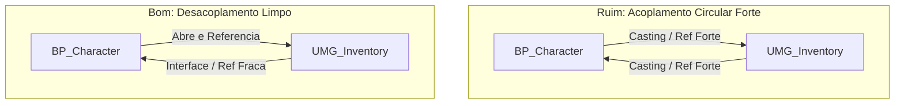

# 🎒 Estrutura de Inventário: Gerenciamento de Slots e Dependências

**[Autor: Antigravity]**  
**[Foco: Estruturas de Dados, Arquitetura MVC e Prevenção de Memory Leaks]**

---

## 🎯 Caso de Uso: O Inventário de Grade/Slots

Pense no sistema de inventário de jogos estilo sobrevivência ou RPG (como Resident Evil ou Diablo). Cada item que o jogador coleta ocupa espaço em um contêiner virtual. O jogador pode abrir uma mochila na tela (UI), reorganizar os itens, consumir consumíveis, equipar armas e descartar tralhas no chão.

Para implementar isso de forma profissional, nunca devemos programar a lógica do inventário diretamente no Widget visual (UI). Devemos estruturar os dados separadamente e gerenciar as referências de forma segura.

---

## 📊 1. Gerenciamento de Slots: Estruturas e Arrays

O coração de um inventário reside nos seus dados. Um inventário nada mais é do que um **Array de Estruturas** contendo as definições dos itens em cada slot.

### A Estrutura Base: `S_InventorySlot`
Em vez de criar variáveis soltas para cada propriedade, criamos uma Struct (Estrutura de Blueprint) que define o que é um "Slot de Inventário":

| Nome do Campo | Tipo de Dado | Descrição Didática |
| :--- | :--- | :--- |
| **`ItemID`** | `Name` / `String` | O identificador único do item correspondente à DataTable principal de Itens. |
| **`Quantity`** | `Integer` | Quantidade atual do item empilhado naquele slot (Stack Size). |
| **`Durability`** | `Float` | Durabilidade útil (para armas de fogo ou ferramentas de desgaste). |

### O Contêiner de Dados (`Array`)
No componente lógico de inventário (geralmente um **Actor Component** anexado ao Personagem, ex: `AC_Inventory`), declaramos:
* **`InventorySlots`**: Um Array de `S_InventorySlot` com tamanho fixo (ex: 20 elementos para 20 slots de mochila).
* **Slots Vazios:** Slots sem itens são representados por estruturas onde `ItemID` está em branco (`None`) e `Quantity` está em `0`.

```
Mochila (Array de 20 slots):
┌──────────────┐┌──────────────┐┌──────────────┐
│ ID: Bala_9mm ││ ID: None     ││ ID: Bandagem │
│ Qtd: 30      ││ Qtd: 0       ││ Qtd: 3       │
└──────────────┘└──────────────┘└──────────────┘
   [Slot 0]        [Slot 1]        [Slot 2]
```

---

## 🎨 2. Separação Lógica de Dados vs. UI (Model-View-Controller)

Um erro muito comum entre desenvolvedores iniciantes na Unreal Engine é escrever a lógica matemática (ex: "Consumir Poção" ou "Adicionar Munição") diretamente dentro de eventos de clique nos widgets de interface.

> [!IMPORTANT]
> ### 📐 Princípio da Responsabilidade Única (Single Responsibility Principle)
>
> 1. **O Modelo (Dados):** Reside em um Actor Component (`AC_Inventory`). É aqui que a matemática acontece. O componente executa funções puras como `AddItem`, `RemoveItem`, `HasEnoughSpace?` e `StackItem`.
> 2. **A Visão (Interface):** Reside nos Widgets (`UMG_Inventory` e `UMG_Slot`). O Widget apenas lê os dados do componente e os desenha na tela. Ele é burro: não decide se um item pode ser coletado; ele apenas avisa o componente que o jogador clicou no slot "X".
> 3. **O Fluxo de Comunicação:**
>    * O jogador interage com o Widget.
>    * O Widget envia um sinal ao `AC_Inventory`: *"Jogador quer consumir o slot 2"*.
>    * O `AC_Inventory` valida as regras, deduz a quantidade dos dados e dispara um evento/notificação: *"Mochila atualizada!"*.
>    * O Widget ouve essa notificação e redesenha seus elementos visuais com base no novo estado.

---

## 🔗 3. Referências Dinâmicas e Evitando Referências Circulares Fortes

A Unreal Engine usa um sistema de Garbage Collection para limpar atores e objetos que não estão mais sendo usados. Se o seu Blueprint A tem uma referência forte (Hard Reference) para o Blueprint B, e o B tem uma para o A, ocorre uma **Referência Circular**. O motor de jogo nunca conseguirá limpar esses objetos da memória, resultando em acúmulo e vazamento de RAM (*Memory Leak*).



### Como Evitar Referências Circulares:
1. **Blueprint Interfaces (BPI):** Faça com que a UI envie informações para o jogador chamando funções de interface (ex: `BPI_CharacterActions`). A UI não precisa saber que está acoplada a um `BP_Character` específico. Ela apenas chama `Execute_UseItem` no seu ator proprietário genérico (`Pawn`).
2. **Soft Object References (Referências Suaves / Preguiçosas):** Ao definir IDs de armas ou itens a serem gerados, evite que a DataTable aponte diretamente para classes reais de atores físicas de armas. Aponte para **Soft Class References** (`TSoftClassPtr`). Isso evita que todas as texturas e malhas 3D de todas as armas do jogo sejam forçadas a carregar na memória de vídeo (VRAM) no instante em que o inventário é aberto.

---

## 🏃 Como Implementar o Fluxo de Uso de Itens Desacoplado

### 👤 Parte do Usuário: Práticas Recomendadas no Unreal Editor

Para garantir que seu inventário seja expansível e performático:

1. **Evite Castings de Widgets:**
   * No `UMG_Slot`, em vez de fazer `Cast To BP_Character` para curar a vida ao clicar em uma poção, chame uma função da interface do seu player (ex: `BPI_InventoryInterface -> UsarSlot(SlotIndex)`).
2. **DataTable Autorotativa:**
   * Centralize os atributos de durabilidade e empilhamento máximo na DataTable de itens (`DT_Items`).
   * No componente `AC_Inventory`, ao receber uma solicitação de adição de item, leia os metadados diretamente da linha da tabela de dados (`Get Data Table Row`), em vez de instanciar o item fisicamente no mundo para verificar suas propriedades.

---

## ❓ Perguntas de Fixação

* **O que acontece com a memória RAM se criarmos links fortes circulares entre a HUD e o Personagem?**
  O Garbage Collector da Unreal não consegue destruí-los mesmo quando o menu é fechado, causando vazamentos de memória e lentidão crônica no jogo após longas sessões.
* **Qual é o papel do Actor Component no sistema de inventário?**
  Ele atua como o controlador lógico e banco de dados local do inventário do jogador, permitindo que a lógica da mochila seja facilmente anexada a NPCs inimigos ou baús de tesouro.
