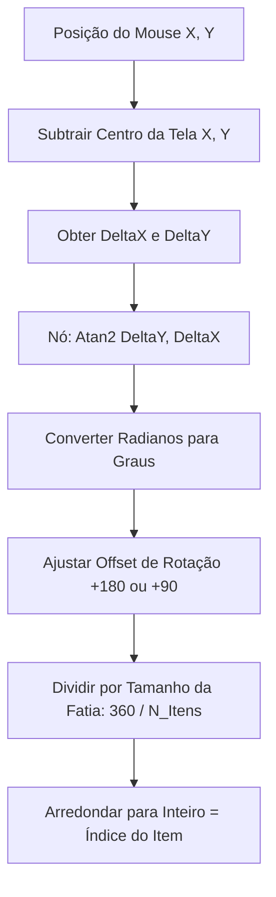

# 🧭 Menu Radial: Guia de Descentralização e Matemática de Seleção

**[Autor: Antigravity]**  
**[Foco: Arquitetura Limpa, Trigonometria e Desacoplamento de Componentes]**

---

## 🎯 Caso de Uso: A Seleção Rápida de Itens

Imagine o jogador no meio de um tiroteio frenético. Em vez de abrir o inventário em tela cheia e parar a ação, ele mantém pressionada a tecla `Tab`. O tempo do jogo desacelera ligeiramente (dilatação temporal), um menu circular (radial) surge no centro da tela e, ao mover o mouse na direção de uma fatia, o item correspondente é realçado e equipado instantaneamente ao soltar a tecla.

Para que isso funcione de forma fluida, limpa e reutilizável, precisamos dominar dois conceitos: a **matemática de detecção angular** e a **arquitetura de desacoplamento**.

---

## 📐 1. A Matemática do Menu Radial: O Poder do `Atan2`

Em uma interface linear tradicional, sabemos qual item está sob o cursor usando posições de caixa (bounding boxes) simples (X e Y). Em um menu circular, os itens são distribuídos em fatias angulares. Para detectar qual fatia o jogador está apontando, precisamos converter as coordenadas Cartesianas bidimensionais $(X, Y)$ da posição do cursor em um **ângulo polar** (em graus ou radianos) relativo ao centro da tela.

### O Cálculo Vetorial

1. **Obter a Posição do Mouse:** Subtraímos a coordenada central do menu da posição atual do cursor para encontrar o vetor de deslocamento relativo $(\Delta X, \Delta Y)$.
2. **Aplicar a Função Arcotangente de Dois Parâmetros (`Atan2`):**
   No Unreal Engine, usamos o nó **Get Angle (Atan2)**. Ao contrário do `Atan(Y/X)` clássico, o `Atan2(Y, X)` lida automaticamente com a divisão por zero e resolve a direção exata em todos os 4 quadrantes da trigonometria (retornando um intervalo de $-\pi$ a $+\pi$ radianos, ou $-180^\circ$ a $+180^\circ$ graus).



### O Nó Clave no Blueprint:
* **Entradas:** `Y` e `X` (Deltas de posição).
* **Saída:** Ângulo em radianos. Multiplicamos por `180 / PI` (ou usamos o nó **Radians to Degrees**) para obter a rotação de $0^\circ$ a $360^\circ$ para mapear a seleção do slot.

---

## 🛡️ 2. Alerta Técnico: Desvio de Convenções (Diretriz G - Solicitude Reversa)

Durante a auditoria técnica do projeto real, identificamos **três falhas arquiteturais graves** na forma como o menu radial e o inventário estão integrados:

> [!CAUTION]
> ### 🚨 Violações Detectadas no Projeto Atual:
>
> 1. **Inversão de Hierarquia Física de Pastas:**
>    * **O Erro:** O arquivo `UMG_Inventory.uasset` (o sistema global de slots de inventário) está salvo dentro da pasta do menu radial:  
>      `Content/Blueprints/UMG/RadialMenu/UMG_Inventory.uasset`
>    * **Por que é ruim:** O inventário é a entidade maior (sistema de armazenamento do personagem). O menu radial é apenas uma visualização acessória rápida. Colocar o inventário dentro da pasta da UI radial inverte a hierarquia lógica, dificultando a manutenção.
>
> 2. **Acoplamento Forte e Ineficiente (Tight Coupling):**
>    * **O Erro:** Sistemas que precisam apenas da roda de seleção (ex: menu de gestos/emotes ou menu de seleção rápida de armas) acabam sendo acoplados a toda a lógica de dados pesada de slots de itens de sobrevivência.
>    * **Por que é ruim:** Viola o *Single Responsibility Principle* (Princípio de Responsabilidade Única). O menu radial deve ser um componente UI genérico puramente visual que aceita uma lista de dados (Ícone, Título, ID) e retorna apenas o "Índice Clicado", sem saber o que é um inventário ou uma arma.
>
> 3. **Caminhos de Máquina Locais Hardcoded:**
>    * **O Erro:** Referências absolutas como `C:/Users/hijon/Documents/UnrealEngine/PROJETO-GTA-29-10-2025/...` inseridas no projeto.
>    * **Por que é ruim:** Destrói a portabilidade do projeto. Se outro desenvolvedor ou um servidor de build automatizado clonar o projeto, as compilações e referências serão corrompidas. O correto é sempre utilizar referências relativas ao diretório `/Game/...`.

---

## 🏃 Como Corrigir e Descentralizar (Passo a Passo)

### 👤 Parte do Usuário: Ações Recomendadas no Unreal Editor

Para corrigir esses desvios e organizar a arquitetura, você deve realizar as seguintes ações no editor:

```
[UMG_Inventory] ──(Mover pasta no Editor)──> /Game/Blueprints/UMG/Inventory/
[RadialMenu] ──(Tornar Reutilizável)──> Aceitar Array de Struct Genérico (S_RadialItem)
```

1. **Organização Física:**
   * Crie uma pasta exclusiva para o inventário: `/Game/Blueprints/UMG/Inventory/`.
   * Mova o `UMG_Inventory` para lá arrastando-o de dentro do Unreal Editor (para que as referências internas sejam atualizadas via *Redirectors*). Depois clique com o botão direito na pasta de origem e selecione **Fix Up Redirectors in Folder**.

2. **Criação da Interface de Comunicação:**
   * Crie uma **Blueprint Interface** chamada `BPI_RadialMenuController`.
   * Adicione a função `OnSlotSelected(SlotIndex: Integer)`.
   * O menu radial apenas dispara essa interface no ator que o abriu (ex: `CharacterReference` ou `WeaponSystemComponent`), em vez de fazer Castings diretos para `UMG_Inventory` ou ler variáveis de inventário diretamente.

---

## ❓ Perguntas de Fixação

* **Por que usamos `Atan2` em vez de `Atan` no cálculo de ângulos do menu radial?**
  Porque o `Atan2` recebe os eixos X e Y separadamente e determina o quadrante correto de $360^\circ$ de forma segura, sem gerar erros de divisão por zero caso o mouse passe exatamente pelo eixo vertical.
* **Qual é a consequência de referenciar arquivos usando caminhos absolutos do Windows?**
  Impede que o projeto seja aberto ou compilado em qualquer computador que não tenha exatamente a mesma estrutura de pastas do desenvolvedor original, quebrando a integração contínua (CI/CD) e o trabalho em equipe.
