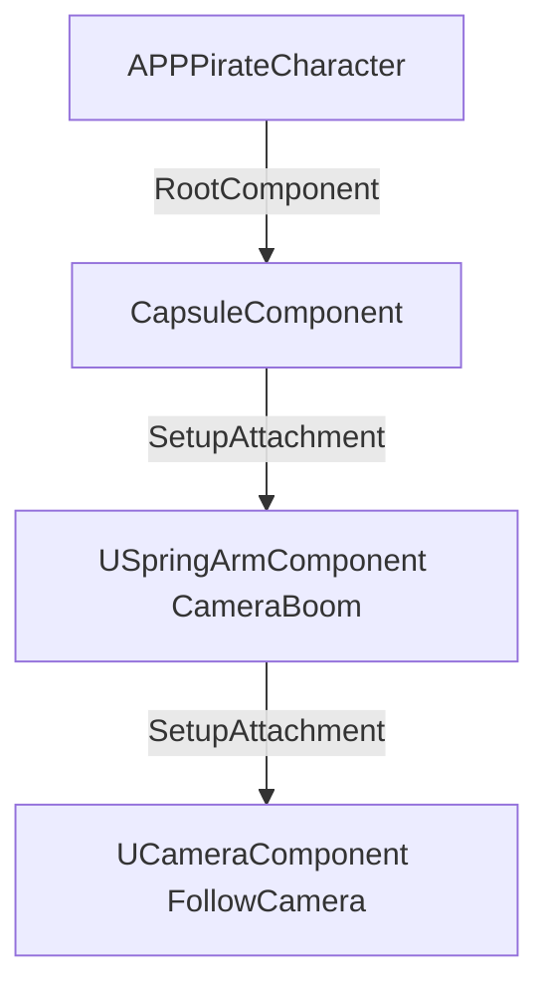
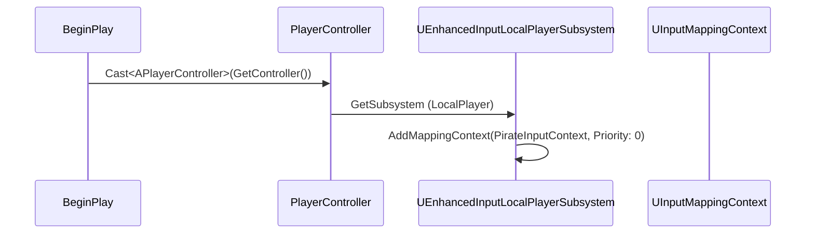

# 🎓 Personagem Jogável: APPPirateCharacter C++

**[Compatibilidade: UE 5.1+]**  
**[Origem: CUSTOMIZADO]**

A classe `APPPirateCharacter` é a fundação em C++ para o protagonista do jogo. Ela herda da classe nativa da Unreal Engine `ACharacter`, que fornece componentes integrados essenciais para jogos 3D, como a movimentação física (`UCharacterMovementComponent`), colisão de cápsula (`UCapsuleComponent`) e a malha 3D (`USkeletalMeshComponent`).

Neste documento, analisamos detalhadamente a configuração da câmera de aventura em terceira pessoa (estilo TPS/Adventure) e o moderno fluxo de inputs via **Enhanced Input System** introduzido na Unreal Engine 5.

---

## 🎯 Caso Prático: Câmera TPS com Giro Livre e Corrida Tática

> *Você foi encarregado de implementar o protótipo de movimentação de um jogo de aventura de piratas em 3D. O designer do jogo exige que a câmera se comporte como a de jogos modernos (ex: Uncharted): livre rotação do mouse sem rotacionar o corpo do personagem automaticamente, a menos que ele se mova. Além disso, o personagem deve caminhar a 400 cm/s por padrão e correr a 700 cm/s ao segurar a tecla Shift. Tudo isso precisa ser implementado usando o novo Enhanced Input da Epic para garantir escalabilidade para consoles.*

---

## ⚙️ 1. Estrutura de Componentes da Câmera (TPS Setup)

Para criar o efeito de câmera livre em terceira pessoa, usamos um braço mecânico virtual chamado `USpringArmComponent` e a câmera real `UCameraComponent`. 



### Relação de Configuração do Construtor:
*   **`CameraBoom->TargetArmLength = 350.f;`** — Distância em centímetros entre o personagem e a lente.
*   **`CameraBoom->bUsePawnControlRotation = true;`** — O braço do suporte da câmera gira com base no controle de rotação do mouse.
*   **`FollowCamera->bUsePawnControlRotation = false;`** — A câmera em si não rotaciona sozinha; ela segue o encaixe final (Socket) do SpringArm, evitando giros indesejados.

---

## ⚖️ 2. Especificadores de Propriedades e Métodos (Headers)

A classe expõe elementos essenciais para o Blueprint e o Editor via macros de reflexão da Unreal Engine.

### Variáveis e Componentes Declarados:

| Variável / Tipo | Especificador UPROPERTY | Categoria | Propósito Técnico |
| :--- | :--- | :--- | :--- |
| **`CameraBoom`**<br>`TObjectPtr<USpringArmComponent>` | `VisibleAnywhere, BlueprintReadOnly` | `Camera` | Braço de suporte da câmera; visível nos detalhes para ajustes no Blueprint. |
| **`FollowCamera`**<br>`TObjectPtr<UCameraComponent>` | `VisibleAnywhere, BlueprintReadOnly` | `Camera` | Câmera TPS real; apenas leitura para Blueprints para evitar sobrescrita de ponteiro. |
| **`PirateInputContext`**<br>`TObjectPtr<UInputMappingContext>` | `EditAnywhere, BlueprintReadOnly` | `Input` | Mapeamento do Enhanced Input (associa teclas a ações). Editável no editor. |
| **`MoveAction`**<br>`TObjectPtr<UInputAction>` | `EditAnywhere, BlueprintReadOnly` | `Input` | Ação de movimento bidimensional (WASD / Analógico). |
| **`LookAction`**<br>`TObjectPtr<UInputAction>` | `EditAnywhere, BlueprintReadOnly` | `Input` | Ação de olhar bidimensional (Mouse X/Y). |
| **`WalkSpeed`**<br>`float` (Padrão: 400.f) | `EditAnywhere` (meta = `AllowPrivateAccess`) | `Movement` | Velocidade normal de caminhada; editável de forma segura em variáveis privadas. |
| **`SprintSpeed`**<br>`float` (Padrão: 700.f) | `EditAnywhere` (meta = `AllowPrivateAccess`) | `Movement` | Velocidade de corrida rápida; editável de forma segura em variáveis privadas. |

---

## 💻 3. Ciclo de Setup do Enhanced Input

O Enhanced Input separa as *Teclas Físicas* (mapeadas no `UInputMappingContext`) das *Ações Lógicas* (`UInputAction`). A ativação no C++ ocorre no início do jogo (`BeginPlay`) e o bind das funções no `SetupPlayerInputComponent`.

### Sequência de Inicialização no `BeginPlay`:



### Trecho Código Essencial de Vinculação:
```cpp
void APPPirateCharacter::SetupPlayerInputComponent(UInputComponent* PlayerInputComponent)
{
    Super::SetupPlayerInputComponent(PlayerInputComponent);

    if (UEnhancedInputComponent* EIC = Cast<UEnhancedInputComponent>(PlayerInputComponent))
    {
        // Movimentação e Visão
        EIC->BindAction(MoveAction, ETriggerEvent::Triggered, this, &APPPirateCharacter::HandleMove);
        EIC->BindAction(LookAction, ETriggerEvent::Triggered, this, &APPPirateCharacter::HandleLook);
        
        // Pulo (Natividade do ACharacter)
        EIC->BindAction(JumpAction, ETriggerEvent::Started, this, &ACharacter::Jump);
        EIC->BindAction(JumpAction, ETriggerEvent::Completed, this, &ACharacter::StopJumping);
        
        // Corrida (Sprint)
        EIC->BindAction(SprintAction, ETriggerEvent::Started, this, &APPPirateCharacter::HandleSprintStart);
        EIC->BindAction(SprintAction, ETriggerEvent::Completed, this, &APPPirateCharacter::HandleSprintEnd);
    }
}
```

---

## ⚙️ 4. Análise de Cálculo Vetorial: Movimentação Direcional

A função `HandleMove` computa a direção de movimento com base na rotação da câmera (direção do olhar do jogador), de modo que pressionar "W" mova o personagem para frente em relação à câmera, e não do mundo absoluto.

### Algoritmo de Movimento:
```cpp
void APPPirateCharacter::HandleMove(const FInputActionValue& Value)
{
    const FVector2D MovementVector = Value.Get<FVector2D>(); // X = Lateral, Y = Frontal

    if (Controller)
    {
        // 1. Obtém apenas o Yaw da câmera (ignora Pitch/Roll para evitar andar para baixo/cima)
        const FRotator Rotation = Controller->GetControlRotation();
        const FRotator YawRotation(0.f, Rotation.Yaw, 0.f);

        // 2. Extrai os vetores direcionais (frente e direita) a partir da matriz de rotação
        const FVector ForwardDirection = FRotationMatrix(YawRotation).GetUnitAxis(EAxis::X);
        const FVector RightDirection   = FRotationMatrix(YawRotation).GetUnitAxis(EAxis::Y);

        // 3. Aplica os inputs de força física de movimento
        AddMovementInput(ForwardDirection, MovementVector.Y);
        AddMovementInput(RightDirection,   MovementVector.X);
    }
}
```

---

## 🏃 Desafio Ativo: Agachar (Crouch) Dinâmico

O Game Designer decidiu adicionar mecânicas de furtividade. Você precisa expor e implementar a lógica para o personagem agachar ao pressionar e segurar uma tecla (ex: C ou Ctrl), reduzindo sua velocidade de caminhada pela metade.

### Esqueleto de Resolução do Desafio:

1. Adicione a variável `CrouchAction` no cabeçalho `.h`:
```cpp
UPROPERTY(EditAnywhere, BlueprintReadOnly, Category = "Input")
TObjectPtr<UInputAction> CrouchAction;
```

2. Adicione no construtor de `.cpp` o suporte a agachar:
```cpp
// O ACharacter nativo precisa ter essa flag de movimentação ativada:
GetCharacterMovement()->GetNavAgentPropertiesRef().bCanCrouch = true;
```

3. Registre o bind no `SetupPlayerInputComponent`:
```cpp
// Associe a ação do input às funções nativas do ACharacter:
EIC->BindAction(CrouchAction, ETriggerEvent::Started, this, &APPPirateCharacter::HandleCrouchStart);
EIC->BindAction(CrouchAction, ETriggerEvent::Completed, this, &APPPirateCharacter::HandleCrouchEnd);
```

4. Declare e implemente as funções de controle:
```cpp
void APPPirateCharacter::HandleCrouchStart()
{
    Crouch(); // Função nativa do ACharacter
}

void APPPirateCharacter::HandleCrouchEnd()
{
    UnCrouch(); // Função nativa do ACharacter
}
```

---

## ❓ Perguntas que este documento responde

- Como configurar o SpringArm e a Camera na Unreal Engine C++ de forma a criar uma câmera livre em 3ª pessoa?
- O que é o Enhanced Input System e como fazer o bind de ações e contextos na UE5?
- Como funciona o cálculo matricial para extrair as direções de frente e de lado a partir da rotação da câmera (Controller Rotation)?
- De que forma a velocidade máxima de caminhada (`MaxWalkSpeed`) pode ser modificada dinamicamente via C++ para mecânicas de corrida?
