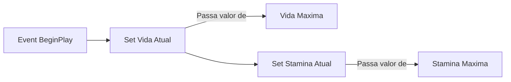
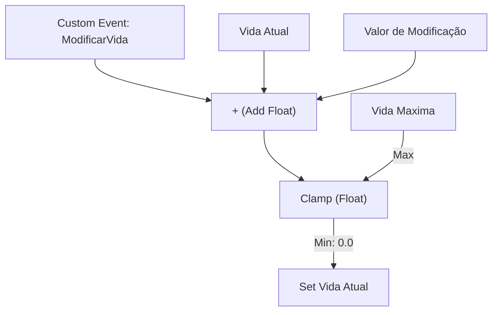

# 🎓 Componente de Atributos: AC_PlayerStatus Blueprint

**[Compatibilidade: UE 5.1+]**  
**[Origem: CUSTOMIZADO]**

O `AC_PlayerStatus` é um **Actor Component** (Componente de Ator) desenvolvido visualmente via Blueprints. O objetivo deste componente é encapsular toda a lógica relacionada aos atributos vitais do personagem, especificamente a **Vida** (Health) e a **Estamina** (Stamina), mantendo o código do personagem limpo e modular.

Neste documento, analisamos a estrutura de variáveis, o fluxo de execução dos Event Graphs para aplicação de dano e cansaço, e a importância de funções de salvaguarda matemática.

---

## 🎯 Caso Prático: Impedindo Overflow de Vida e Estamina

> *Durante os testes do jogo, o jogador usou um item de cura ("Poção de Rum") que deveria curar 50 pontos de vida. No entanto, o jogador já estava com a vida cheia (100/100), fazendo com que a vida atual subisse para 150/100, quebrando a interface gráfica da barra de vida. Em outro teste, ao correr sem parar, a estamina do jogador ficou negativa (-15/100), fazendo com que o jogador precisasse descansar por mais tempo do que o normal antes de poder correr novamente. Como projetar um componente de status robusto que evite esses problemas?*

---

## ⚙️ 1. Estrutura de Variáveis do Componente

Para gerenciar o status de forma precisa, o componente define as seguintes variáveis no painel My Blueprint:

| Variável | Tipo de Dado | Valor Padrão | Descrição Didática |
| :--- | :--- | :--- | :--- |
| **`Vida Atual`** | `Float` | `100.0` | Armazena a saúde corrente do personagem a cada frame. |
| **`Vida Maxima`** | `Float` | `100.0` | Limite superior da vida do personagem (configurável no editor). |
| **`Stamina Atual`** | `Float` | `100.0` | Energia disponível para ações como correr e pular. |
| **`Stamina Maxima`** | `Float` | `100.0` | Limite superior da energia física do personagem. |

---

## ⚙️ 2. Análise do Fluxo de Execução (Event Graph)

### A) Event BeginPlay (Inicialização)
Quando o personagem surge no mapa, o componente lê os limites máximos e os define como valores iniciais para evitar que o personagem comece machucado ou cansado.



### B) Event Graph: Lógica de Atualização com Clamping
Para modificar a vida de forma segura, criamos funções ou eventos customizados que recebem um valor de modificação (positivo para cura, negativo para dano) e utilizam o nó **Clamp (Float)** para blindar a variável.



### Por que usar o nó Clamp?
O nó `Clamp (Float)` restringe um valor de entrada a um intervalo delimitado por um valor Mínimo e um Máximo.
*   **Se a vida calculada for menor que 0.0:** o Clamp retorna exatamente `0.0`, impedindo vidas negativas.
*   **Se a vida calculada passar de Vida Maxima:** o Clamp retorna exatamente o valor de `Vida Maxima`, impedindo bugs de cura infinita (overflow).

---

## 🏃 Desafio Ativo: Regeneração Passiva de Estamina

O designer do jogo deseja que a estamina se regenere automaticamente a uma taxa de 5 pontos por segundo sempre que o personagem não estiver correndo.

### Esqueleto de Resolução do Desafio:

1. No Event Graph do `AC_PlayerStatus`, localize ou adicione o nó **Event Tick** ou utilize um **Timer por Evento**.
2. Adicione um branch para verificar se a `Stamina Atual` é menor que a `Stamina Maxima`.
3. Caso a condição seja verdadeira (True), monte a seguinte lógica visual:

```
[Event Tick] -> [Branch] ──(True)──> [Set Stamina Atual]
                   │                        ▲
             (Stamina < Max)                │ (Resultado)
                                     [Clamp (0.0 to Max)]
                                            ▲
                                     [Stamina + (Ganho * DeltaTime)]
```

*   **Dica matemática:** Para garantir que a regeneração seja independente do frame rate (FPS), multiplique a taxa de ganho (5.0) pelo valor de **Delta Seconds** (saída do Event Tick) antes de somar à `Stamina Atual`.

---

## ❓ Perguntas que este documento responde

- O que é um Actor Component e qual a vantagem de usá-lo para gerenciar a vida do personagem?
- Como funciona o nó mathematical Clamp e por que ele é crucial na atualização de atributos?
- Como inicializar variáveis de status no Event BeginPlay?
- Como projetar um fluxo de Blueprint RAG-friendly para modificação de atributos vitais?
