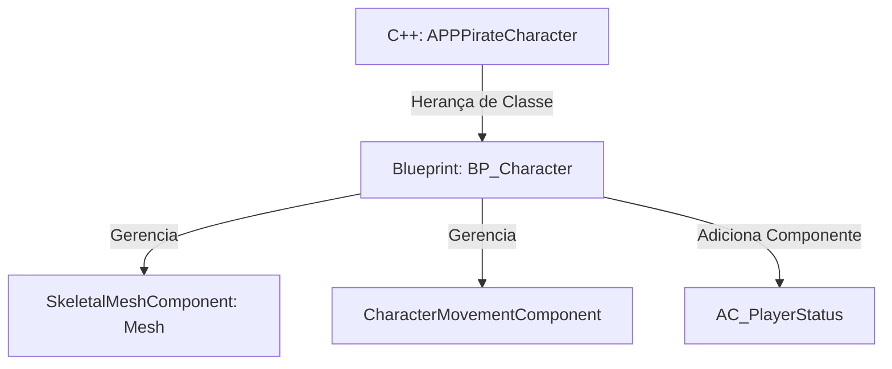

# 🎓 Ator Personagem: BP_Character Blueprint

**[Compatibilidade: UE 5.1+]**  
**[Origem: ALS MODIFICADO]**

O `BP_Character` é o Blueprint central que representa fisicamente o jogador no mundo 3D. Ele herda diretamente da classe C++ `APPPirateCharacter`. Em termos de design de engenharia, essa separação é perfeita: toda a lógica de alto desempenho e setup de input reside no C++, enquanto a configuração de malhas visuais, materiais, trilhas sonoras e partículas é resolvida de forma flexível e rápida no editor Blueprint.

---

## 🎯 Caso Prático: Integrando Arte e Código no Blueprint do Personagem

> *O programador do jogo escreveu toda a lógica de movimento do pirata em C++. O artista 3D finalizou o modelo Skeletal Mesh do pirata ("SkeletalMesh_Pirate") e o animador criou o Blueprint de Animação ("AnimBP_Pirate"). Como conectar o modelo visual e as animações à estrutura lógica sem poluir o código-fonte C++ com referências rígidas a arquivos locais do disco?*

---

## ⚙️ 1. Hierarquia de Herança e Componentes

O Blueprint herda variáveis da classe C++ e permite o acoplamento de novos componentes no editor:



### Componentes Internos e Parâmetros Configurados:

1.  **`Mesh` (SkeletalMeshComponent):**
    *   **Função:** Renderiza a malha visual 3D do personagem.
    *   **Configuração:** Aponta para o asset `JillValentineUE5_2` ou similar.
    *   **Anim Class:** Aponta para `AnimBP_Character` para processar a lógica de Blend Spaces e transição de poses (caminhar, correr, pular).
2.  **`CharacterMovementComponent` (Configurações herdadas):**
    *   **Max Walk Speed:** Configurada automaticamente via C++ com base nas variáveis `WalkSpeed` e `SprintSpeed`.
    *   **Gravity Scale:** Alterada para `1.5` para dar um peso físico realista ao pulo.
3.  **`AC_PlayerStatus` (Actor Component):**
    *   **Função:** Adicionado como componente customizado para controlar os status de saúde e fadiga.

---

## ⚙️ 2. Mapeamento de Inputs no Painel Details

Embora a vinculação lógica das ações (Binds) ocorra no arquivo `PPPirateCharacter.cpp`, o carregamento das referências de assets é feito diretamente no painel Details do `BP_Character`. Isso protege o código de erros causados por caminhos de arquivos de assets alterados.

### Painel Details do Componente de Input:
*   **`Pirate Input Context`:** Aponta para o asset `IMC_Default` na pasta `Content`.
*   **`Move Action`:** Aponta para `IA_Move`.
*   **`Look Action`:** Aponta para `IA_Look`.
*   **`Jump Action`:** Aponta para `IA_Jump`.
*   **`Sprint Action`:** Aponta para `IA_Sprint`.

---

## 🏃 Desafio Ativo: Tocar Som de Pulo no Event OnJumped

Para enriquecer a experiência do jogador, o designer quer que o personagem emita um som de esforço físico ("Jump Grunt") toda vez que ele pular.

### Esqueleto de Resolução do Desafio:

1. Abra o Event Graph do `BP_Character`.
2. Clique com o botão direito no grafo e procure pelo nó **Event On Jumped** (evento nativo disparado toda vez que o personagem inicia um pulo).
3. Conecte o fluxo de execução a um nó **Play Sound at Location** ou **Play Sound 2D**.
4. No parâmetro **Sound**, selecione um asset de áudio apropriado (ex: `SomPulo`).
5. Caso use `Play Sound at Location`, conecte a entrada **Location** ao nó **Get Actor Location** para emitir o som a partir do personagem.

```
[Event On Jumped] ──> [Play Sound at Location]
                             ├── Sound: (Selecione SomPulo)
                             └── Location: [Get Actor Location]
```

---

## ❓ Perguntas que este documento responde

- Como funciona a integração entre uma classe base C++ e um Blueprint filho na Unreal Engine 5?
- Como associar uma malha 3D e um Blueprint de Animação a um componente herdado no editor?
- De que forma os assets do Enhanced Input são vinculados e parametrizados no Blueprint?
- Como utilizar eventos herdados de movimento (como `OnJumped`) no grafo de Blueprints?
