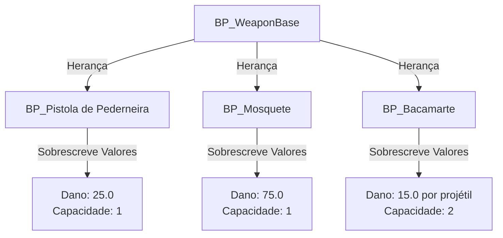
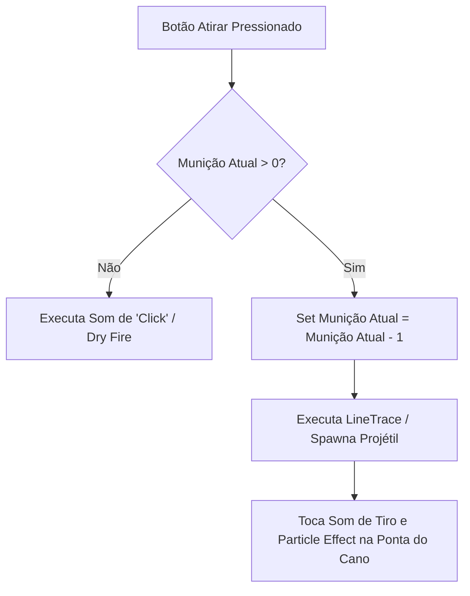

# 🎓 Base de Armas: BP_WeaponBase Blueprint

**[Compatibilidade: UE 5.1+]**  
**[Origem: CUSTOMIZADO]**

O `BP_WeaponBase` é a classe Blueprint pai (`Parent Class`) para todo o arsenal do jogo. Seguindo as melhores práticas de Programação Orientada a Objetos (POO), este Blueprint implementa as regras e variáveis comuns a todas as armas do jogo (como atirar, recarregar e controlar munição), permitindo que armas específicas (como pistolas e rifles) sejam criadas como **Blueprints Filhos** (`Child Blueprints`), herdando toda a lógica base e alterando apenas dados visuais ou parâmetros numéricos.

---

## 🎯 Caso Prático: Criando um Arsenal sem Duplicar Código

> *O estúdio precisa adicionar 5 armas diferentes ao jogo: um Mosquete, uma Pistola de Pederneira, um Bacamarte, uma Metralhadora de Gelo e um Rifle Sniper de Precisão. Se o programador criasse um Blueprint separado do zero para cada arma, teria que refazer o código de recarregar e calcular munição 5 vezes. Se houvesse um bug na recarga, teria que consertar em 5 arquivos diferentes. Como estruturar isso de forma profissional utilizando herança de Blueprints?*

---

## ⚙️ 1. O Pipeline de Herança de Armas

A arquitetura do sistema de armas baseia-se em uma classe mestre que distribui sua lógica para os filhos:



### Variáveis Declaradas no `BP_WeaponBase`:
*   **`Municao Atual`** (`Integer` | Padrão: `30`): Quantidade de balas carregadas na arma no momento.
*   **`Capacidade Pente`** (`Integer` | Padrão: `30`): Quantidade máxima de munição suportada por cartucho.
*   **`Dano`** (`Float` | Padrão: `20.0`): Multiplicador de dano aplicado ao acertar um inimigo.
*   **`Cadencia Disparo`** (`Float` | Padrão: `0.2`): Tempo mínimo de espera em segundos entre cada disparo.

---

## ⚙️ 2. Análise do Fluxo de Execução (Shoot & Reload)

### A) Event Graph: O Disparo Lógico (Custom Event: Atirar)
Quando o jogador pressiona o gatilho, a arma passa por verificações de segurança antes de disparar.



### B) Implementação da Interface: `BP_WeaponInterface`
Para garantir que o personagem principal consiga disparar qualquer arma equipada de forma genérica, o `BP_WeaponBase` implementa a interface `BP_WeaponInterface`. 
*   **Vantagem:** O personagem não precisa saber qual arma está segurando (Cast para Pistola, Cast para Mosquete, etc.). Ele simplesmente chama a função da interface `Execute_Atirar` no ator equipado, e o motor resolve a chamada automaticamente para o Blueprint correto.

---

## 🏃 Desafio Ativo: Recuo Visual Simples (Recoil)

Para adicionar mais dinamismo ao jogo, o designer solicitou que a câmera ou a malha da arma dê um pequeno "tranco" (recuo) para trás e para cima toda vez que a arma disparar.

### Esqueleto de Resolução do Desafio:

1. No `BP_WeaponBase`, crie um evento chamado `AplicarRecuo`.
2. No final do fluxo de disparo bem-sucedido (após tocar o som do tiro), chame o evento `AplicarRecuo`.
3. Use o seguinte fluxo no Blueprint para rotacionar a câmera do jogador ligeiramente para cima:

```
[AplicarRecuo] 
    │
    ▼
[Get Player Controller] ──> [Add Controller Pitch Input] (Valor: -1.5)
```

*   **Explicação:** Adicionar um input negativo no Pitch do controlador faz com que a câmera do jogador se desloque ligeiramente para cima, criando a sensação visual física de recuo (recoil).

---

## ❓ Perguntas que este documento responde

- Como funciona a arquitetura de herança aplicada a sistemas de armas na Unreal?
- O que é o nó de Interface de Blueprint e qual a vantagem de usá-lo em vez de Castings diretos?
- Qual a lógica recomendada para validar e subtrair munição durante o disparo?
- Como implementar um recuo (recoil) básico de câmera em Blueprints?
