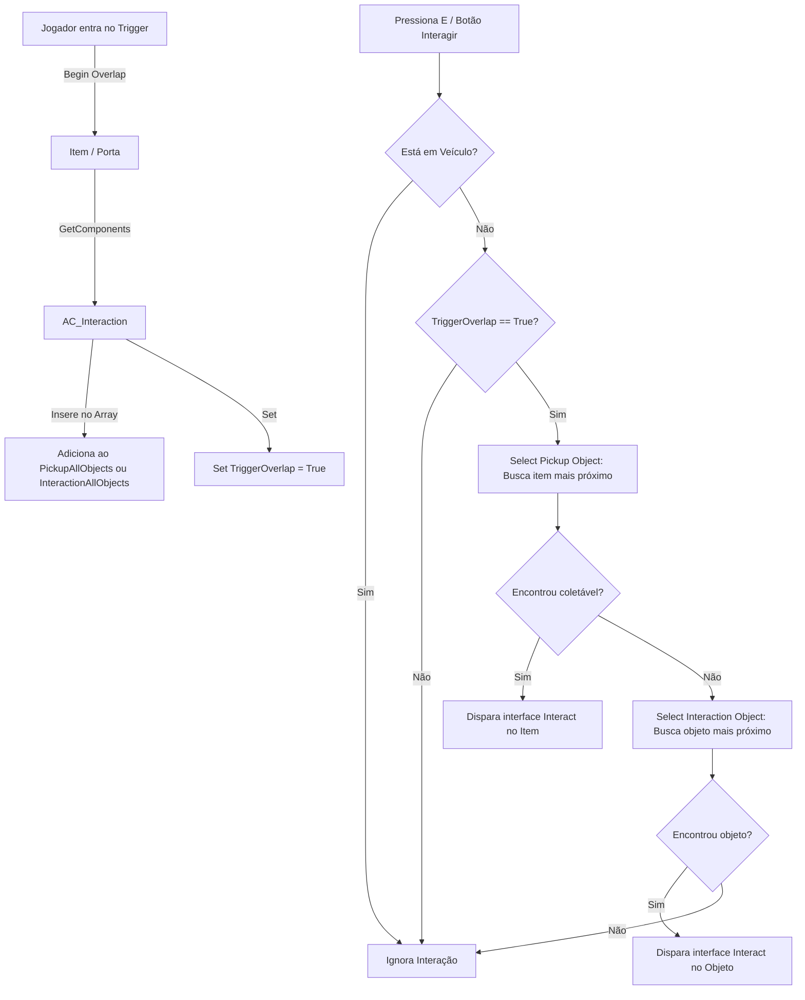
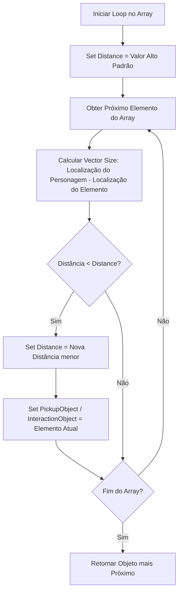

# 🎓 Análise de Blueprint: AC_Interaction (Componente de Interação)

**[Compatibilidade: UE 5.1+]**  
**[Status do Editor: Ativo em Background (PID: 11904)]**  
**[Caminho no Projeto:]** `Content/Blueprints/Interaction/AC_Interaction.uasset`  
**[Fontes de Conhecimento:]** `[Projeto Real]`, `[Documentação Epic Games]`, `[Teoria / IA]`

---

## 🎯 1. Visão Geral do Sistema de Interação

Ao contrário de muitos jogos que usam varreduras de linha de visão (*Line Traces* / Raycasts) para detectar objetos interativos, o **Projeto GTA** adota uma **Arquitetura Baseada em Registro por Sobreposição (Overlap-Register Architecture)**. 

Os próprios objetos interativos (`BP_InteractionObject`) e itens de coleta (`BP_PickupObject`) gerenciam sua colisão. Quando o jogador entra em seus volumes de trigger, os objetos se registram no componente `AC_Interaction` do jogador. O componente, então, gerencia a prioridade de interação executando cálculos matemáticos de distância tridimensional.

---

## ⚙️ 2. Estrutura de Dados e Variáveis

| Nome da Variável | Tipo de Dado | Origem | Descrição |
| :--- | :--- | :--- | :--- |
| **`Character`** | `Character (Object Ref)` | `[Projeto Real]` | Referência em cache do personagem dono do componente para evitar casts repetitivos. |
| **`InteractionAllObjects`** | `Array de BP_InteractionObject_C` | `[Projeto Real]` | Lista de todos os objetos interativos estáticos (como portas) cujos triggers o jogador está sobrepondo. |
| **`InteractionObject`** | `BP_InteractionObject_C (Ref)` | `[Projeto Real]` | O objeto interativo estático mais próximo do jogador no momento. |
| **`Distance`** | `Double (Real)` | `[Projeto Real]` | Variável temporária usada nos loops de comparação de distância para armazenar a menor distância registrada. |
| **`TriggerOverlap`** | `Boolean` | `[Projeto Real]` | Sinalizador que indica se o jogador está sobreposto a pelo menos um trigger interativo ativo. |
| **`Interaction`** | `Boolean` | `[Projeto Real]` | Estado de interação ativa (cooldown/bloqueio temporário). |
| **`PickupAllObjects`** | `Array de BP_PickupObject_C` | `[Projeto Real]` | Lista de todos os itens físicos de coleta (vida, colete, munição) na vizinhança. |
| **`PickupObject`** | `BP_PickupObject_C (Ref)` | `[Projeto Real]` | O item de coleta mais próximo do jogador no momento. |

---

## ⚙️ 3. Lógica dos Grafos e Algoritmos de Priorização

### A) Inicialização (`ReceiveBeginPlay`)
*   **Ação:** Disparado assim que o Character spawna. Executa `GetOwner()`, faz um cast para `Character` e armazena a referência na variável `Character`.
*   **Vantagem:** Evita a má prática de computar `Cast To` repetidamente em loops ou no Tick.

### B) Roteamento da Ação (`EventInteraction`)
Quando o jogador pressiona o botão de ação física, o componente processa a entrada seguindo estes passos:
1.  **Trava de Veículo:** Checa o estado `InVehicle` do personagem. Se verdadeiro, aborta imediatamente.
2.  **Validação de Sobreposição:** Se `TriggerOverlap == False`, aborta.
3.  **Seleção do Coletável mais Próximo:** Chama a função `SelectPickupObject()`.
    *   Se retornar um objeto válido, dispara o evento **`Interact`** (via interface) e remove o item.
4.  **Seleção do Objeto de Cena mais Próximo:** Se não houver coletáveis, chama `SelectInteractionObject()`.
    *   Se retornar um objeto interativo válido (ex: uma porta), dispara o evento **`Interact`**.

### C) Algoritmo de Cálculo de Proximidade (`SelectPickupObject` / `SelectInteractionObject`)
Ambas as funções utilizam uma lógica de varredura matemática de menor distância:

*   **Matemática Tridimensional:** O cálculo da distância é obtido pela subtração dos vetores de localização (`Subtract_VectorVector` das funções `K2_GetActorLocation` do Character e do Item) e passando o resultado pelo nó **`VSize`** (Vector Length), que computa a raiz quadrada da soma dos quadrados dos eixos X, Y e Z ($\sqrt{x^2 + y^2 + z^2}$).

### D) Gerenciamento do Fim de Colisão (`TriggerOverlapEnd`)
Ao sair da área de um trigger:
1.  O componente chama `GetOverlappingComponents` na malha do jogador.
2.  Se o tamanho do array for zero (`Length == 0`), significa que nenhuma área física está encostando no jogador. O componente define `TriggerOverlap = False`.
3.  Se ainda restarem colisões, varre os objetos usando um loop. Se encontrar qualquer componente com canal de colisão definido como **`Trigger`**, define `TriggerOverlap = True` e executa um `Break` no loop para poupar CPU.

---

## ⚠️ 4. Análise de Exploits e Vulnerabilidades de Gameplay

> [!CAUTION]
> **Exploit 1: Imunidade Total a Dano de Queda Livre (Bypass de FallDamage)**
> *   **Gargalo [Projeto Real]:** A lógica de controle de dano de queda no componente `AC_PlayerStatus` interage de forma insegura com o `AC_Interaction`. Se o jogador tiver um objeto de interação em foco (`InteractionObject` válido) mas esse objeto for desativado (`IsActive == False`), o fluxo de verificação de impacto de velocidade Z cai no pino `else` da branch de checagem de atividade de interação e aborta o cálculo de dano. Isso permite que jogadores saltem de qualquer altura sem sofrer dano, bastando focar em um objeto interativo inativo durante a queda.
> *   **Remediação:** Desacoplar completamente a física de velocidade de queda (`FallDamage` baseado em movimento do Character Movement Component) de qualquer verificação de foco de interface ou estado do objeto de interação. O dano de queda deve ser calculado estritamente pelas propriedades físicas do próprio Pawn do jogador.

> [!WARNING]
> **Exploit 2: Spam de Coleta (Duplicação de Itens / Fast Action)**
> *   **Gargalo [Teoria / IA]:** Visto que o `AC_Interaction` apenas despacha a chamada da interface `Interact` para o item coletável (`BP_Health`, `BP_Armour`, etc.) e estes realizam a destruição própria por meio de `K2_DestroyActor` no final do seu evento, um jogador utilizando macros de entrada rápida pode enviar 3 a 5 comandos `Interact` no mesmo frame de rede. Isso faz com que o item conceda os status múltiplas vezes antes de ser removido da memória do motor.
> *   **Remediação:** O item coletável deve verificar um sinalizador lógico `DoOnce` no início do seu Event Graph. Ao receber o primeiro evento `Interact`, define imediatamente `DoOnce = True` e rejeita qualquer chamada subsequente antes de executar a lógica de incremento de status ou de destruição.
