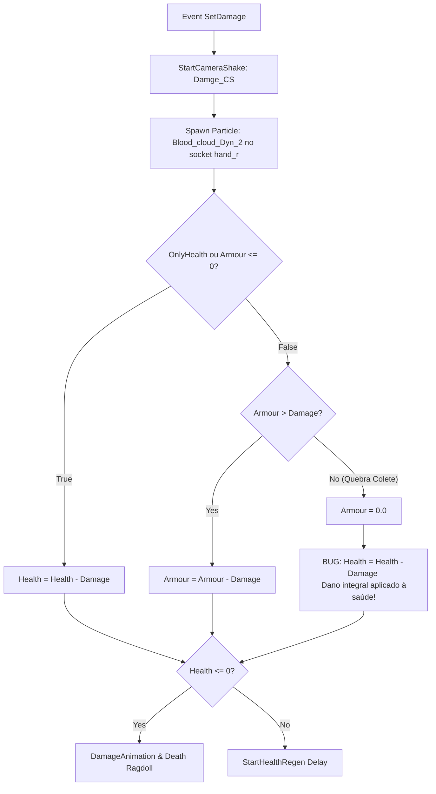
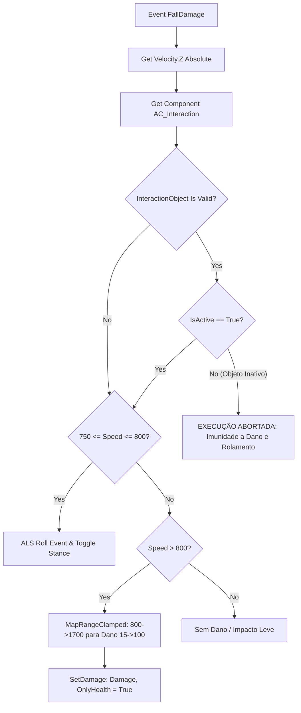

# 🎓 Análise Técnica Avançada: AC_PlayerStatus Blueprint

**[Compatibilidade: Unreal Engine 5.1+]**  
**[Status de Verificação: Analisado com base nos fluxos exatos dos arquivos bruto-exportados]**  
**[Classificação de Fontes: Projeto Real (Mecânica Local) | Documentação Oficial Epic Games | Teoria de Engenharia & IA]**

O `AC_PlayerStatus` é um **Actor Component** (Componente de Ator) desenvolvido visualmente via Unreal Blueprints para encapsular toda a lógica e matemática relacionada aos atributos físicos e vitais do personagem jogador. Ele gerencia de forma integrada a **Vida** (Health), o **Colete** (Armour) e a **Estamina** (Stamina), fornecendo interfaces de comunicação com o sistema de movimentação **ALS V4** (Advanced Locomotion System) e sistemas de interação do jogo.

---

## 🎯 Caso Prático: Prevenção de Bugs de Variação de Atributos e Exaustão Física

> *Durante o combate e movimentação, itens de cura, danos e consumo de energia física alteram constantemente os status do jogador. Sem limites matemáticos rígidos (Clamping), a vida poderia ultrapassar o limite máximo estabelecido (ex: 120/100), corrompendo a exibição de elementos visuais e widgets na UI. Da mesma forma, o consumo contínuo de estamina ao correr poderia resultar em valores negativos no frame rate do jogo, atrasando a recuperação física. O `AC_PlayerStatus` resolve isso aplicando operações matemáticas seguras (`FClamp`, `FMin`) em todas as transições de estado.*

---

## ⚙️ 1. Estrutura de Variáveis do Componente

A tabela abaixo lista as variáveis internas extraídas diretamente dos nós do componente, contendo seus tipos e valores padrão reais definidos no editor da Unreal Engine:

| Variável | Tipo de Dado | Valor Padrão | Descrição Didática |
| :--- | :--- | :--- | :--- |
| **`Character`** | `Character (Object Reference)` | `None` | Referência em cache para o personagem dono do componente (Owner). |
| **`Health`** | `Double (real)` | `100.0` | Nível de saúde/vida atual do personagem jogador. |
| **`MaxHealth`** | `Double (real)` | `100.0` | Limite superior da vida máxima do personagem. |
| **`MinHealth`** | `Double (real)` | `0.0` | Limite inferior de sobrevivência (ponto de morte/ragdoll). |
| **`Armour`** | `Double (real)` | `0.0` | Valor atual do colete de proteção balística do jogador. |
| **`MaxArmour`** | `Double (real)` | `100.0` | Limite superior da armadura/colete de proteção. |
| **`Stamina`** | `Double (real)` | `100.0` | Energia física corrente disponível para ações como correr e pular. |
| **`MaxStamina`** | `Double (real)` | `100.0` | Limite superior da estamina do personagem. |
| **`CanJump`** | `Boolean` | `True` | Flag lógico que bloqueia ou autoriza a ação de pulo com base na energia. |
| **`NewStamina`** | `Double (real)` | `1.0` | Taxa de variação (consumo/recuperação) de estamina por pulso de timer. |
| **`TimeStamina`** | `Double (real)` | `0.1` | Intervalo de tempo (frequência) do temporizador cíclico de estamina. |
| **`StaminaTimer`** | `TimerHandle` | `None` | Identificador (handle) do loop periódico de atualização de estamina. |
| **`NewJumpStamina`** | `Double (real)` | `15.0` | Custo de estamina deduzido a cada tentativa de pulo. |
| **`TimeJumpStamina`** | `Double (real)` | `1.5` | Delay/Cooldown necessário antes de restaurar a taxa original do pulo. |
| **`LocalDamage`** | `Double (real)` | `0.0` | Variável interna local temporária usada para cachear valores de dano recebidos. |

---

## ⚙️ 2. Análise Técnica dos Fluxos Lógicos (Event Graph)

### A) Event BeginPlay (Inicialização do Sistema)
Quando o personagem é spawnado no mapa, o componente resolve suas dependências de cache e inicia o timer cíclico de estamina:

1. **Obtenção do Owner:** Executa `GetOwner()`, realiza um Cast para a classe `Character` do motor de jogo, e armazena na variável `Character`.
2. **Setup de Inicialização:** Chama a função/evento `Sprint`, sobrescrevendo o pino de entrada `NewStamina` com o valor `5.0`.
3. **Ativação do Timer:** A função `Sprint` realiza a chamada para `K2_SetTimerDelegate`, registrando o evento `StaminaSprint` com uma frequência definida pela variável `TimeStamina` (`0.1s`) em loop (`bLooping = True`), guardando a referência em `StaminaTimer`.

```mermaid
graph LR
    BeginPlay[ReceiveBeginPlay] --> GetOwner[GetOwner]
    GetOwner --> CastChar[Cast to Character]
    CastChar --> SetCharRef[Set Character Reference]
    SetCharRef --> CallSprint[Call Sprint (NewStamina = 5.0)]
    CallSprint --> SetTimer[Set Timer Delegate: StaminaSprint]
```

---

### B) Event SetHealth (Modificação Controlada de Saúde)
Modifica a saúde do personagem de forma segura, garantindo compatibilidade com interfaces e interações de estado de morte:

1. **Avaliação do Tipo de Restauração (`AddHealth`):**
   - Se `AddHealth == True`: Soma a vida atual à nova vida (`Health + NewHealth`) e limita o resultado superiormente através de `FMin` contra `MaxHealth`.
   - Se `AddHealth == False`: Sobrescreve diretamente a saúde: `Health = NewHealth`.
2. **Verificação de Morte (`Health <= MinHealth`):**
   - Se o jogador estiver morto, envia a mensagem de interface `DamageAnimation(DamageAnim = True)` (para reações físicas imediatas) e força a variável de locomoção `DesiredGait` do componente ALS (`ALS_Base_CharacterBP`) para o estado `NewEnumerator0` (`Walk`), fazendo o personagem desabar fisicamente.
   - Se estiver vivo, o estado de locomoção não é afetado.

---

### C) Event SetArmour (Modificação Controlada do Colete)
Ajusta a armadura física respeitando os limites superiores do componente:

1. **Checagem de Incremento (`AddArmour`):**
   - Se `AddArmour == True`: Calcula `Armour + NewArmour` e limita o resultado através de `FMin` contra `MaxArmour`.
   - Se `AddArmour == False`: Atribui diretamente: `Armour = NewArmour`.

---

### D) Event SetDamage (Lógica de Recebimento de Danos & Bug de Colete)
Chamado via mensagens de interface de combate. Gerencia tremores de tela, emissão de efeitos visuais de ferimento, absorção por colete e transição de óbito.

1. **Efeitos Visuais e Feedback Físico:**
   - Obtém o `PlayerCameraManager` (Player Index 0) e executa `StartCameraShake` usando a classe customizada `Damge_CS_C`.
   - Spawna partículas de sangue `Blood_cloud_Dyn_2` na posição do socket `"hand_r"` (mão direita do mesh esquelético) com uma escala de `(0.3, 0.3, 0.3)`.
2. **Verificação da Flag `OnlyHealth` (Ignorar Proteções):**
   - Se `OnlyHealth == True` ou se o valor atual de `Armour <= 0`, o dano é subtraído diretamente na barra de vida (`Health = Health - LocalDamage`).
   - Se `OnlyHealth == False` e o jogador possui proteção de armadura (`Armour > 0`):
     - **Caso a Armadura Absorva Totalmente (`Armour - LocalDamage > 0`):** Deduz o dano da armadura e chama `SetArmour(NewArmour = Armour - LocalDamage)`. A saúde permanece intocada.
     - **Caso a Armadura Quebre (`Armour - LocalDamage <= 0`):** Aplica o **Bug de Dano Sobressalente** detalhado abaixo.
3. **Validação do Estado Vital:**
   - Se `Health <= 0`: Chama `DamageAnimation(DamageAnim = True)` e dispara o evento `Death()` para desativar colisão do jogador e acionar o sistema Ragdoll.
   - Se `Health > 0`: Aciona `StartHealthRegen()` para iniciar a cura passiva após delay.

> [!WARNING]
> ### ⚠️ Bug de Design Lógico no Cálculo de Dano Sobressalente
> Quando o dano é maior que a armadura atual (`Armour - LocalDamage <= 0`), o componente executa `SetArmour(NewArmour = 0.0)` corretamente. No entanto, em vez de aplicar à saúde apenas a sobra do dano que ultrapassou o colete (`Health - (LocalDamage - Armour)`), a Blueprint executa `SetHealth(NewHealth = Health - LocalDamage)`. 
>
> **Consequência Prática:** O colete falha completamente em atenuar o impacto se o dano recebido quebrar a armadura. Um personagem com `10` de armadura e `100` de vida que tome um dano de `15` ficará com `0` de armadura e `85` de vida (dano total bruto na vida), em vez de `95` de vida (apenas o excedente de `5` de dano).
>
> > [!IMPORTANT]
> > **Prática Recomendada de Correção (Mitigação do Bug do Colete):**  
> > *   **A mecânica local do projeto** calcula `Health - LocalDamage` na falha de absorção.
> > *   **A recomendação teórica e de engenharia** dita que deve-se calcular o dano restante antes de deduzir a saúde.
> > *   **Solução:** Substitua o nó `Subtract_DoubleDouble` que desconta a vida por uma operação que faça `Health - (LocalDamage - Armour)`. Para isso, faça a subtração de `LocalDamage - Armour` e ligue o resultado a uma subtração da vida atual (`Health - Resultado`), conectando a saída no pino `NewHealth` de `SetHealth`.



---

### E) Event FallDamage (Dano de Queda & Exploit de Imunidade)
Disparado pelo controlador de movimento ao colidir verticalmente com o solo.

1. **Obtenção da Velocidade:** Captura o vetor de velocidade linear (`GetVelocity()`), extrai o componente vertical Z e obtém o valor absoluto `Abs(Velocity.Z)`.
2. **Execução de Salvaguarda de Interação (Exploit de Queda Livre):**
   - Adquire o componente de interação do jogador (`AC_Interaction`).
   - Se o objeto cacheado com o qual o jogador está interagindo (`InteractionObject` de tipo `BP_InteractionObject_C`) for válido:
     - Lê a variável `IsActive` (Boolean) desse objeto.
     - Se `IsActive == False`, o fluxo cai no pino `else` da branch de checagem. Como este pino **está desconectado**, o fluxo de execução é abortado instantaneamente.
3. **Lógica Normal de Impacto (Se o salvaguarda de interação não for ativado):**
   - **Velocidade entre 750 e 800:** Dispara o evento visual do ALS `Roll Event` e alterna a postura do personagem (`Stance` entre `Standing` e `Crouching`) para simular amortecimento. Nenhum dano é aplicado.
   - **Velocidade superior a 800:** Executa um clamp linear através do nó `MapRangeClamped` convertendo a velocidade de `[800.0, 1700.0]` para valores de dano de `[15.0, 100.0]`. Em seguida, aplica diretamente na vida do jogador chamando `SetDamage(OnlyHealth = True)`.

> [!CAUTION]
> ### 🛑 Exploit de Queda Livre (Imunidade a Impactos)
> Devido ao pino de execução `else` da checagem de atividade do `InteractionObject` estar desconectado no Event Graph de `FallDamage`, os jogadores podem obter imunidade total a danos de queda. 
>
> **Método de Reprodução:** Se o personagem estiver mantendo em cache uma interação com um objeto desativado no cenário (`IsActive = False`), a queda não causará dano e a animação de rolamento não será executada, independentemente de cair da maior altura possível do mapa.
>
> > [!IMPORTANT]
> > **Prática Recomendada de Correção (Blindagem contra Exploit de Queda):**  
> > *   **A mecânica local do projeto** interrompe a execução silenciosamente se o objeto estiver inativo porque o pino `else` está vazio.
> > *   **A documentação oficial e de teoria** dita que fluxos condicionais de segurança devem cair no fluxo padrão de processamento caso a condição opcional não seja cumprida.
> > *   **Solução:** Conecte a saída do pino `else` da branch de checagem do `IsActive` (em `K2_IfThenElse_10`) diretamente na entrada de execução da branch `K2_IfThenElse_8` (que avalia a velocidade da queda). Isso impede que a desativação do objeto interrompa a verificação de velocidade e o cálculo de dano de queda.



---

### F) Recuperação Passiva de Saúde (HealthRegen / StartHealthRegen)
Proporciona cura lenta e gradual fora de combate, limpando os timers de processamento automaticamente para evitar desperdício de performance.

1. **Ativação da Regeneração (`StartHealthRegen`):**
   - Configura o `K2_SetTimerDelegate` para acionar o evento `HealthRegen` a cada `0.5s` de forma cíclica (`bLooping = True`).
2. **Lógica de Loop (`HealthRegen`):**
   - Executa uma checagem composta (AND lógico): Verifica se o personagem está vivo (`GetCharacterDead == False`) E se a vida atual é inferior à máxima (`Health < MaxHealth`).
   - **Condição True:** Incrementa a vida chamando `SetHealth(AddHealth = True, NewHealth = 1.0)`. Isso gera uma cura efetiva de **2.0 de vida por segundo**. Imprime a string de desenvolvimento `"Recuperando"`.
   - **Condição False (Vida Cheia ou Personagem Morto):** Imprime a string `"Recuperado"` e interrompe permanentemente o loop através do nó `K2_ClearAndInvalidateTimerHandle`.

---

### G) Consumo e Recuperação de Estamina (Sprint & StaminaSprint)
Controla a fadiga do personagem ao correr e a sua recuperação natural em repouso.

1. **Loop Principal (`StaminaSprint`):**
   - Chamado em intervalos de `TimeStamina` (`0.1s`).
   - Verifica se o jogador está correndo no chão: `Gait == Sprint` AND `IsMovingOnGround == True` (via `CharacterMovementComponent`).
2. **Caso Correndo (Consumo):**
   - Reduz a estamina: `Stamina = Clamp(Stamina - NewStamina, 0.0, MaxStamina)`.
   - Se a estamina atingir `0.0`, limpa o timer periódico com `K2_ClearAndInvalidateTimerHandle` e altera a velocidade desejada (`DesiredGait`) do ALS para `Walk` (NewEnumerator0), forçando o jogador a caminhar por exaustão.
3. **Caso Não Correndo (Recuperação):**
   - Incrementa a estamina: `Stamina = Clamp(Stamina + NewStamina, 0.0, MaxStamina)`.
   - Se a estamina atingir `MaxStamina` (recuperação completa), cancela o timer periódico para poupar ciclos de processamento.

---

### H) Controle de Pulos por Estamina (Jump & JumpStamina)
Mecânica que impede o spam de pulos contínuos ("bunny hopping") limitando a ação pela energia física.

1. **Tentativa de Pulo (`Jump`):**
   - Ao receber o input de pulo, a Blueprint avalia a condição `Stamina < NewJumpStamina` (Custo de Pulo = `15.0`).
   - Se `Stamina < NewJumpStamina` for True: Define `CanJump = False` (bloqueando a ação física no personagem).
   - Se `Stamina < NewJumpStamina` for False: Define `CanJump = True` (liberando a física de pulo).
2. **Consumo de Estamina do Pulo:**
   - Se o pulo for executado, deduz o custo da estamina: `Stamina = Clamp(Stamina - NewJumpStamina, 0.0, MaxStamina)`.
   - Dispara um timer com delay `TimeJumpStamina` (`1.5s`) que chamará o evento `JumpStamina` para servir como tempo de recarga antes de redefinir `CanJump = True`.
3. **Bônus de Estamina em Queda:**
   - Durante a checagem no evento `Jump`, se o personagem estiver caindo (`IsFalling == True`), o componente adiciona incrementalmente `0.001` de estamina (`Stamina = Clamp(Stamina + 0.001, 0.0, MaxStamina)`). Como isso ocorre em um evento discreto disparado uma única vez pelo input de pulo, o bônus é aplicado apenas uma vez por tentativa de salto no ar.

---

### I) Event Tick (Desconectado no Editor)
O pino de execução do evento `ReceiveTick` encontra-se **desconectado** no editor do projeto.

- **Comportamento Inativo:** Se estivesse ativo, o Event Tick executaria conversões de dados (`Conv_DoubleToString`, `Conv_BoolToString`) e concatenações a cada frame para imprimir na tela do editor as variáveis `Armour`, `CanJump` e `NewJumpStamina`.
- **Impacto no Projeto:** O desligamento poupa recursos gráficos e de processamento da CPU no editor (evitando logs contínuos na tela), mas remove o monitoramento em tempo real dessas variáveis em build de desenvolvimento.

---

## ❓ Perguntas Respondidas por este Estudo

* **Como o colete (Armour) mitiga o dano recebido pelo jogador?**  
  Se o dano for menor que a armadura disponível, o colete absorve 100% do impacto de forma limpa. Contudo, se o dano recebido for maior ou igual ao colete, o colete quebra (zera) e a saúde do jogador é penalizada pelo **dano bruto integral**, ignorando a absorção parcial prévia devido a um bug lógico na Blueprint.
* **Como funciona o exploit de imunidade a danos de queda livre?**  
  Ao iniciar a checagem do evento de queda (`FallDamage`), se o personagem possuir em cache uma interação com um `InteractionObject` que esteja inativo (`IsActive == False`), a execução é abortada no pino `else` desconectado da Blueprint, impedindo qualquer aplicação de dano ou rolamento de impacto do ALS.
* **Onde o efeito visual (VFX) de sangue é instanciado ao sofrer danos?**  
  O emissor de partículas `Blood_cloud_Dyn_2` é instanciado na localização espacial do socket `"hand_r"` (mão direita do mesh esquelético do personagem) com escala reduzida a `30%` (0.3).
* **O que acontece quando a estamina é totalmente exaurida ao correr?**  
  O loop periódico do timer de estamina é interrompido e a variável `DesiredGait` do componente ALS é forçada para `Walk` (índice `NewEnumerator0`), fazendo o jogador caminhar imediatamente e dando início à regeneração gradual de sua estamina.
