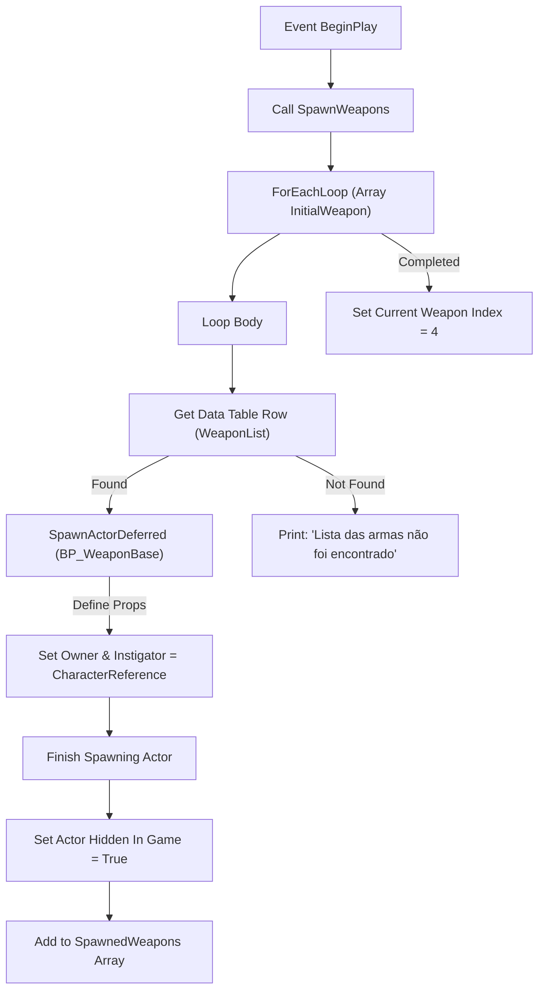
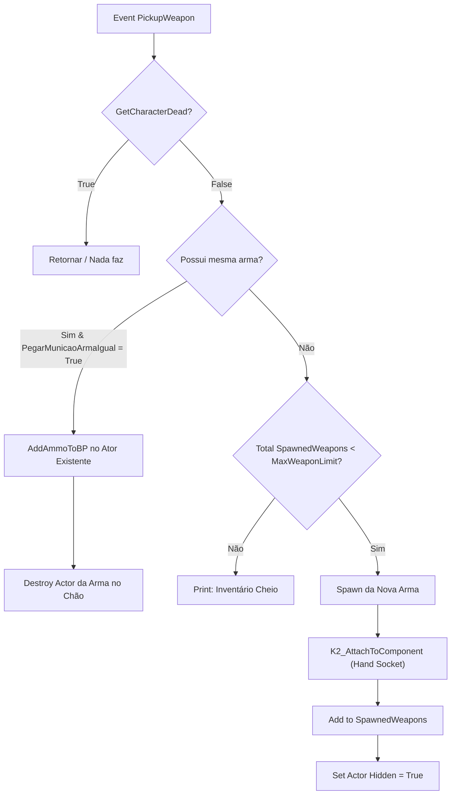
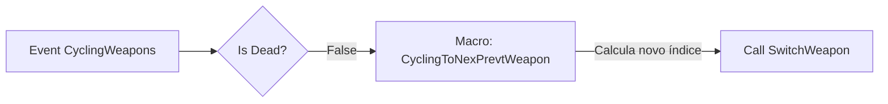
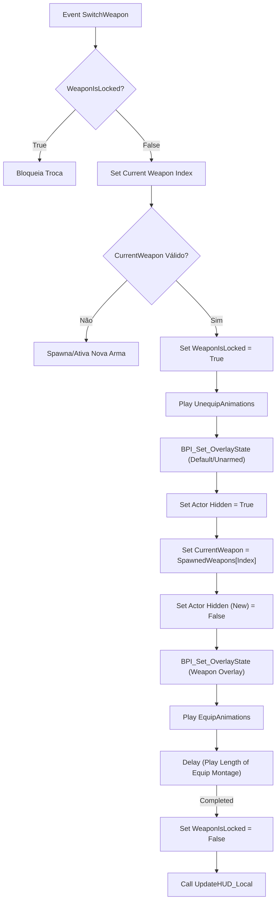
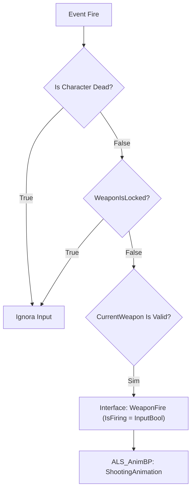
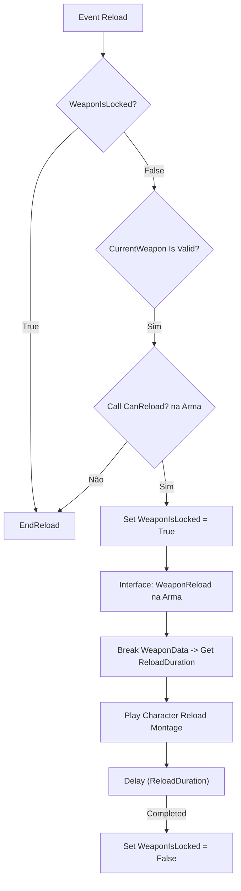
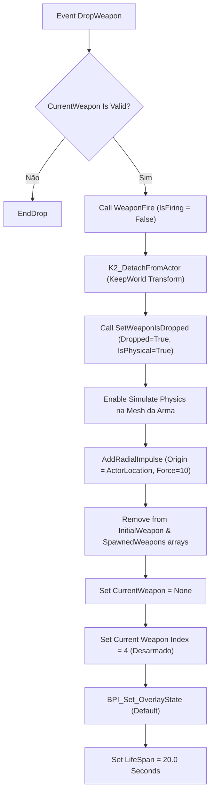

# 🎓 Sistema de Armas: AC_WeaponSystem Actor Component

**[Compatibilidade: UE 5.1+]**  
**[Origem: CUSTOMIZADO]**  
**[Interface Integrada: BP_WeaponInterface e ALS Character BPI]**

O `AC_WeaponSystem` é um **Actor Component** desenvolvido em Blueprints, cuja finalidade é atuar como o cérebro coordenador de combate do personagem jogador. Ele gerencia o inventário local de armas (slots de equipamento), o spawn inicial a partir de DataTables de metadados, a recepção de inputs de disparo, a execução de recargas latentes, a varredura esférica para travamento de mira (Target Lock) e a ejeção física de armas no mundo com simulação de física Ragdoll/Destruction e ciclo de vida otimizado.

---

## 🎯 Caso Prático: O Ciclo de Combate de um Personagem

> *Imagine que o jogador começa desarmado. Ao spawnar (BeginPlay), o sistema lê uma lista de armas iniciais na DataTable e as gera invisíveis nas costas ou coldre do jogador. Ao andar pelo mapa, o jogador encontra uma pistola caída no chão e interage com ela. O sistema intercepta o pickup, verifica se já existe uma pistola no inventário (se sim, apenas adiciona munição à pistola existente; se não, anexa a nova pistola física no slot correto). Ao apertar o botão de disparo, o sistema valida que a arma não está travada por outra ação e repassa a chamada de disparo para a pistola ativa. Se a munição acabar, a recarga é bloqueada se não houver reserva, ou é executada travando novos disparos até o término da animação. Ao decidir descartar a pistola, a malha da arma se desanexa da mão do personagem, ganha simulação de física, é lançada com um impulso e destruída após 20 segundos para poupar memória.*

---

## ⚙️ 1. Estrutura de Variáveis do Componente

Para gerenciar o inventário e o estado das armas de forma isolada do personagem, o componente declara a seguinte tabela de propriedades:

| Variável | Tipo de Dado | Valor Padrão | Descrição Didática |
| :--- | :--- | :--- | :--- |
| **`CharacterReference`** | `Character (Object Reference)` | `None` | Referência direta ao Character proprietário deste componente. |
| **`Current Weapon Index`** | `Integer` | `4` | Índice do slot ativo de arma (ex: 0 a 3 para armas válidas, e 4 para desarmado/mão limpa). |
| **`WeaponIsLocked`** | `Boolean` | `False` | Trinco lógico que impede disparos ou trocas concorrentes durante ações como recarga, spawn ou animações montadas. |
| **`InitialWeapon`** | `Array (S_StoredWeapons Struct)` | *Vazio* | Lista de IDs de armas configuradas no painel do editor para spawn automático na inicialização. |
| **`CurrentWeapon`** | `BP_WeaponBase (Object Reference)` | `None` | Referência direta ao ator da arma atualmente ativa nas mãos do personagem. |
| **`SpawnedWeapons`** | `Array (BP_WeaponBase Obj Ref)` | *Vazio* | Coleção das referências de todas as instâncias de armas spawnadas no inventário do jogador. |
| **`HideWeapon`** | `Boolean` | `False` | Flag usada para ocultar visualmente a arma equipada em momentos específicos (como escaladas ou natação). |
| **`Overlay State`** | `ALS_OverlayState (Enum/Byte)` | `Default` | Estado de sobreposição do Advanced Locomotion System correspondente à postura da arma ativa. |
| **`MaxWeaponLimit`** | `Integer` | `3` | Número máximo de slots de armas carregáveis simultaneamente no inventário físico do componente. |
| **`PegarMunicaoArmaIgual`** | `Boolean` | `True` | Se True, coletar uma arma idêntica apenas adiciona munição reserva ao invés de ocupar um novo slot físico. |
| **`HasSameWeapon`** | `Boolean` | `False` | Flag lógica auxiliar usada nas checagens de armas repetidas em loops de pickup. |
| **`AmmoAdd`** | `Integer` | `0` | Armazenamento temporário de munição recebida antes da injeção no ator da arma. |
| **`ShowMenu`** | `Boolean` | `False` | Define se a interface gráfica de menu radial de seleção rápida (Radial Menu UI) está ativa na tela. |
| **`UMGInventory`** | `UMG_Inventory (Object Reference)` | `None` | Referência direta ao widget visual do menu de inventário radial do jogador. |
| **`TargetStart`** | `Double (Real)` | `0.0` | Ponto de partida em distância para cálculos de Line Trace do sistema de travamento de mira. |
| **`TraceRange`** | `Double (Real)` | `5000.0` | Alcance máximo do escaneamento do Target Lock. |
| **`TargetRadius`** | `Float (Real)` | `150.0` | Raio da varredura esférica de travamento de alvos (Sphere Trace). |
| **`TargetLock`** | `Boolean` | `False` | Indica se o personagem está atualmente travado mirando em algum inimigo. |
| **`TargetActor`** | `Actor (Object Reference)` | `None` | Referência ao ator inimigo atualmente travado pelo Target Lock. |
| **`TargetTimer`** | `TimerHandle` | *Nulo* | Gerenciador do ciclo de atualização de localização da mira travada por frame. |
| **`IsHit`** | `Boolean` | `False` | Flag de validação física se o trace esférico colidiu com um inimigo válido. |
| **`BlendWeight`** | `Double (Real)` | `0.0` | Peso de mesclagem física ativa para a simulação física parcial na reação a impactos. |
| **`BoneName`** | `Name` | `None` | Nome do osso específico no esqueleto que iniciará a simulação de reação física a impactos. |
| **`HitReactionCurve`** | `CurveFloat (Object Reference)` | `None` | Curva float que dita a força de transição do peso físico na reação do impacto a tiros. |

---

## ⚙️ 2. Análise Técnica dos Grafos Lógicos (Event Graph)

### A) Spawn e Inicialização (SpawnWeapons)

Ao acionar o evento `ReceiveBeginPlay` no componente, o fluxo chama `SpawnWeapons` para povoar o inventário inicial do jogador baseado nos IDs definidos em `InitialWeapon`.

*   **Nota de Otimização:** O spawn é feito de forma diferida (`SpawnActorDeferred`) para que o componente consiga setar as variáveis internas `OwnerCharacter` e a estrutura de metadados da arma antes que o script de construção (`Construction Script`) e o `BeginPlay` do ator da arma executem na memória.

---

### B) Lógica de Coleta (PickupWeapon)

Gerencia a colisão física do jogador com armas coletáveis no mundo. Evita duplicatas indesejadas no inventário utilizando a checagem lógica de tipos.

---

### C) Seleção e Troca Dinâmica (SwitchWeapon & Cycling)

O componente escuta os comandos de alternância rápida de armas (`CyclingWeapons` para mouse-wheel ou teclas numéricas) e aciona sequencialmente a desanexação, atualização gráfica e reanexação.

#### Fluxo Geral de Alternância Rápida (Cycling):

#### Execução de Troca Lógica (SwitchWeapon):

---

### D) Controle de Disparo (Fire)

Interliga os cliques de entrada do mouse repassando dinamicamente a ativação de gatilho para a arma instanciada de forma polimórfica (através da `BP_WeaponInterface`).

---

### E) Recarga Física de Munição (Reload)

Controla o ciclo de recarga do personagem, coordenando a trava de combate (`WeaponIsLocked`) e a leitura dos tempos de animação declarados na estrutura de dados da própria arma.

---

### F) Descarte Físico de Arma (DropWeapon)

Desanexa o ator da arma ativa, ativando as propriedades físicas da static mesh para que caia realisticamente pelo cenário, e realiza a limpeza de memória após o ciclo estipulado.

*   **Nota de Limpeza de Memória:** O nó `Set LifeSpan (20.0)` instrui o garbage collector da Unreal Engine a destruir por completo a instância do ator da arma dropada e todas as suas dependências lógicas após o timer expirar, evitando acúmulo de colisões e memory leaks em sessões de jogo prolongadas.

---

## 🛡️ 3. Análise de Brechas, Hacks e Vulnerabilidades (O Pulo do Gato)

Durante o desenvolvimento e auditoria de sistemas de combate em jogos de tiro em terceira pessoa, diversas brechas lógicas podem ser exploradas pelos jogadores (hacks ou exploits) para burlar o design original do jogo. Abaixo estão listadas as principais brechas lógicas identificadas na arquitetura do `AC_WeaponSystem` e as estratégias técnicas para blindá-lo:

### A) Exploit de Cancelamento de Animação de Recarga (Reload Animation Cancel)
*   **A Brecha:** O jogador inicia a recarga. O sistema define `WeaponIsLocked = True`. Porém, se o jogador tentar dropar a arma (`DropWeapon`) ou alternar slots rapidamente e essas ações não validarem o estado interno da recarga da arma, o jogador cancelará a animação na metade e poderá obter a arma com munição cheia de forma instantânea sem passar pelo tempo de espera da animação.
*   **Solução (O Pulo do Gato):** Toda e qualquer ação de descarte (`DropWeapon`), troca de slot (`SwitchWeapon`) ou abertura de inventário radial deve verificar o estado da trava `WeaponIsLocked` ou consultar se a arma ativa possui a flag `IsReloading = True`. Se estiver recarregando, a ação deve ser terminantemente rejeitada ou a recarga deve ser resetada, forçando o jogador a recomeçar do zero.

### B) Cadência Infinita via Troca Rápida (Double Pump / Fast Switch Exploit)
*   **A Brecha:** Armas lentas e de alto dano (como espingardas ou snipers de ferrolho) possuem um tempo de espera obrigatório de cadência. Um exploit comum consiste em atirar, trocar para outra arma e retornar imediatamente, cancelando o tempo de bombeamento da espingarda e permitindo disparos rápidos e acumulativos.
*   **Solução (O Pulo do Gato):** Salvar o timestamp do último disparo na própria instância da arma (e não apenas no componente de armas do jogador). Ao reequipar a arma, o componente deve validar se o tempo decorrido desde o último disparo é maior que a cadência regulamentada (`FireRate`). Se for menor, a ação de disparo deve continuar bloqueada.

### C) Injeção de Munição Infinita por Memória (Client-Side Memory Hacks)
*   **A Brecha:** Realizar o cálculo e a dedução da munição ativa (`CurrentAmmoInBP`) puramente no cliente e apenas replicar o resultado. Hacks locais de memória (como Cheat Engine) conseguem congelar o valor local do float de munição.
*   **Solução (O Pulo do Gato):** Toda a autoridade do inventário deve residir no **Server**. O cliente envia apenas a intenção de input ("Atirar"). O Servidor verifica se o slot correspondente possui munição, deduz o projétil na sua thread autoritativa e sincroniza de volta via replicação (`OnRep_CurrentAmmoInBP`), punindo/desconectando o cliente caso ocorra dessincronização persistente.

### D) Inconsistência de Parser por Falta de Salvamento no Editor (0-Byte File Error)
*   **A Brecha:** Alterações complexas de lógica nas Blueprints de armas não são salvas no editor (`Save All`), deixando a compilação local inconsistente com os metadados gerados pelo pipeline de engenharia reversa. Isso gera arquivos `.md` vazios (0 bytes) ou desatualizados, induzindo o parser e o RAG a erros lógicos graves.
*   **Solução (O Pulo do Gato):** O parser de exportação deve ativamente rastrear arquivos vazios ou desatualizados na pasta de exports e lançar um alerta sonoro ou erro de compilação, forçando o desenvolvedor a fechar processos fantasmas e salvar suas alterações no Unreal Editor.

---

## 🏃 Desafio Técnico Ativo: Evitar Troca de Armas Durante o Disparo

Atualmente, um jogador experiente consegue burlar o limite de cadência de disparo de um rifle de ferrolho (ex: Sniper) disparando e alternando rapidamente de arma, atirando novamente de forma instantânea (técnica conhecida como *Fast Weapon Switch Exploits*).

### Instruções para Resolução do Desafio:
1. No grafo `SwitchWeapon`, antes de processar o novo índice, adicione uma verificação na variável `CurrentWeapon`.
2. Chaveie o acesso à interface e leia o status atual da arma (ex: `IsFiring` ou `IsReloading`).
3. Se a arma estiver em processo ativo de disparo ou recarga, configure a variável `WeaponIsLocked` para `True` temporariamente e impeça a execução da troca até que a arma envie uma notificação de término de animação (`AnimNotify` ou fim de ciclo de disparo).

---

## ❓ Perguntas que este documento responde

- **Qual é o papel do Actor Component `AC_WeaponSystem` e como ele melhora a modularidade do projeto?**
  Ele separa toda a lógica de gerenciamento de inventário de armas e inputs de combate para fora da classe do Personagem, facilitando o reaproveitamento do código para NPCs ou outros tipos de personagens jogáveis.
- **Como o spawn automático de armas iniciais evita congelamentos de tela na Unreal?**
  Ao realizar o spawn diferido (`SpawnActorDeferred`) e dividir o carregamento das armas em loops individuais baseados nos dados indexados da DataTable de armas.
- **O que impede o jogador de atirar enquanto está no meio da animação de recarga?**
  A variável lógica `WeaponIsLocked`, que é setada para `True` no início do evento `Reload` e destravada apenas ao término do tempo de recarga (`ReloadDuration`) extraído da DataTable da arma.
- **Por que as armas dropadas pelo jogador desaparecem após 20 segundos?**
  Devido à chamada da função `SetLifeSpan(20.0)` no ator ejetado, que limpa o lixo de atores com física ativos no nível para manter a estabilidade da taxa de quadros por segundo (FPS).
