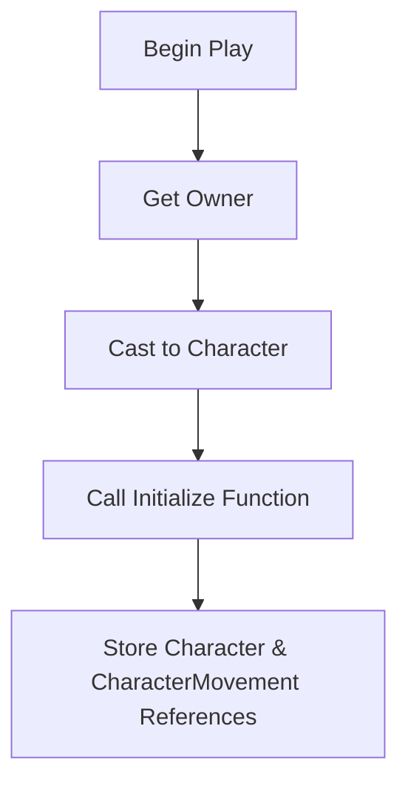
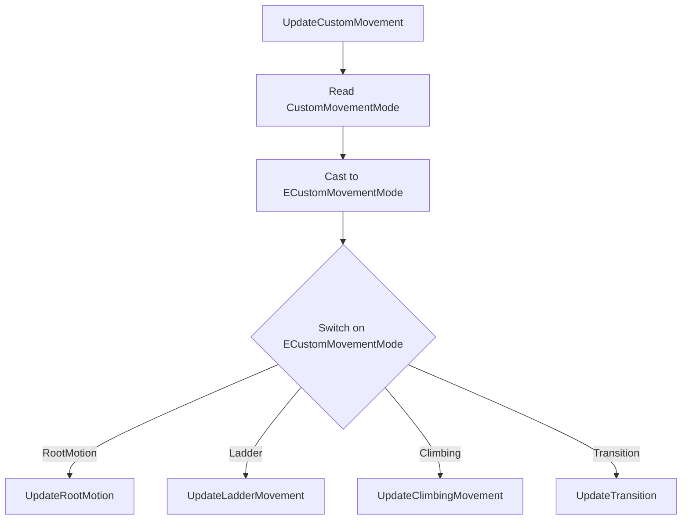
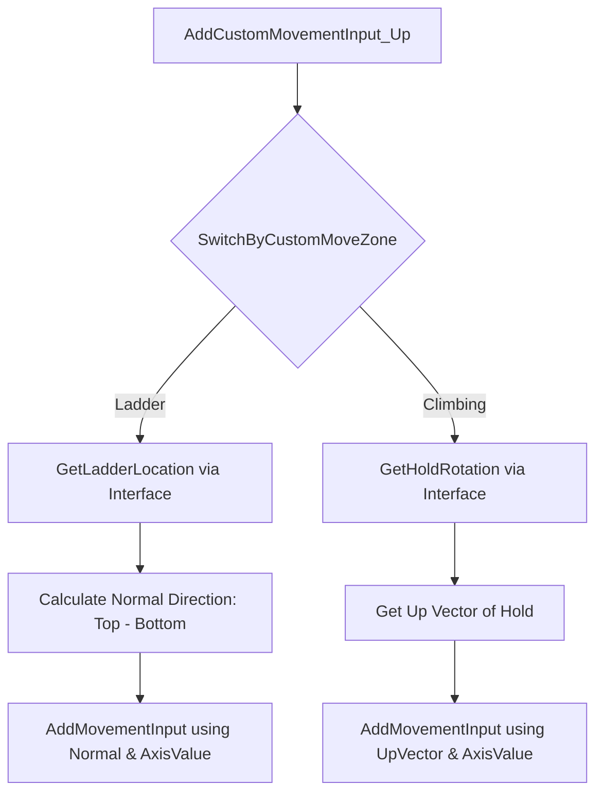

# 🎓 Análise de Blueprint: BP_CustomMovementComponent (Movimento de Escalada e Escada)

**[Compatibilidade: UE 5.1+]**  
**[Origem: Customizado]**  
**[Caminho no Projeto:]** `C:\Users\hijon\Documents\UnrealEngine\PROJETO-GTA-29-10-2025\ProjetoGTA\ProjetoGTA\Content\CustomMovement\Blueprints\Components\BP_CustomMovementComponent.uasset`

O `BP_CustomMovementComponent` é um **Actor Component** avançado projetado para estender os modos de locomoção padrão da Unreal Engine. Ele gerencia a física, a entrada de eixos (inputs) e o fluxo de transição do personagem para movimentos especiais como **subir escadas (Ladders)** e **escalar superfícies vertical/horizontalmente (Climbing/Ledges)**.

---

## 🎯 Caso Prático: Mecânicas de Exploração Vertical à lá GTA / Assassin's Creed

> *Para que o jogador consiga explorar o mapa livremente, ele precisa ser capaz de subir escadas metálicas e escalar paredes rochosas. Fazer essa lógica dentro do Blueprint do personagem principal (`BP_Character`) poluiria o grafo com eixos e travas de física. Centralizar essa lógica em um componente desacoplado (`BP_CustomMovementComponent`) permite que qualquer personagem (ou NPC) receba as mesmas capacidades de escalada apenas anexando o componente.*

---

## ⚙️ 1. Estrutura e Variáveis do Componente

*   **`Character` (Object Reference):** Referência do jogador que possui o componente (armazenada no `BeginPlay`).
*   **`CharacterMovement` (CharacterMovementComponent Reference):** Atalho para o componente de física nativo da Unreal.
*   **`IsTransitioningCustomMoveZone` (Boolean):** Trava lógica para saber se o jogador está na animação de encaixe/transição para a parede ou escada.
*   **`ServerInProgress` (Boolean):** Controle de replicação em rede para validar a sincronização de posicionamento com o servidor.
*   **`MovementDeltaTime` (Double):** Cache do tempo decorrido do frame para interpolações suaves (`Lerp`).
*   **Enum Utilizado: `ECustomMovementMode`:**
    *   `None`: Movimento padrão.
    *   `Ladder`: Subida de escada de mão.
    *   `Climbing`: Escalada livre em paredes/apoios.
    *   `Transition`: Alinhamento físico inicial do corpo à parede.
    *   `RootMotion`: Movimento orientado a animação física direta.

---

## ⚙️ 2. Ciclo de Vida do Movimento

### A) Inicialização (`Begin Play`)

No início do jogo, o componente obtém a referência de seu dono, realiza o `Cast` seguro para `Character` e armazena os atalhos de componentes necessários na memória para evitar buscas redundantes.

### B) Event Loop Principal (`Tick`)
Disparado a cada frame, com otimização estrita de rede:
1.  **`ReceiveTick`**: Recebe o evento e o tempo do frame (`DeltaSeconds`).
2.  **`IsLocallyControlled`**: O componente **apenas realiza varreduras no computador do jogador local** (Client Autônomo), poupando processamento de servidores e inteligências artificiais.
3.  **Fluxo de Varredura:**
    *   `CheckEnteringCustomMoveZone`: Varre o espaço à frente em busca de volumes de interação de escada ou escalada.
    *   `CheckClimbingNextHold`: Enquanto escala, verifica proativamente se há um ponto de apoio (Ledge/Hold) disponível na direção do analógico para permitir o avanço do personagem.

---

## ⚙️ 3. Orquestração e Modos de Atualização (`UpdateCustomMovement`)

Este evento atualiza a física do personagem dependendo do seu estado ativo de locomoção. Ele lê a propriedade nativa `CustomMovementMode` do componente nativo de física da Unreal e ramifica o fluxo através do Enum `ECustomMovementMode`:

### Lógica da Transição Física (`UpdateEnteringTransition`)
Para evitar que o personagem se teletransporte instantaneamente ao se agarrar a uma escada ou parede, o componente realiza um encaixe suave (`Lerp`):
*   Calcula o `VLerp` (vetor de localização) e `RLerp` (rotador de rotação) entre a posição atual do personagem e o ponto exato da escada/parede (`EnteringTransitionBegin` e `EnteringTransitionEnd`).
*   O avanço é controlado pela variável `Transition` clampada estritamente entre `0.0` e `1.0`.

---

## ⚙️ 4. Processamento de Inputs de Escalada e Escada

Os eixos de controle do jogador (teclas `W/S` e `A/D` ou analógico) são injetados nas funções `AddCustomMovementInput_Up` e `AddCustomMovementInput_Right`:

### A) Movimento na Escada (`Ladder`)
1.  **`GetLadderLocation`**: Chama a interface `BPI_CustomMoveZone_Ladder` para extrair os vetores `Top Location` e `Bottom Location` da escada atual.
2.  **Cálculo da Direção:** Subtrai o ponto inferior do superior (`Top - Bottom`) e normaliza o resultado (`Normal`) para obter o vetor de subida exato da escada.
3.  **`AddMovementInput`**: Aplica a direção normalizada ao personagem multiplicando pela força do analógico (`ScaleValue`).

### B) Movimento na Parede (`Climbing`)
1.  **`GetHoldRotation`**: Obtém a rotação do ponto de apoio que está sendo agarrado via interface `BPI_CustomMoveZone_Climbing`.
2.  **Cálculo da Direção:** Extrai o `Up Vector` (para subida/descida vertical) ou o `Right Vector` (para deslocamento lateral horizontal) relativo à orientação tridimensional do apoio.
3.  **`AddMovementInput`**: Envia a direção resultante para a locomoção do personagem bípede.

---

## ⚠️ Possíveis Vulnerabilidades de Gameplay (Análise de Exploits)

*   **Exploit de Teletransporte / Desalinhamento Físico:** Se o jogador spammar o botão de interação na parede ao mesmo tempo em que recebe forças físicas externas (como um empurrão de inimigo ou dano de queda), as variáveis `EnteringTransitionBegin` e `End` podem calcular posições fora do mapa ou prender o personagem dentro da colisão das malhas (cliping).
*   **Mitigação Recomendada:** Desativar a detecção de colisões físicas do canal do jogador (`Pawn`) com o cenário estático temporariamente durante o estado `Transition` e reativar apenas quando a locomoção `Climbing` ou `Ladder` estiver totalmente engajada.
