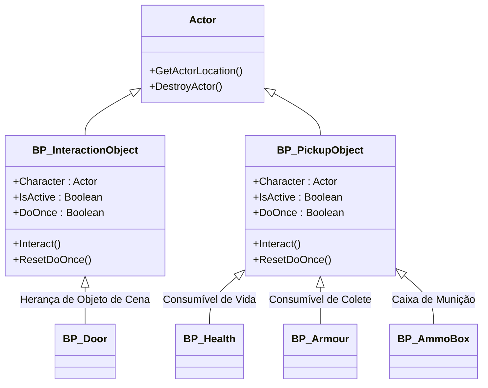

# 🎮 Guia de Estudo: Atores do Subsistema de Interação (World Interaction)

**[Compatibilidade: UE 5.1+]**  
**[Status do Editor: Ativo em Background (PID: 11904)]**  
**[Localização dos Assets no Projeto:]** `Content/Blueprints/Interaction/...`  
**[Fontes de Conhecimento:]** `[Projeto Real]`, `[Documentação Epic Games]`, `[Teoria / IA]`

---

## 🎯 1. Arquitetura de Herança de Atores

Para otimizar o reaproveitamento de código e padronizar o comportamento de detecção de colisão física por triggers, o **Projeto GTA** adota duas hierarquias principais de herança baseadas na classe nativa **`Actor`** da Unreal Engine.



---

## 📋 2. Detalhamento dos Atores Base

### A) Objeto Interativo Mestre: `BP_InteractionObject`
*   **Caminho do Asset:** `Content/Blueprints/Interaction/BP_InteractionObject.uasset`  
*   **Metadados Brutos:** [BP_InteractionObject.md](file:///C:/Users/hijon/Downloads/ava-assistant-30-03-26/ava-assistant-v3-main/CRIADO-AVA-CLI/unreal_engine_docs/Blueprints_Exportados/Blueprints/Interaction/BP_InteractionObject.md)  
*   **Origem:** `[Projeto Real]`

Ator genérico para objetos fixos do cenário que podem sofrer alterações de estado (ex: portas, alavancas, botões).

*   **Comportamento de Trigger Overlap:**
    *   **Begin Overlap:** Quando a cápsula de colisão do jogador sobrepõe o trigger do ator, ele executa `GetPlayerPawn()`, busca o componente `AC_Interaction` e adiciona a si mesmo ao array **`InteractionAllObjects`** do componente. Define `TriggerOverlap = True` no componente.
    *   **End Overlap:** Quando o jogador se afasta, o ator remove a sua referência do array e dispara a limpeza chamando o evento `TriggerOverlapEnd` do componente de interação.

---

### B) Item de Coleta Mestre: `BP_PickupObject`
*   **Caminho do Asset:** `Content/Blueprints/Interaction/BP_PickupObject.uasset`  
*   **Metadados Brutos:** [BP_PickupObject.md](file:///C:/Users/hijon/Downloads/ava-assistant-30-03-26/ava-assistant-v3-main/CRIADO-AVA-CLI/unreal_engine_docs/Blueprints_Exportados/Blueprints/Interaction/BP_PickupObject.md)  
*   **Origem:** `[Projeto Real]`

Ator mestre para itens consumíveis físicos espalhados pelo mundo que concedem status ou inventário e se destroem após coletados.

*   **Comportamento de Trigger Overlap:**
    *   Opera de forma idêntica ao `BP_InteractionObject`, porém registra sua própria referência no array **`PickupAllObjects`** do componente `AC_Interaction` do jogador.

---

## 🚪 3. Análise dos Atores Filhos de Interação

### A) Porta Rotativa Física: `BP_Door`
*   **Caminho do Asset:** `Content/Blueprints/Interaction/BP_Door.uasset`  
*   **Classe Pai:** `BP_InteractionObject_C`  
*   **Metadados Brutos:** [BP_Door.md](file:///C:/Users/hijon/Downloads/ava-assistant-30-03-26/ava-assistant-v3-main/CRIADO-AVA-CLI/unreal_engine_docs/Blueprints_Exportados/Blueprints/Interaction/BP_Door.md)  
*   **Origem:** `[Projeto Real]`

Porta reativa que gira sob um eixo rotativo usando suavização de animação por Timeline.

*   **Variáveis Locais:**
    *   `DoorIsOpened` (Boolean): Armazena se a porta está atualmente aberta (`True`) ou fechada (`False`).
*   **Lógica do Event Graph (Abertura e Fechamento):**
    1.  **Evento `Interact`:** Checa se o ator está ativo (`IsActive == True`).
    2.  **Inversão de Estado:** Executa um nó `Not_PreBool` na variável `DoorIsOpened` para inverter o estado lógico atual e salva o novo valor.
    3.  **Controle da Timeline (`RotationDoor`):**
        *   Se `DoorIsOpened` foi definido como `True` (Porta está abrindo): Chama o pino **`Play`** da Timeline para girar a porta de $0^\circ$ a $90^\circ$.
        *   Se `DoorIsOpened` foi definido como `False` (Porta está fechando): Chama o pino **`Reverse`** da Timeline para retroceder a rotação de volta a $0^\circ$.
    4.  **Atualização de Rotação (`RotationDoor__UpdateFunc`):**
        *   A cada tick da Timeline, ela extrai o valor de float atualizado, passa pelo nó `MakeRotator` especificando a rotação de acordo com o eixo `DoorAxis`.
        *   Chama o método **`K2_SetRelativeRotation`** na malha da porta para atualizar visualmente sua orientação.
*   **Sincronização Multiplayer (Som de Abertura):**
    *   Para garantir que todos os jogadores escutem a porta abrir, o fluxo chama o evento customizado **`PlaySound (Multicast)`**.
    *   Como um evento com diretiva **Multicast**, a chamada realizada pelo cliente que interagiu é replicada pelo servidor para rodar localmente no computador de todos os jogadores na partida, executando a função nativa **`PlaySoundAtLocation`** nas coordenadas físicas tridimensionais da porta (`K2_GetActorLocation`).

---

### B) Caixa de Munição Parametrizada: `BP_AmmoBox`
*   **Caminho do Asset:** `Content/Blueprints/Interaction/BP_AmmoBox.uasset`  
*   **Classe Pai:** `BP_PickupObject_C`  
*   **Metadados Brutos:** [BP_AmmoBox.md](file:///C:/Users/hijon/Downloads/ava-assistant-30-03-26/ava-assistant-v3-main/CRIADO-AVA-CLI/unreal_engine_docs/Blueprints_Exportados/Blueprints/Interaction/BP_AmmoBox.md)  
*   **Origem:** `[Projeto Real]`

Ator que adiciona cartuchos de reserva para a arma correspondente do jogador.

*   **Variáveis Parametrizadas (Expostas no Editor):**
    *   `Ammo Type` (Byte - Enum `AmmoType`): O tipo de munição contido na caixa.
    *   `Weapon ID` (Name): ID de registro da arma correspondente.
    *   `Amount Ammo` (Int): A quantidade exata de balas a ser adicionada.
    *   `Weapon Type` (Byte - Enum `ALS_OverlayState`): O tipo de porte visual da arma associada.
    *   `Projectile Type` (Class - `BP_ProjectileBase_C`): A classe do projétil spawnado por esta arma.
*   **Lógica de Coleta:**
    1.  **Evento `Interact`:** Valida as condições de ativação (`IsActive` e trava `DoOnce`).
    2.  **Incremento de Cartuchos:** Chama a função customizada **`AmmoPickup()`** do personagem passando todas as variáveis de munição listadas acima.
    3.  **Destruição:** Dispara o nó **`K2_DestroyActor`** para limpar o ator do cenário imediatamente.

---

### C) Consumíveis de Cura e Escudo: `BP_Health` e `BP_Armour`
*   **Caminho dos Assets:** 
    *   `Content/Blueprints/Interaction/BP_Health.uasset`
    *   `Content/Blueprints/Interaction/BP_Armour.uasset`
*   **Classe Pai:** `BP_PickupObject_C`  
*   **Metadados Brutos:** [BP_Health.md](file:///C:/Users/hijon/Downloads/ava-assistant-30-03-26/ava-assistant-v3-main/CRIADO-AVA-CLI/unreal_engine_docs/Blueprints_Exportados/Blueprints/Interaction/BP_Health.md), [BP_Armour.md](file:///C:/Users/hijon/Downloads/ava-assistant-30-03-26/ava-assistant-v3-main/CRIADO-AVA-CLI/unreal_engine_docs/Blueprints_Exportados/Blueprints/Interaction/BP_Armour.md)  
*   **Origem:** `[Projeto Real]`

Consumíveis clássicos de cura e recarga de armadura.

*   **Lógica de Coleta:**
    1.  Ao interagir, chamam a função `GetComponents()` na referência obtida do Character para localizar o componente de atributos vitais do jogador (`AC_PlayerStatus`).
    2.  Disparam a chamada de atualização apropriada no componente:
        *   `BP_Health` -> Chama o método **`SetHealth`** (para adicionar vida).
        *   `BP_Armour` -> Chama o método **`SetArmour`** (para restaurar colete).
    3.  Chamam o nó **`K2_DestroyActor`** para remover o coletável do cenário.

---

## 🛠️ 4. Práticas Recomendadas e Correção de Desvios (Performance & Segurança)

> [!IMPORTANT]
> **A) Otimização de Performance: Desativar Overlaps Desnecessários**
> *   **Gargalo [Documentação Epic Games]:** Manter eventos de overlap ativos em múltiplos atores estáticos e dinâmicos no mapa consome tempo de CPU de física. Se o mapa do jogo tiver centenas de portas, caixas de munição e coletáveis processando overlap a cada frame contra todos os canais de colisão, haverá perda de taxa de quadros (FPS).
> *   **Remediação:** 
>     1. Configurar os componentes de colisão (Trigger/Sphere) dos coletores para usar o perfil de colisão **`Custom...`**.
>     2. Habilitar **apenas** o canal do jogador (`Pawn`) para gerar overlap (`Query Only`). Desmarcar canais desnecessários como `Vehicle`, `PhysicsBody` ou `Destructible`.
>     3. Desmarcar a propriedade `Generate Overlap Events` na Malha Estática (Static Mesh) visual dos objetos, mantendo o overlap estritamente no componente de colisão dedicado (Trigger Box/Sphere).

> [!WARNING]
> **B) Segurança contra Exploits de Spam: Implementação Firme de Trava `DoOnce`**
> *   **Gargalo [Teoria / IA]:** Os coletores (`BP_Health`, `BP_Armour`, `BP_AmmoBox`) executam as lógicas de alteração de atributos do jogador *antes* do comando de autodestruição (`K2_DestroyActor`). Devido ao delay natural da latência de replicação do servidor ou do tempo de remoção do objeto do thread de física, jogadores podem pressionar repetidamente o botão de interagir (ou usar macros) para curar-se ou duplicar munição.
> *   **Remediação:** Toda lógica de coleta deve passar **obrigatoriamente** por uma trava física local de fluxo `DoOnce` assim que o evento `Interact` é recebido. O fluxo só prossegue para a cura e destruição após o fecho lógico dessa trava, rejeitando qualquer entrada paralela no mesmo frame.
> 
> ```mermaid
> flowchart LR
>     Interact[Interact Event] --> DoOnce{Do Once}
>     DoOnce -->|Primeira execução| AddStatus[Chama SetHealth / SetArmour / AmmoPickup]
>     AddStatus --> Destroy[K2_DestroyActor]
>     DoOnce -->|Tentativas rápidas extras| Reject[Bloqueia e Aborta]
> ```

> [!CAUTION]
> **C) Replicação Segura no Servidor (Prevenção de Cheats)**
> *   **Gargalo [Teoria / IA]:** Em jogos multijogador, a destruição física e a concessão de atributos devem ser validadas e executadas **no Servidor (Server)**, e nunca iniciadas localmente no Cliente. Se o cliente for responsável por destruir o ator e enviar um RPC informando *"adicionei 50 de vida para mim"*, jogadores maliciosos podem modificar a memória local do jogo para simular overlaps constantes e conceder status infinitos.
> *   **Remediação:** 
>     *   Definir os atores interativos com a propriedade **`Replicates`** ativada.
>     *   Apenas o servidor deve executar a lógica do evento `Interact` e o nó `K2_DestroyActor` (que automaticamente replicará a destruição e a alteração dos atributos vitais no componente de rede para o respectivo cliente).
