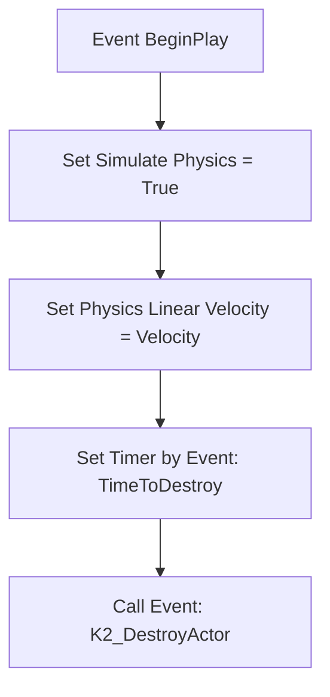

# 🎓 Análise de Blueprint: BP_PhysicalMag (Carregador Descartado Físico)

**[Compatibilidade: UE 5.1+]**  
**[Origem: Customizado]**  
**[Caminho no Projeto:]** `C:\Users\hijon\Documents\UnrealEngine\PROJETO-GTA-29-10-2025\ProjetoGTA\ProjetoGTA\Content\AdvancedLocomotionV4\Blueprints\CharacterLogic\BP_PhysicalMag.uasset` (ou sob a pasta Weapons/CharacterLogic correspondente)

O `BP_PhysicalMag` é uma classe especializada de **StaticMeshActor** responsável pelo spawn tridimensional de pentes/carregadores físicos descartados durante a recarga de armas de fogo. Ele adiciona realismo ao combate, simulando a ejeção do objeto com forças físicas e gerenciando de forma automatizada o ciclo de descarte na memória RAM.

---

## 🎯 Caso Prático: A Ejeção Física de Carregadores no Chão

> *Quando o jogador inicia a recarga de um fuzil, a animação de recarga aciona uma notificação animada (Anim Notify) que spawna este ator (`BP_PhysicalMag`) na posição exata da mão ou do encaixe da arma. Ele é ejetado no ar com velocidade inicial, colide de forma realista com a geometria do chão (gerando detritos visuais/sonoros) e desaparece de forma limpa após alguns segundos para evitar sobrecarga de física acumulada no cenário.*

---

## ⚙️ 1. Lógica de Construção Inicial (`Construction Script`)

Antes do início da física no mapa, a aparência visual do carregador é definida dinamicamente:
*   **`SetStaticMesh` (Target: StaticMeshComponent):** Atribui a malha 3D correta contida na variável `MagazineMesh`. Isso permite que o mesmo Blueprint `BP_PhysicalMag` sirva para carregadores de pistolas, fuzis ou escopetas, alterando apenas a variável no momento do spawn (polimorfismo estético).

---

## ⚙️ 2. Comportamento Físico e Ciclo de Vida (`BeginPlay`)

### Análise Detalhada das Funções:

1.  **`Set Simulate Physics` (Target: StaticMeshComponent):**  
    Ativa a simulação de gravidade e colisão tridimensional para a malha estática do carregador. O objeto cai e rola de acordo com as leis físicas do motor Chaos.
2.  **`Set All Physics Linear Velocity`:**  
    Aplica uma velocidade inicial linear (`Velocity`) com a opção `Add to Current` ativa. Isso simula o impulso mecânico que a arma exerce ao empurrar o carregador para fora do receptor.
3.  **`Set Timer by Event` & `K2_DestroyActor`:**  
    *   **Delegado de Evento:** Cria e liga um link de evento diretamente para a função nativa `DestroyActor()` (Destruir Ator) do motor.
    *   **`Time to Destroy` (Float):** Tempo que o objeto permanece no mapa antes de sumir.
    *   **Finalidade:** Libera a memória de física do nível, evitando que centenas de carregadores soltos causem quedas de taxa de quadros (FPS) no jogo.

---

## ⚠️ Possíveis Vulnerabilidades de Gameplay (Análise de Exploits)

*   **Exploit de Bloqueio Físico e Impacto de Performance:** Se o tempo `TimeToDestroy` for definido como muito alto (ou infinito) e o jogador atirar/recarregar repetidamente, a física de colisões mútuas de dezenas de carregadores no mesmo local pode estressar o motor Chaos, causando lentidão geral (Lag de Física).
*   **Mitigação Recomendada:** Limitar o tempo máximo de destruição para no máximo **5.0 a 7.0 segundos** e desativar colisões com outros carregadores (deixando apenas com o cenário estático).
