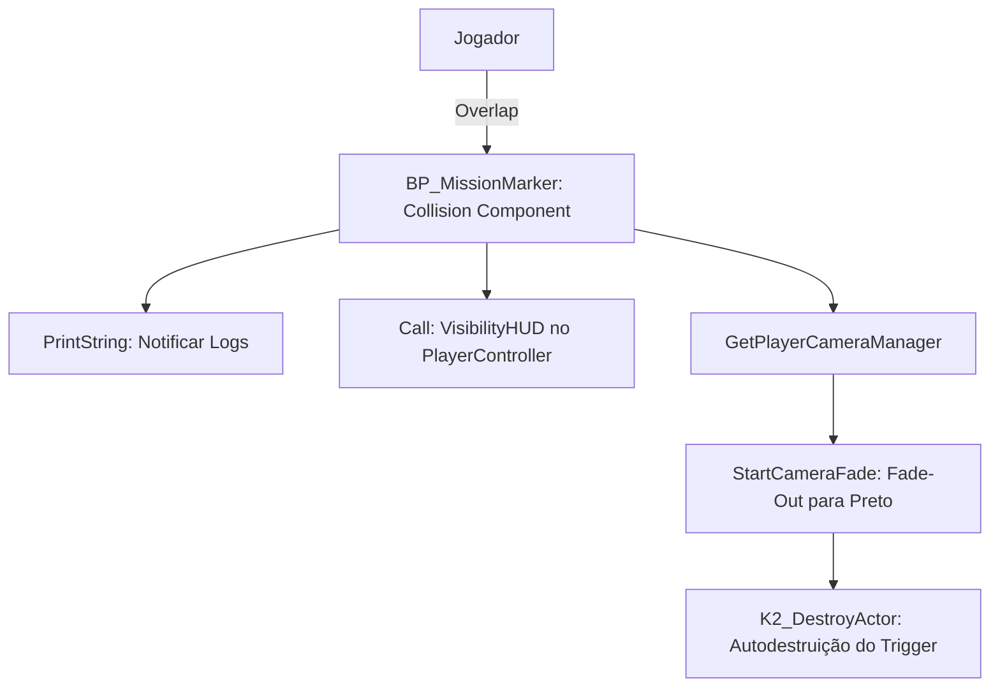

# 🎯 Guia de Estudo: Utilitários Gerais & Comunicação (Gameplay Utilities)

**[Compatibilidade: UE 5.1+]**  
**[Status do Editor: Ativo em Background (PID: 11904)]**  
**[Localização dos Assets no Projeto:]** `Content/Blueprints/...`  
**[Fontes de Conhecimento:]** `[Projeto Real]`, `[Documentação Epic Games]`, `[Teoria / IA]`

---

## 🎯 1. Visão Geral dos Utilitários de Gameplay

Para estruturar um ecossistema de gameplay otimizado, limpo e desacoplado na Unreal Engine, o **Projeto GTA** emprega uma série de ferramentas de uso comum:
*   **Triggers de Efeitos Globais (`BP_MissionMarker`)**: Atores espaciais que desencadeiam transições cinematográficas de tela.
*   **Biblioteca de Funções (`BP_Functions`)**: Funções globais reutilizáveis sem necessidade de instanciamento.
*   **Interfaces de Comunicação (`Character_Interface`)**: A chave para evitar dependências circulares entre classes.
*   **Efeitos de Tremor de Câmera (`Damge_CS`)**: Resposta física de impacto visual na visão do jogador.

---

## 🏁 2. Trigger de Zonas de Missão: `BP_MissionMarker`
*   **Caminho do Asset:** `Content/Blueprints/Interaction/BP_MissionMarker.uasset`  
*   **Classe Pai:** `Actor`  
*   **Metadados Brutos:** [BP_MissionMarker.md](file:///C:/Users/hijon/Downloads/ava-assistant-30-03-26/ava-assistant-v3-main/CRIADO-AVA-CLI/unreal_engine_docs/Blueprints_Exportados/Blueprints/Interaction/BP_MissionMarker.md)  
*   **Origem:** `[Projeto Real]`

`BP_MissionMarker` é um ator de gatilho espacial invisível. Quando a cápsula de colisão de um personagem atravessa seu limite físico, ele dispara uma sequência de finalização ou transição de nível:

1.  **Detecção de Sobreposição (`ComponentBeginOverlap`):** Dispara quando o jogador encosta no colisor do marcador.
2.  **Ocultamento da Interface (`VisibilityHUD`):** Obtém o `PlayerController` e desliga a renderização de elementos da UI (como barras de vida e retícula) para preparar a tela preta.
3.  **Transição de Câmera (`StartCameraFade`):** Acessa o `PlayerCameraManager` para escurecer gradualmente o Viewport para preto (`From Alpha = 0.0` para `To Alpha = 1.0`) durante um intervalo de segundos configurável.
4.  **Descarte da Memória (`K2_DestroyActor`):** Deleta a si mesmo para garantir que a lógica seja executada apenas uma vez por jogada, otimizando o lixo de atores na RAM.

---

## 🛠️ 3. Biblioteca Estática de Funções: `BP_Functions`
*   **Caminho do Asset:** `Content/Blueprints/BP_Functions.uasset`  
*   **Classe Pai:** `BlueprintFunctionLibrary`  
*   **Metadados Brutos:** [BP_Functions.md](file:///C:/Users/hijon/Downloads/ava-assistant-30-03-26/ava-assistant-v3-main/CRIADO-AVA-CLI/unreal_engine_docs/Blueprints_Exportados/Blueprints/BP_Functions.md)  
*   **Origem:** `[Projeto Real]`

Esta classe centraliza algoritmos puros repetitivos para que qualquer Blueprint do projeto possa chamá-los diretamente, economizando tempo de CPU e linhas de código:

### A) Centralizador de Cursor (`CenterMousePosition`)
Garante que o mouse apareça perfeitamente ancorado no meio geométrico da tela quando menus radiais ou de customização forem abertos:
1.  Chama a função de Viewport **`GetViewportSize()`** para obter as dimensões da resolução atual do jogador (X e Y em pixels).
2.  **Cálculo da Metade:** Divide ambas as coordenadas X e Y por `2.0`.
3.  **Conversão Inteira (`FTrunc`):** Trunca os decimais resultantes da divisão para números inteiros puros (evitando bugs de subpixel do mouse).
4.  **Reposicionamento (`SetMouseLocation`):** Injeta o novo par de coordenadas diretamente no `PlayerController`, forçando o cursor a saltar para o centro exato.

### B) Identificação de Material Físico (`GetPhysicalMaterial`)
1.  Lê o canal do material de impacto físico de um Line Trace.
2.  Retorna o enum **`SurfaceType`** correspondente (ex: Metal, Madeira, Concreto) para que o projétil decida qual partícula disparar.

### C) Atalho de Referência de Armas (`GetWeaponSystem`)
1.  Recebe um Ator genérico como entrada.
2.  Chama o nó **`GetComponentByClass`** buscando o componente `AC_WeaponSystem`.
3.  Retorna o ponteiro limpo, economizando a criação de sequências repetitivas de nós de cast no Event Graph.

---

## 🔀 4. Desacoplamento Polimórfico: `Character_Interface`
*   **Caminho do Asset:** `Content/Blueprints/Character/Character_Interface.uasset`  
*   **Classe Pai:** `Interface`  
*   **Metadados Brutos:** [Character_Interface.md](file:///C:/Users/hijon/Downloads/ava-assistant-30-03-26/ava-assistant-v3-main/CRIADO-AVA-CLI/unreal_engine_docs/Blueprints_Exportados/Blueprints/Character_Interface.md)  
*   **Origem:** `[Projeto Real]`

A interface de caracteres declara assinaturas de funções comuns sem implementá-las fisicamente. É a base da comunicação desacoplada do jogo.

*   **Funções Declaradas:**
    *   `SetHealth` / `SetArmour`: Atualização passiva de atributos vitais por itens coletáveis.
    *   `SetDamage` / `DamageAnimation`: Notificação de dano recebido e gatilho de reação a impactos.
    *   `Death` / `IsDead` / `GetCharacterDead`: Estados de ciclo de vida para travas lógicas e ativação de ragdoll.
    *   `IsJumping`: Checagem usada pela animação ou veículos.
    *   `IsJetpack`: Informa a outros sistemas se o personagem está voando.

> [!TIP]
> **Por que usar Interfaces na Unreal? [Documentação Epic Games]**
> Chamar funções usando Casts clássicos (ex: `Cast to BP_Character`) força o blueprint chamador a manter uma **referência direta carregada na memória** de todo o ator do jogador, suas texturas, malhas e variáveis. Isso gera acoplamento severo (*Hard References*).
> Ao usar a interface `Character_Interface`, as armas e consumíveis enviam mensagens polimórficas (ex: `SetDamage (Message)`). Se o ator atingido implementar a interface, ele responde; se não, a chamada é descartada sem falhas de compilação ou carregamentos desnecessários na RAM.

---

## 🎥 5. Tremor de Impacto de Dano: `Damge_CS`
*   **Caminho do Asset:** `Content/Blueprints/CameraEffects/Damge_CS.uasset`  
*   **Classe Pai:** `LegacyCameraShake`  
*   **Metadados Brutos:** [Damge_CS.md](file:///C:/Users/hijon/Downloads/ava-assistant-30-03-26/ava-assistant-v3-main/CRIADO-AVA-CLI/unreal_engine_docs/Blueprints_Exportados/Blueprints/CameraEffects/Damge_CS.md)  
*   **Origem:** `[Projeto Real]`

`Damge_CS` herda da classe de Camera Shakes legada. Ela não contém nós no Event Graph porque define um **ativo de parametrização de oscilação**:
*   **Lógica Interna:** O designer configura valores de rotação (Pitch, Yaw, Roll) e translação de coordenadas (X, Y, Z) com frequências e amplitudes senoidais rápidas no painel de propriedades.
*   **Execução:** Quando o `AC_PlayerStatus` aplica dano à vida do jogador, ele chama a função nativa **`StartCameraShake`** no `PlayerCameraManager`, injetando a classe `Damge_CS` para simular visualmente a agressão recebida de forma imersiva.

---

## 🛠️ 6. Práticas Recomendadas e Correção de Desvios (Trato de Referências)

> [!IMPORTANT]
> **A) Prevenção de Falhas de Câmera Preta Infinita**
> *   **Gargalo [Projeto Real]:** Chamar a função `StartCameraFade` com a propriedade `bHoldWhenFinished = True` sem uma transição reversa correspondente deixa a tela do jogador totalmente escura para sempre se a transição de nível atrasar ou falhar. A destruição imediata de `BP_MissionMarker` por `K2_DestroyActor` impede que o próprio trigger reverta o processo.
> *   **Remediação:** 
>     1. O controle de fade reverso (limpar a tela preta após carregamento) deve residir no Game Instance ou no GameMode do novo nível carregado (`ReceiveBeginPlay`).
>     2. Sempre que um mapa iniciar, chamar `StartCameraFade` com `From Alpha = 1.0` para `To Alpha = 0.0` para desvanecer a tela preta com segurança de forma automatizada.

> [!WARNING]
> **B) Vazamentos de Garbage Collection em Chamadas Repetitivas**
> *   **Gargalo [Teoria / IA]:** Chamar o utilitário `GetWeaponSystem` de [BP_Functions](file:///C:/Users/hijon/Downloads/ava-assistant-30-03-26/ava-assistant-v3-main/CRIADO-AVA-CLI/unreal_engine_docs/Docs_ProjetoGTA_Estudo/02_Blueprints/Blueprints-BP_Utilities.md) em loops repetidos (como a cada Tick ou ao varrer colisões contínuas) força o motor a pesquisar a árvore de componentes inteira via `GetComponentByClass`. Isso eleva o consumo de processador inutilmente.
> *   **Remediação:**
>     *   Nunca chamar rotinas de busca de componentes em loops de alta frequência.
>     *   Em vez disso, faça o cache do componente (`WeaponSystemComponentReference`) no `BeginPlay` do ator do jogador ou veículo e acesse a variável salva diretamente para máxima performance.
