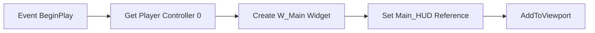
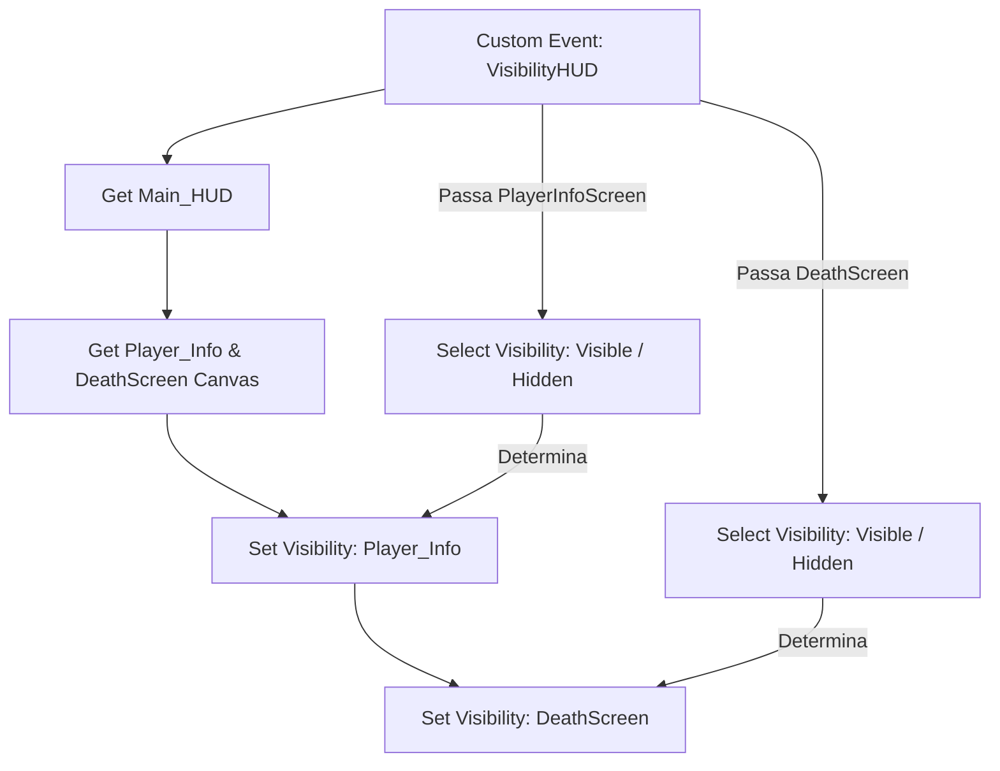

# 🎓 Análise Técnica Detalhada: PC_ProjetoGTA Player Controller

**[Compatibilidade: Unreal Engine 5.1+]**  
**[Origem: CUSTOMIZADO]**  
**[Status de Verificação: Extraído diretamente de PC_ProjetoGTA.t3d e verificado visualmente]**

O `PC_ProjetoGTA` é o **Player Controller** (Controlador do Jogador) principal do projeto. Na arquitetura da Unreal Engine, o Player Controller atua como a interface entre o cérebro humano (input) e o peão físico (Pawn/Character). Este Blueprint foi projetado especificamente para gerenciar o ciclo de vida da interface gráfica de usuário (HUD) e controlar a visibilidade dos painéis de tela.

---

## 🎯 Caso Prático: Gerenciamento Centralizado de HUD e UI

> *Se a criação do widget de interface (HUD) fosse delegada diretamente ao Blueprint do personagem (Character), toda vez que o personagem morresse e reaparecesse (respawn), a tela seria duplicada ou destruída incorretamente, causando vazamento de memória e sobreposição visual. Centralizar a criação e controle de visibilidade da HUD no Player Controller garante que a interface persista de forma estável durante todo o ciclo de vida da sessão de jogo.*

---

## ⚙️ 1. Estrutura de Variáveis do Controlador

O controlador define e mantém a seguinte variável crítica de referência de interface:

| Variável | Tipo de Dado | Valor Padrão | Descrição Didática |
| :--- | :--- | :--- | :--- |
| **`Main_HUD`** | `W_Main (Object Reference)` | `None` | Referência em cache para a tela principal (User Widget) do jogador, permitindo manipulação direta de seus sub-elementos. |

---

## ⚙️ 2. Análise dos Fluxos Lógicos (Event Graph)

### A) Event BeginPlay (Instanciação da Interface)
Assim que o jogador assume o controle do personagem ao iniciar a partida, o Player Controller cria e exibe o painel de interface principal.

#### Sequência de Execução:
1. **Gatilho de Início:** O `ReceiveBeginPlay` inicia a execução.
2. **Identificação do Jogador:** O nó `GetPlayerController` lê o índice local `0` do jogador.
3. **Instanciação do Widget:** O nó `Create W_Main Widget` constrói o widget visual baseado na classe `W_Main_C`. O parâmetro `NorthYaw` está pré-configurado conceitualmente para `180.0` para calibração de bússola/radar circular.
4. **Armazenamento em Cache:** Define a variável `Main_HUD` recebendo a saída do widget recém-criado.
5. **Apresentação em Tela:** Executa `AddToViewport` (Adicionar à Porta de Visualização) com `ZOrder = 0` para renderizar a HUD na tela principal do jogador.

---

### B) Evento Customizado: Controle de Visibilidade de Telas (VisibilityHUD)
Este fluxo gerencia dinamicamente quais elementos do HUD estão visíveis, sendo essencial para alternar entre a HUD normal de gameplay e a tela de game over/morte.

#### Parâmetros de Entrada do Evento:
*   **`PlayerInfoScreen`** (`Boolean`): Controla a visibilidade das informações do jogador (energia, vida, minimapa, armas).
*   **`DeathScreen`** (`Boolean`): Controla a visibilidade da tela de morte.

#### Sequência de Execução:
1. **Entrada do Evento:** O evento personalizado `VisibilityHUD` recebe os sinais booleanos.
2. **Roteamento de Sub-Widgets:** A partir da referência da `Main_HUD`, o fluxo obtém os componentes filhos:
   * **`Player_Info`** (`CanvasPanel`): O painel contendo barras de vida, colete e status.
   * **`DeathScreen`** (`CanvasPanel`): O painel contendo a mensagem de game over e botões de respawn.
3. **Seleção de Estado (Nós `Select`):**
   * O primeiro nó `Select` avalia a variável `PlayerInfoScreen`. Se `True`, retorna o estado Slate `Visible`; se `False`, retorna `Hidden`.
   * O segundo nó `Select` faz o mesmo para `DeathScreen`, convertendo `True` para `Visible` e `False` para `Hidden`.
4. **Aplicação de Visibilidade:**
   * Executa `SetVisibility` no Canvas `Player_Info` com a saída do primeiro nó select.
   * Em seguida, executa `SetVisibility` no Canvas `DeathScreen` com a saída do segundo nó select.

---

## ⚙️ 3. Por que foi feito assim? (Práticas Recomendadas)

*   **Evitando Branches Excessivos:** O uso dos nós **Select** em vez de múltiplos Branches (`If/Else`) reduz o número de fios de execução no gráfico. Isso melhora drasticamente a legibilidade do Blueprint e reduz a sobrecarga de processamento visual da máquina virtual de Blueprints.
*   **Encapsulamento por Tipo de Dado:** Utilizar `ESlateVisibility` (Visible/Hidden) de forma direta nos Canvas Panels do HUD secundário mantém a interface otimizada, já que objetos ocultados com `Hidden` não realizam cálculos visuais de layout na tela a cada frame, poupando poder de GPU.

---

## ❓ Perguntas que este documento responde

*   **Por que a HUD principal (`W_Main`) é criada no Player Controller e não no Character?**  
    Para evitar que a HUD seja reinstanciada ou duplicada quando o personagem sofre respawn, mantendo a interface estável e persistente na tela do jogador.
*   **Como o evento `VisibilityHUD` altera os elementos da tela do jogador?**  
    Ele recebe sinais booleanos para a tela de status do jogador e para a tela de morte, converte esses booleanos para estados de visibilidade (`Visible` / `Hidden`) usando nós `Select`, e aplica as configurações nos sub-widgets da `Main_HUD`.
*   **O que acontece com os painéis ocultados com `Hidden` na Unreal Engine?**  
    Eles deixam de ser desenhados na tela e não participam dos cálculos de colisão ou layout de interface do Slate, resultando em otimização de processamento de UI.
