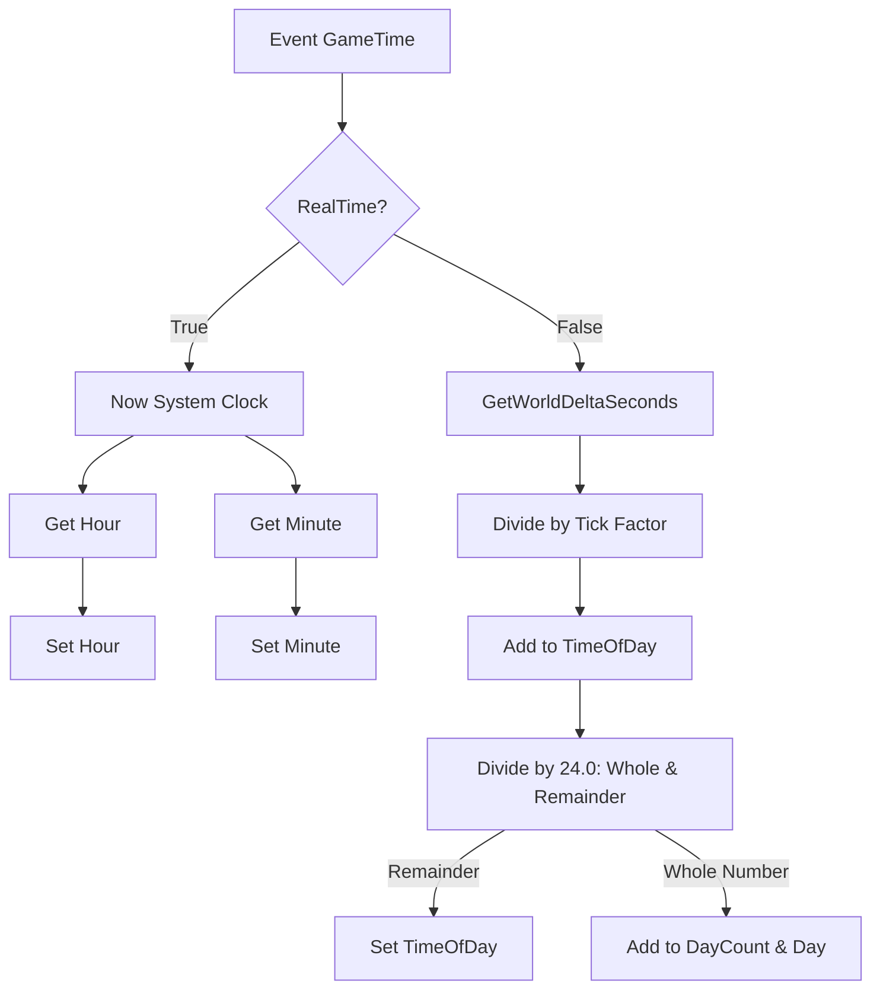

# 🎓 Análise Técnica Detalhada: ProjetoGameInstance Blueprint

**[Compatibilidade: Unreal Engine 5.1+]**  
**[Origem: CUSTOMIZADO]**  
**[Status de Verificação: Extraído diretamente de ProjetoGameInstance.t3d e verificado visualmente]**

O `ProjetoGameInstance` é a classe customizada de **GameInstance** do projeto. Na arquitetura da Unreal Engine, a Game Instance é um objeto que persiste durante transições de níveis e mapas. Isso o torna o local ideal para armazenar estados globais do jogo, dados persistentes de progresso e sistemas de contagem de tempo contínuo que não podem ser reiniciados ao mudar de cenário.

---

## 🎯 Caso Prático: Simulador de Clima e Ciclo Dia/Noite Persistente

> *Se o ciclo de tempo (horas, minutos, dias) fosse calculado dentro do blueprint de um nível (Level Blueprint) ou do personagem, o tempo seria resetado toda vez que o jogador entrasse em uma casa, entrasse em uma missão ou morresse (o que recarrega o nível). Ao implementar a simulação matemática do tempo dentro da Game Instance, o relógio do jogo continua correndo perfeitamente, independente das transições de mapas ou respawns.*

---

## ⚙️ 1. Estrutura de Variáveis do Sistema de Tempo

O Game Instance define as seguintes variáveis globais para a simulação:

| Variável | Tipo de Dado | Valor Padrão | Descrição Didática |
| :--- | :--- | :--- | :--- |
| **`RealTime`** | `Boolean` | `False` | Define o modo de tempo: `True` para usar a hora real do computador do jogador, `False` para usar tempo acelerado do jogo. |
| **`TimeOfDay`** | `Double (real)` | `12.0` | Valor decimal de horas decorridas no dia (ex: `14.5` equivale a 14h30min ou 2:30 PM). |
| **`Hour`** | `Integer` | `12` | O valor inteiro da hora atual (0 a 23), extraído para exibição de UI. |
| **`Minute`** | `Integer` | `0` | O valor inteiro dos minutos atuais (0 a 59), extraído para exibição de UI. |
| **`Tick`** | `Double (real)` | `60.0` | Fator de escala/velocidade do tempo. Controla a duração de um dia fictício no jogo. |
| **`DayCount`** | `Integer` | `1` | Contador absoluto de dias decorridos no jogo. |
| **`Day`** | `Integer` | `1` | O dia atual do calendário de jogo. |

---

## ⚙️ 2. Análise dos Fluxos Lógicos (Event Graph)

### A) Evento de Inicialização (ReceiveInit)
O evento `ReceiveInit` é executado uma única vez quando o processo do jogo é iniciado.

*   **Finalidade:** Configura o loop de atualização do tempo.
*   **Lógica:** Dispara o nó `K2_SetTimerDelegate` (Definir Timer por Delegado) apontando para o evento customizado `GameTime`, com repetição cíclica constante para atualizar a hora a cada frame ou fração de segundo.

---

### B) Processamento de Tempo Misto: Real vs. Jogo (Event GameTime)
Este evento realiza a bifurcação condicional com base no booleano `RealTime` e executa as equações matemáticas de progressão temporal.

#### 1. Rota de Tempo Real (`RealTime == True`):
*   **Lógica:** Executa a chamada de sistema `Now()` (Obter Hora Atual do Sistema Operacional).
*   **Extração:** Passa a estrutura de dados DateTime resultante nos nós `GetHour` e `GetMinute`, gravando diretamente os valores inteiros nas variáveis globais `Hour` e `Minute` do Game Instance.

#### 2. Rota de Tempo Acelerado do Jogo (`RealTime == False`):
Este é o núcleo do simulador de tempo do jogo:
*   **Progressão Incremental:** Obtém o delta de tempo do frame por `GetWorldDeltaSeconds()`, divide este valor pelo fator `Tick` e soma à variável `TimeOfDay`.
    $$\text{Novo } TimeOfDay = TimeOfDay + \left( \frac{\text{DeltaSeconds}}{\text{Tick}} \right)$$
*   **Divisão Inteira com Resto (`Division Whole and Remainder`):** O novo valor calculado é dividido por `24.0` (total de horas em um dia).
    *   **O Resto (Remainder / FMod):** Representa a hora fracionária dentro do dia atual (ex: 0.0 a 23.99). Este valor é salvo de volta na variável `TimeOfDay`.
    *   **O Quociente Inteiro (Return Value):** Indica se um ciclo de 24 horas foi completado neste frame (normalmente retorna `0`, mas retorna `1` no instante exato da meia-noite). Este valor é adicionado aos acumuladores `DayCount` e `Day` usando nós de soma.

---

### C) Formatação de Horas e Minutos para Interface (UI)
Após calcular o valor decimal em `TimeOfDay`, o componente extrai os componentes de horas e minutos de forma inteira nas comment boxes específicas:

#### 1. Extração de Minutos (`Obtem os minutos`):
1. Multiplica o valor de `TimeOfDay` por `60.0` para converter o dia em minutos absolutos.
2. Roda o nó `FMod` com divisor `60.0` para extrair apenas a sobra de minutos da hora corrente.
3. Roda o nó `FFloor` (Arredondamento para Baixo) para eliminar dízimas decimais.
4. Define o valor na variável `Minute`.

#### 2. Extração de Horas (`Obtem as horas`):
1. Executa o nó `FMod` em `TimeOfDay` com divisor `24.0` para isolar a hora corrente.
2. Roda o nó `FFloor` (Arredondamento para Baixo).
3. Define o valor na variável `Hour`.

---

### D) Sincronização Visual do Céu (BP_GoodSky)
Para garantir que as estrelas, sol e lua correspondam exatamente à hora do jogo calculada:

1. **Localização do Ator:** Roda o nó `GetActorOfClass` procurando a referência do ator de iluminação dinâmica da cena (`BP_GoodSky_C` / `Good Sky`).
2. **Atualização da Iluminação:** Se o ator for encontrado no mundo, o Game Instance chama a função/evento `TimeOfDay` (ou define a propriedade de tempo do céu) passando a variável decimal `TimeOfDay`.
3. Isso força o ator de iluminação a recalcular o ângulo solar, cor do céu e intensidade de luz, sincronizando visualmente o dia e a noite.

---

## ❓ Perguntas que este documento responde

*   **Por que a Game Instance é a classe escolhida para calcular o tempo do jogo?**  
    Porque ela persiste ao longo de todo o jogo. Os dados de tempo (horas, dias) continuam rodando e não são resetados quando o jogador morre ou troca de fase.
*   **Qual a diferença entre os modos de tempo `RealTime` e tempo do jogo acelerado?**  
    O modo `RealTime` sincroniza o relógio do jogo com o horário real do computador do usuário via `Now()`. O modo acelerado calcula o tempo somando os deltas de frames escalados por um multiplicador `Tick`.
*   **Como o sistema detecta que um dia se passou no jogo?**  
    Ele realiza uma divisão inteira com resto (`Division (Whole and Remainder)`) do tempo total por 24. O resto atualiza a hora do dia e o resultado inteiro (quociente) adiciona dias ao calendário quando cruza a meia-noite.
*   **Como a iluminação do cenário reflete as horas calculadas pelo jogo?**  
    A Game Instance obtém o ator dinâmico de céu `BP_GoodSky` através de `GetActorOfClass` e passa para ele a hora atual (`TimeOfDay`), forçando a reatualização solar na cena.
