# 🖥️ Análise Pedagógica e Técnica: Subsistema de UMG e HUD

**[Compatibilidade: UE 5.1+]**  
**[Status do Editor: Ativo em Background (PID: 11904)]**  
**[Localização dos Assets no Projeto:]** `Content/Blueprints/UMG/...`  
**[Fontes de Conhecimento:]** `[Projeto Real]`, `[Documentação Epic Games]`, `[Teoria / IA]`

---

## 🎯 1. Visão Geral do Subsistema UMG

O subsistema de **Unreal Motion Graphics (UMG)** é responsável pela interface gráfica do jogador. Em vez de usar as classes legadas de desenho por tela (Canvas HUD), o projeto adota componentes visuais reativos estruturados sob hierarquias de painéis organizadas em coordenadas de tela e âncoras.

A HUD mestre e os menus de seleção são instanciados e controlados dinamicamente via Player Controller ([PC_ProjetoGTA](file:///C:/Users/hijon/Downloads/ava-assistant-30-03-26/ava-assistant-v3-main/CRIADO-AVA-CLI/unreal_engine_docs/Docs_ProjetoGTA_Estudo/02_Blueprints/Blueprints-PC_ProjetoGTA.md)).

```mermaid
graph TD
    PC[PC_ProjetoGTA] -->|Instancia e adiciona| W_Main[W_Main]
    PC -->|Instancia e adiciona| UMG_Inv[UMG_Inventory]
    
    subgraph W_Main (HUD Principal)
        W_Main --> WBCrosshair[WBCrosshair]
        W_Main --> W_PickupItem[W_PickupItem]
        W_Main --> Player_Info[Canvas: Player_Info]
        Player_Info --> Vida[ProgressBar: Vida]
        Player_Info --> Colete[ProgressBar: Colete]
        Player_Info --> Stamina[ProgressBar: Stamina]
        Player_Info --> Hora[TextBlock: Hora]
        W_Main --> WeaponSwitcher[WidgetSwitcher: WeaponSwitcher]
        WeaponSwitcher -->|Slot 0| Icon_Hand[T_SocoIcone]
        WeaponSwitcher -->|Slot 1| Icon_Weapons[T_AK47 + AmmoBox]
    end

    subgraph UMG_Inventory (Menu Radial)
        UMG_Inv --> BackgroundBlur[BackgroundBlur]
        UMG_Inv --> RadialMenu[UMG_RadialMenu]
        RadialMenu --> Slot0[UMG_Slot 0]
        RadialMenu --> Slot1[UMG_Slot 1]
        RadialMenu --> Slot2[UMG_Slot 2]
        RadialMenu --> Slot3[UMG_Slot 3]
        RadialMenu --> Slot4[UMG_Slot 4]
        RadialMenu --> Slot5[UMG_Slot 5]
        RadialMenu --> Slot6[UMG_Slot 6]
        RadialMenu --> Slot7[UMG_Slot 7]
    end
```

---

## 📋 2. Detalhamento Técnico dos Componentes Visuais

### A) HUD Principal: `W_Main`
*   **Caminho do Asset:** `Content/Blueprints/UMG/W_Main.uasset`  
*   **Metadados Brutos:** [w_main.md](file:///C:/Users/hijon/Downloads/ava-assistant-30-03-26/ava-assistant-v3-main/CRIADO-AVA-CLI/unreal_engine_docs/Blueprints_Exportados/Blueprints/Widget-HUD/UI/w_main.md)  
*   **Origem:** `[Projeto Real]`

O widget central da interface contendo múltiplos Canvas Panels sobrepostos e reativos.

*   **Hierarquia e Alinhamento:**
    *   **HUD (CanvasPanel):** Painel de tela cheia que organiza a disposição geral da UI.
    *   **DeathScreen (CanvasPanel):** Oculto por padrão (`Visibility = Hidden`). Posicionado no centro da tela (`Anchors 0.5, 0.5`). Contem o texto vermelho `ESCAFEDEU-SE` (`TextBlock_108`) usando tamanho padrão e sombra projetada com canal alfa em `0.8` para reforçar a legibilidade.
    *   **Player_Info (CanvasPanel):** Localizado no canto superior direito (`Anchors 0.89, 0.13`), responsável por agrupar os status do jogador:
        *   `Vida` (ProgressBar): Inserida dentro da `BordaVida` (cor preta). Cor da barra: Vermelho puro (`R=1.0`). Percentual de preenchimento de teste: `0.57`.
        *   `Colete` (ProgressBar): Inserido na `BordaColete`. Cor da barra: Cinza padrão (`R=0.42`). Percentual de teste: `0.40`.
        *   `Stamina` (ProgressBar): Localizado no fundo do painel (`Anchors 0.5, 1.0`). Cor da barra: Cinza. Percentual de teste: `0.60`.
        *   `Hora` (TextBlock): Mostra o texto formatado `00:00` usando tamanho de fonte `50`, contorno (outline size = 3) e espaçamento de caracteres `50`.
    *   **WeaponSwitcher (WidgetSwitcher):** Chaveia entre estados de armas equipadas (`Anchors 1.0, 1.0`, canto inferior direito):
        *   `0_NoWeapon` (Overlay): Contém a imagem `Icon_Hand` carregando a textura `T_SocoIcone.uasset`.
        *   `1_Weapons` (Overlay): Exibe a imagem ativa da arma `Icon_Weapons` (`T_AK47.uasset`) e o bloco `AmmoBox` (HorizontalBox) com o formato: `AmmoMagazine` (TextBlock: `00`), um separador (TextBlock: `-`) e `AmmoStored` (TextBlock: `00`).
    *   **Minimapa (Overlay):** Posicionado no canto inferior esquerdo (`Anchors 0.0, 1.0`, alinhamento `0.0, 1.0`). Contém a borda do mapa `MinimapBorder` carregando o indicador `T_North_Icon.uasset`.
    *   **Damage (Image):** Textura de dano avermelhada de tela inteira (`T_Damage.uasset`), oculta por padrão (`Visibility = Hidden`).

---

### B) Retícula Dinâmica de Mira: `WBCrosshair`
*   **Caminho do Asset:** `Content/Blueprints/UMG/WBCrosshair.uasset`  
*   **Metadados Brutos:** [WBCrosshair.md](file:///C:/Users/hijon/Downloads/ava-assistant-30-03-26/ava-assistant-v3-main/CRIADO-AVA-CLI/unreal_engine_docs/Blueprints_Exportados/Blueprints/Widget-HUD/UI/WBCrosshair.md)  
*   **Origem:** `[Projeto Real]`

Interface aninhada no centro da tela (`W_Main`) que desenha a mira física e permite animações dinâmicas de dispersão.

*   **Estrutura de Bordas (Borders):**
    *   Possui 4 elementos principais do tipo `Border` representados pelas variáveis `top`, `bottom`, `left` e `right`, todas ancoradas perfeitamente ao centro (`Anchors 0.5, 0.5`).
    *   Cada borda contém um sub-componente de borda (ex: `Border_96`, `Border_133`) que define as dimensões físicas da retícula.
    *   A cor das bordas (`BrushColor`) é preta pura (`R=0, G=0, B=0, A=1`).

---

### C) Pop-up de Coleta: `W_PickupItem`
*   **Caminho do Asset:** `Content/Blueprints/UMG/W_PickupItem.uasset`  
*   **Metadados Brutos:** [W_PickupItem.md](file:///C:/Users/hijon/Downloads/ava-assistant-30-03-26/ava-assistant-v3-main/CRIADO-AVA-CLI/unreal_engine_docs/Blueprints_Exportados/Blueprints/Widget-HUD/UI/W_PickupItem.md)  
*   **Origem:** `[Projeto Real]`

Notificação visual flutuante ativada quando o jogador posiciona a câmera sobre um objeto interativo da classe `BP_PickupObject`.

*   **Hierarquia de Layout:**
    *   **Border_240:** Caixa de fundo escura translúcida (`BrushColor R=0.005, G=0.005, B=0.005, A=0.7`) com margem (padding) de `10.0`.
    *   **VerticalBox_54:** Organiza o aviso em duas linhas verticais separadas por um espaçador (`Spacer_369` de altura `4.71`):
        *   `HorizontalBox_278`: Contém a instrução fixa `Press E to pickup weapon.` em fonte tamanho `16` com contorno de tamanho `2`.
        *   `HorizontalBox_476`: Contém o nome da arma associada `Weapon` (TextBlock configurado centralizado).

---

### D) Seleção Radial e Inventário: `UMG_Inventory`, `UMG_RadialMenu`, `UMG_Slot`
*   **Caminho dos Assets:** 
    *   `Content/Blueprints/UMG/RadialMenu/UMG_Inventory.uasset`
    *   `Content/Blueprints/UMG/RadialMenu/UMG_RadialMenu.uasset`
    *   `Content/Blueprints/UMG/RadialMenu/UMG_Slot.uasset`
*   **Metadados Brutos:** [UMG_Inventory.md](file:///C:/Users/hijon/Downloads/ava-assistant-30-03-26/ava-assistant-v3-main/CRIADO-AVA-CLI/unreal_engine_docs/Blueprints_Exportados/Blueprints/Widget-HUD/RadialMenu/UMG_Inventory.md), [UMG_RadialMenu.md](file:///C:/Users/hijon/Downloads/ava-assistant-30-03-26/ava-assistant-v3-main/CRIADO-AVA-CLI/unreal_engine_docs/Blueprints_Exportados/Blueprints/Widget-HUD/RadialMenu/UMG_RadialMenu.md), [UMG_Slot.md](file:///C:/Users/hijon/Downloads/ava-assistant-30-03-26/ava-assistant-v3-main/CRIADO-AVA-CLI/unreal_engine_docs/Blueprints_Exportados/Blueprints/Widget-HUD/RadialMenu/UMG_Slot.md)  
*   **Origem:** `[Projeto Real]`

Conjunto de 3 widgets que juntos gerenciam a roda de armas com câmera lenta ativa.

*   **`UMG_Inventory` (Painel Mestre do Menu):**
    *   **BackgroundBlur_207:** Aplica efeito de desfoque gaussian na cena 3D por trás do menu com força `BlurStrength = 4.0`.
    *   **Cor (Image):** Imagem verde translúcida de fundo (`TintColor R=0, G=1, B=0, A=0.2`) cobrindo toda a tela.
    *   **WeaponName (TextBlock):** Texto central inferior dinâmico para exibir o nome da arma sob seleção.
*   **`UMG_RadialMenu` (Gerenciador Físico da Roda):**
    *   Exibe imagens de roda centralizada (`MenuRadial`, `Selection` e `BorderSelection`) com tamanho `700x700`. A seleção ativa e as bordas possuem tonalidade verde destacada (`R=0, G=1, B=0.15`).
    *   Possui 8 instâncias fixas do widget de slot de slot 0 (`UMG_Slot`) a slot 7 (`UMG_Slot_7`) espalhadas nas coordenadas radialmente calculadas (ex: topo: `Top=-250`; direita: `Left=247`; inferior direito: `Left=175, Top=170`).
    *   Cada slot possui a propriedade `WeaponSlot` inicializada respectivamente de `NewEnumerator0` (Slot 0) a `NewEnumerator7` (Slot 7).
*   **`UMG_Slot` (Slot Individual):**
    *   Contém um `SizeBox` com dimensões fixas forçadas (`WidthOverride = 250`, `HeightOverride = 80`).
    *   **WeaponIcon (Image):** Exibe a miniatura da arma associada (`T_AK47.uasset` configurado como padrão).
    *   **AmmoBox (HorizontalBox):** Agrupa os textos de munição do respectivo slot: `AmmoMagazine` (TextBlock: `00`), separador e `AmmoStored` (TextBlock: `00` na cor cinza).

---

### E) Customização Visual: `W_CustomCharacter`
*   **Caminho do Asset:** `Content/Blueprints/UMG/W_CustomCharacter.uasset`  
*   **Metadados Brutos:** [W_CustomCharacter.md](file:///C:/Users/hijon/Downloads/ava-assistant-30-03-26/ava-assistant-v3-main/CRIADO-AVA-CLI/unreal_engine_docs/Blueprints_Exportados/Blueprints/Widget-HUD/UI/W_CustomCharacter.md)  
*   **Origem:** `[Projeto Real]`

Widget independente utilizado para trocar os atributos de malha visual (como roupas ou variações de skin) no menu inicial.

*   **Hierarquia Visual:**
    *   **HorizontalBox_69:** Centralizado verticalmente na tela (`Anchors 0.0, 0.5` a `1.0, 0.5`), estendendo-se de ponta a ponta.
    *   **LeftButton (Button):** Posicionado à esquerda (`Padding Left = 500.0`), com fundo azul (`R=0.0, G=0.38, B=1.0`) e texto contendo a seta `<-`.
    *   **RightButton (Button):** Posicionado à direita (`Padding Right = 500.0`), com fundo azul e texto contendo a seta `->`.

---

## 🔀 3. Fluxo de Integração e Atualização de Informações

```mermaid
sequenceDiagram
    participant PC as PC_ProjetoGTA
    participant HUD as W_Main
    participant WS as AC_WeaponSystem
    participant PS as AC_PlayerStatus

    PC->>HUD: CreateWidget() & AddToViewport()
    loop Event Tick (Má Prática)
        HUD->>PS: Get Health / Armour / Stamina
        PS-->>HUD: Valores Decimais (Percentuais)
        HUD->>HUD: Atualiza ProgressBars (Vida, Colete, Stamina)
    end
    
    rect rgb(30, 40, 50)
        Note over WS, HUD: Troca de Armas
        WS->>HUD: Event SetActiveWeaponIndex(Index)
        HUD->>HUD: WeaponSwitcher.SetActiveWidgetIndex(Index)
        HUD->>HUD: Icon_Weapons.SetBrushFromTexture()
    end
```



---

## 🛠️ 4. Práticas Recomendadas e Correção de Desvios (Performance & Segurança)

> [!IMPORTANT]
> **A) Otimização Crítica: Eliminar Property Bindings / Event Tick**
> *   **Gargalo [Projeto Real / Epic Games]:** O projeto utiliza Property Bindings ou consultas contínuas por quadro (Event Tick) nos Widgets (`Vida`, `Colete`, `Stamina`) para buscar informações dos componentes `AC_PlayerStatus` e `AC_WeaponSystem`. A Unreal Engine precisa avaliar essas conexões recursivamente a cada frame no thread principal, causando sobrecarga massiva de CPU quando o HUD cresce.
> *   **Remediação / Prática Recomendada:** Substituir todas as vinculações dinâmicas por uma arquitetura baseada em eventos (**Event-Driven UI**).
>     1. No `AC_PlayerStatus`, criar um Event Dispatcher chamado `OnStatusChanged(Health, Armour, Stamina)`.
>     2. No widget `W_Main`, durante o evento `Construct`, fazer o Bind ao `OnStatusChanged` obtendo a referência do personagem.
>     3. Atualizar as barras de progresso apenas quando esse evento for disparado (evitando a execução de chamadas redundantes a cada frame).
>
> ```cpp
> // Equivalente em C++ recomendado para evitar sobrecarga no Tick do Blueprint
> DECLARE_DYNAMIC_MULTICAST_DELEGATE_ThreeParams(FOnPlayerStatusChanged, float, NewHealth, float, NewArmour, float, NewStamina);
> ```

> [!WARNING]
> **B) Controle de Custo de Renderização: Otimização do Background Blur**
> *   **Gargalo [Documentação Epic Games]:** O widget `UMG_Inventory` aplica um `BackgroundBlur_207` com força `4.0` sobre toda a área de visualização 3D. O pós-processamento de desfoque é extremamente custoso no thread de GPU, especialmente em resoluções mais altas (4K), pois requer múltiplas passadas de amostragem por pixel.
> *   **Remediação / Prática Recomendada:** 
>     *   Nunca manter o widget `UMG_Inventory` ativo na Viewport quando o menu radial estiver oculto. O Player Controller deve chamar `RemoveFromParent` ou alterar a visibilidade do widget explicitamente para `Collapsed` ou `Hidden`.
>     *   Quando o menu for recolhido, garantir que o parâmetro de desfoque seja redefinido ou que o widget de blur seja completamente desativado para liberar recursos de renderização da GPU.

> [!TIP]
> **C) Segurança: Blindagem contra Exploit de Troca Rápida de Armas ("Weapon Cycling Hack")**
> *   **Gargalo [Teoria / IA]:** Jogadores maliciosos podem injetar inputs rápidos ou criar macros de controle para ciclar rapidamente o `ActiveWidgetIndex` do `WeaponSwitcher` na HUD. Se o componente lógico `AC_WeaponSystem` não possuir travas independentes e apenas reagir às chamadas do HUD, o jogador poderá ignorar as animações de equipar/recarregar ("anim cancel") e disparar infinitamente a taxas de cadência superiores às projetadas.
> *   **Remediação / Prática Recomendada:** 
>     1. **Autoridade Lógica:** O HUD `W_Main` deve ser tratado exclusivamente como um elemento de apresentação visual passivo. A lógica de qual arma está ativa reside unicamente no servidor/componente `AC_WeaponSystem`.
>     2. **Cooldown de Input:** O `AC_WeaponSystem` deve rejeitar requisições de troca de armas se o tempo decorrido desde o último disparo ou da última troca for inferior ao tempo total da animação de equipar (`EquipTime`).
>     3. **Sincronização HUD:** O `WeaponSwitcher` do HUD só deve trocar o índice visual de exibição quando receber a confirmação bem-sucedida de replicação do evento de troca vinda do `AC_WeaponSystem`.

> [!CAUTION]
> **D) Refatoração de Escalabilidade: Slots Radiais Estáticos**
> *   **Gargalo [Projeto Real]:** O `UMG_RadialMenu` define estaticamente 8 variáveis separadas (`UMG_Slot`, `UMG_Slot_1` ... `UMG_Slot_7`) de forma hardcoded no Canvas Panel. Isso dificulta a escalabilidade para mais slots de inventário ou menus dinâmicos configurados dinamicamente com base em itens de base de dados.
> *   **Remediação / Prática Recomendada:** Refatorar o grafo para que o `UMG_RadialMenu` possua um container dinâmico (como um `WrapBox` ou gerador de posições radial matemático via código/Blueprint). No `Construct`, ler um Array de itens de armas e spawnar instâncias de `UMG_Slot` dinamicamente, posicionando-as via fórmulas trigonométricas de seno e cosseno baseadas no tamanho do array de inventário.
