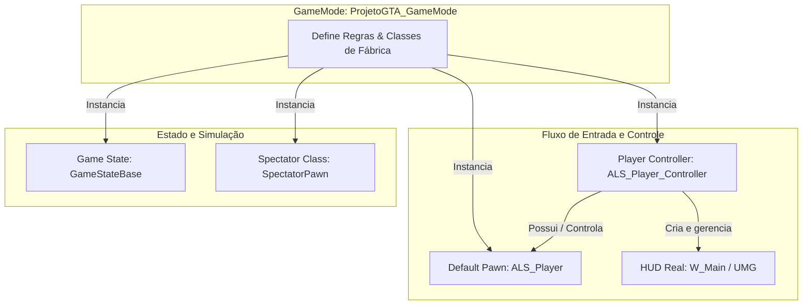

# 🎓 Arquitetura de Gameplay: GameMode e Classes Auxiliares (Gameplay Framework)

**[Compatibilidade: UE 5.1+]**  
**[Origem: Motor Nativo & Customizado (ALS V4)]**

Para construir um jogo robusto na Unreal Engine, é fundamental compreender o **Gameplay Framework** — um conjunto de classes C++ nativas projetadas pela Epic Games que trabalham em harmonia para gerenciar o estado do jogo, a representação física do jogador, o fluxo de regras e as interfaces de usuário.

Neste documento, analisamos detalhadamente os cinco elementos fundamentais configurados no GameMode principal do projeto (`ProjetoGTA_GameMode`), suas funções, como são criados, para que servem e a arquitetura oculta que você precisa conhecer para evitar gargalos de desenvolvimento.

---

## 🗺️ Mapa de Localização no Projeto

| Classe no GameMode | Classe Selecionada | Tipo de Classe | Localização / Caminho do Arquivo no Projeto |
| :--- | :--- | :--- | :--- |
| **Default Pawn Class** | `ALS_Player` | Blueprint Asset | `C:\Users\hijon\Documents\UnrealEngine\PROJETO-GTA-29-10-2025\ProjetoGTA\ProjetoGTA\Content\AdvancedLocomotionV4\Blueprints\CharacterLogic\ALS_Player.uasset` |
| **HUD Class** | `HUD` | Classe Nativa C++ | **Nativo do Motor** (`AHUD` - não possui `.uasset` próprio na pasta Content) |
| **Player Controller Class** | `ALS_Player_Controller` | Blueprint Asset | `C:\Users\hijon\Documents\UnrealEngine\PROJETO-GTA-29-10-2025\ProjetoGTA\ProjetoGTA\Content\AdvancedLocomotionV4\Blueprints\CharacterLogic\ALS_Player_Controller.uasset` |
| **Game State Class** | `GameStateBase` | Classe Nativa C++ | **Nativo do Motor** (`AGameStateBase` - não possui `.uasset` próprio na pasta Content) |
| **Spectator Class** | `SpectatorPawn` | Classe Nativa C++ | **Nativo do Motor** (`ASpectatorPawn` - não possui `.uasset` próprio na pasta Content) |

---

## ⚙️ Detalhamento dos Componentes

---

### 1. Default Pawn Class (`ALS_Player`)
*   **O que é:** O **Pawn** é o agente físico do jogo que pode ser controlado por um jogador ou por uma inteligência artificial. Ele possui colisão, física de movimento e representação visual (Static ou Skeletal Mesh).
*   **Para que serve:** Representar o avatar do jogador no espaço tridimensional do mapa. Ele recebe os comandos físicos de locomoção enviados pelo Player Controller.
*   **Como funciona no projeto:** O projeto utiliza o `ALS_Player`, que é herdado do **Advanced Locomotion System (ALS V4)**. Ele gerencia estados complexos de movimento como corrida, caminhada furtiva (crouching), saltos (jumping), escalada de obstáculos (mantle), ragdoll físico instantâneo e posicionamento inverso dos pés (Foot IK) nas superfícies.
*   **Como é criado:** No Editor da Unreal Engine, clica-se com o botão direito na pasta de destino -> *Blueprint Class* -> Seleciona-se `Character` (que é um Pawn especializado em locomoção bípede com física de gravidade incorporada) ou herda-se diretamente da classe base de movimento do ALS (`ALS_BaseCharacterBP`).

---

### 2. HUD Class (`HUD`)
*   **O que é:** O `AHUD` é a classe herdada historicamente no motor para lidar com renderização de elementos 2D bidimensionais na tela (texto, mira, caixas de colisão de depuração).
*   **Para que serve:** Tradicionalmente, servia para desenhar elementos simples de interface usando chamadas de desenho em tempo real diretamente do C++ na tela (Canvas).
*   **Como funciona no projeto:** O projeto mantém a classe padrão do motor (`HUD`). Isso ocorre porque a Unreal Engine moderna utiliza o **UMG (Unreal Motion Graphics)** para interfaces profissionais. A lógica de interface do Projeto GTA (como a exibição da saúde, stamina e menu de armas) foi deslocada para Widgets de Usuário (`W_Main`) criados via Blueprint no Player Controller (`PC_ProjetoGTA`) e adicionados diretamente ao Viewport do jogador através do nó `AddToViewport`.
*   **Como é criado:** Para criar um HUD personalizado (se necessário), clica-se com o botão direito -> *Blueprint Class* -> Pesquisa-se e seleciona-se `HUD` como classe pai.

---

### 3. Player Controller Class (`ALS_Player_Controller`)
*   **O que é:** O `APlayerController` é a interface de comunicação não física entre o jogador humano e o motor de jogo. Pense nele como a "alma" ou o "cérebro" do jogador.
*   **Para que serve:** Receber entradas diretas do hardware do jogador (teclas pressionadas, cliques do mouse, eixos analógicos do controle) e traduzir esses sinais em intenções que controlam o Pawn possuído. Ele é quem determina se o mouse deve aparecer na tela, gerencia o foco do input de teclado e orquestra a criação das interfaces do usuário principais.
*   **Como funciona no projeto:** O `ALS_Player_Controller` captura as entradas físicas do jogador e as encaminha para a lógica de animação do ALS no `ALS_Player`. O Player Controller persiste durante toda a sessão no mapa, mesmo que o personagem morra, seja destruído ou sofra respawn.
*   **Como é criado:** Clica-se com o botão direito -> *Blueprint Class* -> Seleciona-se `Player Controller` como classe pai.

---

### 4. Game State Class (`GameStateBase`)
*   **O que é:** O `AGameStateBase` é a classe encarregada de monitorar o estado geral do jogo enquanto a partida está em andamento.
*   **Para que serve:** Em jogos multiplayer, ele armazena dados que precisam ser sincronizados (replicados) para todos os computadores dos jogadores conectados (como o tempo de partida restante, placar de pontos, estado das missões cooperativas ou se o jogo está pausado). Em jogos single-player, ele monitora variáveis globais da sessão corrente no nível.
*   **Como funciona no projeto:** Utiliza a classe nativa do motor (`GameStateBase`), pois regras persistentes globais da sessão em andamento do GTA (como o tempo do dia decimal e sincronização com `BP_GoodSky`) estão centralizadas no `GameInstance` para permitir persistência mesmo após a troca de níveis (transição de mapas).
*   **Como é criado:** Clica-se com o botão direito -> *Blueprint Class* -> Pesquisa-se e seleciona-se `Game State Base` como classe pai.

---

### 5. Spectator Class (`SpectatorPawn`)
*   **O que é:** Um Pawn especializado e invisível, desprovido de malha tridimensional e gravidade física, que possui um componente de movimento aéreo livre (`USpectatorPawnMovement`).
*   **Para que serve:** Permitir que o jogador "assista" ao jogo (modo espectador) voando livremente pelo cenário quando não possui um corpo físico ativo (por exemplo, após morrer em uma partida ou antes de entrar no jogo).
*   **Como funciona no projeto:** Utiliza o padrão nativo `SpectatorPawn` para suporte padrão à navegação de câmera caso o controle seja desassociado de um peão físico principal.
*   **Como é criado:** Clica-se com o botão direito -> *Blueprint Class* -> Pesquisa-se e seleciona-se `Spectator Pawn` como classe pai.

---

## 💡 O Que Você Não Sabia Que Precisava Saber (Arquitetura Oculta)

Para ir além do conhecimento básico e programar como um desenvolvedor sênior da Unreal Engine, você deve dominar estas três verdades estruturais ocultas do motor:

### A) A Armadilha do Respawn (Onde salvar seus dados)

> [!CAUTION]
> **Nunca armazene dados persistentes de progresso do jogador (como dinheiro, inventário de armas ou pontuação) na classe do Personagem (Pawn/Character)!**
> 
> Quando o personagem morre, o GameMode destrói o ator do `Character` e instancia um novo no ponto de spawn. Se suas variáveis de vida máxima atualizada, inventário ou dinheiro acumulado estiverem dentro do Blueprint do personagem, **todas elas serão resetadas a zero no respawn**.
> 
> *   **Solução Profissional:** Salve dados persistentes da sessão no **Player State** (que é anexado ao Player Controller e sobrevive à destruição do Pawn) ou no **Player Controller**. Para dados que devem sobreviver até mesmo à troca de mapas (ir da cidade para um menu ou ilha), salve no **Game Instance**.

---

### B) A Diferença de Existência no Servidor vs Cliente (Multiplayer)

> [!IMPORTANT]
> O **GameMode** só existe fisicamente na máquina que está rodando como **Servidor** (Server-only). Os jogadores conectados (Clients) não têm acesso ao GameMode por questões estritas de segurança (evitando trapaças e hacks de leitura de memória).
> 
> *   Se você tentar obter referências do GameMode (`Get Game Mode`) a partir de um Widget rodando no computador de um cliente, ele retornará um valor nulo (`None`).
> *   **A regra de ouro:** Se uma informação precisa ser lida por todos os jogadores (como placar ou progresso), coloque-a no **GameState**, pois ele é replicado automaticamente do servidor para todos os clientes.

---

### C) O Ciclo de Vida da HUD no Player Controller

> [!TIP]
> **Por que criar a HUD no Player Controller e não no Begin Play do Character?**
> 
> Se você criar o widget da HUD no `Begin Play` do Character, toda vez que o personagem sofrer respawn, um novo widget da HUD será adicionado à tela do jogador. Isso causa sobreposição visual (widgets empilhados infinitamente uns sobre os outros) e um vazamento grave de memória RAM (Memory Leak), pois os widgets antigos não são destruídos automaticamente.
> 
> Centralizar a criação da HUD no `Begin Play` do **Player Controller** (e armazenar a referência em cache como `Main_HUD` para atualizar seus valores por Eventos) garante que a interface seja gerada exatamente uma única vez por sessão de jogo.

---

## 📚 Fundamentação Teórica da Epic Games
De acordo com os manuais de arquitetura oficial da **Epic Games Developer Portal**:
1. **GameMode Base:** Define o contrato de jogo e estabelece as regras de spawn (`SpawnDefaultPawnAtTransform`).
2. **PlayerController:** Mantém o mapeamento estável de entrada de hardware e o foco da câmera, agindo como o proprietário lógico da conexão do jogador (`UNetConnection`).
3. **Pawn:** É concebido puramente como um títere físico descartável e substituível, projetado para receber comandos externos através da função nativa `Possess()`.
