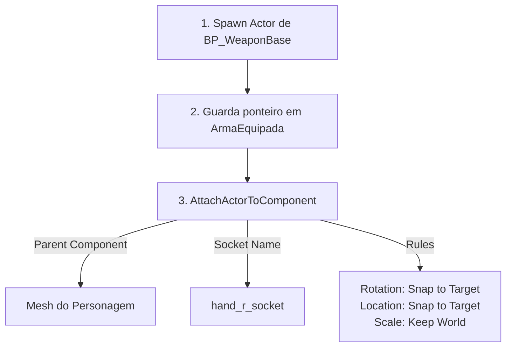
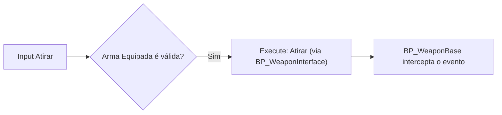

# 🎓 Subsistema: Sistema de Armas (Weapon & Inventory System)

**[Compatibilidade: UE 5.1+]**  
**[Origem: CUSTOMIZADO]**

O Sistema de Armas do projeto gerencia o ciclo de vida dos equipamentos de combate do jogador: desde o armazenamento no inventário à instanciação física no cenário e fixação nas mãos do personagem jogável. Ele opera de forma desacoplada por meio de um **Actor Component** chamado `AC_WeaponSystem` acoplado ao `BP_Character`.

Este documento aborda a dinâmica de encaixe (Sockets) de esqueletos 3D e a lógica de disparo polimórfica via interfaces de comunicação.

---

## 🎯 Caso Prático: Empunhando a Pistola no Socket da Mão Direta

> *O modelador 3D exportou a arma e o personagem. No entanto, se o programador simplesmente gerar o ator da arma no cenário, ela cai no chão devido à gravidade ou fica flutuando na origem do mapa (coordenadas 0,0,0). A arma precisa acompanhar perfeitamente o movimento da mão do pirata durante as animações de corrida e mira. Como realizar essa fixação física de forma dinâmica em tempo de execução?*

---

## ⚙️ 1. Lógica de Spawn e Fixação no Socket (Attach)

Para fixar a arma ao esqueleto do personagem, criamos um ponto de ancoragem virtual chamado **Socket** no esqueleto do pirata no Editor da Unreal Engine (geralmente chamado de `hand_r_socket` para a mão direita).



### O Nó chave: `AttachActorToComponent`
Este nó faz com que o ator da arma passe a herdar todas as transformações de posição, rotação e escala do Socket do personagem.
*   **Snap to Target:** Configura o ator anexado para alinhar sua origem espacial instantaneamente com a posição e orientação do Socket de destino.
*   **Keep Relative/Keep World:** Preserva as proporções de escala da arma para evitar que ela fique gigantesca ou minúscula.

---

## ⚙️ 2. Ciclo de Disparo Polimórfico (Interface Call)

Ao pressionar o botão de disparo (Mouse Esquerdo), o personagem não faz uma verificação de tipo para cada arma específica. A comunicação ocorre de forma genérica:



### Fluxo Didático:
1.  O `BP_Character` possui uma variável `ArmaEquipada` do tipo `Actor (Reference)`.
2.  O input do jogador aciona uma chamada de mensagem de interface `Atirar`.
3.  Qualquer ator que implemente a `BP_WeaponInterface` receberá a mensagem e responderá com sua lógica específica de tiro (ex: a metralhadora atirará em rajadas, o mosquete dará um tiro lento de alto dano).

---

## 🏃 Desafio Ativo: Descartar Arma Equipada (Drop Weapon)

O Designer do jogo quer que o jogador seja capaz de jogar a arma atual no chão ao pressionar a tecla "G", permitindo que ela caia fisicamente e possa ser coletada novamente.

### Esqueleto de Resolução do Desafio:

1. No `BP_Character`, crie uma ação de input para a tecla "G" (ex: `IA_DropWeapon`).
2. No Event Graph, conecte o evento do input a um Branch que verifica se `ArmaEquipada` é válido.
3. Se válido, monte a lógica de desanexação física:

```
[IA_DropWeapon] ──> [DetachFromActor] (Target: ArmaEquipada)
                           │
                           ▼
                  [Set Simulate Physics] (Target: StaticMesh da ArmaEquipada, True)
                           │
                           ▼
                  [Set ArmaEquipada = Null (Limpar referência)]
```

*   **Explicação:** O nó `DetachFromActor` solta a arma do Socket da mão. Ao ativar `Set Simulate Physics` no componente colisor da arma, ela ganha peso físico e cai de forma realista no chão do mapa devido à gravidade.

---

## ❓ Perguntas que este documento responde

- Como funciona a fixação de itens e armas no esqueleto 3D do personagem usando Sockets?
- O que acontece fisicamente ao usar as regras de fixação `Snap to Target`?
- Como funciona a comunicação polimórfica de disparo utilizando Blueprints Interfaces?
- De que forma implementar um sistema de descarte (Drop) físico de armas em Unreal Engine?
