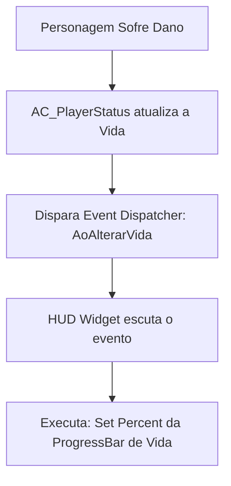

# 🎓 Subsistema: Sistema de HUD (Heads-Up Display / UMG)

**[Compatibilidade: UE 5.1+]**  
**[Origem: CUSTOMIZADO]**

O HUD do jogo exibe dados críticos de gameplay em tempo real na tela do jogador, como a quantidade de vida, estamina e a contagem de munição da arma equipada. Ele é construído sobre o framework **UMG (Unreal Motion Graphics)**, que utiliza Widgets visuais acoplados à tela do jogador (`Viewport`).

Este documento aborda a arquitetura de vinculação de dados do HUD e as práticas ideais para exibição de dados com foco em desempenho gráfico.

---

## 🎯 Caso Prático: A Otimização de Performance no HUD

> *O programador júnior implementou a barra de vida criando uma "função de binding" direto no painel do Widget que lê a vida do personagem a cada frame. Durante os testes, o jogo sofreu uma queda perceptível de frames por segundo (FPS) quando dezenas de inimigos apareceram. O perfilador da Unreal revelou que a leitura contínua (no Tick) do widget do HUD estava consumindo CPU de forma desnecessária. Como reestruturar a atualização do HUD para ocorrer apenas quando a vida realmente mudar?*

---

## ⚙️ 1. Event Bindings vs. Tick Bindings (Arquitetura orientada a Eventos)

Em vez de verificar os atributos a cada frame (Tick), a arquitetura profissional do HUD usa a abordagem baseada em **Eventos** (Event-Driven HUD). O HUD só é modificado quando uma ação real ocorre no jogo.



### Por que a abordagem de Eventos é superior?
- **Tick Binding:** Executa buscas de memória e casts a cada quadro do jogo (ex: 60 ou 120 vezes por segundo), desperdiçando processamento mesmo que o jogador não tenha tomado dano.
- **Event Dispatcher (Delegates):** O widget registra-se no componente `AC_PlayerStatus` no início. Só executa lógica de atualização quando o evento de dano dispara, poupando ciclos preciosos da CPU.

---

## ⚙️ 2. Componentes e Estrutura do HUD Widget

O layout do HUD é construído na aba Designer do Widget Blueprint.

```mermaid
graph TD
    HUDWidget[WBP_HUD] --> Canvas[Canvas Panel]
    Canvas --> HealthBar[ProgressBar: Vida]
    Canvas --> StaminaBar[ProgressBar: Stamina]
    Canvas --> AmmoBox[Horizontal Box: Munição]
    AmmoBox --> AmmoText[TextBlock: MunicaoAtual]
    AmmoBox --> DividerText[TextBlock: "/"]
    AmmoBox --> MaxAmmoText[TextBlock: CapacidadePente]
```

*   **Progress Bar (Barra de Progresso):** Utilizada para Vida e Estamina. Aceita um valor de porcentagem (`Percent`) entre `0.0` (vazia) e `1.0` (cheia). O cálculo executado é:
    $$\text{Percent} = \frac{\text{Vida Atual}}{\text{Vida Maxima}}$$
*   **Text Blocks (Blocos de Texto):** Utilizados para exibir munição de forma estruturada. Atualizados usando o nó **Format Text**, que une a munição atual e o limite em uma única string:
    `{MunicaoAtual} / {CapacidadePente}`

---

## 🏃 Desafio Ativo: Indicador Visual de Dano (Damage Screen Overlay)

Para dar uma sensação de perigo, o designer solicitou que uma imagem de borda vermelha e piscante apareça na tela do jogador sempre que a vida estiver abaixo de 30%.

### Esqueleto de Resolução do Desafio:

1. No Widget `WBP_HUD`, adicione um componente **Image** cobrindo toda a tela.
2. Defina uma textura de borda vermelha suave na imagem e marque sua visibilidade padrão como `Hidden` (oculta).
3. No Event Graph do Widget, crie a lógica a partir do evento de atualização de vida:

```
[Evento Atualizar Vida] 
         │
         ▼
[Vida / Vida Max] ──> [Branch: Percent < 0.3?]
                             ├── (True) ──> [Set Visibility: Visible] (Image Vermelha)
                             └── (False) ──> [Set Visibility: Hidden] (Image Vermelha)
```

---

## ❓ Perguntas que este documento responde

- O que é o framework UMG e como criar interfaces de usuário (Widgets) na Unreal?
- Por que vinculações diretas (Property Bindings) no Tick prejudicam o desempenho do jogo?
- Como usar Event Dispatchers para atualizar elementos de HUD apenas sob demanda?
- Como calcular e aplicar a porcentagem da barra de vida e estamina no UMG?
