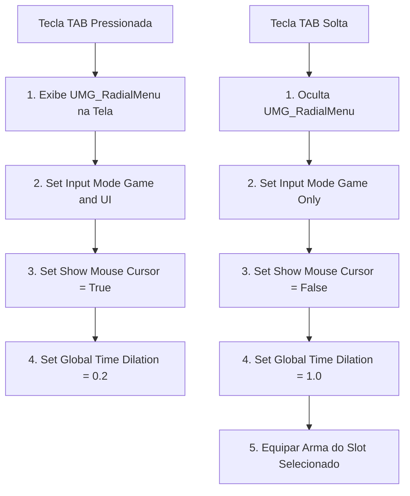
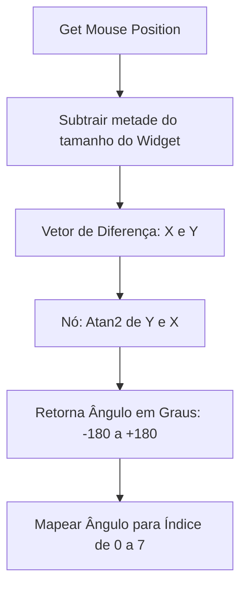

# 🎓 Subsistema: Menu Rotativo de Armas (Radial Weapon Wheel UMG)

**[Compatibilidade: UE 5.1+]**  
**[Origem: CUSTOMIZADO]**

O Menu Rotativo (ou Weapon Wheel) permite que o jogador selecione rapidamente equipamentos em tempo real sem pausar completamente a ação do jogo. Ele é construído sobre o UMG como um widget composto (`UMG_RadialMenu`) que calcula dinamicamente o ângulo do cursor do mouse a partir do centro da tela para determinar qual slot está selecionado.

Este documento detalha o cálculo trigonométrico necessário para mapear coordenadas da tela a fatias radiais, e a manipulação da velocidade do tempo físico do jogo (Time Dilation).

---

## 🎯 Caso Prático: Seleção de Armas sob Pressão (Combate Lento)

> *Durante batalhas intensas contra piratas inimigos, o jogador precisa trocar o Mosquete descarregado pela Pistola de Pederneira. Abrir um menu convencional em tela cheia que para o jogo quebra a imersão e o ritmo de combate. A solução clássica da indústria é uma roda de armas radial: ao segurar a tecla "Tab", o tempo desacelera para 20% da velocidade normal (efeito slow-motion), permitindo que o jogador movimente o mouse em uma direção para escolher a arma e retorne ao combate imediatamente ao soltar a tecla. Como programar isso?*

---

## ⚙️ 1. O Pipeline de Exibição e Desaceleração Temporal (Time Dilation)

Quando o jogador pressiona e solta a tecla "Tab", o Blueprint do personagem gerencia o estado da interface e do tempo físico da Unreal Engine:



### O Nó: `Set Global Time Dilation`
Este nó manipula a velocidade com que o tempo passa para todo o universo físico do jogo.
*   **0.2:** O jogo roda a apenas 20% da velocidade original (efeito cinematográfico de câmera lenta).
*   **1.0:** Velocidade padrão do jogo em tempo de execução real.

---

## ⚙️ 2. O Cálculo Matemático da Direção do Mouse (Trigonometria)

Para saber qual slot circular o mouse está apontando, o `UMG_RadialMenu` lê as coordenadas bidimensionais do mouse a cada frame e calcula o arco-tangente a partir do centro do widget.



### A Fórmula Trigonométrica no Blueprint:
1.  **Nó `Atan2 (Degrees)`:** Recebe a coordenada Y e a coordenada X do deslocamento do mouse e retorna o ângulo exato em graus (de $-180^\circ$ a $180^\circ$).
2.  **Conversão:** Adicionamos $180$ ao ângulo retornado para transformar a escala para $0^\circ$ a $360^\circ$ positivos.
3.  **Divisão por Fatias:** Para uma roda de 8 armas, cada fatia possui $45^\circ$ ($360 / 8$). Dividimos o ângulo por 45 e arredondamos para baixo (`Floor`) para obter o índice do slot selecionado (de 0 a 7).

---

## 🏃 Desafio Ativo: Destaque Visual do Slot Selecionado

Para dar um feedback visual instantâneo ao jogador, o slot selecionado na roda de armas deve mudar de cor ou ficar ligeiramente maior.

### Esqueleto de Resolução do Desafio:

1. Dentro do `UMG_RadialMenu`, crie uma lista (Array) contendo as imagens dos botões dos slots.
2. Crie uma função chamada `AtualizarDestaqueMenu`.
3. No Event Tick do Widget (executado durante a exibição da roda), após calcular o índice selecionado, monte a seguinte lógica:

```
[AtualizarDestaqueMenu] ──> [ForEachLoop (Array de Slots)]
                                  │
          ┌───────────────────────┴───────────────────────┐
    (Indice Loop == Indice Selecionado?)           (Caso Contrário)
          │                                               │
          ▼                                               ▼
[Set Render Scale: 1.15]                        [Set Render Scale: 1.0]
[Set Render Color: Amarela]                     [Set Render Color: Branca]
```

---

## ❓ Perguntas que este documento responde

- Como fazer um menu radial no UMG da Unreal Engine?
- O que é o nó `Set Global Time Dilation` e como ele é utilizado para criar efeitos de câmera lenta?
- Como usar a função trigonométrica `Atan2` no Blueprint para calcular o ângulo do cursor do mouse?
- Como mapear um ângulo de 360 graus para índices de fatias de uma interface circular?
