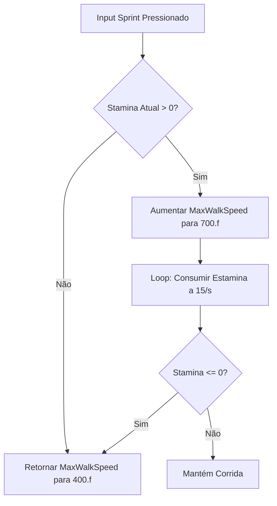
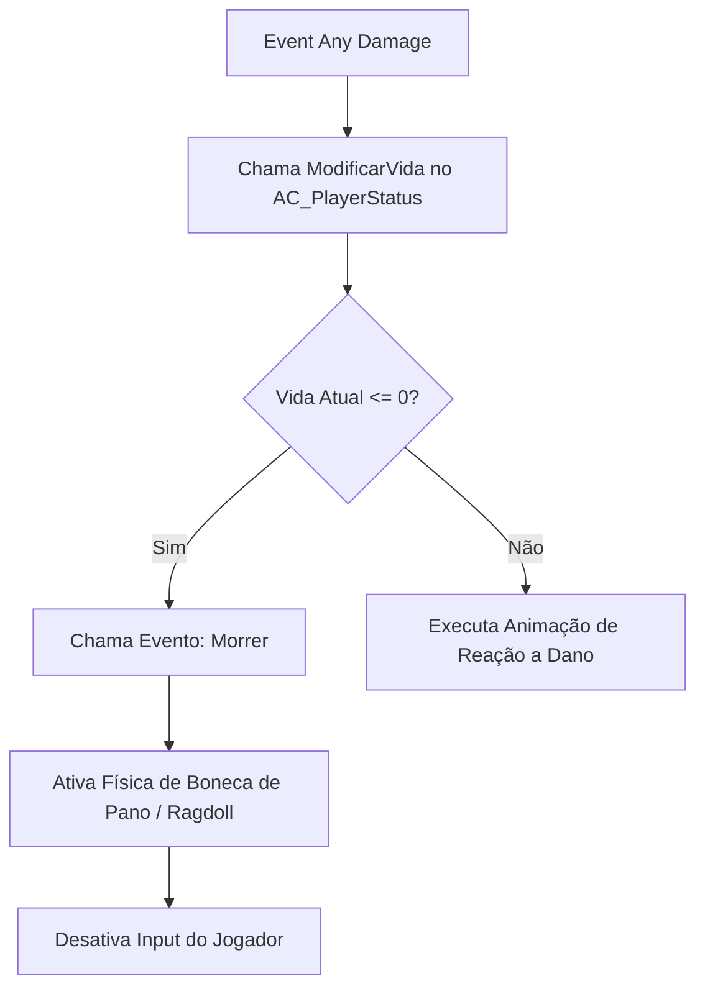

# 🎓 Subsistema: Vida & Estamina (Health & Stamina System)

**[Compatibilidade: UE 5.1+]**  
**[Origem: CUSTOMIZADO]**

O sistema de Vida e Estamina rege o núcleo físico e tático do personagem. Ele gerencia as consequências de receber dano de inimigos ou quedas (Vida), bem como a fadiga decorrente de esforços mecânicos contínuos, como a corrida (Estamina).

Neste documento, analisamos os loops lógicos de consumo e regeneração desses atributos e como eles se integram com o sistema de movimentação do jogador.

---

## 🎯 Caso Prático: Cansaço Físico ao Correr (Sprint Logic)

> *O Game Designer determinou que a corrida (Sprint) não pode ser infinita. O jogador deve gastar estamina a uma taxa de 15 pontos por segundo enquanto correr. Se a estamina chegar a zero, o personagem deve parar de correr imediatamente, retornando à velocidade normal de caminhada e impedindo novas corridas até recuperar o fôlego. Como integrar essa regra com os inputs C++ e o componente AC_PlayerStatus?*

---

## ⚙️ 1. Lógica Integrada de Corrida e Estamina

A mecânica de corrida depende da interação entre os inputs do personagem (`BP_Character`), a velocidade física (`CharacterMovement`) e o gerenciamento de energia (`AC_PlayerStatus`).



### O Loop de Consumo (Event Tick do Personagem):
1.  **Condição:** A cada frame, o personagem verifica se a flag `bIsSprinting` está ativada.
2.  **Cálculo:** Se estiver ativada, a estamina é reduzida:  
    $$\text{Stamina Atual} = \text{Stamina Atual} - (\text{Taxa Consumo} \times \text{Delta Time})$$
3.  **Verificação:** Se a estamina resultante for $\le 0$, o evento `HandleSprintEnd` é chamado automaticamente, forçando a velocidade para `WalkSpeed`.

---

## ⚙️ 2. Lógica de Dano e Condição de Morte

Quando o personagem colide com um perigo ou é atingido por um projétil, o motor chama o evento nativo `ApplyDamage` da Unreal. O componente do personagem intercepta este sinal e deduz o valor de vida atual.



---

## 🏃 Desafio Ativo: Penalidade de Exaustão

Para tornar o jogo mais punitivo, você deve implementar o estado de **Exaustão**. Se o jogador zerar completamente a estamina, ele não poderá correr novamente até que ela se regenere a pelo menos 30%.

### Esqueleto de Resolução do Desafio:

1. No `AC_PlayerStatus`, crie uma variável Boolean chamada `bEstaExausto`.
2. Altere o loop de consumo de estamina. Se a estamina chegar a `0.0`, defina `bEstaExausto = True`.
3. No loop de regeneração de estamina, se `Stamina Atual` for $\ge 30.0$, defina `bEstaExausto = False`.
4. No Blueprint do personagem, modifique a verificação inicial do Sprint:

```
[Input Sprint Pressionado] ──> [Branch: bEstaExausto?] ──(False)──> [Permite Correr]
                                      │
                                    (True)
                                      │
                                      ▼
                               [Bloqueia Corrida]
```

---

## ❓ Perguntas que este documento responde

- Como fazer a integração entre o sistema de movimento C++ e o componente de estamina do Blueprint?
- Qual é o fluxo de tomada de dano e verificação de morte do jogador?
- Como implementar um consumo de estamina por frame ajustado pelo `DeltaTime`?
- Como configurar a física Ragdoll em Blueprints quando o personagem morre?
