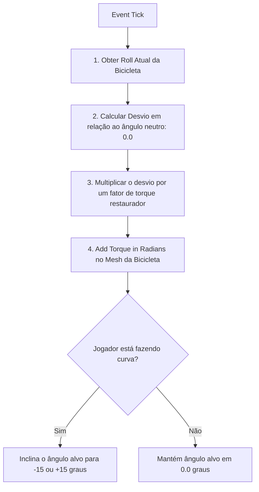
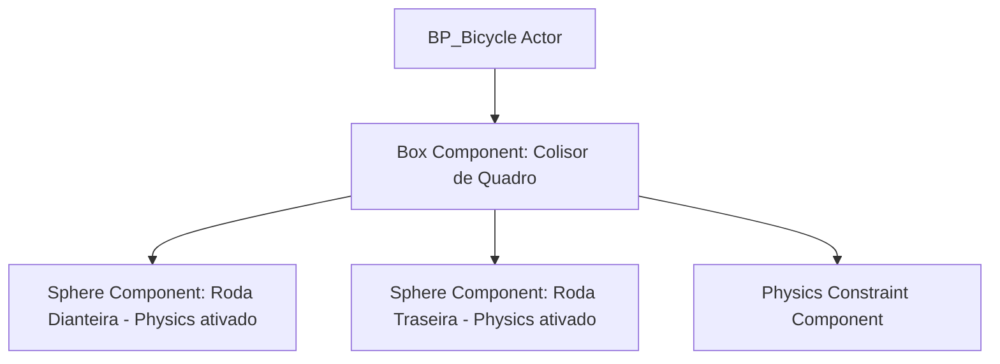

# 🎓 Tópico de Estudo: Mecânica de Bicicleta Customizada (Bicycle Physics)

**[Compatibilidade: UE 5.1+]**  
**[Origem: CUSTOMIZADO]**

A simulação de uma bicicleta na Unreal Engine é um desafio de física avançado, pois veículos de duas rodas não possuem equilíbrio lateral intrínseco como os carros. Em vez de usar o Chaos Vehicles padrão, a abordagem ideal para jogos arcade é criar um peão físico customizado (`Pawn`) que utiliza **forças físicas ativas** e restrições angulares para se manter em pé enquanto realiza curvas realistas (inclinação lateral ou lean).

Neste documento, analisamos a arquitetura matemática para estabilização de duas rodas e o fluxo de montagem em Blueprints.

---

## 🎯 Caso Prático: O Equilíbrio Físico em Curvas

> *O jogador encontra uma bicicleta de metal enferrujada. Ao subir nela e acelerar, o designer quer que a bicicleta se comporte de maneira realista: ela deve inclinar-se para os lados durante as curvas (efeito de rolagem por força centrífuga) e se auto-estabilizar quando andar em linha reta. Se usarmos colisão rígida simples, a bicicleta simplesmente tombará para o lado e cairá como um objeto estático. Como programar um corretor de equilíbrio por torque ativo?*

---

## ⚙️ 1. O Pipeline do Corretor de Equilíbrio (Stabilization System)

Para manter a bicicleta em pé sem travar completamente suas animações de inclinação, implementamos um laço de controle físico no **Event Tick** que mede a inclinação lateral (Roll) e aplica uma força rotacional corretiva (Torque) proporcional no eixo X.



---

## ⚙️ 2. Estrutura do Pawn da Bicicleta

O ator da bicicleta (`BP_Bicycle`) deve ser estruturado com componentes físicos individuais para simular suspensão e colisores esféricos para as rodas.



*   **Physics Constraint (Restrição Física):** Acopla o quadro às rodas, permitindo a rotação livre apenas no eixo Y (movimento de girar a roda) e travando deslocamentos laterais.
*   **Quadro com Centro de Massa rebaixado:** Para facilitar o equilíbrio passivo, rebaixamos o centro de massa do componente raiz alterando o vetor **Center of Mass Offset** no painel Details do Physics.

---

## 💻 3. Passo a Passo da Implementação

### Passo 1: Configurar a Colisão Física
1.  Defina o componente raiz (Box) para simular física (`Simulate Physics = True`).
2.  Altere a massa do quadro para `80.0 kg` e a das rodas para `5.0 kg`.

### Passo 2: Calcular a Força de Tração
No Event Graph do `BP_Bicycle`, ao receber o input de acelerar (Throttle), aplique um torque diretamente sobre a roda traseira:

```
[IA_ThrottleInput] ──> [Add Torque in Radians] (Target: RodaTraseira, Eixo: Y)
```

### Passo 3: Implementar a Rotação do Guidão (Steering)
Para fazer curvas, gire a Roda Dianteira no eixo Z relativo ao quadro usando o nó **Set Relative Rotation** com base no input de direção (Steering).

---

## 🏃 Desafio Ativo: Pedalar para Ganhar Impulso

Em vez de velocidade contínua como a de um motor, a bicicleta deve avançar por "impulsos" a cada pedalada. O jogador precisa apertar repetidamente o botão de acelerar para pegar velocidade.

### Esqueleto de Resolução do Desafio:

1. Adicione uma variável Float chamada `ForcaPedalada` (ex: `15000.0`).
2. Mude o bind do Enhanced Input do Throttle de `Triggered` (contínuo) para `Started` (um disparo por clique).
3. No Event Graph, conecte a lógica de aceleração por impulso instantâneo:

```
[IA_Throttle: Started] ──> [Add Impulse] (Target: RodaTraseira, no vetor Forward da bicicleta)
                                 └── Multiplicado por: ForcaPedalada
```

---

## ❓ Perguntas que este documento responde

- Por que veículos de duas rodas exigem tratamento de física diferenciado na Unreal?
- Como usar o nó `Add Torque in Radians` para estabilizar a rolagem (Roll) de um ator fisicamente simulado?
- O que é o componente `Physics Constraint` e como ele é aplicado em rodas e eixos?
- Como implementar curvas por inclinação (lean angle) em uma simulação de moto ou bicicleta?
