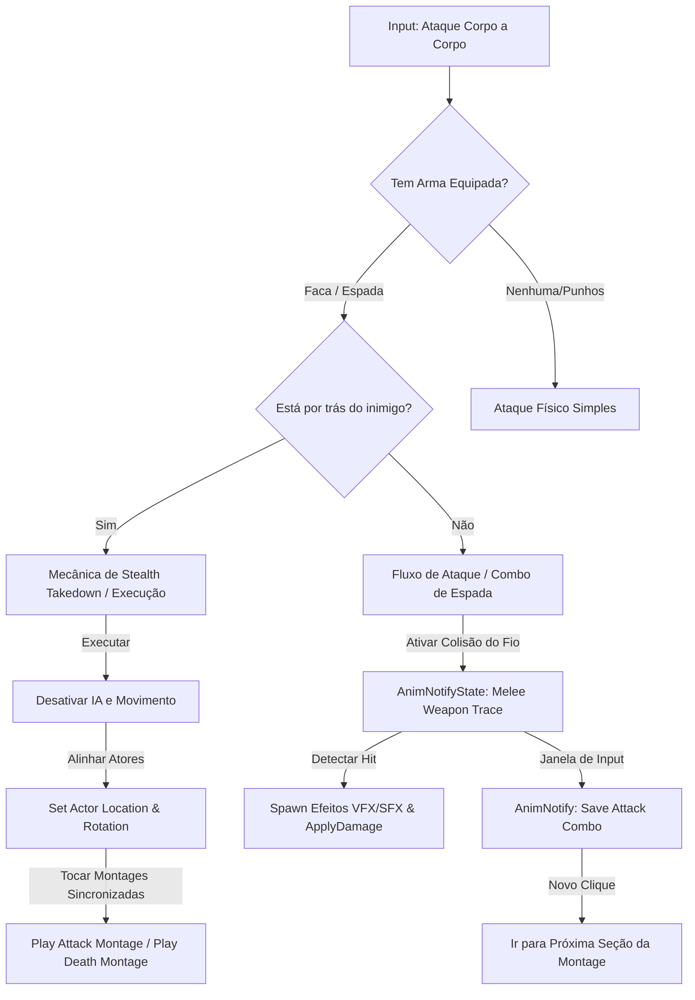

# 🎓 Implementando Combate Corpo a Corpo e Furtividade (Facas, Espadas, Combos e Eliminações)

**[Compatibilidade: UE 5.1+]**  
**[Origem: IDEIAS DE IMPLEMENTAÇÃO FUTURA]**

Este guia aborda o planejamento arquitetural e lógico para a criação de um sistema de combate corpo a corpo (melee) robusto em Unreal Engine. Ele cobre o desenvolvimento de ataques com facas e espadas (estilo Samurai / God of War) com detecção de impacto por traçado de colisão, combos, finalizações cinematográficas (execuções) e mecânicas de eliminação silenciosa (stealth takedowns).

---

## 🎯 Caso Prático: O Guerreiro Furtivo e o Mestre da Espada

> *O design de jogo requer que o jogador possa alternar entre dois estilos de combate físico:*
> 1.  * **Abordagem Furtiva (Stealth):** Estando desarmado ou com a faca equipada, se aproximar silenciosamente por trás de um inimigo desavisado. O HUD exibe a tecla para "Eliminação Silenciosa", que ao ser pressionada, trava ambos os personagens em uma animação coordenada (Sync Montage) onde o inimigo é eliminado sem alertar os outros.*
> 2.  * **Combate Direto (Action/Samurai):** Empunhando uma katana ou espada pesada, o jogador pode desferir sequências de ataques rápidos com combos encadeados, gerando faíscas metálicas e sangue no impacto (VFX/SFX). Se a postura do inimigo quebrar, um comando de "Finalização" (Finisher) pode ser disparado, tocando um golpe letal.*
> 3.  * **Ataque à Distância Físico (Arremesso):** O jogador pode segurar o botão de mira e arremessar a faca, que voará descrevendo uma trajetória física parabólica até se fixar na parede ou no corpo do inimigo.*

---

## ⚙️ 1. Pré-requisitos no Projeto

*   **Montagens de Animação (Anim Montages):**
    *   Montagens de golpes de espada (Slashes) com seções (Sections) configuradas para combos.
    *   Montagens sincronizadas de execução (uma para o atacante, outra correspondente para a vítima).
*   **Soquetes de Arma no Personagem:**
    *   `Katana_Holster` (nas costas) e `Katana_Hand` (na mão direita do manequim).
    *   `Knife_Holster` (na perna/cinto) e `Knife_Hand` (na mão do manequim).
*   **Assets de Efeitos:**
    *   Efeitos de impacto (Sangue para alvos orgânicos, Faíscas para metal/cenário).

---

## ⚙️ 2. Arquitetura do Sistema de Combate Melee



---

## 💻 3. Detalhamento Técnico das Lógicas

### A) Detecção de Impacto Precisa (Weapon Line Trace)
Evite usar colisores simples de caixa (Box Colliders) na espada, pois eles causam falsos positivos de dano durante transições rápidas. O ideal é realizar múltiplos traçados de linha (Line Traces) ao longo do gume da lâmina durante o arco do golpe.

1.  **Criação do AnimNotifyState (`ANS_MeleeTrace`):**
    *   Crie um Blueprint de classe `AnimNotifyState` chamado `ANS_MeleeTrace`.
    *   Na função `Received_NotifyBegin`, obtenha a referência da arma e ative a flag de colisão (`SetCollisionActive = True`).
    *   Na função `Received_NotifyTick`, execute uma sequência de **`LineTraceForObjects`** ligando soquetes posicionados na base e na ponta da lâmina da espada (`Blade_Start` e `Blade_End`).
    *   Se houver impacto em um `Pawn`, chame **`ApplyDamage`** e gere faíscas ou sangue no ponto de impacto (`Location` do Hit Result).
    *   Na função `Received_NotifyEnd`, desative o traçado para evitar danos fantasmas.

```
       Visual do Line Trace no Gume da Lâmina:
       
         [Ponta: Blade_End] ──(Socket 4)
                 │             ▲
                 ▼             │ (Múltiplos Traces por frame)
         [Meio: Blade_Mid]  ──(Socket 2)
                 │             ▲
                 ▼             │
         [Base: Blade_Start]──(Socket 1)
```

---

### B) Mecânica de Eliminação Silenciosa (Stealth Takedown)
Para verificar se o jogador pode assassinar um inimigo silenciosamente por trás, calculamos o produto escalar (Dot Product) dos vetores de direção (Forward Vectors) de ambos os personagens.

#### Lógica matemática de aproximação traseira:
Se o jogador está atrás do inimigo e olhando na mesma direção que ele:
$$\vec{F}_{\text{jogador}} \cdot \vec{F}_{\text{inimigo}} > 0.8 \quad (\approx \text{ângulo de visão traseiro menor que } 36^\circ)$$

```
          Inimigo                Jogador
         (Olhando ──>)         (Olhando ──>)
         [Forward: 1, 0]   ·   [Forward: 0.9, 0.1]  = 0.9 (Permite Execução!)
```

#### Passo a Passo no Blueprint:
1.  Obtenha a distância entre o jogador e o inimigo (`Get Distance To`). Se for menor que `150` unidades, prossiga.
2.  Obtenha o `Actor Forward Vector` do Jogador e do Inimigo.
3.  Faça o **`Dot Product`** entre os dois vetores.
4.  Se o resultado for maior que `0.8`, significa que o jogador está atrás e olhando na mesma direção geral do inimigo.
5.  **Ação de Execução:**
    *   Desative a movimentação do jogador e do inimigo (`CharacterMovement -> DisableMovement`).
    *   Alinhe a rotação do jogador para coincidir com a do inimigo (`SetActorRotation`).
    *   Mova o jogador ligeiramente para a posição ideal de execução usando `MoveComponentTo` ou similar.
    *   Toque a montagem **`Montage_Player_Takedown`** no jogador e **`Montage_Enemy_Death`** no inimigo simultaneamente.

---

### C) Sistema de Combos de Espada (Katana Combos)
Utilize as seções da Anim Montage (`Combo01`, `Combo02`, `Combo03`) e a variável `ComboCount` para gerenciar os ataques.

1.  Crie uma variável inteira `ComboIndex` e uma booleana `bSaveAttack`.
2.  No arquivo de animação (Anim Montage), adicione uma **AnimNotify** chamada `SaveAttack` perto do final do arco do corte.
3.  Quando o jogador clica para atacar:
    *   Se `ComboIndex == 0`, chame `PlayAnimMontage` iniciando na seção `Combo01`. Defina `ComboIndex = 1`.
    *   Se o jogador clicar novamente enquanto `bSaveAttack` estiver ativo, defina `bSaveAttack = False` e use o nó **`Montage Jump to Section`** para pular para a seção `Combo02`, atualizando `ComboIndex = 2`.
4.  Ao finalizar a montagem de animação sem novos cliques, zere `ComboIndex = 0`.

---

### D) Faca de Arremesso (Throwing Knife)
Representa um projétil físico de arremesso que simula gravidade real e se fixa no cenário ao colidir.

1.  **Criação do Projétil:** Crie um Blueprint Actor `BP_ThrowingKnife` herdando de `BP_ProjectileBase` ou usando um componente **`ProjectileMovement`**.
2.  **Gravidade:** Configure `ProjectileMovement -> ProjectileGravityScale = 1.0` (simula arco parabólico real) e velocidade inicial moderada (ex: `2000.0`).
3.  **Fixação no Alvo (Stick to Wall):**
    *   No evento **`OnComponentHit`** da faca:
        1.  Desative a simulação de física e movimento (`Stop` no componente ProjectileMovement).
        2.  Use o nó **`AttachActorToComponent`** (ou `AttachToActor`) conectando a faca ao componente colidido (seja o cenário ou o esqueleto do inimigo).
        3.  Desative colisões da faca para evitar novos impactos físicos anômalos.

---

## 🏃 Desafio Ativo: Sistema de Aparo (Parry / Defesa com Espada)

Implemente uma mecânica onde, se o jogador pressionar o botão de bloqueio (`Defesa`) exatamente **0.2 segundos** antes de receber um golpe de espada inimigo, ele executa um "Parry", empurrando o inimigo para trás e deixando-o vulnerável.

### Esqueleto de Resolução do Desafio:
1. No Blueprint do personagem, crie um evento `Bloquear` que define a flag `IsBlocking = True` e chame um Timer de `0.2` segundos para definir a flag de oportunidade `IsParryWindowActive = True`.
2. Quando a janela expirar, defina `IsParryWindowActive = False`.
3. No evento `AnyDamage` (ou no recebimento de dano Melee):
   * Se `IsParryWindowActive == True`: Ignore o dano, toque um efeito de faíscas metálicas (`Parry_VFX`), ative uma animação de cambaleio no atacante e dê um empurrão físico.
   * Se apenas `IsBlocking == True`: Reduza o dano recebido em 80% (bloqueio comum) e gaste estamina.
   * Se nenhuma flag estiver ativa: Aplique o dano total de impacto.

---

## ❓ Perguntas que este documento responde

- Como criar um sistema de detecção de colisão preciso para espadas usando Line Traces?
- Qual o cálculo matemático para verificar se um jogador está posicionado por trás de um inimigo para stealth takedowns?
- Como gerenciar combos consecutivos em Unreal Engine usando seções de Anim Montages?
- Como fazer projéteis de arremesso (como facas) se fixarem de forma realista nas paredes e personagens após o impacto?
