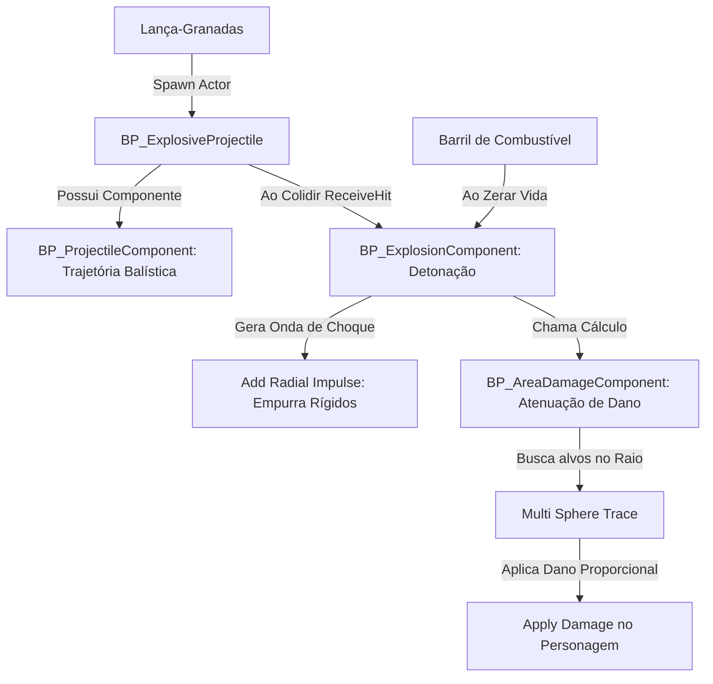

# 🎓 Implementando um Sistema de Explosivos e Dano de Área (RPG / Grenades)

**[Compatibilidade: UE 5.1+]**  
**[Origem: IDEIAS DE IMPLEMENTAÇÃO FUTURA]**

Este guia didático aborda a criação de um sistema modular de armas explosivas e dano de área do zero em Unreal Engine. O objetivo é expandir o arsenal básico de projéteis (`BP_ProjectileBase`) para suportar foguetes (RPGs), granadas de arremesso e objetos do cenário que explodem (barris de combustível), calculando física de onda de choque e atenuação de dano por distância.

---

## 🎯 Caso Prático: O Lançador de Granadas e o Barril Explosivo

> *O designer do jogo solicitou a inclusão de um lança-granadas e de barris vermelhos de combustível espalhados pela cidade. Ao disparar uma granada ou atirar no barril, ambos devem explodir de forma idêntica: gerar uma enorme bola de fogo visual, tocar um estrondo sonoro, empurrar fisicamente os objetos e carros próximos em todas as direções (onda de choque) e causar dano máximo no centro da explosão, reduzindo o dano à medida que os personagens se afastam da origem (área de dano com atenuação).*
>
> *Para evitar que criemos códigos repetidos de explosão na granada e no barril, estruturaremos a lógica de forma modular utilizando componentes reutilizáveis.*

---

## ⚙️ 1. Pré-requisitos no Projeto

*   **BP_ProjectileBase** ativo no projeto para herança do projétil físico (visto em [Blueprints-BP_ProjectileSystem.md](file:///C:/Users/hijon/Downloads/ava-assistant-30-03-26/ava-assistant-v3-main/CRIADO-AVA-CLI/unreal_engine_docs/Docs_ProjetoGTA_Estudo/02_Blueprints/Blueprints-BP_ProjectileSystem.md)).
*   **Physical Material** de impacto configurado no projeto.
*   Partículas de Explosão (`P_Explosion`) e Som (`Explosion_Cue`) importados (disponíveis sob a pasta `/StarterContent/`).

---

## ⚙️ 2. Arquitetura do Sistema de Explosivos

Ao modularizar o sistema, criamos componentes que realizam uma única tarefa com alta eficiência:

---

## 💻 3. Passo a Passo da Implementação

### Passo A: O Projétil Lançador (`BP_ExplosiveProjectile`)
Este ator representa a granada física disparada pela arma.
1.  **Criação:** Crie um Blueprint Actor chamado `BP_ExplosiveProjectile` e defina sua classe pai como `BP_ProjectileBase`.
2.  **Configurações:** No painel *Details*, altere o `ProjectileMesh` para uma esfera metálica e marque a velocidade `Speed` para um valor baixo (ex: `1500.0`), simulando o arco parabólico de arremesso.
3.  **Habilitar Ricochete:** Defina `Ricochet = True` para que a granada quique no chão antes de explodir.

---

### Passo B: O Componente de Trajetória (`BP_ProjectileComponent`)
Substitui ou estende o movimento básico para trajetórias balísticas personalizadas.
1.  **Criação:** Crie um Blueprint do tipo **`Actor Component`** chamado `BP_ProjectileComponent` e anexe-o ao seu projétil.
2.  **Lógica:** No Event Tick do componente, calcule a posição física futura usando a equação de queda livre pela gravidade:
    $$\vec{P}(t) = \vec{P}_0 + \vec{V}_0 t + \frac{1}{2} \vec{g} t^2$$
3.  **Vantagem:** Permite desenhar linhas visuais preditivas de mira na tela do jogador (arco de trajetória) antes de realizar o lançamento físico.

---

### Passo C: O Componente Reutilizável de Explosão (`BP_ExplosionComponent`)
Este componente será anexado à granada, ao barril explosivo e a carros para gerar o efeito visual e físico de detonação.
1.  **Criação:** Crie um **`Actor Component`** chamado `BP_ExplosionComponent`.
2.  **Variáveis:** 
    *   `ExplosionRadius` (Float | Padrão: `500.0`): Raio físico da detonação.
    *   `ExplosionForce` (Float | Padrão: `3000.0`): Intensidade do empurrão.
    *   `ExplosionVFX` (Cascade Particle / Niagara System).
    *   `ExplosionSFX` (Sound Cue).
3.  **Função `Detonar()`:**
    *   **Efeitos:** Executa `SpawnEmitterAtLocation` e `SpawnSoundAtLocation` na localização atual do ator dono (`GetOwner` -> `K2_GetActorLocation`).
    *   **Física (Onda de Choque):** Executa um nó **`RadialCollapse / AddRadialImpulse`** no canal de colisão física, aplicando a força `ExplosionForce` radialmente a partir do centro com atenuação linear, jogando carros e objetos simulados longe.
    *   **Chamada de Dano:** Invoca a função do componente de dano de área.

---

### Passo D: O Componente Lógico de Dano de Área (`BP_AreaDamageComponent`)
Este componente calcula o dano sofrido por cada alvo dentro do raio da explosão.
1.  **Criação:** Crie um **`Actor Component`** chamado `BP_AreaDamageComponent`.
2.  **Variáveis:**
    *   `BaseDamage` (Float | Padrão: `100.0`): Dano máximo no epicentro.
    *   `MinimumDamage` (Float | Padrão: `10.0`): Dano na borda do raio.
    *   `DamageRadius` (Float | Padrão: `500.0`): Raio limite de dano.
3.  **Lógica da Função `AplicarDanoRadial()`:**
    *   Usa o nó **`MultiSphereTraceForObjects`** a partir da localização da explosão, usando o raio `DamageRadius` e configurado para filtrar apenas o canal `Pawn` (jogadores/inimigos).
    *   Para cada ator atingido retornado no array de Hits:
        1.  Calcula a distância entre o epicentro e o ator (`Distance`).
        2.  Calcula o fator de atenuação linear do dano:
            $$\text{Dano Real} = \text{BaseDamage} \times \left( 1 - \frac{\text{Distance}}{\text{DamageRadius}} \right)$$
        3.  Passa o resultado por um nó `Clamp (Float)` para garantir que o dano real nunca seja inferior a `MinimumDamage` nem superior a `BaseDamage`.
        4.  Chama a função nativa **`ApplyDamage`** passando o dano recalculado ao alvo correspondente.

---

## 🏃 Desafio Ativo: Granada de Detonação por Tempo (Timer Fuse)

Para evitar que a granada exploda instantaneamente ao colidir, configure-a para detonar exatamente **3 segundos** após ser disparada.

### Esqueleto de Resolução do Desafio:
1. No `BP_ExplosiveProjectile`, abra o grafo de eventos e localize o evento `BeginPlay`.
2. Conecte um nó **`Set Timer by Event`** com o parâmetro `Time = 3.0` e `Looping = False`.
3. Crie um evento customizado chamado `DispararExplosao` e ligue-o ao pino de evento do timer.
4. No `DispararExplosao`, obtenha o componente `BP_ExplosionComponent` e chame a função `Detonar()`.

---

## ❓ Perguntas que este documento responde

- Como criar um sistema de explosão reutilizável em Unreal Engine usando Actor Components?
- Qual a fórmula matemática recomendada para calcular a atenuação de dano por distância radial?
- Como aplicar forças físicas de empurrão (onda de choque) em objetos simulados após uma detonação?
- Como estruturar um projétil de granada que quica usando o componente ProjectileMovement?
