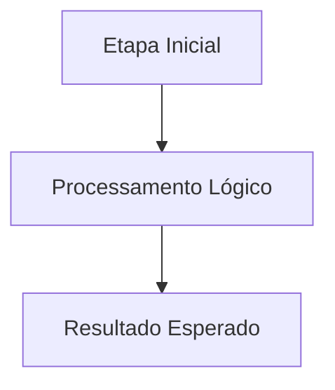

# 🎓 [Nome do Tópico]

**[Compatibilidade: UE 5.1+]**  
**[Origem: CUSTOMIZADO / ALS NATIVO / ALS MODIFICADO / PLUGIN]**

[Uma breve introdução didática explicando conceitualmente o que este tópico aborda e qual sua importância no desenvolvimento do jogo.]

---

## 🎯 Caso Prático: [Título do Cenário de Gameplay]

> *[Descreva um cenário real de gameplay ou problema prático enfrentado pelo desenvolvedor que justifica a criação ou implementação deste sistema/funcionalidade.]*

---

## ⚙️ 1. Pré-requisitos no Projeto

*   **[Pré-requisito 1]**: [Descrição do que já deve estar criado, importado ou configurado no projeto (ex: plugins específicos, malhas 3D, controladores).]
*   **[Pré-requisito 2]**: [Ex: C++ base do personagem `APPPirateCharacter` com Enhanced Input configurado.]

---

## ⚙️ 2. Arquitetura ou Fluxo de Execução

[Forneça um diagrama Mermaid que ilustre o ciclo de vida, fluxo de dados ou conexões do sistema.]



---

## 💻 3. Passo a Passo da Implementação

### A) Configuração no Editor / Asset
1.  **[Passo 1]**: [Descreva o primeiro passo físico a ser executado na interface do editor da Unreal Engine.]
2.  **[Passo 2]**: [Ex: Configurar os limites físicos de colisão e malha visual.]

### B) Código C++ Relevante (se aplicável)
```cpp
// [Insira aqui o cabeçalho .h ou implementação .cpp relevante para o tópico]
```

### C) Lógica de Blueprints Relevante (se aplicável)
- **[Nome do Evento]**: [Descreva a sequência de nós visuais necessários para completar a lógica, ex: Event Tick -> Branch -> ApplyDamage.]

---

## 🏃 Desafio Ativo: [Título do Desafio]

[Um desafio de adaptação ou extensão lógica para garantir que o aluno fixe o conhecimento prático.]

### Esqueleto de Resolução do Desafio:
1.  [Passo 1 do desafio]
2.  [Exemplo de estrutura de código ou fluxo de Blueprint a ser completado]

---

## ❓ Perguntas que este documento responde

- [Pergunta 1 relevante para o RAG]
- [Pergunta 2 relevante para o RAG]
- [Pergunta 3 relevante para o RAG]
