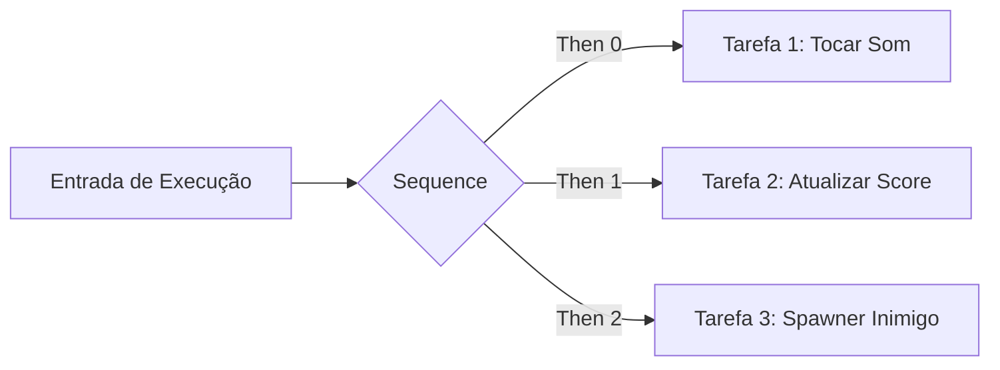
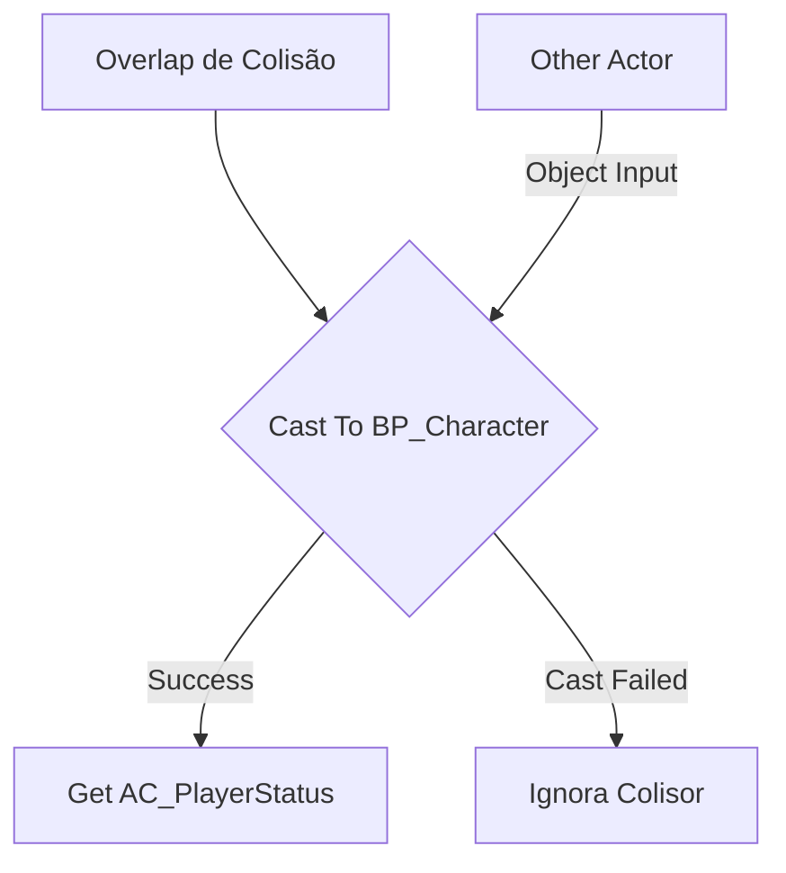

# 🎓 Glossário: Nós Comuns de Blueprints Explicados

**[Compatibilidade: UE 4.20 a UE 5.4+]**  
**[Origem: CUSTOMIZADO]**

Os Blueprints utilizam uma linguagem de script visual baseada em nós. Cada nó representa um bloco de código C++ envelopado de forma visual. Para dominar a criação de lógicas na Unreal Engine, é fundamental entender o fluxo de execução (controlado pelos pinos brancos de formato pentagonal) e o fluxo de dados (controlado pelos pinos coloridos redondos).

Este glossário explica detalhadamente os nós lógicos mais comuns encontrados nos grafeos do projeto.

---

## 🎯 Caso Prático: Otimizando Lógicas Complexas sem Perder Legibilidade

> *Você está criando um sistema que precisa abrir uma porta, acender uma luz e emitir um som de alerta ao mesmo tempo. Se você enfileirar todas essas tarefas de forma linear em uma única linha de código, o grafo ficará gigante e difícil de ler. Além disso, se o som falhar, a porta pode não abrir. Como organizar a execução de múltiplas ações independentes e controlar fluxos condicionais de forma limpa no Blueprint?*

---

## ⚙️ 1. Tabela de Nós e Equivalências de Programação

Abaixo está o mapeamento dos nós lógicos mais importantes da Unreal Engine e sua correspondência com linguagens tradicionais baseadas em texto:

| Nome do Nó | Equivalente em Código | Explicação Técnica do Fluxo | Exemplo Prático |
| :--- | :--- | :--- | :--- |
| **`Branch`** | `if / else` | Avalia uma entrada booleana (`True` ou `False`) e direciona o fluxo de execução de acordo. | Verificar se o jogador tem a chave antes de abrir a porta. |
| **`Sequence`** | Blocos de código consecutivos | Executa uma série de pinos de saída (`Then 0`, `Then 1`, etc.) de forma linear em um único frame. Melhora a legibilidade. | `Then 0` acende a luz; `Then 1` abre a porta; `Then 2` toca o som. |
| **`ForEachLoop`** | `for (auto Item : Array)` | Percorre todos os itens de uma lista (Array) e executa o pino `Loop Body` para cada elemento encontrado. | Aplicar dano a todos os inimigos dentro de uma área circular. |
| **`Cast To [Classe]`** | Type Casting (`dynamic_cast`) | Tenta converter um ponteiro genérico de um objeto para um tipo específico. Se falhar, segue o pino `Cast Failed`. | Verificar se o objeto que colidiu com a armadilha é o jogador (`BP_Character`). |
| **`Set Timer by Event`** | `setInterval` / Temporizador | Agenda um evento customizado para ser disparado após X segundos. Pode ser configurado para rodar em loop (`Looping`). | Regenerar 2 pontos de estamina a cada 0.5 segundos. |
| **`Clamp`** | `std::clamp` | Limita um número (Float ou Integer) para que ele nunca fique abaixo do mínimo ou acima do máximo configurado. | Impedir que a vida caia abaixo de 0 ou ultrapasse 100. |
| **`FlipFlop`** | Variável booleana alternante | Alterna a execução entre a saída `A` e a saída `B` a cada vez que o nó é ativado. | Tecla `I` abre o inventário no primeiro clique (A) e fecha no segundo (B). |
| **`Do Once`** | Flag de controle única | Permite que o fluxo de execução passe apenas uma vez. Fica bloqueado até que o pino `Reset` seja chamado. | Garantir que o diálogo de tutorial só apareça na primeira vez que entrar na área. |

---

## ⚙️ 2. Visualização Gráfica de Nós Importantes

### O Nó Sequence (Execução em Série)
O nó `Sequence` não executa em paralelo (multi-threading). Ele executa a ramificação `Then 0` inteira e, imediatamente após sua conclusão, executa a ramificação `Then 1` dentro do mesmo frame do motor.



### O Nó Cast To (Verificação e Acesso)
O casting é utilizado para acessar variáveis de outros atores. Se a entrada `Object` for do tipo correto, o nó disponibiliza a saída `As [Classe]` contendo todas as variáveis daquele ator.



---

## 🏃 Desafio Ativo: Controlando Fluxo com FlipFlop e Gate

Crie a lógica lógica de Blueprint para uma lâmpada interativa. Quando o jogador entrar na área de alcance (`Trigger`) e pressionar a tecla `F`, a luz deve ligar se estiver desligada, ou desligar se estiver ligada.

### Esqueleto de Resolução do Desafio:

1. Use os nós **On Component Begin Overlap** e **On Component End Overlap** da colisão.
2. Adicione um nó **Gate** (uma porta lógica de fluxo).
3. Conecte o Begin Overlap no pino **Open** (abrir) do Gate e o End Overlap no pino **Close** (fechar) do Gate.
4. Conecte a Tecla de Input `F` no pino **Enter** (entrar) do Gate.
5. Da saída **Exit** do Gate, conecte a um nó **FlipFlop**.
6. Conecte a saída `A` do FlipFlop ao nó **Set Intensity** da lâmpada (Valor: 5000) e a saída `B` ao mesmo nó (Valor: 0).

```
[Overlap Begin] ──> Open  ┐
[Overlap End]   ──> Close ┼──> [Gate] ──> [FlipFlop] ──(A)──> [Luz: 5000]
[Tecla F]       ──> Enter ┘                          └──(B)──> [Luz: 0]
```

---

## ❓ Perguntas que este documento responde

- O que é e para que serve o nó `Branch` em Blueprints?
- Como funciona o nó `Sequence` e de que forma ele ajuda na organização do código?
- Qual a finalidade do nó `Cast To` e como utilizá-lo de forma segura sem quebras?
- Como funcionam temporizadores baseados em eventos (`Set Timer by Event`) na Unreal Engine?
