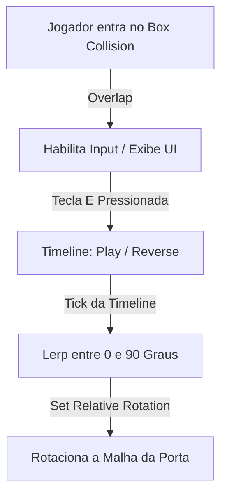
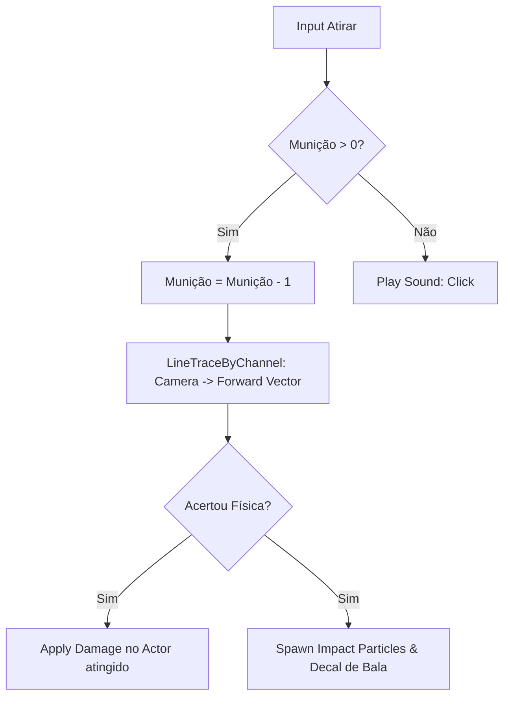
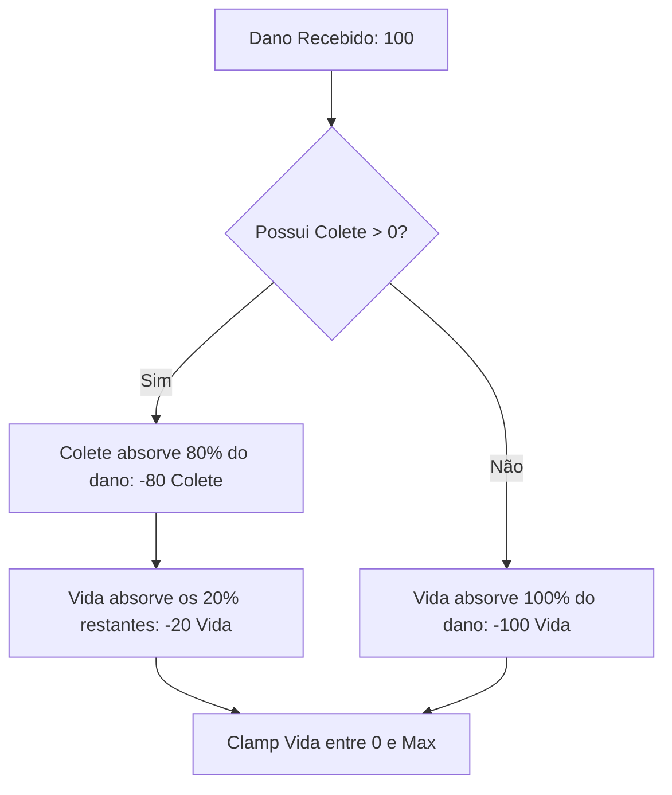

# 🎮 Guia Prático de Implementação: Portas, Armas, Combate e Status na Unreal Engine 5

**[Compatibilidade: Unreal Engine 5.0 - 5.5+]**  
**[Origem: CUSTOMIZADO / GUIA PEDAGÓGICO]**

Este manual prático foi desenvolvido para responder de forma definitiva sobre **como criar, configurar e inserir na cena** mecânicas cruciais de jogo do zero. Ele serve como um roteiro prático passo a passo para que qualquer estudante ou desenvolvedor consiga replicar e implementar sistemas funcionais de portas, armas, disparo, mira, recarga e distribuição de dano com colete.

---

# 🚪 MÓDULO 1: Criando uma Porta Interativa do Zero

Este módulo ensina como criar uma porta giratória física que se abre suavemente quando o jogador entra em uma área de colisão (Trigger Box) e pressiona uma tecla de interação ou passa por ela.



### Passo 1: Criando o Blueprint Actor da Porta
1. No painel **Content Browser**, clique com o botão direito e selecione **Blueprint Class**.
2. Escolha **Actor** como classe pai. Nomeie o arquivo como `BP_Door_Interactive`.
3. Dê um duplo clique para abrir a janela de edição do Blueprint.

### Passo 2: Configurando os Componentes (Hierarquia)
Na aba **Components** (canto superior esquerdo), monte a seguinte árvore estrutural:
1. **`DefaultSceneRoot`** (Raiz padrão do ator).
2. Clique em **+ Add** e adicione um **Static Mesh** para o batente da porta. Renomeie para `FrameMesh`.
3. Clique em **FrameMesh**, adicione um novo **Static Mesh** como filho. Renomeie para `DoorMesh`.
   > [!IMPORTANT]
   > **Ajuste do Ponto de Articulação (Pivot Point):** Certifique-se de que a malha da porta (`DoorMesh`) tenha sua origem localizada em uma das suas extremidades laterais (e não no centro). Se o pivô estiver no centro, a porta girará no próprio eixo como uma porta giratória de banco.
4. Selecione `FrameMesh` e adicione um componente **Box Collision**. Renomeie para `InteractionTrigger`.
5. No painel de detalhes (canto direito), aumente as dimensões de `InteractionTrigger` (ex: `Box Extent`: X: 150, Y: 150, Z: 100) para cobrir uma área confortável de aproximação.

---

### Passo 3: Criando a Lógica de Rotação Suave (Event Graph)
Abra a aba **Event Graph** para programar o comportamento físico:

#### A) Detectando a Entrada do Jogador (Overlap)
1. Selecione o componente `InteractionTrigger`.
2. No painel Details, desça até os eventos e clique no botão verde `+` ao lado de **On Component Begin Overlap** e **On Component End Overlap**.
3. No gráfico de eventos, arraste o pino de execução de **On Component Begin Overlap** e crie um nó **Enable Input**. Obtenha a referência do controlador conectando um nó **Get Player Controller** ao pino `Player Controller`.
4. Faça o equivalente para **On Component End Overlap**, conectando a um nó **Disable Input**.

```
[On Component Begin Overlap] ──> [Enable Input] (Player Controller: Get Player Controller)
[On Component End Overlap]   ──> [Disable Input] (Player Controller: Get Player Controller)
```

#### B) Configurando a Tecla de Interação e a Timeline
1. Adicione um evento de entrada de teclado clicando com o botão direito e pesquisando por **Keyboard Event E**.
2. A partir do pino **Pressed**, clique com o botão direito e digite **Add Timeline...** no final da lista. Dê o nome de `DoorTimeline` para o nó criado.
3. Dê um duplo clique no nó `DoorTimeline` para abrir o editor de curvas.
4. Clique em **+ Track** e escolha **Add Float Track**. Renomeie a curva interna para `Alpha`.
5. Configure a duração total (`Length`) para `1.0` segundo.
6. Clique com o botão direito na linha do tempo para adicionar dois pontos (Keys):
   *   **Ponto 1:** Time: `0.0`, Value: `0.0`.
   *   **Ponto 2:** Time: `1.0`, Value: `1.0`. *(Clique nos pontos e selecione **Auto** para suavizar a curva de aceleração).*
7. Retorne ao **Event Graph**.

#### C) Interpolando a Rotação (Lerp & Set Relative Rotation)
1. Arraste um pino de execução de **Pressed** do evento de teclado **E** e conecte-o a um nó **Flip Flop** (isso alternará entre abrir e fechar a cada clique).
2. Conecte o pino **A** do Flip Flop na entrada **Play** da Timeline, e o pino **B** na entrada **Reverse**.
3. Arraste a partir da saída **Update** da Timeline e adicione o nó **Set Relative Rotation** (Target: `DoorMesh`).
4. Arraste o pino de rotação azul `New Rotation` de *Set Relative Rotation* e selecione **Split Struct Pin** para expor individualmente os eixos Roll (X), Pitch (Y) e Yaw (Z).
5. Clique com o botão direito e adicione um nó **Lerp (Float)**.
6. Conecte o pino `Alpha` da Timeline à entrada `Alpha` do Lerp.
7. Defina a entrada **A** (porta fechada) como `0.0` e a entrada **B** (porta aberta) como `90.0` (ou `-90.0` dependendo do lado de abertura desejado).
8. Conecte a saída do Lerp (pino de retorno) no canal **Yaw (Z)** de rotação exposto no nó *Set Relative Rotation*.

```
                ┌──────────────┐
                │ DoorTimeline │
[Flip Flop] ──> │ Play/Reverse │
                │   Update     │ ──> [Set Relative Rotation (DoorMesh)]
                │   Alpha      │ ──> [Lerp Float (A: 0.0, B: 90.0)] ──> Yaw (Z)
                └──────────────┘
```

### Passo 4: Inserindo a Porta no Cenário
1. Salve e compile o Blueprint.
2. Arraste o `BP_Door_Interactive` de dentro do seu Content Browser direto para o seu mapa (Level).
3. Posicione-o no batente de uma parede. 
4. Clique no botão **Play** do Editor, ande até a porta e pressione a tecla **E** para vê-la abrir e fechar fisicamente de forma suave.

---

# 🔫 MÓDULO 2: Sistema de Armas, Disparo (Line Trace), Mira e Recarga

Este módulo orienta sobre como criar um sistema completo de armamento que permite ao personagem segurar uma arma física anexada à mão, mirar (aproximando a câmera), atirar calculando projéteis e impacto no cenário através de traçado de linha, e recarregar respeitando as restrições de munição.



## Seção A: Spawn e Encaixe da Arma (Sockets)
Para fazer a arma aparecer nas mãos do jogador:
1. Abra o Skeleton do seu personagem no editor de animações.
2. Localize o osso da mão direita (`hand_r`), clique com o botão direito e selecione **Add Socket**. Renomeie-o para `WeaponSocket`.
3. No Blueprint do seu personagem (`BP_Character`), adicione a lógica no **Event BeginPlay**:
   *   Use o nó **SpawnActorFromClass** (Selecione a classe `BP_WeaponBase`).
   *   Arraste o retorno dele e salve-o em uma variável chamada `ArmaEquipada`.
   *   Adicione o nó **AttachActorToComponent**:
       *   **Target:** Conecte o pino `ArmaEquipada`.
       *   **Parent:** Conecte a malha do personagem (`Mesh`).
       *   **In Socket Name:** Digite exatamente `WeaponSocket`.
       *   **Location/Rotation Rule:** Defina como `Snap to Target`.
       *   **Scale Rule:** Defina como `Keep World`.

---

## Seção B: Mecânica de Tiro Prático (Line Trace)
O disparo com armas instantâneas (Hitscan) calcula o trajeto do projétil na velocidade da luz usando Line Trace:

1. No Blueprint da arma (`BP_WeaponBase`), crie um evento de disparo (ex: Interface Event `Atirar`).
2. Adicione um **Branch** para verificar se `Munição Atual > 0`. Se for falso, toque um som de "Click" (Dry Fire).
3. Se verdadeiro, subtraia `1` de `Munição Atual`.
4. Adicione o nó **LineTraceByChannel**:
   *   **Start (Início):** Obtenha a câmera do jogador. Use **Get World Location** da câmera do personagem e conecte no pino *Start*.
   *   **End (Fim):** Obtenha o vetor para onde a câmera está apontando usando **Get Actor Forward Vector** (ou Get World Rotation e depois Get Forward Vector) a partir da câmera.
   *   Adicione o nó de multiplicação **Multiply (Float)** e multiplique o vetor frontal por um valor alto (ex: `5000.0` metros / alcance da bala).
   *   Adicione o nó **Add (Vector)** para somar o resultado da multiplicação à posição *Start*. Conecte a saída final no pino **End**.
   *   **Draw Debug Type:** Configure como `For Duration` temporariamente para poder enxergar a trajetória física da bala no editor.

```
[Camera Location] ───────────────────────────────────────────> [ + ] ──> Start (LineTrace)
[Camera Forward Vector] ──> [ * ] (Float: 5000.0) ──────────> [   ] ──> End (LineTrace)
```

5. Processe o Impacto:
   *   Arraste a partir do pino de retorno **Out Hit** do Line Trace e crie um nó **Break Hit Result** (isso abrirá as propriedades do local do impacto).
   *   Use o nó **Apply Damage**:
       *   **Damaged Actor:** Conecte o pino `Hit Actor` do *Break Hit Result*.
       *   **Base Damage:** Conecte a variável `Dano` da arma.
       *   **Damage Causer:** Conecte a referência `Self`.
   *   Use o nó **Spawn Emitter at Location** conectando no pino `Impact Point` para criar poeira, sangue ou faíscas no local exato do impacto da bala.

---

## Seção C: Mecânica de Mira Suave (Aim Down Sights - ADS)
A mecânica de mirar altera o campo de visão (Field of View - FOV) da câmera e centraliza a arma.

1. No `BP_Character`, crie um evento para o botão direito do mouse (**Right Mouse Button**).
2. Adicione um nó **Timeline** chamado `AimTimeline`. Duração: `0.2` segundos. Crie um Float Track chamado `FOVAlpha` que vai de `0.0` (tempo 0.0) até `1.0` (tempo 0.2).
3. Conecte o pino de execução **Pressed** do clique no **Play** da Timeline, e **Released** no **Reverse**.
4. A partir de **Update** da Timeline, adicione o nó **Set Field Of View** (Target: `CameraComponent`).
5. Crie um nó **Lerp (Float)**:
   *   Conecte `FOVAlpha` no pino `Alpha` do Lerp.
   *   Defina a entrada **A** (FOV padrão) como `90.0`.
   *   Defina a entrada **B** (mira ativa) como `60.0` (efeito de zoom).
   *   Conecte a saída do Lerp na entrada `In Field Of View` do nó de ajuste da câmera.

```
[Aim Click Pressed]  ──> [Play] ──> [AimTimeline] ──> Update ──> [Set Field of View]
[Aim Click Released] ──> [Reverse]      │ (Alpha)
                                        ▼
                                  [Lerp (A: 90, B: 60)] ──> In Field of View
```

---

## Seção D: Sistema de Recarga (Reload)
A recarga repõe a munição respeitando o limite do cartucho e a munição reserva global:

1. No `BP_WeaponBase`, crie o evento `Recarregar` (ativado por exemplo pela tecla **R**).
2. Verifique via **Branch** se `Munição Atual < Capacidade Pente` E se `Munição Reserva > 0`.
3. Se sim, calcule a quantidade necessária para completar o pente:
   *   `Necessário = Capacidade Pente - Munição Atual`.
4. Determine a quantidade real a ser inserida (caso a munição reserva seja menor do que a necessária):
   *   Use o nó **Min (Integer)** comparando `Necessário` e `Munição Reserva`. Salve a saída menor como `Inserir`.
5. Execute a matemática de reabastecimento:
   *   `Set Munição Atual = Munição Atual + Inserir`.
   *   `Set Munição Reserva = Munição Reserva - Inserir`.

```
[Quantidade Necessária: Capacidade - Atual] ──┐
                                              ├──> [Min (Integer)] ──> Quantidade Real a Inserir
[Munição Reserva Disponível] ─────────────────┘
```

---

# 🛡️ MÓDULO 3: Distribuição de Dano e Colete (Escudo)

Este módulo ensina a criar um sistema de saúde robusto no componente `AC_PlayerStatus`, onde o dano sofrido é reduzido primeiro pela blindagem do colete (que absorve por exemplo 80% do dano e desconta do escudo), repassando o dano restante para a vida do jogador.



### Passo 1: Declarando as Variáveis de Status
No componente `AC_PlayerStatus`, crie as seguintes variáveis numéricas do tipo **Float**:
*   `Vida` (Padrão: 100.0) e `VidaMaxima` (Padrão: 100.0)
*   `Colete` (Padrão: 100.0) e `ColeteMaximo` (Padrão: 100.0)

### Passo 2: Implementando o Cálculo de Dano com Absorção
1. Crie um Custom Event chamado `CalcularDanoComBlindagem` que receba um input do tipo Float chamado `DanoEntrada`.
2. Adicione um **Branch** com a condição: `Colete > 0.0`.

#### Lógica A (Se houver colete ativo):
1. O colete absorverá 80% do dano de entrada:
   *   Crie um nó de multiplicação e calcule: `DanoNoColete = DanoEntrada * 0.8`.
2. A vida receberá os 20% restantes do dano:
   *   Calcule: `DanoNaVida = DanoEntrada * 0.2`.
3. Verifique se o dano calculado para o colete é maior do que a blindagem restante no colete (se sim, o colete será quebrado e o excesso de dano será repassado para a vida):
   *   Adicione um **Branch** com a condição: `DanoNoColete > Colete`.
   *   **Se for maior (True):**
       *   Calcule o excesso: `Excesso = DanoNoColete - Colete`.
       *   `Set Colete = 0.0` (Zera o colete).
       *   `Set Vida = Vida - (DanoNaVida + Excesso)`.
   *   **Se for menor/igual (False):**
       *   `Set Colete = Colete - DanoNoColete`.
       *   `Set Vida = Vida - DanoNaVida`.

#### Lógica B (Se NÃO houver colete ativo):
1. O dano vai direto e de forma integral para a saúde:
   *   `Set Vida = Vida - DanoEntrada`.

---

### Passo 3: Garantindo Valores Limpos (Nó Clamp)
Toda vez que a variável `Vida` ou `Colete` for alterada, é obrigatório restringir os valores máximos e mínimos para evitar comportamentos bizarros (como o HUD quebrar exibindo vida negativa ou ultrapassando o tamanho da tela).
1. Logo após definir a variável `Vida`, insira o nó **Clamp (Float)**.
2. Conecte o resultado da nova vida no pino **Value** do Clamp.
3. Configure o valor **Min** para `0.0` e o valor **Max** para a variável `VidaMaxima`.
4. Conecte a saída do Clamp na entrada da variável `Vida`. Realize o mesmo processo para o `Colete`.

```
[Cálculo de Nova Vida] ──> [Clamp (Float)] (Min: 0.0, Max: VidaMaxima) ──> Set Vida
```

---

# 📖 MÓDULO 4: Glossário Prático de Nós Utilizados

Aqui são detalhados os nós da Unreal Engine envolvidos nestes sistemas, explicando de forma clara o que cada um executa e por que foi escolhido para a mecânica:

1.  **`Timeline`**: Funciona como um motor de animação interno nos Blueprints. Ele dispara um sinal repetido a cada quadro (Update) com base em curvas de tempo que você desenha. É essencial para abrir portas de forma suave e transitar o FOV da câmera ao mirar.
2.  **`Lerp (Linear Interpolation)`**: Interpola linearmente entre dois valores (A e B) com base em um percentual (Alpha de 0 a 1). Se o Alpha for 0, o Lerp retorna o valor A; se for 1, retorna o valor B. É usado junto com a Timeline para calcular a rotação exata da porta a cada milissegundo de animação.
3.  **`LineTraceByChannel`**: Realiza uma linha de teste físico no mundo tridimensional, partindo de uma coordenada A até uma coordenada B. Se a linha atingir colisores físicos, ela retorna informações detalhadas (ponto exato do impacto, ator atingido, vetor normal). É o nó mestre para mecânicas de tiro, mira laser e scanners de cenário.
4.  **`Clamp (Float)`**: Garante que um valor numérico flutuante fique estritamente contido dentro do intervalo configurado. Se o valor cair abaixo do mínimo, ele assume o valor mínimo; se subir acima do máximo, assume o valor máximo. Evita erros comuns de vida ou escudos negativos.
5.  **`AttachActorToComponent`**: Conecta de forma rígida um ator filho (como a malha da arma) a um componente pai (como a malha esquelética do personagem), fixando-se de forma dinâmica a um ponto específico (Socket) do esqueleto.

---

## 🏃 Desafios Ativos de Extensão

Para treinar o conhecimento prático contido nesta apostila, tente implementar as extensões abaixo:

1.  **Dano por Queda Progressivo:** No evento `OnLanded` do `BP_Character`, verifique a velocidade no eixo Z no momento do impacto. Se a velocidade de queda ultrapassar um limite seguro, calcule o dano proporcionalmente usando o nó `Map Range Clamped` e aplique no seu componente de status.
2.  **Destruição Física da Porta:** Utilize o evento `ReceiveAnyDamage` do `BP_Door_Interactive`. Se o dano recebido zerar uma variável de durabilidade interna da porta, execute o nó `Destroy Actor` e spawne uma malha quebrada (Destructible Mesh) no mesmo local.

---

## ❓ Perguntas que este documento responde

*   Como configurar a hierarquia de componentes e ajustar o ponto de pivô para construir uma porta funcional em Blueprints?
*   De que forma criar caminhos de interpolação suave usando os nós `Timeline` e `Lerp` aplicados a transformações espaciais?
*   Quais são as etapas matemáticas e nós necessários para simular trajetórias de balas instantâneas via `LineTraceByChannel`?
*   Como criar e vincular armas às mãos de um personagem em execução usando esferas ou encaixes virtuais (`Sockets`)?
*   Qual o algoritmo de cálculo para blindagens e coletes absorverem danos de forma percentual preservando a saúde do personagem?
