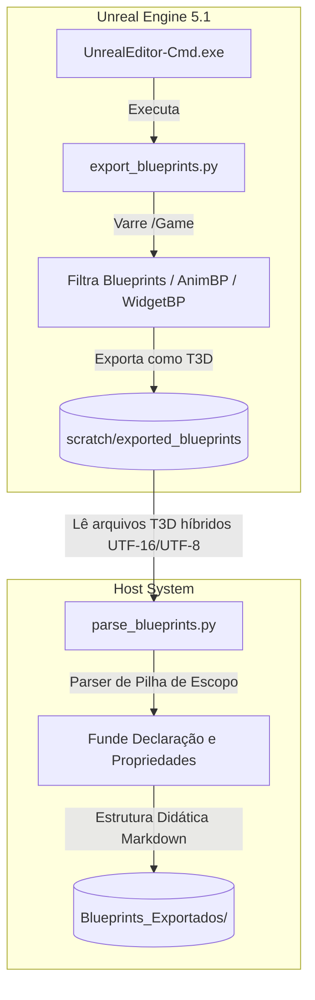

# Relatório de Exportação e Estruturação de Blueprints

Este documento detalha o processo, os scripts e as resoluções técnicas aplicadas para exportar toda a estrutura lógica do projeto Unreal Engine (GTA / Pirata Perdido) e convertê-la em uma base de documentação Markdown estruturada, ideal para fins de estudo e indexação semântica (RAG).

---

## 🎯 Objetivo do Pipeline

O objetivo principal é extrair as regras de negócio, variáveis, eventos e chamadas de métodos de todos os Blueprints, Animation Blueprints e Widget Blueprints contidos no projeto Unreal Engine 5.1 (`C:\Users\hijon\Documents\UnrealEngine\PROJETO-GTA-29-10-2025\ProjetoGTA\ProjetoGTA`), organizando-os na mesma estrutura de diretórios do projeto original no diretório:
`CRIADO-AVA-CLI/unreal_engine_docs/Blueprints_Exportados/`

---

## 🛠️ Arquitetura do Pipeline

O pipeline é dividido em duas etapas fundamentais executadas em ambientes separados:



---

## 📄 Scripts Utilizados

### 1. Script de Exportação (`export_blueprints.py`)
*   **Caminho:** [export_blueprints.py](file:///C:/Users/hijon/Downloads/ava-assistant-30-03-26/ava-assistant-v3-main/scratch/export_blueprints.py)
*   **Função:** Inicia uma instância silenciosa (headless) da Unreal Engine através de um commandlet, executa uma varredura pelo `AssetRegistry` buscando objetos do tipo `Blueprint`, `AnimBlueprint` e `WidgetBlueprint` sob a pasta `/Game` e realiza a exportação em massa no formato de texto ASCII/T3D.
*   **Principais Desafios & Soluções:**
    *   *Remoção do Exporter Fixo:* A classe `BlueprintExporterT3D` não está exposta diretamente no módulo Python da Unreal. Deixando o campo `task.exporter` vazio, o motor escolhe automaticamente o exportador T3D correto por padrão.
    *   *Atributo Inexistente:* O atributo `task.replace_existing` causava quebras por não existir na classe `AssetExportTask` na versão 5.1. A sua remoção sanou a exceção e manteve a substituição nativa automática ativa.

### 2. Script de Processamento e Parsing (`parse_blueprints.py`)
*   **Caminho:** [parse_blueprints.py](file:///C:/Users/hijon/Downloads/ava-assistant-30-03-26/ava-assistant-v3-main/scratch/parse_blueprints.py)
*   **Função:** Varre os arquivos `.t3d` exportados, extrai as informações críticas de arquitetura e escreve os arquivos de documentação Markdown.
*   **Principais Desafios & Soluções:**
    *   *Codificação Híbrida (UTF-16LE / UTF-8):* O Unreal Engine exporta Blueprints complexos ou com caracteres acentuados utilizando codificação UTF-16 Little Endian com BOM, enquanto outros saem em UTF-8. A leitura inicial forçada em UTF-8 removia bytes importantes (nulos), fazendo com que as buscas por regex falhassem. Adicionamos um bloco `try-except` para tentar decodificar como UTF-16 primeiro, com fallback automático para UTF-8.
    *   *Nós e Propriedades Desacoplados:* No formato T3D, o Unreal primeiro declara todos os nós sob o grafo (`Begin Object Class=... Name="..."`) e só depois, no fim do arquivo, define suas propriedades (`Begin Object Name="..."`). Desenvolvemos um parser baseado em pilha de escopo (`stack`), mantendo o rastreamento de qual grafo e nó de destino as propriedades lidas pertencem, unificando a declaração de classe e propriedades perfeitamente.

---

## 📂 Estrutura e Formato dos Documentos Gerados

A documentação gerada sob a pasta [Blueprints_Exportados](file:///C:/Users/hijon/Downloads/ava-assistant-30-03-26/ava-assistant-v3-main/CRIADO-AVA-CLI/unreal_engine_docs/Blueprints_Exportados) preserva fielmente o caminho original dos ativos no projeto (como `/AdvancedLocomotionV4/Blueprints/` ou `/Blueprints/Character/`). Cada arquivo `.md` contém:

1.  **Cabeçalho da Classe:** Nome e identificação da Classe Pai / Herança (ex: `Character`, `ActorComponent`, `AnimInstance`).
2.  **Variáveis Declaradas:** Uma tabela contendo todos os nomes de variáveis e tipos de dados resolvidos (como booleanos, reais, classes de objetos e estruturas).
3.  **Grafos de Eventos e Lógica:**
    *   Títulos e caixas de comentários originais inseridos pelo desenvolvedor nos grafos (útil para contextualizar a lógica).
    *   Eventos de entrada (`ReceiveBeginPlay`, inputs, eventos customizados).
    *   Lista consolidada de todas as funções e métodos chamados naquele grafo (ex: `SpawnEmitterAtLocation`, `StartCameraShake`, `FClamp`).
    *   Variáveis que sofreram leitura (`Get`) ou gravação (`Set`).
    *   Totalizador de nós de tomada de decisão (`Branch / If`).
4.  **Indexação RAG:** Uma seção de perguntas que o documento responde para auxiliar mecanismos semânticos de busca a recuperar a finalidade e lógica do Blueprint com alta precisão.

---

## 🚀 Como Executar Novamente o Pipeline

Caso ocorram alterações de lógica ou novos Blueprints sejam criados no projeto, você poderá executar o pipeline seguindo os passos abaixo:

### Passo 1: Executar a Exportação no Unreal Engine
Abra o terminal (PowerShell) no diretório do seu assistente e execute o commandlet da Unreal Engine:
```powershell
& "C:\Program Files\Epic Games\UE_5.1\Engine\Binaries\Win64\UnrealEditor-Cmd.exe" "C:\Users\hijon\Documents\UnrealEngine\PROJETO-GTA-29-10-2025\ProjetoGTA\ProjetoGTA\ProjetoGTA.uproject" -run=pythonscript -script="C:\Users\hijon\Downloads\ava-assistant-30-03-26\ava-assistant-v3-main\scratch\export_blueprints.py" -stdout -silent -noce -nosound -norender
```
*Esse script gerará ou atualizará todos os arquivos `.t3d` na pasta `scratch/exported_blueprints`.*

### Passo 2: Executar o Parser Python
No mesmo terminal, execute o parser para regerar os arquivos Markdown:
```powershell
python scratch\parse_blueprints.py
```
*Este comando lerá os arquivos exportados e atualizará a pasta de documentação estruturada `CRIADO-AVA-CLI/unreal_engine_docs/Blueprints_Exportados/`.*
