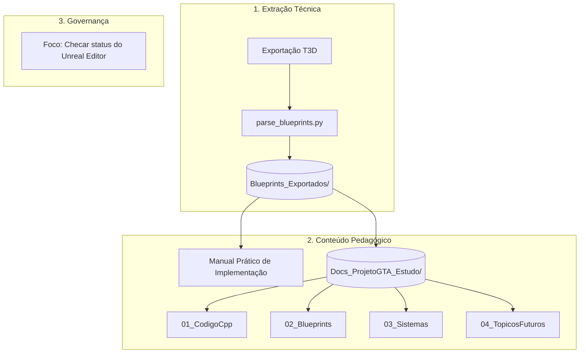

# 📝 Resumo de Progresso e Continuidade: Projeto GTA / Pirata Perdido

**[Data da Sessão Atual: 24 de Junho de 2026]**  
**[Status do Editor: Ativo/Verificado (M4A1 e Beretta atualizados)]**  
**[Destino da Base de Estudo:]** [Docs_ProjetoGTA_Estudo](file:///C:/Users/hijon/Downloads/ava-assistant-30-03-26/ava-assistant-v3-main/CRIADO-AVA-CLI/unreal_engine_docs/Docs_ProjetoGTA_Estudo)

---

## 🎯 Visão Geral do Que Foi Realizado

### 📅 Sessão: 24 de Junho de 2026 (Atual)
Nesta sessão, focamos na infraestrutura do AVA CLI: atualização do RAG, correção do bug de foco de conversa e integração em tempo real com o Unreal Engine 5:
1. **Indexação RAG Completa (331 arquivos):** Toda a pasta `CRIADO-AVA-CLI/` foi sincronizada para o `Drive_Sync/` e indexada com embeddings pelo `nomic-embed-text`. O AVA agora tem conhecimento vetorial de toda a documentação do ProjetoGTA: Blueprints exportados, guias pedagógicos, cursos de C++ UE5 e histórico de sessões. Resultado: **Processados: 331 | Ignorados: 0 | Falhas: 0**.
2. **Correção do Bug de Foco de Conversa (`routers.ts`):** O AVA misturava tópicos de conversas diferentes porque o `historyWindow` não detectava mudanças de assunto. Adicionamos a função `detectTopicShift()` que compara palavras-chave da mensagem atual com as últimas 6 mensagens do histórico. Se não houver sobreposição semântica (nenhuma palavra em comum), o histórico é zerado automaticamente, evitando contaminação de contexto. Ex: falar de "arma do jogo" → "tomar água" → "arma do jogo" agora funciona sem misturar.
3. **Script de Automação RAG (`sync-rag-criado-ava-cli.ps1`):** Criado script PowerShell que automatiza toda a pipeline de sync+index sem intervenção manual:
   * Sincronização incremental por **hash SHA256** (só copia arquivos novos/modificados)
   * Verificação e inicialização automática do Ollama
   * Execução do `pnpm rag:index`
   * Parâmetro `-Restart` para reiniciar o servidor AVA após indexação
   * **Uso:** `powershell -ExecutionPolicy Bypass -File sync-rag-criado-ava-cli.ps1`
4. **Aumento do Timeout de Embedding (`.env`):** `EMBEDDING_TIMEOUT_MS` foi de `15000` para `45000` ms para eliminar o "Fallback determinístico" nos arquivos grandes de Blueprint (ex: `AC_WeaponSystem-2.md` com 204 chunks).
5. **Integração Direta com Unreal Engine 5 (Tool `unreal_ops`):** Criamos e habilitamos a tool `unreal_ops` no motor do AVA, permitindo que o agente se comunique com o Unreal Editor via Remote Control API na porta 30010. O agente agora pode inspecionar Blueprints/actors, rodar scripts Python e comandos de console, capturar viewport e compilar Blueprints diretamente em tempo real. Adicionamos a documentação de referência `unreal_ops_integration.md` no RAG e testes automatizados unitários em `tests/unreal-ops.test.ts` (todos aprovados). *[Correções e Melhorias Concluídas]: (a) Ajustamos o filtro de regex em `agents.ts` para que consultas sobre "unreal", "ue5" e "conexão" ativem `unreal_ops` em vez de desviar para `blender_ue5_ops`. (b) Configuramos os plugins de Remote Control e porta 30010 diretamente no projeto ativo em execução no editor (`ProjetoGTA.uproject` e `DefaultEngine.ini`). (c) Desenvolvemos um mecanismo de RAG Context-Aware Boosting no `retriever-patch.ts` que identifica qual projeto está aberto no Unreal Editor e prioriza dinamicamente as informações corretas (boost de +0.30 nos scores do GTA se o GTA estiver ativo, e boost nos do Pirata se o Pirata estiver ativo), eliminando a confusão de contexto e misturas entre os dois projetos. (d) Corrigimos a confusão do RAG quando o usuário faz perguntas de um projeto enquanto o outro está aberto no editor (ex: perguntar de AK-47 do Pirata com o editor do GTA aberto): implementamos a detecção primária de intenção por palavras-chave diretamente na consulta (ex: termos como "m4a1", "ak47", "gta"), que sobrepõe a detecção do editor aberto. Também mapeamos os arquivos da pasta `blueprints_exportados` como pertencentes ao GTA para fins de boosting. (e) Registramos nativamente o `unreal_ops` no AVA CLI (`cli/index.ts`), inserindo-o na lista de ferramentas suportadas e no bloco switch de execução. (f) Testamos a conexão com o editor e validamos o funcionamento completo via CLI com sucesso, reportando o status online.*


### 📅 Sessão: 23 de Junho de 2026
Nesta sessão, focamos no diagnóstico da AK-47, sockets de armas sem ossos dedicados e design de mecânicas de combate futuras:
1. **Diagnóstico da AK-47 Presa na Mão (Details / WeaponID):** Identificamos que quando armas são colocadas manualmente no cenário (ex: `BP_WeaponBase_C_6`), elas precisam ter a variável `WeaponStored -> WeaponID` configurada como `"AK47"` no painel *Details*. Caso contrário, ao iniciar o jogo, o script de construção falha, o mesh da arma fica vazio, a munição zera e a arma gruda na mão do jogador sem poder ser descartada ou recarregada.
2. **Criação de Sockets Sem Bones Dedicados (Muzzle na Beretta):** Documentamos e auxiliamos o usuário na criação do socket `"Muzzle"` na pistola `Beretta`, adicionando o socket diretamente sob o osso `"base"` e transladando-o até a saída física do cano, com o eixo X positivo (seta vermelha) orientado para frente.
3. **Renomeação Segura de Asset (SK_AR4 para SK_M4A1):** Orientamos a renomeação segura de `SK_AR4` para `SK_M4A1` diretamente no Content Browser do Unreal Editor para resolver a incoerência com a DataTable `WeaponList` e instruímos sobre o uso de "Fix Up Redirectors".
4. **Matriz de Decisão do AutoReload:** Analisamos a convenção de design para a variável `AutoReload`, estabelecendo que fuzis automáticos (AK-47, MP5) devem mantê-la ativa, enquanto shotguns, snipers e lança-granadas devem desativá-la para evitar loops indesejados de recarga.
5. **Planejamento Técnico de Mecânicas Futuras:** Criamos e estruturamos os guias didáticos para:
   * **Combate Corpo a Corpo (Melee):** Combos de espada, seções de montagem e line traces de colisão.
   * **Stealth (Takedowns):** Verificação de ângulo entre jogador e inimigo por Dot Product vetorial.
   * **Facas de Arremesso:** Mecânica de projétil com física ativa e fixação no alvo.
   * **Explosivos:** Granadas físicas, força de impulso radial e line trace de visibilidade de dano.

### 📅 Sessão: 22 de Junho de 2026
Nesta sessão, corrigimos falhas operacionais críticas do sistema de armas no Unreal Editor:
1. **Configuração de Input de Recarga:** Mapeamos a tecla `R` via Enhanced Input (`IA_Reload`) e a conectamos ao componente `AC_WeaponSystem` no Event Graph do jogador.
2. **Correção do Holster Bug (Arma presa nas costas):** Corrigimos o anexo incorreto do pente (`Magazine`) no custom event `AttachInHand` do Blueprint `BP_WeaponBase` para anexar o corpo principal da arma (`WeaponMesh`) e utilizar dinamicamente a variável de soquete `WeaponData -> HandSocket`.
3. **Criação do Soquete Muzzle:** Adicionamos o socket `"Muzzle"` na malha esquelética (`SK_MP5`) no visualizador 3D para sanar o erro de disparo no console.
4. **Coleta de Munição (BP_AmmoBox):** Ajustamos o tipo de overlap do coletável para buscar a ID da arma (`WeaponID`), garantindo a coleta de munição mesmo com o personagem desarmado.
5. **Correção de Colisão no Descarte de Armas (SetWeaponIsDropped):** Adicionamos uma ramificação (Branch) no custom event `SetWeaponIsDropped` do Blueprint `BP_WeaponBase` para desativar a colisão de pickup instantaneamente se a arma foi recolhida (`Dropped = False`), eliminando o bug de autodescarte ao andar ou passar perto de armas equipadas.
6. **Atualização do HUD de Munição Reserva no Pickup (AddAmmoToBP):** Modificamos a definição de `CurrentAmmoInBP` no Blueprint `BP_WeaponBase` para usar o nó `DEFINIR c/ Notificar` (Set with Notify), garantindo que a alteração da variável replique e chame automaticamente `OnRep_CurrentAmmoInBP` no Servidor/Host e nos Clientes locais sem causar erros de compilação por chamadas manuais.
7. **Correção de Travamento no Equipamento em Slots Vazios (Substituir a Arma):** Inserimos uma verificação `Is Valid` no início da função `Substituir a Arma` do componente `AC_WeaponSystem` para validar se a arma antiga no slot existe. Se for nula, o fluxo pula diretamente para a atribuição da nova arma, eliminando erros fatais de `Accessed None` e corrigindo o bug que deixava a arma grudada na mão sem atualizar o inventário.



---

## 🛠️ 1. Pipeline de Engenharia Reversa (Extração Automática)

Para não depender de análises superficiais, implementamos um pipeline para ler a lógica visual do Unreal Editor:

*   **Exportador headless (`export_blueprints.py`):** Script executado via Commandlet do Unreal Editor que varre `/Game` e exporta todos os 159 blueprints (Widgets, AnimBPs e Blueprints comuns) para o formato ASCII `.t3d` na pasta `scratch/exported_blueprints`.
*   **Parser de Escopo Híbrido (`parse_blueprints.py`):** Resolve problemas de codificação híbrida (UTF-8 e UTF-16LE com BOM) e reconstrói as conexões lógicas dos grafos, correlacionando os nós com suas propriedades de dados (que ficam espalhadas pelo arquivo `.t3d`).
*   **Destino Limpo:** Toda a estrutura lógica convertida está em [Blueprints_Exportados](file:///C:/Users/hijon/Downloads/ava-assistant-30-03-26/ava-assistant-v3-main/CRIADO-AVA-CLI/unreal_engine_docs/Blueprints_Exportados).

---

## 📚 2. Arquitetura da Base de Estudo (`Docs_ProjetoGTA_Estudo/`)

Criamos guias didáticos detalhados baseados na metodologia **Tecnologia & 3D**:
*   **`00_Indice_Geral.md`:** Mapa de navegação e resumo das classes e blueprints mapeados.
*   **`Manual_Pratico_Implementacao.md`:** Guia de implementação de portas com Timeline/Lerp, armas com Line Trace, zoom de mira, recarga e absorção de dano por colete.
*   **`Changelog_Base_Estudos.md`:** Histórico de versões e Diário de Bordo do projeto, contendo os exploits catalogados e as sugestões de correção de desvios (atualizado até a versão `v1.9.0`).
*   **`Guia_Operacional_Agente_IA.md`:** Manual de governança técnica e regras de linkagem cruzada para futuras interações de agentes IA.
*   **`Guia_Navegacao_Unreal_Editor_Iniciantes.md`:** Curso Masterclass (Zero ao Intermediário) em Unreal Engine 5. Cobre abas do editor, atalhos WASD/grafo, import/export e migração segura, criação de materiais e instâncias, física de colisões (Block vs Overlap), troca de manequins no componente Mesh, locomoção avançada (Blend Spaces/State Machines) e Inteligência Artificial com Behavior Trees.
*   **`01_CodigoCpp/`:**
    *   `PPPirateCharacter.md`: Análise de setup de Enhanced Input (IMC, IA) e movimento físico 3D.
    *   `PPGameMode.md`: Inicialização do jogo e configuração do Pawn padrão.
*   **`02_Blueprints/`:**
    *   `Blueprints-AC_PlayerStatus.md`: Detalhamento de saúde, absorção do colete, dano de queda escalado e estamina.
    *   `Blueprints-PC_ProjetoGTA.md`: Gerenciamento do ciclo de vida da HUD e controle de visibilidade otimizado com nós `Select` (evitando branches excessivos).
    *   `Blueprints-ProjetoGameInstance.md`: Loop matemático de ciclo dia/noite (Real vs Jogo), conversão decimal e sincronização do céu (`BP_GoodSky`).
    *   `BP_WeaponBase.md` e `BP_Character.md`: Organização do arsenal sob herança visual e comunicação genérica por Interfaces.
*   **`03_Sistemas/`:** Integração sistêmica de Vida, Armas, HUD reativo e o Menu Rotativo Radial (cálculo `Atan2` e dilatação temporal).
*   **`04_TopicosFuturos/`:** Guias passo a passo para integração de Chaos Vehicles (Carros) e Torque Ativo (Bicicletas).
*   **`05_GlossarioBlueprint/`:** Guia prático dos nós lógicos comuns e suas equivalências de código.

---

## ⚠️ 3. Nova Diretriz de Trabalho: Monitoramento do Editor e Controle de Segurança

Definimos regras estritas de segurança para execuções e análises futuras:

> [!IMPORTANT]
> **A) Execução de Comandos com Unreal Editor Ativo:**
> *   **Gargalo:** O script `scratch/run_export_via_remote.py` requer que o Unreal Editor esteja ativo em background para se conectar via Python Remote API.
> *   **Solução:** Antes de rodar comandos do editor, eu sempre executarei um teste de processos (`tasklist` / `Get-Process`). Se o Unreal Editor estiver inativo, **eu interromperei a tarefa e alertarei você para ativá-lo**, evitando falhas de rede ou de conexões de soquete nulas.

> [!WARNING]
> **B) Controle de Arquivos Não Salvos no Editor (Prevenção de 0-Bytes):**
> *   **Gargalo:** Arquivos não salvos no Unreal Editor (falta de `Ctrl+S` ou `Save All`) resultam em exportações vazias (0 bytes) ou desatualizadas no disco (ex: `AC_WeaponSystem-4.md`).
> *   **Solução:** Antes de qualquer análise técnica, eu **vou inspecionar o tamanho dos arquivos de metadados**. Se houver algum arquivo com 0 bytes ou sem estrutura, eu alertarei você imediatamente para salvar o respectivo asset no editor antes de prosseguirmos.

> [!TIP]
> **C) Foco em Segurança e Prevenção de Exploits (O Pulo do Gato):**
> *   **Diretriz:** Durante a análise de novos grafos de Blueprints ou código C++, eu irei proativamente analisar, documentar e apontar possíveis brechas de segurança de gameplay (hacks ou exploits comuns de jogadores, tais como cancelamento de animações, loops infinitos, exploits de cadência de disparo e injeções de memória). Cada documento de estudo conterá uma seção específica para isso.

> [!CAUTION]
> **D) Detecção de Conexões Desconectadas e Erros de Compilação/Mecânica:**
> *   **Gargalo:** Conexões de execução (como o pino de execução do *Event Tick* / *Evento Tique*) ou pinos de dados desconectados/soltos nos grafos de Blueprints impedem a execução da lógica ou causam falhas de compilação e bugs na mecânica.
> *   **Solução:** Deve ser um foco crítico de atenção. Sempre que algo não estiver compilando ou uma mecânica apresentar comportamento inesperado, verificar ativamente a existência de conexões desconectadas e/ou lógica interrompida nos grafos de Blueprints, alertando sobre a necessidade de reconexão ou correção do código.

> [!IMPORTANT]
> **E) Controle de Duplicidade de Conteúdo e Rastreabilidade de Mecânicas (RAG-Ready):**
> *   **Gargalo:** Receber e processar repetidamente informações de mecânicas, blueprints ou C++ que já foram previamente analisadas pode causar redundância nos documentos e fragmentar o conhecimento no banco vetorial (RAG).
> *   **Solução:** Sempre que receber dados de mecânica ou código, eu devo verificar ativamente se o tema já foi tratado. Se sim, devo reportar onde o assunto foi localizado (ex: `C:/Users/hijon/Documents/UnrealEngine/PROJETO-GTA-29-10-2025/ProjetoGTA/ProjetoGTA/Content/Blueprints/Interaction/AC_Interaction.uasset`). Apresentarei uma análise de mudanças: se houver novidades, detalharei as alterações; se não houver, confirmarei que o conteúdo continua idêntico. Isso garante a integridade dos links de indexação e evita poluição na busca semântica da assistente.

> [!IMPORTANT]
> **F) Mesclagem de Fontes e Diretrizes de Correção de Desvios (Projeto vs. Epic vs. Teoria):**
> *   **Gargalo:** A documentação pode se tornar confusa se não diferenciar o comportamento local (que pode ter erros) das recomendações oficiais ou teóricas de desenvolvimento de jogos.
> *   **Solução:** Ao documentar e analisar as mecânicas, o conteúdo deve ser categorizado de acordo com suas origens (Projeto Real, Documentação da Epic Games ou Teoria e IA). Diante de qualquer bug, exploit ou má prática identificada na mecânica do projeto, o documento deve conter **obrigatoriamente** uma seção de **"Prática Recomendada / Correção de Desvios"** mostrando exatamente como consertar ou blindar o código no Unreal Editor para evitar exploits no gameplay.

> [!WARNING]
> **G) Alerta sobre Desvio de Convenções e Boas Práticas (Solicitude-Reversa):**
> *   **Gargalo:** Se o usuário solicitar uma alteração ou implementação que contrarie as convenções do projeto, boas práticas de engenharia de software ou diretrizes de arquitetura da Unreal Engine, o agente não deve aceitar passivamente (comportamento "yes-man").
> *   **Solução:** Eu devo ativamente analisar a solicitação, confrontá-la com as convenções e emitir um alerta técnico justificando o porquê de tal solicitação não ser adequada (ex: violação de Single Responsibility Principle, alto acoplamento, dependência circular ou caminhos absolutos locais que quebram portabilidade). Devo propor a alternativa arquiteturalmente correta antes de executar qualquer alteração de código.
> *   **Exemplo Prático Analisado:** O asset de inventário `UMG_Inventory.uasset` está localizado incorretamente em `Content/Blueprints/UMG/RadialMenu/` (com referência ao caminho absoluto de máquina `C:/Users/hijon/Documents/UnrealEngine/PROJETO-GTA-29-10-2025/ProjetoGTA/ProjetoGTA/Content/Blueprints/UMG/RadialMenu/UMG_Inventory.uasset`). Isso representa três desvios de boas práticas:
>     1. **Inversão de Hierarquia Física:** O inventário (maior escopo) fica aninhado em um subcomponente visual (radial menu, menor escopo), prejudicando a legibilidade e organização da estrutura de pastas.
>     2. **Acoplamento Forte e Ineficiente:** Sistemas que necessitam apenas da lógica visual da roda de seleção (como emotes ou armas rápidas) acabam acoplados e forçados a carregar o peso de toda a lógica complexa de slots do inventário.
>     3. **Caminhos de Máquina Hardcoded:** Referências absolutas de sistema de arquivos do sistema operacional quebram a portabilidade e a integridade de compilação/execução do projeto entre máquinas de diferentes desenvolvedores. O correto é usar o caminho de pacote relativo da Unreal (ex: `/Game/Blueprints/UMG/RadialMenu/UMG_Inventory`).

---

## 🚀 Como Retomar o Trabalho no Futuro

Quando você voltar para dar continuidade, siga este roteiro rápido de manutenção:

### A) Atualizar Lógicas de Blueprints no Markdown
Caso você faça alterações lógicas nas Blueprints dentro do Unreal Editor, você pode atualizar a documentação gerada automaticamente com dois comandos no terminal da pasta raiz:

1.  **Garanta que o Unreal Editor esteja aberto** com o projeto `ProjetoGTA` carregado.
2.  **Execute a exportação:**
    ```powershell
    & "C:\Program Files\Epic Games\UE_5.1\Engine\Binaries\Win64\UnrealEditor-Cmd.exe" "C:\Users\hijon\Documents\UnrealEngine\PROJETO-GTA-29-10-2025\ProjetoGTA\ProjetoGTA\ProjetoGTA.uproject" -run=pythonscript -script="C:\Users\hijon\Downloads\ava-assistant-30-03-26\ava-assistant-v3-main\scratch\export_blueprints.py" -stdout -silent -noce -nosound -norender
    ```
3.  **Execute o Parser para atualizar os Markdown:**
    ```powershell
    python scratch\parse_blueprints.py
    ```

### B) Próximos Passos Sugeridos
*   **Resolver os Desafios Ativos:** Cada guia didático possui um `🏃 Desafio Ativo` (ex: criar recuo de mira, tocar som de pulo, adicionar regeneração de vida). Você pode abrir o Unreal Editor e realizar essas lógicas.
*   **Indexação no RAG:** A pasta [Docs_ProjetoGTA_Estudo](file:///C:/Users/hijon/Downloads/ava-assistant-30-03-26/ava-assistant-v3-main/CRIADO-AVA-CLI/unreal_engine_docs/Docs_ProjetoGTA_Estudo) está pronta para ser sincronizada com seu script de banco de vetores (`index-drive-sync.ts`), garantindo respostas precisas no chat da assistente.
