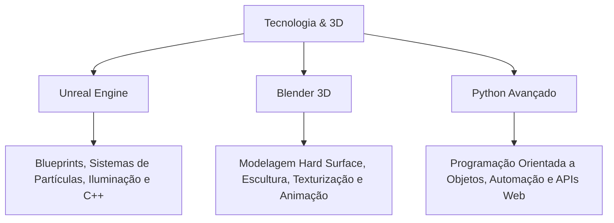

# 🚀 Módulo Tecnologia & 3D: Desenvolvimento de Jogos e Computação Gráfica

Bem-vindo ao seu ambiente avançado de aprendizado técnico! Aqui você irá dominar a criação de mundos virtuais e lógica interativa, integrando ferramentas industriais de ponta como a **Unreal Engine 5**, o **Blender** e conceitos avançados de programação em **Python**.

---

## 🧭 Trilhas de Aprendizado

Este módulo foi projetado para levar você da modelagem do primeiro objeto 3D à programação de sistemas interativos complexos em tempo real:

### 📂 Estrutura de Pastas deste Módulo:
- [**`/unreal-engine`**](file:///c:/Users/hijon/Documents/curso-python-do-zero/tecnologia-3d/unreal-engine): Criação de mecânicas de gameplay, inteligência artificial para jogos e manipulação da engine.
- [**`/blender`**](file:///c:/Users/hijon/Documents/curso-python-do-zero/tecnologia-3d/blender): Arte 3D completa. Modelagem poligonal, escultura de personagens e criação de shaders.
- [**`/python-avancado`**](file:///c:/Users/hijon/Documents/curso-python-do-zero/tecnologia-3d/python-avancado): Automação de ferramentas 3D (Blender API) e programação robusta.

---

## 🛠️ Diretriz Pedagógica Aplicada ao 3D e Games

Aprender computação gráfica e programação gráfica exige uma abordagem focada em **projetos e depuração**:

1. **Aprendizado Guiado por Projetos (Project-based)**: Cada aula constrói um ativo (um modelo 3D no Blender) ou uma mecânica (um sistema de pulo duplo na Unreal).
2. **Trace Tables de Parâmetros e Blueprints**: Loops e fluxos de Blueprints são destrinchados com tabelas mostrando o valor de cada variável (`Vector`, `Rotator`, `Boolean`) a cada frame.
3. **Instruções Sem Atalhos**: Passos de interface no Blender e na Unreal são detalhados minuciosamente para evitar que você se perca no labirinto de menus das ferramentas.

---

## 📅 Como Progredir nos Estudos

> [!NOTE]
> **Passo 1: Entenda o Pipeline**
> Antes de abrir o software, leia a documentação teórica da aula para entender a lógica por trás do que faremos (ex: como funciona a malha poligonal ou a lógica de eventos da Unreal).

> [!TIP]
> **Passo 2: Execução Prática Passo a Passo**
> Siga o guia prático fornecido (com atalhos destacados e esquemas visuais). Crie o arquivo do projeto na sua pasta local.

> [!IMPORTANT]
> **Passo 3: Desafio de Adaptação**
> Resolva o desafio proposto ao final de cada lição. Ele exigirá que você pegue a lógica aprendida (ex: abrir uma porta por aproximação) e a adapte para outro objeto (ex: acender uma luz por aproximação).

---

### 🚀 Pronto para Construir?
Abra a pasta do [**Blender**](file:///c:/Users/hijon/Documents/curso-python-do-zero/tecnologia-3d/blender) para modelar seu primeiro objeto ou a da [**Unreal Engine**](file:///c:/Users/hijon/Documents/curso-python-do-zero/tecnologia-3d/unreal-engine) para começar a dar vida aos seus projetos!

## 🛠️ Metodologias Pedagógicas Utilizadas

Neste repositório, você não realiza leituras passivas. Todos os materiais são estruturados com as seguintes técnicas de retenção de conhecimento:

> [!NOTE]
> **1. Metodologia Exemplo-Prática (Trace Tables / Rastreamento)**
> Conceitos lógicos e loops complexos contam com tabelas passo a passo demonstrando o fluxo do computador. Em matérias de humanas e direito, usamos matrizes de tomada de decisão para analisar casos fáticos.

> [!TIP]
> **2. Método MERQ (Engenharia Reversa de Questões)**
> Aplicado nas resoluções das provas da OAB, este método descontrói as questões identificando:
> - **Palavras-chave contextuais** e seus significados jurídicos.
> - **Conceitos norteadores gerais** vs. especificidades.
> - **Princípios reitores** e artigos de lei seca correspondentes.
> - A **mentalidade da banca (FGV)** e as armadilhas dos distratores.

> [!IMPORTANT]
> **3. Construção Guiada por Moldes**
> Os desafios práticos (redação, programação ou peças de petição) fornecem "folhas de rascunho" e esqueletos pré-estruturados para acelerar a escrita e blindar o raciocínio contra erros comuns.