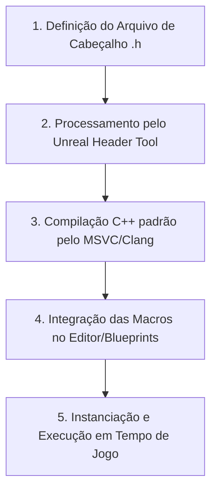

# 🎮 Módulo Unreal Engine: Teoria e Programação C++ Avançada

Bem-vindo ao centro estratégico de aprendizado de **Unreal Engine**. Este repositório foi reestruturado de acordo com a nossa diretriz pedagógica ativa de engenharia reversa e está alinhado com a documentação oficial da **Epic Games** e as melhores práticas de arquitetura de C++ da indústria de jogos. Ele funciona como uma base de conhecimento estruturada para o domínio teórico e prático da engine, abordando o ciclo de vida de objetos, gerenciamento de memória e as particularidades entre diferentes versões.

---

## 📂 Estrutura de Pastas e Tópicos do Módulo

O projeto está organizado com foco nos subsistemas internos da engine e na integração robusta entre C++ e Blueprints:
- [**`/arquitetura-core`**](file:///c:/Users/hijon/Documents/curso-python-do-zero/tecnologia-3d/unreal-engine/arquitetura-core): O coração da engine. Sistema de reflexão, Garbage Collection, Macros fundamentais e gerenciamento de memória.
- [**`/gameplay-framework`**](file:///c:/Users/hijon/Documents/curso-python-do-zero/tecnologia-3d/unreal-engine/gameplay-framework): Regras e entidades do jogo. Atores, peões, personagens, controladores e fluxo de jogo.
- [**`/physics-collision`**](file:///c:/Users/hijon/Documents/curso-python-do-zero/tecnologia-3d/unreal-engine/physics-collision): Dinâmicas físicas, detecção de colisões, varreduras (Line Traces) e canais de colisão via código.
- [**`/interface-ui`**](file:///c:/Users/hijon/Documents/curso-python-do-zero/tecnologia-3d/unreal-engine/interface-ui): Conexão entre C++ e interfaces visuais (UMG/Slate) e gerenciamento de estado de UI.

---

## 🔥 ALTA PRIORIDADE (Core da Engine e Memory Management)

Abaixo estão os pilares determinantes para dominar a programação de jogos profissionais em Unreal C++, acompanhados dos links da documentação oficial e do mapeamento dos conceitos críticos:

### 1. Sistema de Reflexão e Compilação (UHT & UBT)
*   **Documentação Oficial:** [Unreal Engine C++ Programming](https://dev.epicgames.com/documentation/pt-br/unreal-engine/epic-cplusplus-coding-standard-for-unreal-engine)
*   **Conceitos Críticos (Universais):**
    *   **Unreal Header Tool (UHT):** O gerador de código que lê arquivos de cabeçalho (`.h`) e gera metadados de reflexão.
    *   **UCLASS(), UPROPERTY(), UFUNCTION(), GENERATED_BODY():** Macros essenciais para expor o C++ ao editor e à reflexão.
*   **Especificidade de Versão:**
    *   **UE4 (Antiga):** Utilizava o sistema de *Hot Reload* (que frequentemente corrompia o estado da memória do editor ao recompilar).
    *   **UE5 (Moderna):** Utiliza o **Live Coding** (baseado em remendos binários em tempo de execução, muito mais estável). Deve ser ativado e executado diretamente com o atalho `Ctrl + Alt + F11`.

### 2. Gerenciamento de Memória e Garbage Collection (GC)
*   **Documentação Oficial:** [Unreal Engine Garbage Collection](https://dev.epicgames.com/documentation/pt-br/unreal-engine/garbage-collection-in-unreal-engine)
*   **Artigos e Regras Críticas:**
    *   **UPROPERTY() como Ponteiro Seguro:** Todo ponteiro para um `UObject` deve ser decorado com a macro `UPROPERTY()` para que o Garbage Collector saiba que há uma referência ativa e não destrua o objeto em memória.
    *   **Smart Pointers da Unreal:** Uso correto de `TSharedPtr`, `TUniquePtr` e `TWeakPtr` para classes não herdadas de `UObject`.
    *   **Garbage Collection Passivo:** A engine faz uma varredura periódica para limpar objetos com referências zeradas (limpeza automática de memória).

---

## ⚠️ MÉDIA PRIORIDADE (Framework de Gameplay e Migração)

Esses temas expandem a lógica estrutural dos seus jogos e garantem que o código seja portátil e atualizável:

### 1. Gameplay Framework (Atores e Componentes)
*   **Documentação Oficial:** [Gameplay Framework](https://dev.epicgames.com/documentation/pt-br/unreal-engine/gameplay-framework-in-unreal-engine)
*   **Conceitos Críticos:**
    *   **Actor Lifecycle:** Compreensão exata dos estágios do Ator: `SpawnActor` -> `PostActorCreated` -> `BeginPlay` -> `Tick` -> `EndPlay`.
    *   **Actor Components:** Separação modular de responsabilidades (ex: criar um componente de inventário em C++ e acoplá-lo a qualquer Ator).

### 2. Compatibilidade e Migração de Projetos
*   **Conceitos Críticos:**
    *   **Enhanced Input System:** Sistema de controle por contextos de entrada. OBRIGATÓRIO no UE 5.1+. Em projetos migrados do UE4 ou UE 5.0, as ações antigas de Input (`Axis/Action Mappings`) devem ser convertidas para `Input Actions` e `Input Mapping Contexts`.
    *   **Migração de Código C++:** Ao abrir um projeto de versão anterior em uma mais recente, o Unreal Build Tool (`UBT`) exigirá a regeneração dos arquivos de projeto do Visual Studio (clique direito no arquivo `.uproject` -> *Generate Visual Studio project files*).
    *   **Resolução de APIs Depreciadas:** Funções obsoletas geram avisos de compilação (*compiler warnings*) que precisam ser substituídos pelos novos padrões (ex: `GetWorld()->GetTimeSeconds()` no lugar de chamadas depreciadas de tempo).

---

## 🛠️ Diretriz Pedagógica: O Raciocínio Concreto em C++

A programação avançada de Unreal Engine exige a compreensão exata do fluxo entre o código estático C++, a reflexão da Engine e a instanciação no jogo:

### Como Utilizar as Lições deste Módulo:
1.  **Analise o Caso Prático:** Cada lição começa apresentando um problema funcional em um jogo (ex: abrir uma porta interativa).
2.  **Desenhe a Arquitetura:** Mapeie quais classes e macros (`UObject`, `AActor`, `UPROPERTY`) serão necessárias para resolver a lide.
3.  **Use o Live Coding com Segurança:** Compile suas alterações de código utilizando o Live Coding (`Ctrl + Alt + F11`) com o editor Unreal aberto para testar instantaneamente.

---

## 🛠️ Metodologia de Estudo: Método MERQ-C++

Nossos estudos de C++ seguem a **Engenharia Reversa de Questões e Código (MERQ-C++)**, estruturando as lições sob cinco pilares obrigatórios:

1.  **Análise Fática:** Identifica o comportamento dinâmico esperado do jogo (o que o jogador deve ver e fazer).
2.  **Mapeamento de Especificadores de Macros:** Detalha a escolha exata dos parâmetros das macros (ex: por que usamos `BlueprintReadOnly` e não `BlueprintReadWrite`, ou `Category = "Gameplay"`).
3.  **Gerenciamento de Memória & Ciclo de Vida:** Explica a responsabilidade de alocação de memória daquela classe e quais funções de ciclo de vida (`BeginPlay`, `Tick`) estão sendo sobrescritas (`override`).
4.  **Segurança de Compilação & Versão:** Destaca as diferenças entre versões do Unreal e os cuidados a tomar no fluxo de compilação e empacotamento.
5.  **Desafio de Extensão (Molde):** Fornece uma tarefa complementar com esqueleto pré-definido para exercitar a lógica aplicada.

---

### 🚀 Lições Disponíveis para Estudo:
1. [**Aula 1: Sistema de Reflexão e Estrutura de Ator C++**](file:///c:/Users/hijon/Documents/curso-python-do-zero/tecnologia-3d/unreal-engine/aula_01_arquitetura_macros.md) — Dê seus primeiros passos compilando Ativos C++ e compreendendo a magia por trás do compilador da Unreal.
2. [**Aula 2: Estrutura de Diretórios e Fluxo de Builds C++**](file:///c:/Users/hijon/Documents/curso-python-do-zero/tecnologia-3d/unreal-engine/aula_02_estrutura_diretorios.md) — Compreenda a arquitetura de pastas físicas, configurações `.Build.cs` e boas práticas de controle de versão (Git).
3. [**Aula 3: Migração, Compatibilidade e Atualização de Projetos C++**](file:///c:/Users/hijon/Documents/curso-python-do-zero/tecnologia-3d/unreal-engine/aula_03_migracao_versoes.md) — Aprenda a atualizar projetos, refatorar APIs legadas e migrar ativos mantendo dependências.

