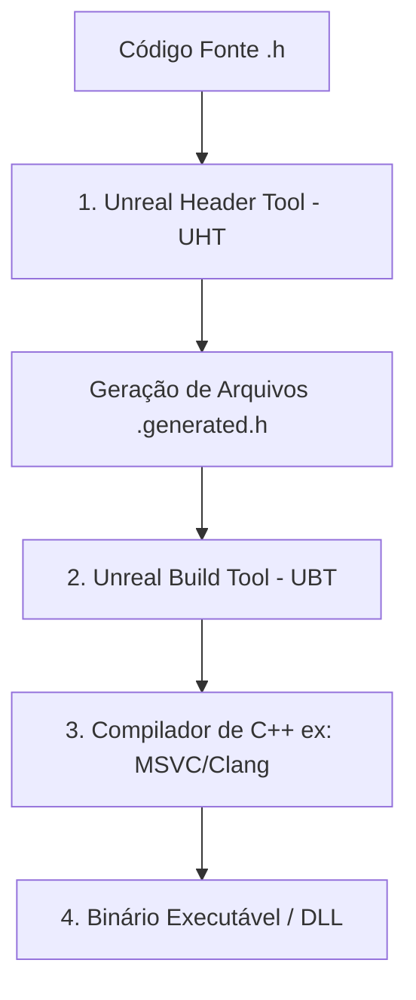

# 🎓 Aula 1: Sistema de Reflexão e Estrutura de Ator C++

**[Compatibilidade: UE 4.20 a UE 5.4+]**

A programação em C++ na Unreal Engine difere do C++ padrão (*ISO Standard*) devido à existência do **Sistema de Reflexão** (Reflection System). A reflexão permite que o motor conheça em tempo de execução os dados e metadados das classes, variáveis e funções, habilitando o Garbage Collection, a serialização e a integração direta com Blueprints.

Nesta aula, analisaremos os fundamentos da compilação na Unreal, a anatomia das macros e criaremos um Ator interativo com movimento procedural controlado por C++.

---

## 🎯 Caso Prático: A Plataforma Oscilante Procedural

> *Você foi encarregado de criar um elemento de cenário dinâmico para um jogo de plataforma 3D: uma plataforma oscilante que sobe e desce suavemente (movimento senoidal) no eixo Z e rotaciona continuamente em torno do seu próprio eixo (Yaw). O designer de fases precisa de total controle sobre a velocidade de oscilação, a amplitude do movimento e a velocidade de rotação diretamente no Editor (Painel Details), sem ter que recompilar o código.*

---

## ⚙️ 1. O Sistema de Reflexão e o Ciclo de Compilação (UHT & UBT)

O C++ padrão não possui suporte nativo à reflexão (capacidade de inspecionar tipos em tempo de execução). Para resolver isso, a Epic desenvolveu um pipeline de compilação proprietário que roda antes do compilador de C++:



1.  **Unreal Header Tool (UHT):** Examina os cabeçalhos (`.h`) em busca de macros como `UCLASS()`, `UPROPERTY()` e `UFUNCTION()`. Ele gera o código-fonte de reflexão nos arquivos `.generated.h`.
2.  **Unreal Build Tool (UBT):** Gerencia as dependências do projeto e configura os parâmetros de compilação da plataforma-alvo, orquestrando a chamada ao compilador de C++ (como Visual Studio MSVC ou Xcode Clang).

---

## ⚖️ 2. Anatomia das Macros de Reflexão

Para expor uma classe e seus membros ao editor Unreal, usamos macros estruturadas. Veja a especificação delas:

### A) Estrutura Mínima do Cabeçalho (.h)
Todo arquivo `.h` que represente um objeto Unreal precisa seguir essa assinatura exata:

```cpp
#pragma once

#include "CoreMinimal.h"
#include "GameFramework/Actor.h"
#include "MyActor.generated.h" // Deve ser O ÚLTIMO include do arquivo!

UCLASS()
class MEUPROJETO_API AMyActor : public AActor
{
    GENERATED_BODY() // Prepara a classe para receber metadados gerados pelo UHT
};
```

### B) Especificadores de `UPROPERTY()`
Esta macro decora variáveis membros, definindo como o Editor e a Engine interagem com elas:

| Especificador | Efeito no Editor | Efeito em Blueprints | Caso de Uso |
| :--- | :--- | :--- | :--- |
| **`EditAnywhere`** | Editável no painel Details do Editor (na instância do cenário e no Blueprint Asset). | Nível de acesso padrão (leitura/escrita oculta). | Variáveis de configuração ajustáveis pelo Designer. |
| **`EditDefaultsOnly`** | Editável apenas abrindo o Blueprint Asset original. | Bloqueado na instância colocada na fase. | Configuração global da classe (ex: malha visual padrão). |
| **`VisibleAnywhere`** | Visível no painel Details, mas não editável. | Apenas visualização. | Componentes internos (ex: a malha física do ator). |
| **`BlueprintReadWrite`** | Sem alteração no Editor. | Expõe nós `Get` e `Set` para o grafo de Blueprints. | Variáveis que a lógica visual precisa manipular. |
| **`BlueprintReadOnly`** | Sem alteração no Editor. | Expõe apenas o nó `Get` (somente leitura). | Dados computados via C++ protegidos contra alteração externa. |

---

## 💻 3. Implementando a Plataforma Oscilante (C++)

Criaremos uma classe chamada `AFloatingPlatform` herdada de `AActor`.

### [FloatingPlatform.h](file:///c:/Users/hijon/Documents/curso-python-do-zero/tecnologia-3d/unreal-engine/FloatingPlatform.h)
```cpp
#pragma once

#include "CoreMinimal.h"
#include "GameFramework/Actor.h"
#include "FloatingPlatform.generated.h"

UCLASS()
class TECNOLOGIA3D_API AFloatingPlatform : public AActor
{
    GENERATED_BODY()
    
public:	
    // Construtor padrão
    AFloatingPlatform();

protected:
    // Chamado no início do jogo ou spawn
    virtual void BeginPlay() override;

public:	
    // Chamado a cada frame
    virtual void Tick(float DeltaTime) override;

    // Componente visual e físico da plataforma
    UPROPERTY(VisibleAnywhere, BlueprintReadOnly, Category = "Components")
    class UStaticMeshComponent* PlatformMesh;

    // Amplitude do movimento vertical (em centímetros/unidades Unreal)
    UPROPERTY(EditAnywhere, BlueprintReadWrite, Category = "Movement|Setup")
    float MovementAmplitude;

    // Velocidade de oscilação (frequência)
    UPROPERTY(EditAnywhere, BlueprintReadWrite, Category = "Movement|Setup")
    float MovementSpeed;

    // Velocidade de rotação (graus por segundo)
    UPROPERTY(EditAnywhere, BlueprintReadWrite, Category = "Movement|Setup")
    float RotationSpeed;

private:
    // Posição inicial no mundo antes de oscilar
    FVector StartLocation;

    // Variável interna para controle do tempo senoidal acumulado
    float RunningTime;
};
```

### [FloatingPlatform.cpp](file:///c:/Users/hijon/Documents/curso-python-do-zero/tecnologia-3d/unreal-engine/FloatingPlatform.cpp)
```cpp
#include "FloatingPlatform.h"
#include "Components/StaticMeshComponent.h"

// Construtor: Inicializa valores padrões e componentes
AFloatingPlatform::AFloatingPlatform()
{
    // Define se o Tick deve ser chamado a cada frame
    PrimaryActorTick.bCanEverTick = true;

    // Instancia o componente de Static Mesh e o define como raiz do Ator
    PlatformMesh = CreateDefaultSubobject<UStaticMeshComponent>(TEXT("PlatformMesh"));
    RootComponent = PlatformMesh;

    // Valores padrões seguros ajustáveis no Editor
    MovementAmplitude = 100.f; // Flutua 100 cm para cima/baixo
    MovementSpeed = 2.f;       // Velocidade senoidal
    RotationSpeed = 45.f;      // Roda 45 graus por segundo
    RunningTime = 0.f;
}

void AFloatingPlatform::BeginPlay()
{
    Super::BeginPlay();
    
    // Memoriza a posição inicial da plataforma
    StartLocation = GetActorLocation();
}

void AFloatingPlatform::Tick(float DeltaTime)
{
    Super::Tick(DeltaTime);

    // 1. Lógica de Oscilação Senoidal (Z)
    RunningTime += DeltaTime;
    FVector CurrentLocation = GetActorLocation();
    
    // Fórmulas matemáticas: Delta Z = Amplitude * sin(Tempo * Velocidade)
    float DeltaHeight = FMath::Sin(RunningTime * MovementSpeed) * MovementAmplitude;
    CurrentLocation.Z = StartLocation.Z + DeltaHeight;
    SetActorLocation(CurrentLocation);

    // 2. Lógica de Rotação (Yaw)
    FRotator CurrentRotation = GetActorRotation();
    // Adiciona rotação incremental no eixo Yaw com base no tempo de frame delta
    CurrentRotation.Yaw += RotationSpeed * DeltaTime;
    SetActorRotation(CurrentRotation);
}
```

---

## 🛠️ Segurança de Compilação, Versões e Migração

*   **IWYU (Include What You Use):** A partir da Unreal 4.15+, a Epic adota o modelo IWYU. Evite colocar `#include "Engine.h"` (monolítico) nos arquivos. Inclua apenas o necessário. Por exemplo, no arquivo `.cpp`, incluímos especificamente `Components/StaticMeshComponent.h`.
*   **Live Coding (UE 5.0+):** Não use o botão de compilação do Visual Studio ou o botão "Compile" antigo dentro do editor para recompilar código ativo. Em vez disso, use o **Live Coding** pressionando `Ctrl + Alt + F11` dentro do editor da Unreal.
*   **Migração de Projetos C++:** Se você criar este Ator em um projeto Unreal 4 e migrar para a Unreal 5, as regras de compilação exigem que você limpe a pasta `.vs`, `Binaries`, `Intermediate` e `DerivedDataCache`. Após deletar estas pastas, clique com o botão direito no arquivo `.uproject` e selecione *Generate Visual Studio project files*.

---

## 🏃 Desafio Ativo: Molde de Exercício

Estenda o comportamento da plataforma oscilante. O designer de fases quer que a plataforma também oscile no **eixo X (horizontal)** de forma alternada ou integrada com a vertical.

### Esqueleto do Desafio (`AFloatingPlatform` Estendido)

Substitua a lógica de cálculo do `Tick` para comportar a amplitude horizontal (`MovementAmplitudeX`).

#### Modifique a Declaração (.h):
```cpp
// Insira abaixo de MovementAmplitude
UPROPERTY(EditAnywhere, BlueprintReadWrite, Category = "Movement|Setup")
float MovementAmplitudeX;
```

#### Esqueleto de Resolução (.cpp):
```cpp
// No construtor, inicialize o valor padrão:
MovementAmplitudeX = 0.f; // Padrão sem movimento horizontal

// Modifique o cálculo da posição dentro da função Tick:
void AFloatingPlatform::Tick(float DeltaTime)
{
    Super::Tick(DeltaTime);

    RunningTime += DeltaTime;
    FVector CurrentLocation = GetActorLocation();

    // CALCULE AQUI O MOVIMENTO DO EIXO Z E DO EIXO X:
    float DeltaHeight = FMath::Sin(RunningTime * MovementSpeed) * MovementAmplitude;
    // float DeltaHorizontal = ... (Calcule usando o seno ou cosseno e MovementAmplitudeX)

    // APLIQUE AS ALTERAÇÕES:
    CurrentLocation.Z = StartLocation.Z + DeltaHeight;
    // CurrentLocation.X = StartLocation.X + DeltaHorizontal;

    SetActorLocation(CurrentLocation);

    // Rotação
    FRotator CurrentRotation = GetActorRotation();
    CurrentRotation.Yaw += RotationSpeed * DeltaTime;
    SetActorRotation(CurrentRotation);
}
```
