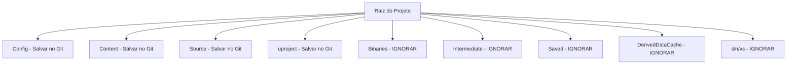

# 🎓 Aula 2: Estrutura de Diretórios e Fluxo de Builds C++

**[Compatibilidade: UE 4.20 a UE 5.4+]**

Diferente de projetos em C++ convencionais, onde a estrutura de pastas é definida livremente pelo programador, a Unreal Engine impõe uma arquitetura rígida de diretórios. Essa organização permite que o **Unreal Build Tool (UBT)** e o **Unreal Header Tool (UHT)** localizem, organizem e compilem automaticamente os módulos do jogo de maneira eficiente.

Nesta lição, estudaremos a estrutura física de um projeto Unreal C++, a função de cada diretório e como configurar o controle de versão de forma correta e segura.

---

## 🎯 Caso Prático: O Repositório Git Corrompido

> *Um programador recém-chegado à sua equipe de desenvolvimento de jogos inicializou um repositório Git na raiz do projeto Unreal e fez o commit de absolutamente tudo na máquina local, incluindo arquivos compilados e caches do editor. O resultado foi um push travado de mais de 15 GB de dados inúteis, arquivos travados que impedem a compilação por outros membros e centenas de conflitos nos arquivos de workspace do Visual Studio (`.sln`). Como reestruturar o projeto e limpar o repositório identificando o que é código-fonte essencial e o que é temporário?*

---

## ⚙️ 1. Anatomia dos Diretórios do Projeto Unreal

Um projeto Unreal C++ contém arquivos vitais de design e lógica (que devem ser salvos no controle de versão) e pastas gigantescas geradas automaticamente durante a compilação ou importação de ativos (que devem ser ignoradas).



### Detalhamento das Pastas:

*   **`Config/` (VITAL):** Contém arquivos de configuração em formato `.ini` (ex: configurações de input, parâmetros de física, definições de renderização, configurações do editor).
*   **`Content/` (VITAL):** Onde residem todos os ativos do jogo (Blueprints, Malhas 3D, Texturas, Áudios, Mapas). **Nota:** Embora sejam arquivos binários (com extensões `.uasset` e `.umap`), eles devem obrigatoriamente ir para o repositório.
*   **`Source/` (VITAL):** Contém todo o código C++ do jogo (`.h` e `.cpp`), além das regras de empacotamento de módulos do UBT (`.Build.cs` e `.Target.cs`).
*   **`[NomeDoProjeto].uproject` (VITAL):** O arquivo descritor do projeto em formato JSON. Ele aponta para os módulos C++ carregados, as versões da engine utilizadas e quais Plugins estão ativos.
*   **`Binaries/` (TEMPORÁRIA):** Contém os arquivos binários compilados (DLLs e executáveis locais do editor). É reconstruída a cada compilação.
*   **`Intermediate/` (TEMPORÁRIA):** Guarda os arquivos de cache de compilação rápida do compilador e os cabeçalhos de reflexão gerados pelo UHT (`.generated.h`).
*   **`Saved/` (TEMPORÁRIA):** Contém backups automáticos de mapas, capturas de tela e arquivos de logs gerados em tempo de execução.
*   **`DerivedDataCache (DDC)/` (TEMPORÁRIA):** O cache de dados derivados que o editor gera para otimizar o carregamento de texturas e shaders no formato da sua placa de vídeo. Pode consumir dezenas de gigabytes de espaço.
*   **`[NomeDoProjeto].sln` / `.vs/` / `CMakeLists.txt` (IDE):** Arquivos de solução do Visual Studio, Rider ou outra IDE. São gerados dinamicamente com base no arquivo `.uproject` e na pasta `Source/`.

---

## ⚖️ 2. Mapeamento de Controle de Versão (GitIgnore)

Com base nas definições dos diretórios, construímos a matriz de governança do controle de versão para projetos Unreal C++:

| Diretório / Arquivo | Deve ir para o Git? | Justificativa Técnica |
| :--- | :--- | :--- |
| **`Config/*.ini`** | **Sim** | Define os parâmetros de física, engine e inputs que unem C++ e Blueprints. |
| **`Content/**/*.uasset`** | **Sim** | São os ativos visuais e lógicos finais criados pelos artistas e designers. |
| **`Source/**/*`** | **Sim** | Contém a propriedade intelectual em código-fonte C++ e as regras de build. |
| **`*.uproject`** | **Sim** | É o arquivo que orquestra todo o carregamento do projeto no launcher e editor. |
| **`Binaries/`** | **Não** | DLLs de desenvolvimento são enormes e geram conflitos a cada compilação local. |
| **`Intermediate/`** | **Não** | Caches do compilador locais da máquina do desenvolvedor. |
| **`Saved/`** | **Não** | Dados de logs e autosaves temporários locais. |
| **`DerivedDataCache/`** | **Não** | Pode ser regenerado pelo editor e varia dependendo da placa de vídeo de cada dev. |
| **`*.sln` / `.vs/`** | **Não** | Configurações internas do compilador Visual Studio locais de cada máquina. |

---

## 💻 3. A Estrutura do arquivo de Configuração de Build (`.Build.cs`)

Dentro da pasta `Source/[NomeDoProjeto]/`, você encontrará o arquivo `[NomeDoProjeto].Build.cs`. Ele dita quais módulos de C++ externos e internos da Unreal Engine o seu código pode acessar.

### Exemplo de `MyProject.Build.cs` Comentado:
```csharp
using UnrealBuildTool;

public class MyProject : ModuleRules
{
    public MyProject(ReadOnlyTargetRules Target) : base(Target)
    {
        // IWYU (Include What You Use) ativo por padrão para otimizar compilações
        PCHUsage = PCHUsageMode.UseExplicitOrSharedPCHs;
	
        // Módulos públicos essenciais que seu C++ pode incluir:
        // "Core": Biblioteca básica do C++ Unreal (Tipos, Strings, Arrays, Math).
        // "CoreUObject": Sistema de Reflexão e manipulação de objetos base.
        // "Engine": Classes de Atores, Componentes, Física e Mundos virtuais.
        // "InputCore": Sistema básico de teclado e mouse.
        PublicDependencyModuleNames.AddRange(new string[] { 
            "Core", 
            "CoreUObject", 
            "Engine", 
            "InputCore" 
        });

        // Módulos privados necessários apenas para o código interno
        PrivateDependencyModuleNames.AddRange(new string[] {  });
    }
}
```

---

## 🛠️ Regenerando o Projeto C++ Limpo (Workflow de Resolução de Erros)

Sempre que deletar pastas temporárias para limpar o repositório ou resolver um erro catastrófico de compilação, execute o seguinte procedimento:

1.  Feche o Editor Unreal e a IDE (Visual Studio / Rider).
2.  Deleite manualmente as pastas: `Binaries/`, `Intermediate/`, `Saved/`, `DerivedDataCache/` e o arquivo `.sln` na raiz do projeto.
3.  Clique com o **botão direito** no arquivo `.uproject` e selecione **Generate Visual Studio project files**.
4.  Abra o arquivo `.sln` recém-gerado. O Visual Studio irá reindexar as dependências corretas de C++ e o projeto compilará limpo do zero.

---

## 🏃 Desafio Ativo: Elaboração de GitIgnore de Segurança

Para evitar acidentes com commits gigantescos no projeto, você deve estruturar o arquivo `.gitignore` na raiz do projeto Unreal.

Complete o esqueleto do arquivo `.gitignore` a seguir, adicionando os caminhos corretos a serem ignorados pelo repositório.

### Esqueleto de Resolução do Desafio (`.gitignore` para Unreal C++)

```text
# ==========================================
# GITIGNORE PARA UNREAL ENGINE C++ PROJECTS
# ==========================================

# 1. Ignorar arquivos de soluções de IDEs de desenvolvimento
/*.sln
.vs/
.idea/
.vscode/

# 2. Ignorar diretórios e artefatos de compilação da Unreal Engine
# ESCREVA AQUI as pastas de compilação e caches locais da Unreal a serem ignoradas:
# ex: Binaries/
# ...

# 3. Ignorar backups automáticos e arquivos salvos
# ...

# 4. Ignorar caches otimizados de shaders e dados derivados
# ...

# 5. Ignorar arquivos de dump de falhas de memória (Crashes)
*.log
*.dmp
```
