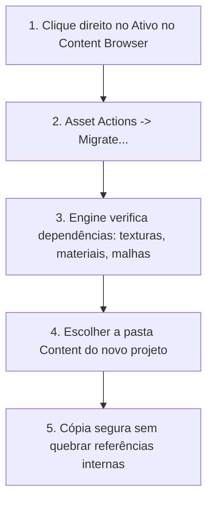

# 🎓 Aula 3: Migração, Compatibilidade e Atualização de Projetos C++

**[Compatibilidade: UE 4.25 a UE 5.4+]**

À medida que novas versões da Unreal Engine são lançadas pela Epic Games, a arquitetura interna do motor evolui. APIs obsoletas são depreciadas, o sistema de física transita (ex: de *PhysX* no UE4 para *Chaos Physics* no UE5) e novos sistemas tornam-se obrigatórios (ex: *Enhanced Input System*). Migrar um projeto em C++ exige um fluxo de trabalho estruturado para contornar problemas de vinculação (*linker errors*) e erros de compilação.

Nesta aula, estudaremos os métodos corretos de atualização de engine, a migração isolada de ativos e como refatorar código legado C++ para APIs modernas.

---

## 🎯 Caso Prático: A Transição do UE4 para o UE5

> *Sua equipe decidiu migrar um projeto de jogo de exploração em terceira pessoa desenvolvido na Unreal Engine 4.27 para a Unreal Engine 5.3 para aproveitar as tecnologias de Nanite (geometria virtualizada) e Lumen (iluminação global). No entanto, ao tentar abrir o projeto diretamente na nova versão, o compilador C++ falhou catastroficamente, apontando dezenas de erros relacionados ao sistema de entrada legado (Input Actions) e funções físicas obsoletas. Como orquestrar uma migração segura sem perder o histórico do código?*

---

## ⚙️ 1. Os Dois Caminhos de Transição: Atualização de Projeto vs. Migração de Assets

A Epic Games disponibiliza duas metodologias para mover dados entre diferentes versões da engine:

### A) Atualização do Projeto Inteiro (Project Upgrade)
Consiste em alterar a versão registrada no descritor `.uproject` e recompilar o código na versão mais recente.
*   **Indicação:** Quando o escopo do jogo é grande e todas as mecânicas em C++ e Blueprints devem permanecer integradas.
*   **Procedimento Correto:** Sempre selecione **"Open a copy"** em vez de atualizar "em cima" do projeto original (*in-place*), para evitar corrupção irreversível do projeto em caso de falha de compilação.

### B) Ferramenta de Migração de Assets (Migrate Tool)
Exporta um ativo (Blueprint, Malha, Material) e **todas as suas dependências** automaticamente para a pasta `Content` de outro projeto (que já está configurado na versão mais recente).
*   **Indicação:** Quando se quer mover apenas elementos específicos (ex: um carro interativo) sem poluir o novo projeto com configurações legadas do projeto antigo.



---

## ⚖️ 2. Principais Rupturas de API e Mudanças de Arquitetura (UE4 vs. UE5)

Ao migrar código C++ do Unreal 4 para o Unreal 5, as seguintes alterações críticas de API ocorrem e devem ser refatoradas:

| Recurso / Sistema no UE4 | Equivalente no UE5 (C++) | Impacto de Compilação / O que muda? |
| :--- | :--- | :--- |
| **Legacy Input System** (`InputComponent->BindAction`) | **Enhanced Input System** (`UEnhancedInputComponent->BindAction`) | A vinculação de inputs passa a ser feita por classes de contexto de mapeamento (`UInputMappingContext`) e ações de input (`UInputAction`) em C++. |
| **PhysX Engine** | **Chaos Physics Engine** | As estruturas de dados de física e colisões mudaram de nome. Funções internas de consulta de colisão física devem ser reescritas para o padrão Chaos. |
| **Headers Monolíticos** (ex: `Engine.h`) | **Strict IWYU (Include What You Use)** | O compilador falhará se não encontrar os cabeçalhos específicos das classes (ex: incluir explicitamente `#include "Components/InputComponent.h"`). |

---

## 💻 3. Anatomia de uma Refatoração de C++ (Enhanced Input System)

Veja a diferença prática de inicialização e vinculação de comandos antes (UE 4.27) e depois (UE 5.3) para um comando de "Pular" em C++:

### Código Legado (UE 4.27 / Padrão Antigo):
```cpp
// No cabeçalho (Character.h):
void SetupPlayerInputComponent(class UInputComponent* PlayerInputComponent) override;
void JumpAction();

// Na implementação (Character.cpp):
void AMyCharacter::SetupPlayerInputComponent(UInputComponent* PlayerInputComponent)
{
    Super::SetupPlayerInputComponent(PlayerInputComponent);
    
    // Vinculação simples direta
    PlayerInputComponent->BindAction("Jump", IE_Pressed, this, &AMyCharacter::JumpAction);
}
```

### Código Modernizado (UE 5.3 / Enhanced Input):
```cpp
// No cabeçalho (Character.h):
// Necessário incluir o header específico do Enhanced Input nas dependências do Build.cs
UPROPERTY(EditAnywhere, BlueprintReadOnly, Category = "Input")
class UInputAction* JumpAction;

UPROPERTY(EditAnywhere, BlueprintReadOnly, Category = "Input")
class UInputMappingContext* DefaultMappingContext;

void JumpTriggered(const struct FInputActionInstance& Instance);

// Na implementação (Character.cpp):
#include "EnhancedInputComponent.h"
#include "EnhancedInputSubsystems.h"

void AMyCharacter::BeginPlay()
{
    Super::BeginPlay();
    
    // Adiciona o Contexto de Mapeamento (Mapping Context) no Player Controller local
    if (APlayerController* PC = Cast<APlayerController>(GetController()))
    {
        if (UEnhancedInputLocalPlayerSubsystem* Subsystem = ULocalPlayer::GetSubsystem<UEnhancedInputLocalPlayerSubsystem>(PC->GetLocalPlayer()))
        {
            Subsystem->AddMappingContext(DefaultMappingContext, 0);
        }
    }
}

void AMyCharacter::SetupPlayerInputComponent(UInputComponent* PlayerInputComponent)
{
    Super::SetupPlayerInputComponent(PlayerInputComponent);
    
    // Converte e vincula utilizando o novo componente de input avançado
    if (UEnhancedInputComponent* EnhancedInputComp = Cast<UEnhancedInputComponent>(PlayerInputComponent))
    {
        EnhancedInputComp->BindAction(JumpAction, ETriggerEvent::Triggered, this, &AMyCharacter::JumpTriggered);
    }
}
```

---

## 🛠️ Procedimento Seguro de Upgrade de Projetos C++ (Passo a Passo)

Caso decida fazer a atualização da versão do projeto inteiro:

1.  **Faça Backup Completo:** Comite todas as alterações locais na branch estável do git ou duplique a pasta física do projeto.
2.  **Limpe Arquivos Temporários:** Exclua as pastas `Binaries/`, `Intermediate/`, `Saved/`, `DerivedDataCache/` e o arquivo `.sln` do projeto Unreal original.
3.  **Mude a Versão da Engine:** Clique com o botão direito no arquivo `.uproject` -> Selecione **Switch Unreal Engine Version...** -> Escolha a nova versão (ex: 5.3).
4.  **Gere os Arquivos de Solução:** Clique com o botão direito no `.uproject` -> Selecione **Generate Visual Studio project files**.
5.  **Corrija os Erros de Compilação:** Abra o `.sln` recém-gerado no Visual Studio ou Rider. Compile o código e resolva sequencialmente todos os erros de API depreciada no compilador.
6.  **Abra o Editor:** Assim que o código compilar com sucesso via IDE, abra o editor Unreal para compilar os Blueprints remanescentes.

---

## 🏃 Desafio Ativo: Refatorando Funções Físicas Obsoletas

Um projeto antigo da Unreal Engine utiliza uma função de consulta de colisão que foi modificada na versão nova. Seu trabalho é consertar o bloco de código que está impedindo a compilação.

A função legada utiliza um parâmetro que foi removido nas APIs mais recentes das versões 5.x.

### Esqueleto de Resolução do Desafio (Refatorando LineTrace)

#### Código Antigo (Com Erro de Compilação):
```cpp
void AMyCharacter::CheckFloor()
{
    FHitResult HitResult;
    FVector Start = GetActorLocation();
    FVector End = Start - FVector(0.f, 0.f, 200.f);
    
    // Erro de Compilação no UE5: O especificador FCollisionQueryParams estrito impede a compilação
    // se não mapearmos explicitamente a exclusão do próprio Ator
    FCollisionQueryParams Params;
    Params.bTraceComplex = false;
    // Params.bTraceAsyncPhysicalMaterial = true; // API depreciada no motor modernizado

    GetWorld()->LineTraceSingleByChannel(HitResult, Start, End, ECC_Visibility, Params);
}
```

#### Escreva o Código Corrigido no Padrão do UE5:
Complete o esqueleto adicionando a instrução correta para ignorar o próprio Ator no traçado de colisão física (`Params.AddIgnoredActor`):

```cpp
void AMyCharacter::CheckFloor()
{
    FHitResult HitResult;
    FVector Start = GetActorLocation();
    FVector End = Start - FVector(0.f, 0.f, 200.f);
    
    FCollisionQueryParams Params;
    Params.bTraceComplex = false;
    
    // ESCREVA AQUI a linha para adicionar o próprio caractere à lista de atores a serem ignorados:
    // Params.AddIgnoredActor(this);
    
    GetWorld()->LineTraceSingleByChannel(HitResult, Start, End, ECC_Visibility, Params);
}
```
