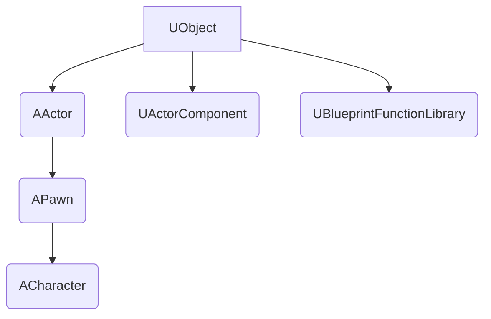

# Módulo 8 - Classes Base da Unreal
## FASE 3: UNREAL ENGINE ESPECÍFICO

### Status: 📚 MATERIAL DE ESTUDO

---

## 1. HIERARQUIA DE CLASSES DA UNREAL

A Unreal Engine é construída sobre uma hierarquia de classes que utiliza o conceito de **Herança** (Módulo 5) para definir o comportamento dos objetos no jogo.

O topo da hierarquia de *gameplay* é o **`UObject`**, que é a classe base para todos os objetos que o sistema de Reflexão e o *Garbage Collector* da Unreal gerenciam.

### Diagrama Simplificado da Hierarquia



---

## 2. `AActor`: O QUE É E COMO USAR

### Teoria

O **`AActor`** (prefixo `A` de acordo com o padrão Epic) é a classe base para qualquer objeto que pode ser **colocado** ou **spawnado** no mundo do jogo (nível).

*   **Função:** Representa uma entidade física ou lógica no mundo.
*   **Exemplos:** Uma luz, uma porta, uma plataforma móvel, um inimigo, o jogador.
*   **Características:** Possui localização, rotação, escala, pode ter componentes anexados e participa do ciclo de vida do jogo (`BeginPlay`, `Tick`).

### Exemplo de Uso

Quando você cria uma nova classe C++ no Unreal Engine, se ela for um objeto que existe no mundo, ela deve herdar de `AActor`.

```cpp
// AMinhaPlataforma.h
#pragma once

#include "CoreMinimal.h"
#include "GameFramework/Actor.h" // Header essencial para AActor
#include "MinhaPlataforma.generated.h" // Gerado pelo UHT

UCLASS() // Macro de Reflexão
class AMinhaPlataforma : public AActor // Herda de AActor
{
    GENERATED_BODY() // Macro essencial
    
public:	
    // Construtor
    AMinhaPlataforma();

protected:
    // Chamado no início do jogo
    virtual void BeginPlay() override;

public:	
    // Chamado a cada frame
    virtual void Tick(float DeltaTime) override;
};
```

---

## 3. `APawn` E `ACharacter`

### `APawn`

O **`APawn`** é uma subclasse de `AActor` que serve como a representação física de um jogador ou IA no mundo.

*   **Função:** É o objeto que pode ser **possuído** (controlado) por um `AController` (seja `APlayerController` ou `AAIController`).
*   **Características:** Possui a capacidade de ser controlado, mas não tem movimento ou malha física por padrão. É ideal para objetos não-humanoides (Ex: um veículo, uma câmera de segurança).

### `ACharacter`

O **`ACharacter`** é uma subclasse de `APawn` e é a classe mais comum para personagens humanoides.

*   **Função:** É um `APawn` especializado com funcionalidades pré-configuradas para personagens que andam, correm e pulam.
*   **Características:** Já vem com um `CapsuleComponent` (colisão), um `SkeletalMeshComponent` (malha) e um `CharacterMovementComponent` (lógica de movimento complexa).

### Relação de Controle

| Classe | Descrição |
|:---|:---|
| **`APawn` / `ACharacter`** | O corpo no mundo do jogo. |
| **`AController`** | O cérebro que controla o `Pawn`. |
| **`APlayerController`** | O cérebro que recebe *input* do jogador. |
| **`AAIController`** | O cérebro que executa a lógica de IA. |

---

## 4. `UActorComponent`

### Teoria

O **`UActorComponent`** (prefixo `U` de `UObject`) é a classe base para componentes que podem ser anexados a um `AActor` para adicionar funcionalidade.

*   **Função:** Implementa o **Padrão de Design Componente** (Módulo 3 da Fase 2), promovendo a composição sobre a herança.
*   **Exemplos:** `USkeletalMeshComponent` (para renderizar malhas), `UCameraComponent` (para visão), `UParticleSystemComponent` (para efeitos visuais).
*   **Características:** Não possui localização, rotação ou escala no mundo por si só, mas herda o ciclo de vida do seu `AActor` proprietário.

### Composição vs. Herança

Em vez de criar uma classe `AInimigoVoador` que herda de `AInimigo`, você cria uma classe `AInimigo` e anexa um `UFlyingComponent` (componente de voo). Isso torna o código mais flexível e modular.

---

## EXERCÍCIO: HIERARQUIA E HERANÇA

### Exercício 1: Identificação de Classes Base

Para cada item abaixo, qual é a classe base mais apropriada para herdar no Unreal Engine (`AActor`, `APawn`, `ACharacter`, `UActorComponent`)?

1.  Um projétil que é disparado e explode ao atingir algo.
2.  Um sistema de inventário que gerencia itens do jogador.
3.  O personagem principal que o jogador controla em primeira pessoa.
4.  Um carro que pode ser dirigido pelo jogador.

<details>
<summary>Ver Respostas</summary>

1.  **Projétil:** **`AActor`**. É um objeto que existe no mundo, mas não precisa ser controlado por um `Controller`.
2.  **Sistema de Inventário:** **`UActorComponent`**. É uma funcionalidade que deve ser anexada ao `ACharacter` ou `APawn` do jogador.
3.  **Personagem Principal:** **`ACharacter`**. Possui toda a lógica de movimento humanoide pré-configurada.
4.  **Carro:** **`APawn`**. É um objeto que pode ser possuído por um `Controller`, mas não tem a lógica de movimento humanoide.
</details>

---

## RESUMO DO MÓDULO 8

### O Que Você Aprendeu

✅ **`UObject`:** Base de tudo, gerencia Reflexão e Garbage Collection.  
✅ **`AActor`:** Base para objetos no mundo.  
✅ **`APawn` / `ACharacter`:** Classes para entidades controláveis.  
✅ **`UActorComponent`:** Base para componentes, promovendo a composição.  

### Próximo Passo

O próximo módulo aprofundará o uso dos componentes, que são a forma mais comum de adicionar funcionalidade aos `AActor`s.

**Próximo:** Módulo 9: Sistema de Componentes
