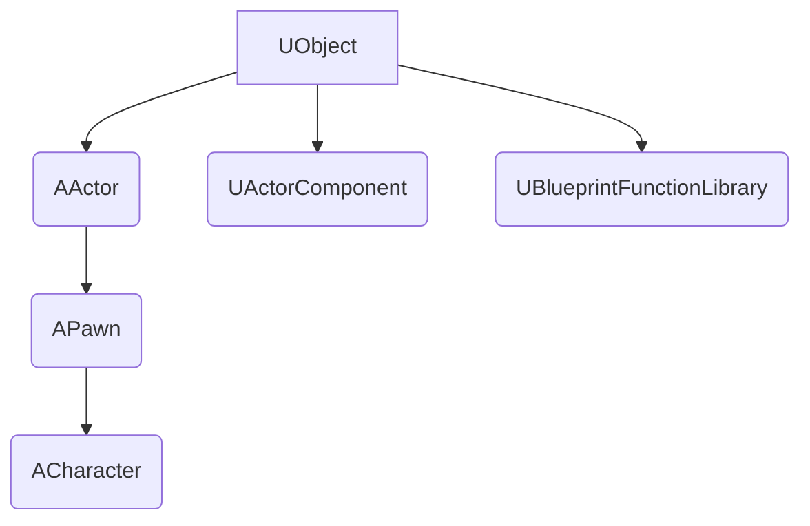

# 📚 GUIA COMPLETO DE ESTUDO: C++ PARA UNREAL ENGINE

Este documento unifica todo o material de estudo fornecido, incluindo teorias e exercícios, na ordem de aprendizado recomendada. Ele serve como o seu material de referência completo.

---

## 🟢 FASE 1: FUNDAMENTOS C++

### Módulo 1 - Fundamentos C++ para Unreal Engine

**Status: ✅ CONCLUÍDO**

#### 1. ESTRUTURA BÁSICA DE UM PROGRAMA C++

**Teoria**

Todo programa C++ precisa de:

1. **Headers** (bibliotecas) - ferramentas que você vai usar
2. **Namespace** - atalho para não escrever `std::` toda hora
3. **Função main()** - onde o programa começa
4. **return 0** - indica que o programa terminou com sucesso

**Código Base**

```cpp
#include <iostream>
using namespace std;

int main() {
    // Seu código aqui
    return 0;
}
```

**Explicação Linha por Linha**

```cpp
#include <iostream>      // Inclui ferramentas de entrada/saída
using namespace std;     // Permite usar cout sem std::
int main() {            // Função principal (obrigatória)
    return 0;           // Encerra programa com sucesso
}                       // Fecha a função main
```

#### 2. BIBLIOTECAS (HEADERS)

**Teoria**

Headers são arquivos que contêm código pronto para usar. Você inclui no início do programa com `#include`.

**Principais Headers para Iniciantes**

| Header       | Para que serve            | Exemplo de uso                |
| ------------ | ------------------------- | ----------------------------- |
| `<iostream>` | Entrada/saída (cout, cin) | `cout << "Oi";`               |
| `<string>`   | Trabalhar com texto       | `string nome = "João";`       |
| `<cmath>`    | Matemática (sqrt, pow)    | `sqrt(16);`                   |
| `<vector>`   | Listas dinâmicas          | `vector<int> lista;`          |
| `<limits>`   | Limites de tipos          | `numeric_limits<int>::max();` |

**Exemplo Prático**

```cpp
#include <iostream>  // Para cout
#include <string>    // Para string
using namespace std;

int main() {
    string nome = "Guerreiro";
    cout << "Classe: " << nome << endl;
    return 0;
}
```

#### 3. TIPOS DE DADOS

**Teoria**

Variáveis são "caixas" que guardam informações. Cada tipo de caixa guarda um tipo diferente de dado.

**Tipos Básicos**

| Tipo     | Guarda            | Exemplo                  | Tamanho  |
| -------- | ----------------- | ------------------------ | -------- |
| `int`    | Números inteiros  | `100`, `-50`, `0`        | 4 bytes  |
| `float`  | Números decimais  | `3.14f`, `0.5f`          | 4 bytes  |
| `double` | Decimais precisos | `3.14159`, `0.5`         | 8 bytes  |
| `char`   | Um caractere      | `'A'`, `'x'`, `'5'`      | 1 byte   |
| `bool`   | Verdadeiro/Falso  | `true`, `false`          | 1 byte   |
| `string` | Texto             | `"Hello"`, `"Guerreiro"` | Variável |

**Regras Importantes**

- `float` precisa de `f` no final: `0.5f`
- `char` usa aspas simples: `'A'`
- `string` usa aspas duplas: `"texto"`
- `bool` só aceita `true` ou `false`

**Exemplo Completo**

```cpp
#include <iostream>
#include <string>
using namespace std;

int main() {
    int vida = 100;              // Inteiro
    float velocidade = 5.5f;     // Decimal
    char classe = 'G';           // Caractere
    bool vivo = true;            // Booleano
    string nome = "Kratos";      // Texto

    cout << "Nome: " << nome << endl;
    cout << "Vida: " << vida << endl;
    cout << "Velocidade: " << velocidade << endl;
    cout << "Classe: " << classe << endl;
    cout << "Vivo: " << vivo << endl;  // 1=true, 0=false

    return 0;
}
```

**Saída:**

```
Nome: Kratos
Vida: 100
Velocidade: 5.5
Classe: G
Vivo: 1
```

#### 4. SAÍDA DE DADOS (cout)

**Teoria**

`cout` = Console Output = mostra dados na tela

**Sintaxe**

```cpp
cout << "texto";           // Mostra texto
cout << variavel;          // Mostra valor da variável
cout << "texto" << var;    // Mostra texto + variável
cout << endl;              // Quebra linha
```

**Operador <<**

O `<<` é o operador de inserção. Você pode encadear vários:

```cpp
cout << "Vida: " << vida << " / " << vidaMax << endl;
```

**Exemplos**

```cpp
int pontos = 500;

// Forma 1: Simples
cout << pontos;

// Forma 2: Com texto
cout << "Pontos: " << pontos;

// Forma 3: Com quebra de linha
cout << "Pontos: " << pontos << endl;

// Forma 4: Múltiplas variáveis
int level = 10;
cout << "Level " << level << " - Pontos: " << pontos << endl;
```

#### 5. ENTRADA DE DADOS (cin)

**Teoria**

`cin` = Console Input = lê dados do teclado

**Sintaxe**

```cpp
int idade;
cin >> idade;  // Espera você digitar e apertar ENTER
```

**Operador >>**

O `>>` é o operador de extração. Ele "extrai" o dado do teclado para a variável.

**Fluxo Completo**

```cpp
#include <iostream>
using namespace std;

int main() {
    int nivel;

    cout << "Digite seu nível: ";  // Pede informação
    cin >> nivel;                   // Lê do teclado
    cout << "Você é nível " << nivel << endl;  // Mostra

    return 0;
}
```

**Ler Múltiplos Valores**

```cpp
int x, y;
cout << "Digite X e Y: ";
cin >> x >> y;  // Digita: 10 20 [ENTER]
```

**Ler String com Espaços**

```cpp
#include <string>
string nomeCompleto;

// Problema: cin para no espaço
cin >> nomeCompleto;  // "João Silva" → lê só "João"

// Solução: getline
getline(cin, nomeCompleto);  // Lê "João Silva" completo
```

#### 6. OPERAÇÕES MATEMÁTICAS

**Operadores Básicos**

| Operador | Operação         | Exemplo  | Resultado |
| -------- | ---------------- | -------- | --------- |
| `+`      | Adição           | `5 + 3`  | `8`       |
| `-`      | Subtração        | `5 - 3`  | `2`       |
| `*`      | Multiplicação    | `5 * 3`  | `15`      |
| `/`      | Divisão          | `10 / 2` | `5`       |
| `%`      | Resto da divisão | `10 % 3` | `1`       |

**Ordem de Precedência**

```cpp
int resultado = 5 + 3 * 2;  // resultado = 11 (não 16)
// Multiplicação primeiro: 3 * 2 = 6
// Depois soma: 5 + 6 = 11

int resultado2 = (5 + 3) * 2;  // resultado2 = 16
// Parênteses primeiro: 5 + 3 = 8
// Depois multiplica: 8 * 2 = 16
```

**Exemplo Prático**

```cpp
#include <iostream>
using namespace std;

int main() {
    int ataque = 50;
    int defesa = 20;
    int multiplicador = 2;

    int danoBase = ataque - defesa;           // 30
    int danoTotal = danoBase * multiplicador; // 60

    cout << "Dano causado: " << danoTotal << endl;

    return 0;
}
```

**Divisão Inteira vs Decimal**

```cpp
int a = 10;
int b = 3;

int resultado1 = a / b;        // 3 (corta decimal)
float resultado2 = a / b;      // 3.0 (ainda corta!)
float resultado3 = (float)a / b;  // 3.33333 (correto)

// Ou declare como float desde o início
float x = 10.0f;
float y = 3.0f;
float resultado4 = x / y;  // 3.33333
```

#### 7. COMENTÁRIOS

**Tipos**

```cpp
// Comentário de linha única

/*
   Comentário
   de múltiplas
   linhas
*/

int vida = 100;  // Comentário no final da linha
```

**Boas Práticas**

```cpp
// ✅ BOM: Explica "por quê"
// Reduz vida pela metade ao ser atingido por crítico
vida = vida / 2;

// ❌ RUIM: Repete o óbvio
// Divide vida por 2
vida = vida / 2;
```

#### EXERCÍCIOS PRÁTICOS

**Exercício 1: Calculadora de Vida**
Crie um programa que:

1. Declare `vidaMaxima = 100`
2. Declare `dano = 30`
3. Calcule `vidaRestante = vidaMaxima - dano`
4. Mostre: `"Vida restante: "` + valor

**Solução**

```cpp
#include <iostream>
using namespace std;

int main() {
    int vidaMaxima = 100;
    int dano = 30;
    int vidaRestante = vidaMaxima - dano;

    cout << "Vida restante: " << vidaRestante << endl;
    return 0;
}
```

**Exercício 2: Sistema de Pontuação**
Peça ao usuário:

1. Digite os pontos do nível 1
2. Digite os pontos do nível 2
3. Calcule e mostre a soma total

**Solução**

```cpp
#include <iostream>
using namespace std;

int main() {
    int nivel1, nivel2;

    cout << "Pontos do nível 1: ";
    cin >> nivel1;

    cout << "Pontos do nível 2: ";
    cin >> nivel2;

    int total = nivel1 + nivel2;
    cout << "Total de pontos: " << total << endl;

    return 0;
}
```

**Exercício 3: Ficha de Personagem**
Crie uma ficha completa:

1. Peça: nome (string), nível (int), vida (int)
2. Calcule: `poder = nivel * 10 + vida`
3. Mostre todas as informações formatadas

**Solução**

```cpp
#include <iostream>
#include <string>
using namespace std;

int main() {
    string nome;
    int nivel, vida;

    cout << "Nome do personagem: ";
    getline(cin, nome);

    cout << "Nível: ";
    cin >> nivel;

    cout << "Vida: ";
    cin >> vida;

    int poder = nivel * 10 + vida;

    cout << "\n=== FICHA DO PERSONAGEM ===" << endl;
    cout << "Nome: " << nome << endl;
    cout << "Nível: " << nivel << endl;
    cout << "Vida: " << vida << endl;
    cout << "Poder: " << poder << endl;

    return 0;
}
```

**Exercício 4: Sistema de Dano Crítico**
Sistema de combate:

1. Peça: ataque (int), defesa (int)
2. Calcule: `danoNormal = ataque - defesa`
3. Calcule: `danoCritico = danoNormal * 2`
4. Mostre ambos os valores

**Solução**

```cpp
#include <iostream>
using namespace std;

int main() {
    int ataque, defesa;

    cout << "Valor de ataque: ";
    cin >> ataque;

    cout << "Valor de defesa: ";
    cin >> defesa;

    int danoNormal = ataque - defesa;
    int danoCritico = danoNormal * 2;

    cout << "\nDano normal: " << danoNormal << endl;
    cout << "Dano crítico: " << danoCritico << endl;

    return 0;
}
```

**Exercício 5: Conversor de Moedas**
Sistema de loja:

1. Peça quantidade de gold (int)
2. Taxa de conversão: 1 gold = 100 silver
3. Calcule e mostre o valor em silver

**Solução**

```cpp
#include <iostream>
using namespace std;

int main() {
    int gold;
    const int TAXA = 100;  // const = valor não muda

    cout << "Quantidade de gold: ";
    cin >> gold;

    int silver = gold * TAXA;

    cout << "Você tem " << silver << " silver" << endl;

    return 0;
}
```

---

### Módulo 2 - Lógica de Programação

**Status: 📚 MATERIAL DE ESTUDO**

#### PARTE 1: CONDICIONAIS (if/else)

**Teoria**

Condicionais permitem que o programa tome decisões. O código só executa SE uma condição for verdadeira.

**Analogia:** "SE tenho dinheiro, ENTÃO compro item, SENÃO mostro mensagem de erro"

**Sintaxe Básica**

```cpp
if (condicao) {
    // Executa se verdadeiro
}
```

```cpp
if (condicao) {
    // Executa se verdadeiro
} else {
    // Executa se falso
}
```

```cpp
if (condicao1) {
    // Executa se condicao1 verdadeira
} else if (condicao2) {
    // Executa se condicao2 verdadeira
} else {
    // Executa se todas falsas
}
```

**Operadores de Comparação**

| Operador | Significado    | Exemplo  | Resultado |
| -------- | -------------- | -------- | --------- |
| `==`     | Igual a        | `5 == 5` | `true`    |
| `!=`     | Diferente de   | `5 != 3` | `true`    |
| `>`      | Maior que      | `5 > 3`  | `true`    |
| `<`      | Menor que      | `3 < 5`  | `true`    |
| `>=`     | Maior ou igual | `5 >= 5` | `true`    |
| `<=`     | Menor ou igual | `3 <= 5` | `true`    |

**⚠️ ATENÇÃO:** `=` é atribuição, `==` é comparação!

```cpp
int x = 5;      // Atribui 5 a x
if (x == 5) {   // Compara se x é igual a 5
    // código
}
```

**Operadores Lógicos**

| Operador | Significado | Exemplo             | Quando é verdadeiro         |
| -------- | ----------- | ------------------- | --------------------------- |
| `&&`     | E (AND)     | `a > 5 && b < 10`   | Ambas condições verdadeiras |
| `\|\|`   | OU (OR)     | `a > 5 \|\| b < 10` | Pelo menos uma verdadeira   |
| `!`      | NÃO (NOT)   | `!(a > 5)`          | Inverte o resultado         |

**Exemplo 1: Sistema de Vida**

```cpp
#include <iostream>
using namespace std;

int main() {
    int vida = 30;

    if (vida > 50) {
        cout << "Vida alta - Continue lutando!" << endl;
    } else if (vida > 20) {
        cout << "Vida média - Cuidado!" << endl;
    } else {
        cout << "Vida crítica - Use poção!" << endl;
    }

    return 0;
}
```

**Saída:** `Vida média - Cuidado!`

**Exemplo 2: Sistema de Acesso**

```cpp
#include <iostream>
using namespace std;

int main() {
    int nivel = 15;
    bool temChave = true;

    // Precisa nível 10 E ter a chave
    if (nivel >= 10 && temChave) {
        cout << "Porta destrancada!" << endl;
    } else {
        cout << "Acesso negado!" << endl;
    }

    return 0;
}
```

**Saída:** `Porta destrancada!`

**Exemplo 3: Menu de Personagem**

```cpp
#include <iostream>
using namespace std;

int main() {
    int escolha;

    cout << "=== ESCOLHA SUA CLASSE ===" << endl;
    cout << "1 - Guerreiro" << endl;
    cout << "2 - Mago" << endl;
    cout << "3 - Arqueiro" << endl;
    cout << "Digite sua escolha: ";
    cin >> escolha;

    if (escolha == 1) {
        cout << "Você é um Guerreiro! +10 Força" << endl;
    } else if (escolha == 2) {
        cout << "Você é um Mago! +10 Inteligência" << endl;
    } else if (escolha == 3) {
        cout << "Você é um Arqueiro! +10 Agilidade" << endl;
    } else {
        cout << "Opção inválida!" << endl;
    }

    return 0;
}
```

**Switch Case (Alternativa ao if/else)**

Usado quando você compara a mesma variável com vários valores fixos.

```cpp
#include <iostream>
using namespace std;

int main() {
    int opcao;

    cout << "1-Atacar 2-Defender 3-Fugir: ";
    cin >> opcao;

    switch (opcao) {
        case 1:
            cout << "Você atacou!" << endl;
            break;  // Importante! Sai do switch
        case 2:
            cout << "Você defendeu!" << endl;
            break;
        case 3:
            cout << "Você fugiu!" << endl;
            break;
        default:
            cout << "Ação inválida!" << endl;
    }

    return 0;
}
```

**⚠️ Não esqueça o `break`!** Sem ele, executa os próximos cases também.

#### Exercícios - Condicionais

**Exercício 1: Sistema de Dano**
Crie um programa que:

1. Peça o ataque do jogador (int)
2. Peça a defesa do inimigo (int)
3. SE ataque > defesa: mostre "Causou dano!"
4. SENÃO: mostre "Ataque bloqueado!"

**Solução**

```cpp
#include <iostream>
using namespace std;

int main() {
    int ataque, defesa;

    cout << "Ataque do jogador: ";
    cin >> ataque;

    cout << "Defesa do inimigo: ";
    cin >> defesa;

    if (ataque > defesa) {
        cout << "Causou dano!" << endl;
    } else {
        cout << "Ataque bloqueado!" << endl;
    }

    return 0;
}
```

**Exercício 2: Verificador de Level**
Crie um programa que:

1. Peça o level do jogador
2. SE level < 10: "Iniciante"
3. SE level entre 10 e 30: "Intermediário"
4. SE level > 30: "Avançado"

**Solução**

```cpp
#include <iostream>
using namespace std;

int main() {
    int level;

    cout << "Digite seu level: ";
    cin >> level;

    if (level < 10) {
        cout << "Categoria: Iniciante" << endl;
    } else if (level <= 30) {
        cout << "Categoria: Intermediário" << endl;
    } else {
        cout << "Categoria: Avançado" << endl;
    }

    return 0;
}
```

**Exercício 3: Sistema de Loja**
Crie um programa que:

1. Peça o gold do jogador
2. Peça o preço do item
3. SE tem gold suficiente E preço <= gold: "Compra realizada!"
4. SENÃO: "Gold insuficiente!"
5. Mostre o gold restante após compra (se comprou)

**Solução**

```cpp
#include <iostream>
using namespace std;

int main() {
    int gold, preco;

    cout << "Seu gold: ";
    cin >> gold;

    cout << "Preço do item: ";
    cin >> preco;

    if (gold >= preco) {
        gold = gold - preco;
        cout << "Compra realizada!" << endl;
        cout << "Gold restante: " << gold << endl;
    } else {
        cout << "Gold insuficiente!" << endl;
    }

    return 0;
}
```

#### PARTE 2: LOOPS (REPETIÇÃO)

**Teoria**

Loops executam o mesmo código múltiplas vezes. Útil para:

- Processar inventários
- Spawnar inimigos
- Contar regressivamente
- Repetir ações

**FOR LOOP**

Use quando você sabe QUANTAS vezes vai repetir.

**Sintaxe**

```cpp
for (inicio; condição; incremento) {
    // código que repete
}
```

**Anatomia do For**

```cpp
for (int i = 0; i < 5; i++) {
    cout << i << endl;
}
```

1. `int i = 0` - cria variável i começando em 0
2. `i < 5` - continua enquanto i for menor que 5
3. `i++` - aumenta i em 1 a cada repetição
4. Executa 5 vezes (i = 0, 1, 2, 3, 4)

**Exemplo 1: Contagem Simples**

```cpp
#include <iostream>
using namespace std;

int main() {
    cout << "Contagem regressiva:" << endl;

    for (int i = 5; i >= 1; i--) {
        cout << i << endl;
    }

    cout << "BOOM!" << endl;
    return 0;
}
```

**Saída:**

```
Contagem regressiva:
5
4
3
2
1
BOOM!
```

**Exemplo 2: Spawnar Inimigos**

```cpp
#include <iostream>
using namespace std;

int main() {
    int quantidadeInimigos = 5;

    for (int i = 1; i <= quantidadeInimigos; i++) {
        cout << "Inimigo #" << i << " spawnou!" << endl;
    }

    cout << "Total: " << quantidadeInimigos << " inimigos" << endl;
    return 0;
}
```

**Saída:**

```
Inimigo #1 spawnou!
Inimigo #2 spawnou!
Inimigo #3 spawnou!
Inimigo #4 spawnou!
Inimigo #5 spawnou!
Total: 5 inimigos
```

**Exemplo 3: Tabuada**

```cpp
#include <iostream>
using namespace std;

int main() {
    int numero = 7;

    cout << "Tabuada do " << numero << ":" << endl;

    for (int i = 1; i <= 10; i++) {
        cout << numero << " x " << i << " = " << numero * i << endl;
    }

    return 0;
}
```

**WHILE LOOP**

Use quando você NÃO sabe quantas vezes vai repetir. Continua enquanto condição for verdadeira.

**Sintaxe**

```cpp
while (condicao) {
    // código que repete
}
```

**Exemplo 1: Sistema de Combate**

```cpp
#include <iostream>
using namespace std;

int main() {
    int vidaInimigo = 100;
    int dano = 25;
    int turno = 1;

    while (vidaInimigo > 0) {
        cout << "Turno " << turno << ": Atacando!" << endl;
        vidaInimigo = vidaInimigo - dano;
        cout << "Vida do inimigo: " << vidaInimigo << endl;
        turno++;
    }

    cout << "Inimigo derrotado!" << endl;
    return 0;
}
```

**Saída:**

```
Turno 1: Atacando!
Vida do inimigo: 75
Turno 2: Atacando!
Vida do inimigo: 50
Turno 3: Atacando!
Vida do inimigo: 25
Turno 4: Atacando!
Vida do inimigo: 0
Inimigo derrotado!
```

**Exemplo 2: Menu Interativo**

```cpp
#include <iostream>
using namespace std;

int main() {
    int opcao = 0;

    while (opcao != 4) {
        cout << "\n=== MENU ===" << endl;
        cout << "1 - Ver status" << endl;
        cout << "2 - Descansar" << endl;
        cout << "3 - Inventário" << endl;
        cout << "4 - Sair" << endl;
        cout << "Escolha: ";
        cin >> opcao;

        if (opcao == 1) {
            cout << "HP: 100/100" << endl;
        } else if (opcao == 2) {
            cout << "Você descansou!" << endl;
        } else if (opcao == 3) {
            cout << "Inventário: Espada, Poção" << endl;
        } else if (opcao == 4) {
            cout << "Saindo do jogo..." << endl;
        } else {
            cout << "Opção inválida!" << endl;
        }
    }

    return 0;
}
```

---

### Módulo 3 - Arrays e Vetores

**FASE 1: FUNDAMENTOS C++**

**Status: 📚 MATERIAL DE ESTUDO**

#### 1. ARRAYS BÁSICOS EM C++

**Teoria**

Um **Array** (ou vetor) é uma estrutura de dados que armazena uma coleção de elementos do **mesmo tipo** em posições de memória contíguas. O tamanho de um array é fixo e deve ser definido no momento da declaração.

**Características Chave:**

- **Tamanho Fixo:** Não pode crescer ou diminuir após a criação.
- **Acesso por Índice:** Os elementos são acessados usando um índice numérico, que **sempre começa em 0**.

**Sintaxe**

```cpp
// Tipo NomeArray[Tamanho];
int Pontuacoes[5]; // Array de 5 inteiros

// Inicialização
int VidaInimigos[] = {100, 75, 50, 120}; // O tamanho é inferido (4)
string Nomes[3] = {"Guerreiro", "Mago", "Arqueiro"};
```

**Acesso e Modificação**

```cpp
#include <iostream>
#include <string>
using namespace std;

int main() {
    string Inventario[4] = {"Espada", "Poção", "Escudo", "Vazio"};

    // Acessando o primeiro elemento (índice 0)
    cout << "Primeiro item: " << Inventario[0] << endl; // Saída: Espada

    // Modificando o último elemento (índice 3)
    Inventario[3] = "Machado";
    cout << "Novo item: " << Inventario[3] << endl; // Saída: Machado

    // Tentativa de acessar fora do limite (índice 4) é um erro grave!
    // cout << Inventario[4] << endl; // ❌ ERRO: Acesso fora do limite

    return 0;
}
```

**Iterando com Loops**

Arrays são quase sempre usados em conjunto com loops `for` para processar todos os elementos.

```cpp
#include <iostream>
using namespace std;

int main() {
    int Pontuacoes[] = {10, 25, 5, 40, 15};
    int tamanho = sizeof(Pontuacoes) / sizeof(Pontuacoes[0]); // Calcula o tamanho
    int soma = 0;

    for (int i = 0; i < tamanho; i++) {
        soma += Pontuacoes[i]; // Soma o elemento atual
    }

    cout << "Pontuação total: " << soma << endl; // Saída: 95

    return 0;
}
```

#### 2. STD::VECTOR (VETORES DINÂMICOS)

**Teoria**

O `std::vector` é o contêiner mais usado em C++ para coleções. Ao contrário dos arrays, ele é **dinâmico**, ou seja, pode crescer e diminuir de tamanho em tempo de execução. Ele faz parte da Standard Template Library (STL).

**Quando Usar `std::vector`**

| Característica | Array Básico                             | `std::vector`                                               |
| :------------- | :--------------------------------------- | :---------------------------------------------------------- |
| **Tamanho**    | Fixo (definido na compilação)            | Dinâmico (pode mudar em tempo de execução)                  |
| **Segurança**  | Não verifica limites (risco de _crash_)  | Verifica limites (mais seguro, mas um pouco mais lento)     |
| **Funções**    | Poucas funções nativas                   | Muitas funções úteis (`push_back`, `size`, `clear`, etc.)   |
| **Uso**        | Coleções pequenas e de tamanho conhecido | **Quase sempre a melhor escolha** para coleções em C++ puro |

**Sintaxe e Funções Principais**

Para usar `std::vector`, você precisa incluir o header `<vector>`.

```cpp
#include <iostream>
#include <vector> // Necessário para usar vector
#include <string>
using namespace std;

int main() {
    // Declaração: vector<Tipo> Nome;
    vector<string> Inventario;

    // Adicionar elementos (push_back)
    Inventario.push_back("Poção de Cura");
    Inventario.push_back("Espada Longa");

    // Acessar elementos (índice)
    cout << "Item 1: " << Inventario[0] << endl;

    // Tamanho atual (size)
    cout << "Tamanho: " << Inventario.size() << endl; // Saída: 2

    // Remover o último elemento (pop_back)
    Inventario.pop_back();

    // Iterar com range-based for (C++ moderno)
    cout << "\nInventário atual:" << endl;
    for (const string& item : Inventario) {
        cout << "- " << item << endl;
    }

    return 0;
}
```

**`std::vector` no Unreal Engine**

Embora o `std::vector` seja o padrão em C++ puro, no Unreal Engine você deve usar o contêiner nativo **`TArray`**.

- **`TArray`** é o equivalente do `std::vector` na Unreal.
- Ele é otimizado para o motor e se integra melhor com o sistema de memória e o _Garbage Collection_.
- A sintaxe é muito similar: `TArray<int> MinhaLista;`

#### EXERCÍCIOS DE INVENTÁRIO COM ARRAYS E VETORES

**Exercício 1: Inventário Fixo (Array Básico)**

Crie um programa que simule um inventário de 5 slots usando um **array básico** de strings.

1. Inicialize o array com 5 nomes de itens.
2. Use um loop `for` para mostrar o conteúdo de cada slot.
3. Modifique o item no slot 2 (índice 1) para "Armadura de Ferro".
4. Mostre o inventário novamente.

**Solução**

```cpp
#include <iostream>
#include <string>
using namespace std;

void mostrarInventario(const string inventario[], int tamanho) {
    cout << "\n=== INVENTÁRIO ===" << endl;
    for (int i = 0; i < tamanho; i++) {
        cout << "Slot " << i << ": " << inventario[i] << endl;
    }
}

int main() {
    const int TAMANHO_MAX = 5;
    string Inventario[TAMANHO_MAX] = {"Espada", "Poção", "Escudo", "Moeda", "Vazio"};

    mostrarInventario(Inventario, TAMANHO_MAX);

    // 3. Modificar o item no slot 2 (índice 1)
    Inventario[1] = "Armadura de Ferro";

    cout << "\n--- Item modificado ---" << endl;
    mostrarInventario(Inventario, TAMANHO_MAX);

    return 0;
}
```

**Exercício 2: Inventário Dinâmico (`std::vector`)**

Crie um programa que simule um inventário dinâmico usando **`std::vector`** de strings.

1. Crie um `vector` vazio.
2. Adicione 3 itens usando `push_back`.
3. Mostre o tamanho atual do inventário.
4. Remova o último item usando `pop_back`.
5. Use um loop `range-based for` para mostrar o conteúdo restante.

**Solução**

```cpp
#include <iostream>
#include <vector>
#include <string>
using namespace std;

int main() {
    vector<string> Inventario;

    // 2. Adicionar 3 itens
    Inventario.push_back("Arco Élfico");
    Inventario.push_back("Flechas (x50)");
    Inventario.push_back("Poção de Mana");

    // 3. Mostrar o tamanho
    cout << "Tamanho inicial: " << Inventario.size() << endl;

    // 4. Remover o último item
    Inventario.pop_back();

    // 5. Mostrar o conteúdo restante
    cout << "\nInventário após remoção:" << endl;
    for (const string& item : Inventario) {
        cout << "- " << item << endl;
    }

    cout << "\nTamanho final: " << Inventario.size() << endl;

    return 0;
}
```

**Exercício 3: Busca de Item (Crescente)**

Crie um programa que:

1. Inicialize um `std::vector<string>` com 5 nomes de itens.
2. Peça ao usuário para digitar o nome de um item a ser buscado.
3. Use um loop `for` para percorrer o vetor.
4. **SE** o item for encontrado, mostre a mensagem "Item [Nome do Item] encontrado no slot [Índice]!" e use `break` para sair do loop.
5. **SE** o loop terminar sem encontrar o item, mostre "Item não encontrado no inventário."

**Solução**

```cpp
#include <iostream>
#include <vector>
#include <string>
using namespace std;

int main() {
    vector<string> Inventario = {"Espada", "Poção", "Escudo", "Moeda", "Mapa"};
    string itemBusca;
    bool encontrado = false;

    cout << "Inventário: Espada, Poção, Escudo, Moeda, Mapa" << endl;
    cout << "Qual item deseja buscar? ";
    cin >> itemBusca;

    for (int i = 0; i < Inventario.size(); i++) {
        if (Inventario[i] == itemBusca) {
            cout << "Item " << itemBusca << " encontrado no slot " << i << "!" << endl;
            encontrado = true;
            break; // Sai do loop assim que encontra
        }
    }

    if (!encontrado) {
        cout << "Item não encontrado no inventário." << endl;
    }

    return 0;
}
```

---

### Módulo 3 - Funções

**Status: 📚 MATERIAL DE ESTUDO**

#### O QUE SÃO FUNÇÕES?

**Teoria**

Funções são blocos de código reutilizáveis que executam uma tarefa específica.

**Analogia:** Uma função é como uma máquina:

- Você dá ingredientes (parâmetros)
- Ela processa
- Retorna um resultado

**Por que usar?**

- ✅ Evita repetição de código
- ✅ Organiza o programa
- ✅ Facilita manutenção
- ✅ Torna código testável

#### ANATOMIA DE UMA FUNÇÃO

```cpp
tipo_retorno nomeDaFuncao(parametros) {
    // código
    return valor;
}
```

**Partes:**

1. **Tipo de retorno** - que tipo de dado a função devolve
2. **Nome da função** - identificador único
3. **Parâmetros** - dados que a função recebe (opcional)
4. **Corpo** - código que executa
5. **return** - valor que devolve (se não for void)

#### TIPOS DE FUNÇÕES

**1. Função Void (Sem Retorno)**

Executa ação, mas NÃO devolve valor.

```cpp
#include <iostream>
using namespace std;

void saudacao() {
    cout << "Bem-vindo ao jogo!" << endl;
}

int main() {
    saudacao();  // Chama a função
    return 0;
}
```

**Saída:** `Bem-vindo ao jogo!`

**2. Função com Retorno**

Devolve um valor. O tipo de retorno deve ser o mesmo do valor devolvido.

```cpp
#include <iostream>
using namespace std;

// Retorna um inteiro (int)
int calcularDano(int ataque, int defesa) {
    int dano = ataque - defesa;
    if (dano < 0) {
        return 0;
    }
    return dano;
}

int main() {
    int danoReal = calcularDano(50, 20);
    cout << "Dano real causado: " << danoReal << endl; // Saída: 30

    return 0;
}
```

**3. Função com Parâmetros**

Recebe dados para trabalhar.

```cpp
#include <iostream>
using namespace std;

// Recebe um inteiro (level) e um float (multiplicador)
float calcularXP(int level, float multiplicador) {
    return level * 100 * multiplicador;
}

int main() {
    float xp = calcularXP(5, 1.5f);
    cout << "XP ganho: " << xp << endl; // Saída: 750

    return 0;
}
```

#### PASSAGEM DE PARÂMETROS

**1. Passagem por Valor (Cópia)**

A função recebe uma **cópia** da variável. Qualquer alteração dentro da função **não afeta** a variável original.

```cpp
#include <iostream>
using namespace std;

void aumentarVida(int vida) {
    vida = vida + 50; // Altera a CÓPIA
    cout << "Vida dentro da função: " << vida << endl;
}

int main() {
    int vidaHeroi = 100;
    aumentarVida(vidaHeroi);
    cout << "Vida fora da função: " << vidaHeroi << endl; // Continua 100

    return 0;
}
```

**2. Passagem por Referência (Original)**

A função recebe um **apelido** (`&`) para a variável original. Qualquer alteração dentro da função **afeta** a variável original.

```cpp
#include <iostream>
using namespace std;

void aumentarVida(int& vida) { // Recebe por referência
    vida = vida + 50; // Altera a ORIGINAL
    cout << "Vida dentro da função: " << vida << endl;
}

int main() {
    int vidaHeroi = 100;
    aumentarVida(vidaHeroi);
    cout << "Vida fora da função: " << vidaHeroi << endl; // Agora é 150

    return 0;
}
```

**Quando usar Referência?**

- Quando você precisa que a função altere a variável original.
- Para passar objetos grandes (como `FVector` ou `TArray`) de forma eficiente, evitando a cópia.

#### EXERCÍCIOS DE FUNÇÕES

**Exercício 1: Função de Cura**
Crie uma função `Curar(int& vida, int cura)` que receba a vida por referência e a quantidade de cura por valor. A função deve aumentar a vida do personagem.

**Solução**

```cpp
#include <iostream>
using namespace std;

void Curar(int& vida, int cura) {
    vida = vida + cura;
    cout << "Curado! Vida atual: " << vida << endl;
}

int main() {
    int vidaHeroi = 50;
    Curar(vidaHeroi, 30);
    Curar(vidaHeroi, 50);

    return 0;
}
```

**Exercício 2: Função de Status**
Crie uma função `MostrarStatus(string nome, int vida, int level)` que não retorne valor (`void`) e apenas imprima o status formatado.

**Solução**

```cpp
#include <iostream>
#include <string>
using namespace std;

void MostrarStatus(string nome, int vida, int level) {
    cout << "\n=== STATUS ===" << endl;
    cout << "Nome: " << nome << endl;
    cout << "Level: " << level << endl;
    cout << "Vida: " << vida << endl;
    cout << "==============" << endl;
}

int main() {
    MostrarStatus("Guerreiro", 150, 12);
    return 0;
}
```

**Exercício 3: Função de Dano Crítico (com retorno)**
Crie uma função `CalcularDanoCritico(int danoBase)` que retorne o dano base multiplicado por 1.5 (use `float` para o retorno).

**Solução**

```cpp
#include <iostream>
using namespace std;

float CalcularDanoCritico(int danoBase) {
    return danoBase * 1.5f;
}

int main() {
    int danoBase = 40;
    float danoCritico = CalcularDanoCritico(danoBase);

    cout << "Dano Base: " << danoBase << endl;
    cout << "Dano Crítico: " << danoCritico << endl; // Saída: 60

    return 0;
}
```

---

## 🔵 FASE 2: PROGRAMAÇÃO ORIENTADA A OBJETOS (POO)

### Módulo 4 - Introdução a Classes (POO)

**FASE 2: PROGRAMAÇÃO ORIENTADA A OBJETOS (POO)**

**Status: 📚 MATERIAL DE ESTUDO**

#### 1. O QUE É UMA CLASSE?

**Teoria**

Uma **Classe** é o conceito fundamental da Programação Orientada a Objetos (POO). Ela funciona como um **molde** ou **projeto** para criar objetos. A classe define a estrutura de dados (atributos) e o comportamento (métodos) que os objetos criados a partir dela terão.

**Analogia:** Pense em uma classe como o projeto de um carro. O projeto define que todo carro terá rodas, um motor e a capacidade de acelerar. O objeto é o carro físico que você constrói a partir desse projeto.

**Exemplo: Classe Personagem**

```cpp
#include <iostream>
#include <string>
using namespace std;

// Definição da Classe
class Personagem
{
public:
    // Atributos (Propriedades)
    string Nome;
    int Vida;
    int Ataque;

    // Métodos (Funções Membros)
    void MostrarStatus()
    {
        cout << "Nome: " << Nome << endl;
        cout << "Vida: " << Vida << endl;
        cout << "Ataque: " << Ataque << endl;
    }
};

int main()
{
    // Criação de Objetos (Instâncias)
    Personagem Guerreiro;
    Guerreiro.Nome = "Kratos";
    Guerreiro.Vida = 100;
    Guerreiro.Ataque = 25;

    Personagem Mago;
    Mago.Nome = "Gandalf";
    Mago.Vida = 75;
    Mago.Ataque = 40;

    // Chamando os métodos
    Guerreiro.MostrarStatus();
    Mago.MostrarStatus();

    return 0;
}
```

#### 2. ATRIBUTOS E MÉTODOS

**2.1. Atributos (Variáveis Membros)**

São as variáveis declaradas dentro da classe. Elas representam o **estado** ou as **propriedades** do objeto.

- No exemplo acima: `Nome`, `Vida` e `Ataque` são atributos.

**2.2. Métodos (Funções Membros)**

São as funções declaradas dentro da classe. Elas representam o **comportamento** ou as **ações** que o objeto pode realizar.

- No exemplo acima: `MostrarStatus()` é um método.

#### 3. PUBLIC VS PRIVATE (Encapsulamento Básico)

**Teoria**

Em C++, usamos especificadores de acesso para implementar o **Encapsulamento**, um dos pilares da POO. O encapsulamento protege os dados internos do objeto de serem modificados de forma inesperada.

| Especificador | Acesso                                                      | Uso Recomendado                                                                                                 |
| :------------ | :---------------------------------------------------------- | :-------------------------------------------------------------------------------------------------------------- |
| **`public`**  | Acessível de **qualquer lugar** (dentro ou fora da classe). | Deve ser usado para a **interface** da classe (métodos que outros objetos precisam chamar).                     |
| **`private`** | Acessível **apenas** pelos métodos da própria classe.       | Deve ser usado para os **atributos** (dados) e métodos internos que não devem ser expostos. **Melhor Prática.** |

**Exemplo de Encapsulamento**

```cpp
#include <iostream>
using namespace std;

class Personagem
{
private:
    // Atributo privado: só pode ser modificado pelos métodos da classe
    int VidaAtual = 100;

public:
    // Método público para causar dano (controla a modificação)
    void ReceberDano(int Dano)
    {
        VidaAtual -= Dano;
        if (VidaAtual < 0)
        {
            VidaAtual = 0;
        }
        cout << "Recebeu " << Dano << " de dano. Vida restante: " << VidaAtual << endl;
    }

    // Método público para obter a vida (Getter)
    int GetVida() const
    {
        return VidaAtual;
    }
};

int main()
{
    Personagem Inimigo;

    // Inimigo.VidaAtual = -50; // ❌ ERRO! VidaAtual é privado

    Inimigo.ReceberDano(30); // ✅ OK. Acessa via método público

    if (Inimigo.GetVida() == 0)
    {
        cout << "Inimigo derrotado!" << endl;
    }

    return 0;
}
```

#### 4. CONSTRUTOR E DESTRUTOR

**4.1. Construtor**

O **Construtor** é um método especial que é chamado **automaticamente** quando um objeto da classe é criado (instanciado). Ele é usado para inicializar os atributos do objeto.

- **Regras:**
  - Tem o **mesmo nome** da classe.
  - Não tem tipo de retorno (nem `void`).

**Exemplo de Construtor:**

```cpp
class Arma
{
public:
    string Nome;
    int Dano;

    // Construtor Padrão (sem parâmetros)
    Arma()
    {
        Nome = "Punho";
        Dano = 1;
        cout << "Arma padrão criada." << endl;
    }

    // Construtor com Parâmetros
    Arma(string NovoNome, int NovoDano)
    {
        Nome = NovoNome;
        Dano = NovoDano;
        cout << "Arma " << Nome << " criada com " << Dano << " de dano." << endl;
    }
};

int main()
{
    Arma Arma1; // Chama o Construtor Padrão
    Arma Arma2("Espada de Fogo", 50); // Chama o Construtor com Parâmetros

    return 0;
}
```

**4.2. Destrutor**

O **Destrutor** é um método especial que é chamado **automaticamente** quando o objeto é destruído (sai do escopo ou é deletado). Ele é usado para liberar recursos (como memória alocada dinamicamente).

- **Regras:**
  - Tem o mesmo nome da classe, prefixado por um til (`~`).
  - Não tem tipo de retorno e não aceita parâmetros.

**Exemplo de Destrutor:**

```cpp
class Recurso
{
public:
    Recurso() { cout << "Recurso alocado." << endl; }
    ~Recurso() { cout << "Recurso liberado." << endl; } // Destrutor
};

int main()
{
    Recurso R; // Aloca recurso
    // ... código ...
    return 0; // R é destruído aqui, chamando o destrutor
}
```

#### EXERCÍCIO: CLASSE ARMA

**Exercício 5: Classe Arma com Dano e Durabilidade**

Crie uma classe `Arma` que simule um item de jogo.

1.  **Atributos Privados:**
    - `int Dano`: Dano base da arma.
    - `int Durabilidade`: Durabilidade atual (máximo 100).
2.  **Construtor:**
    - Receba `DanoInicial` e `DurabilidadeInicial` como parâmetros e inicialize os atributos.
3.  **Método Público:**
    - `void Usar()`:
      - **SE** `Durabilidade` for maior que 0, diminua a durabilidade em 10 e mostre o dano.
      - **SENÃO**, mostre "Arma quebrada! Não pode ser usada.".
4.  **Método Público:**
    - `void Consertar()`: Restaura a durabilidade para 100.
5.  **No `main()`:**
    - Crie um objeto `Arma` (Ex: `Espada(30, 100)`).
    - Chame `Usar()` várias vezes até que a arma quebre.
    - Chame `Consertar()` e use a arma novamente.

**Solução**

```cpp
#include <iostream>
using namespace std;

class Arma
{
private:
    int Dano;
    int Durabilidade;

public:
    // Construtor
    Arma(int DanoInicial, int DurabilidadeInicial)
    {
        Dano = DanoInicial;
        Durabilidade = DurabilidadeInicial;
        cout << "Arma criada. Dano: " << Dano << ", Durabilidade: " << Durabilidade << endl;
    }

    // Método Usar
    void Usar()
    {
        if (Durabilidade > 0)
        {
            Durabilidade -= 10;
            cout << "Ataque! Dano causado: " << Dano << ". Durabilidade restante: " << Durabilidade << endl;
        }
        else
        {
            cout << "Arma quebrada! Não pode ser usada." << endl;
        }
    }

    // Método Consertar
    void Consertar()
    {
        Durabilidade = 100;
        cout << "Arma consertada! Durabilidade: " << Durabilidade << endl;
    }
};

int main()
{
    Arma Espada(30, 30); // Durabilidade inicial baixa para teste

    Espada.Usar(); // 30 -> 20
    Espada.Usar(); // 20 -> 10
    Espada.Usar(); // 10 -> 0
    Espada.Usar(); // Arma quebrada!

    Espada.Consertar();
    Espada.Usar(); // 100 -> 90

    return 0;
}
```

---

### Módulo 5 - Conceitos Intermediários POO

**FASE 2: PROGRAMAÇÃO ORIENTADA A OBJETOS (POO)**

**Status: 📚 MATERIAL DE ESTUDO**

#### 1. HERANÇA

**Teoria**

A **Herança** é um mecanismo que permite que uma nova classe (chamada **subclasse** ou **classe derivada**) adquira as propriedades (atributos) e o comportamento (métodos) de uma classe existente (chamada **superclasse** ou **classe base**).

Isso estabelece uma relação **"É UM TIPO DE"** (Ex: Um `Mago` **É UM TIPO DE** `Personagem`).

**Benefícios:**

- **Reutilização de Código:** Evita reescrever atributos e métodos comuns.
- **Organização:** Cria uma hierarquia lógica de classes.

**Sintaxe**

```cpp
class Subclasse : public Superclasse {
    // Membros específicos da subclasse
};
```

**Exemplo: Inimigo herda de Personagem**

```cpp
#include <iostream>
#include <string>
using namespace std;

// CLASSE BASE
class Personagem
{
public:
    string Nome;
    int Vida = 100;

    void Mover()
    {
        cout << Nome << " está se movendo." << endl;
    }
};

// CLASSE DERIVADA
class Inimigo : public Personagem
{
public:
    int Dano = 10;

    void Atacar()
    {
        cout << Nome << " ataca e causa " << Dano << " de dano!" << endl;
    }
};

int main()
{
    Inimigo Goblin;
    Goblin.Nome = "Goblin";

    // Goblin usa métodos e atributos herdados de Personagem
    Goblin.Mover(); // Saída: Goblin está se movendo.

    // Goblin usa métodos próprios
    Goblin.Atacar(); // Saída: Goblin ataca e causa 10 de dano!

    return 0;
}
```

#### 2. ENCAPSULAMENTO: GETTERS E SETTERS

**Teoria**

Para permitir que o mundo exterior interaja com dados privados de forma controlada, usamos métodos públicos:

- **Getter (Acessador):** Um método que **retorna** o valor de um atributo privado.
- **Setter (Modificador):** Um método que **modifica** o valor de um atributo privado, geralmente incluindo lógica de validação.

**Exemplo: Getters e Setters**

```cpp
#include <iostream>
using namespace std;

class Jogador
{
private:
    int Vida = 100; // Atributo privado

public:
    // Setter: Permite modificar a vida com validação
    void SetVida(int NovaVida)
    {
        if (NovaVida >= 0 && NovaVida <= 100)
        {
            Vida = NovaVida;
            cout << "Vida alterada para: " << Vida << endl;
        }
        else if (NovaVida < 0)
        {
            Vida = 0;
            cout << "O jogador morreu!" << endl;
        }
        else
        {
            Vida = 100;
            cout << "Vida restaurada ao máximo!" << endl;
        }
    }

    // Getter: Permite ler a vida
    int GetVida() const // 'const' indica que o método não altera o objeto
    {
        return Vida;
    }
};

int main()
{
    Jogador Heroi;

    Heroi.SetVida(50);
    Heroi.SetVida(-10); // A lógica de validação do Setter impede vida negativa

    cout << "Vida atual (lida pelo Getter): " << Heroi.GetVida() << endl;

    return 0;
}
```

#### 3. POLIMORFISMO BÁSICO COM VIRTUAL

**Teoria**

**Polimorfismo** significa "muitas formas". Ele permite que objetos de classes diferentes, mas relacionadas por herança, respondam ao mesmo método de maneiras específicas.

Em C++, o polimorfismo dinâmico é alcançado usando a palavra-chave **`virtual`** na função da classe base.

- **`virtual`:** Indica que a função pode ser sobrescrita (_override_) pelas classes derivadas.
- **`override`:** (Melhor Prática C++ moderno) Indica explicitamente que a função está sobrescrevendo uma função virtual da classe base.

**Exemplo: Polimorfismo**

```cpp
#include <iostream>
using namespace std;

// CLASSE BASE
class Arma
{
public:
    // Função virtual: permite que subclasses a sobrescrevam
    virtual void Atacar()
    {
        cout << "Ataque genérico." << endl;
    }
};

// CLASSE DERIVADA 1
class Espada : public Arma
{
public:
    // Sobrescreve o método da classe base
    void Atacar() override
    {
        cout << "Espada: Cortando o inimigo!" << endl;
    }
};

// CLASSE DERIVADA 2
class Arco : public Arma
{
public:
    void Atacar() override
    {
        cout << "Arco: Atirando uma flecha!" << endl;
    }
};

int main()
{
    // Ponteiro da classe base (Arma*) pode apontar para qualquer subclasse
    Arma* MinhaArma = new Espada();
    MinhaArma->Atacar(); // Saída: Espada: Cortando o inimigo!
    delete MinhaArma;

    MinhaArma = new Arco();
    MinhaArma->Atacar(); // Saída: Arco: Atirando uma flecha!
    delete MinhaArma;

    return 0;
}
```

**Importância:** O polimorfismo permite que você crie uma lista de `Arma*` e chame `Atacar()` em cada item, sem se preocupar se é uma `Espada` ou um `Arco`.

#### EXERCÍCIO: SISTEMA DE CLASSES

**Exercício 4: Sistema de Classes (Guerreiro, Mago, Arqueiro)**

Crie um sistema de classes que utilize Herança e Polimorfismo.

1.  **Classe Base `Personagem`:**
    - Atributo `string Nome`.
    - Método `virtual void Atacar() = 0;` (Função virtual pura: torna `Personagem` uma classe abstrata, forçando subclasses a implementarem `Atacar`).
    - Método `void Mover()` (implementado).
2.  **Subclasses `Guerreiro`, `Mago`, `Arqueiro`:**
    - Herde de `Personagem`.
    - Implemente o método `Atacar()` de forma específica para cada classe.
3.  **No `main()`:**
    - Crie um `vector<Personagem*>` e adicione um objeto de cada subclasse.
    - Use um loop para chamar `Atacar()` em cada elemento do vetor.

**Solução**

```cpp
#include <iostream>
#include <string>
#include <vector>
using namespace std;

// CLASSE BASE ABSTRATA
class Personagem
{
public:
    string Nome;

    // Construtor
    Personagem(string nome) : Nome(nome) {}

    // Função virtual pura: deve ser implementada pelas subclasses
    virtual void Atacar() = 0;

    void Mover()
    {
        cout << Nome << " está se movendo." << endl;
    }
};

// SUBCLASSE 1
class Guerreiro : public Personagem
{
public:
    Guerreiro(string nome) : Personagem(nome) {}

    void Atacar() override
    {
        cout << Nome << " desfere um golpe de espada poderoso!" << endl;
    }
};

// SUBCLASSE 2
class Mago : public Personagem
{
public:
    Mago(string nome) : Personagem(nome) {}

    void Atacar() override
    {
        cout << Nome << " lança uma bola de fogo mágica!" << endl;
    }
};

// SUBCLASSE 3
class Arqueiro : public Personagem
{
public:
    Arqueiro(string nome) : Personagem(nome) {}

    void Atacar() override
    {
        cout << Nome << " dispara uma flecha certeira!" << endl;
    }
};

int main()
{
    // Vetor de ponteiros para a classe base
    vector<Personagem*> Time;

    Time.push_back(new Guerreiro("Arthur"));
    Time.push_back(new Mago("Merlin"));
    Time.push_back(new Arqueiro("Legolas"));

    cout << "=== INÍCIO DO COMBATE ===" << endl;

    // Polimorfismo em ação: o mesmo método chama diferentes implementações
    for (Personagem* p : Time)
    {
        p->Atacar();
    }

    cout << "=== FIM DO COMBATE ===" << endl;

    // Limpeza de memória
    for (Personagem* p : Time)
    {
        delete p;
    }

    return 0;
}
```

---

### Módulo 6 - Ponteiros e Referências

**FASE 2: PROGRAMAÇÃO ORIENTADA A OBJETOS (POO)**

**Status: 📚 MATERIAL DE ESTUDO**

#### 1. O QUE SÃO PONTEIROS?

**Teoria**

Um **Ponteiro** é uma variável que armazena o **endereço de memória** de outra variável. Em vez de armazenar um valor diretamente, ele armazena a localização (o "endereço") onde o valor real está guardado.

Ponteiros são cruciais em C++ para:

- Gerenciamento de memória dinâmica.
- Passagem de grandes estruturas de dados para funções de forma eficiente.
- **No Unreal Engine:** Ponteiros são usados para referenciar objetos do mundo do jogo (`AActor*`, `UObject*`).

**Sintaxe e Operadores**

| Operador | Nome              | Significado                                     | Exemplo            |
| :------- | :---------------- | :---------------------------------------------- | :----------------- |
| `*`      | **Declaração**    | Declara uma variável como ponteiro.             | `int* ptr;`        |
| `&`      | **Endereço de**   | Retorna o endereço de memória de uma variável.  | `ptr = &variavel;` |
| `*`      | **Desreferência** | Acessa o valor armazenado no endereço apontado. | `*ptr = 10;`       |

**Exemplo Prático**

```cpp
#include <iostream>
using namespace std;

int main() {
    int Vida = 100;
    int* ptrVida = &Vida; // Ponteiro para Vida

    cout << "Valor de Vida: " << Vida << endl;
    cout << "Endereço de Vida: " << &Vida << endl;
    cout << "Valor do Ponteiro (Endereço): " << ptrVida << endl;
    cout << "Valor apontado pelo Ponteiro: " << *ptrVida << endl;

    // Modificando o valor através do ponteiro
    *ptrVida = 50;

    cout << "\nNovo valor de Vida: " << Vida << endl; // Saída: 50

    return 0;
}
```

#### 2. REFERÊNCIAS (`&`) VS PONTEIROS (`*`)

**Teoria**

Uma **Referência** é um **apelido** para uma variável existente. Uma vez inicializada, a referência não pode ser alterada para referenciar outra variável.

| Característica   | Ponteiro (`*`)                                   | Referência (`&`)                                               |
| :--------------- | :----------------------------------------------- | :------------------------------------------------------------- |
| **Sintaxe**      | Usa `*` para declarar e `*` para desreferenciar. | Usa `&` para declarar. Não precisa de desreferência.           |
| **Endereço**     | Pode ser nulo (`nullptr`).                       | Não pode ser nula (deve ser inicializada).                     |
| **Reatribuição** | Pode apontar para diferentes variáveis.          | Não pode ser reatribuída (é um apelido fixo).                  |
| **Uso Comum**    | Memória dinâmica, estruturas de dados.           | Passagem de parâmetros para funções (passagem por referência). |

**Exemplo de Referência**

```cpp
#include <iostream>
using namespace std;

void modificarPorReferencia(int& ref) {
    ref = 200; // Modifica a variável original
}

int main() {
    int Ataque = 10;
    int& refAtaque = Ataque; // refAtaque é um apelido para Ataque

    cout << "Ataque original: " << Ataque << endl; // 10

    refAtaque = 50; // Modifica Ataque através do apelido

    cout << "Ataque modificado: " << Ataque << endl; // 50

    modificarPorReferencia(Ataque);
    cout << "Ataque após função: " << Ataque << endl; // 200

    return 0;
}
```

#### 3. MEMÓRIA DINÂMICA (`new` e `delete`)

**Teoria**

A memória dinâmica (Heap) permite alocar memória em tempo de execução.

- **`new`:** Aloca memória no Heap e retorna o endereço (um ponteiro).
- **`delete`:** Libera a memória alocada pelo `new`.

**⚠️ Regra de Ouro:** Para cada `new`, deve haver um `delete`. Se você esquecer o `delete`, ocorre um **vazamento de memória** (_memory leak_).

**Exemplo: Alocação e Liberação**

```cpp
#include <iostream>
using namespace std;

int main() {
    // Aloca um inteiro no Heap e retorna o endereço para ptrXP
    int* ptrXP = new int;

    *ptrXP = 500; // Atribui valor à memória alocada

    cout << "XP no Heap: " << *ptrXP << endl;

    // Libera a memória alocada
    delete ptrXP;

    // É uma boa prática definir o ponteiro como nullptr após a exclusão.
    ptrXP = nullptr;

    return 0;
}
```

**Ponteiros e Classes (Operador `->`)**

Quando um ponteiro aponta para um objeto de uma classe, usamos o operador **seta (`->`)** para acessar seus membros.

```cpp
class Item {
public:
    void Usar() { cout << "Item usado!" << endl; }
};

int main() {
    Item* ptrItem = new Item();

    // Equivalente a: (*ptrItem).Usar();
    ptrItem->Usar();

    delete ptrItem;
    return 0;
}
```

**Ponteiros no Unreal Engine**

No Unreal Engine, você usará principalmente ponteiros para `UObject` (`TObjectPtr<T>`) e deixará o motor gerenciar a memória (Garbage Collection).

#### EXERCÍCIOS DE PONTEIROS

**Exercício 1: Troca de Valores com Ponteiros**

Crie uma função `TrocarValores(int* a, int* b)` que receba dois ponteiros para inteiros e troque os valores que eles apontam.

1.  Declare dois inteiros no `main()`.
2.  Chame a função passando o endereço de cada um (`&variavel`).
3.  Mostre os valores antes e depois da chamada.

**Solução**

```cpp
#include <iostream>
using namespace std;

// Recebe ponteiros
void TrocarValores(int* a, int* b) {
    int temp = *a; // Armazena o valor apontado por a
    *a = *b;       // O valor de a recebe o valor de b
    *b = temp;     // O valor de b recebe o valor original de a
}

int main() {
    int x = 10;
    int y = 20;

    cout << "Antes: x=" << x << ", y=" << y << endl;

    // Passa os endereços de x e y
    TrocarValores(&x, &y);

    cout << "Depois: x=" << x << ", y=" << y << endl;

    return 0;
}
```

**Exercício 2: Criação de Inimigo Dinâmico**

Crie uma classe `Inimigo` com um método `void Atacar()`. No `main()`:

1.  Use `new` para criar um objeto `Inimigo` dinamicamente.
2.  Use o operador `->` para chamar o método `Atacar()`.
3.  Use `delete` para liberar a memória.

**Solução**

```cpp
#include <iostream>
using namespace std;

class Inimigo {
public:
    Inimigo() { cout << "Inimigo spawnado!" << endl; }
    ~Inimigo() { cout << "Inimigo destruído!" << endl; }

    void Atacar() {
        cout << "O inimigo ataca o jogador!" << endl;
    }
};

int main() {
    // 1. Cria dinamicamente
    Inimigo* Goblin = new Inimigo();

    // 2. Chama o método
    Goblin->Atacar();

    // 3. Libera a memória
    delete Goblin;
    Goblin = nullptr;

    return 0;
}
```

---

## 🟡 FASE 3: UNREAL ENGINE ESPECÍFICO

### Padrão de Codificação C++ da Epic Games e Diferenças para Unreal Engine

#### 1. Padrão de Codificação C++ da Epic Games (Mandatório)

O padrão de codificação da Epic Games é fundamental para a manutenção e legibilidade do código no Unreal Engine.

**1.1. Convenções de Nomenclatura**

- **PascalCase:** A primeira letra de cada palavra em um nome (tipo ou variável) é capitalizada, sem underscores. Ex: `Health`, `UPrimitiveComponent`.
- **Prefixos de Tipo:** Tipos são prefixados com uma letra maiúscula para distingui-los de variáveis.
  | Prefixo | Tipo | Exemplo |
  |:---|:---|:---|
  | **T** | Classes Template | `TArray`, `TAttribute` |
  | **U** | Classes que herdam de `UObject` | `UActorComponent` |
  | **A** | Classes que herdam de `AActor` | `AExampleActor` |
  | **S** | Classes que herdam de `SWidget` | `SCompoundWidget` |
  | **I** | Interfaces Abstratas | `IAnalyticsProvider` |
  | **E** | Enums | `EColorBits` |
  | **F** | Outras classes (Structs, etc.) | `FVector`, `FString` |
- **Variáveis Booleanas:** Devem ser prefixadas com `b`. Ex: `bPendingDestruction`, `bHasFadedIn`.
- **Parâmetros de Função:**
  - Funções que retornam `bool` devem ser perguntas (Ex: `IsVisible()`).
  - Parâmetros de saída (passados por referência e modificados) devem ser prefixados com `Out` (Ex: `void GetLocation(FVector& OutLocation)`).
- **Declaração de Variáveis:** Cada variável deve ser declarada em sua própria linha para permitir comentários individuais.

**1.2. Organização de Classes**

- **Ordem de Seções:** A organização deve ser pensada para o leitor. O público (`public`) deve vir primeiro, seguido pelo protegido (`protected`) e privado (`private`).

  ```cpp
  UCLASS()
  class EXAMPLEPROJECT_API AExampleActor : public AActor
  {
      GENERATED_BODY()

  public:
          // Interface pública

  protected:
          // Implementação protegida

  private:
          // Implementação privada
  };
  ```

#### 2. Diferenças entre C++ Padrão e C++ para Unreal Engine

O C++ da Unreal Engine (UE C++) é uma extensão do C++ padrão, otimizado para o desenvolvimento de jogos e integrado ao ecossistema do motor.

| Característica        | C++ Padrão                                                    | C++ para Unreal Engine                                                                                                                                           |
| :-------------------- | :------------------------------------------------------------ | :--------------------------------------------------------------------------------------------------------------------------------------------------------------- |
| **Sistema de Tipos**  | Tipos primitivos (`int`, `float`, `std::string`, etc.)        | Tipos específicos da UE (`int32`, `float`, `FString`, `FVector`, `FRotator`, etc.)                                                                               |
| **Memória/Ponteiros** | Ponteiros brutos (`*`), `std::shared_ptr`, `std::unique_ptr`. | Ponteiros brutos, mas principalmente _smart pointers_ da UE (`TSharedPtr`, `TWeakObjectPtr`) e ponteiros especiais para `UObject` (`UPROPERTY` e `TObjectPtr`).  |
| **Reflexão**          | Não possui um sistema de reflexão nativo.                     | Possui um sistema de **Reflexão** robusto (Unreal Header Tool - UHT) que gera código para o motor.                                                               |
| **Macros**            | Uso limitado.                                                 | Uso **extensivo** de macros especiais (`UCLASS`, `UPROPERTY`, `UFUNCTION`, `GENERATED_BODY`) para integrar classes e membros ao sistema de Reflexão e ao Editor. |
| **Coleta de Lixo**    | Não possui.                                                   | Possui um sistema de **Garbage Collection** para objetos que herdam de `UObject`.                                                                                |
| **Bibliotecas**       | Usa a Standard Template Library (STL).                        | Prefere suas próprias bibliotecas (`TArray`, `TMap`, `FString`) para integração com o sistema de Reflexão e otimização.                                          |

**2.1. O Papel das Macros da Unreal**

As macros da Unreal (como `UCLASS`, `UPROPERTY`, `UFUNCTION`) são a principal diferença. Elas são marcadores que o **Unreal Header Tool (UHT)** lê para gerar código C++ adicional.

- **`UCLASS()`:** Marca uma classe para ser reconhecida pelo sistema de Reflexão da Unreal.
- **`UPROPERTY()`:** Marca uma variável para ser exposta ao Editor, serialização e Garbage Collection.
- **`UFUNCTION()`:** Marca uma função para ser chamada a partir de Blueprints, ou para ser usada como um _Delegate_ (evento).

---

### Módulo 7 - Transição para Unreal

**FASE 3: UNREAL ENGINE ESPECÍFICO**

**Status: 📚 MATERIAL DE ESTUDO**

#### 1. DIFERENÇAS ENTRE C++ PURO E C++ DA UNREAL

O C++ da Unreal Engine (UE C++) é uma extensão do C++ padrão, otimizado para o desenvolvimento de jogos e integrado ao ecossistema do motor. A principal diferença reside no **Sistema de Reflexão** e no **Gerenciamento de Memória**.

| Característica               | C++ Padrão              | C++ para Unreal Engine                                                            |
| :--------------------------- | :---------------------- | :-------------------------------------------------------------------------------- |
| **Strings**                  | `std::string`           | **`FString`** (mutável), **`FName`** (identificadores), **`FText`** (localizado). |
| **Vetores**                  | `std::vector`           | **`TArray`** (otimizado para Unreal).                                             |
| **Tipos Numéricos**          | `int`, `float`          | **`int32`**, **`float`** (32-bit).                                                |
| **Geometria**                | Não nativo              | **`FVector`**, **`FRotator`**, **`FTransform`**.                                  |
| **Gerenciamento de Memória** | Manual (`new`/`delete`) | **Garbage Collection** para `UObject` (via `UPROPERTY`).                          |
| **Reflexão**                 | Não nativo.             | **Macros** (`UCLASS`, `UPROPERTY`, `UFUNCTION`).                                  |

#### 2. HEADERS ESSENCIAIS

No Unreal Engine, você não usa `iostream` ou `string` da STL. Você inclui _headers_ específicos do motor.

**`CoreMinimal.h`**

Este é o _header_ mais básico e essencial. Ele inclui a maioria dos tipos fundamentais da Unreal, como `FString`, `TArray`, `int32`, e as macros básicas.

```cpp
#include "CoreMinimal.h"
// Usado na maioria dos arquivos .h e .cpp
```

**`GameFramework/Actor.h`**

Este _header_ é necessário para qualquer classe que herde de `AActor`.

```cpp
#include "GameFramework/Actor.h"
// Usado em classes de jogo como AMinhaPlataforma.h
```

**Outros Headers Comuns**

| Header                               | Para que serve                                   |
| :----------------------------------- | :----------------------------------------------- |
| `"Components/StaticMeshComponent.h"` | Para usar o `UStaticMeshComponent`.              |
| `"Engine/World.h"`                   | Para acessar o mundo do jogo (Ex: `GetWorld()`). |
| `"Kismet/GameplayStatics.h"`         | Para funções utilitárias de _gameplay_.          |

#### 3. NAMESPACES: `std` VS `UE`

A Epic Games **desencoraja fortemente** o uso de `using namespace std;` ou qualquer `using namespace` em arquivos _header_ (`.h`) para prevenir colisões de nomes.

#### 4. TIPOS DA UNREAL

A Unreal Engine usa seus próprios tipos para garantir portabilidade, tamanho fixo e integração com o sistema de Reflexão.

**Tipos de String**

| Tipo Unreal   | Descrição                                          | Uso                                                  |
| :------------ | :------------------------------------------------- | :--------------------------------------------------- |
| **`FString`** | String mutável.                                    | Manipulação de texto, logs.                          |
| **`FName`**   | String imutável, otimizada para comparação rápida. | Identificadores, nomes de componentes.               |
| **`FText`**   | String otimizada para localização (tradução).      | Texto que será exibido na interface do usuário (UI). |

**Tipos de Geometria (Structs)**

| Tipo Unreal      | Descrição                          | Exemplo de Uso                       |
| :--------------- | :--------------------------------- | :----------------------------------- |
| **`FVector`**    | Vetor 3D (X, Y, Z).                | Posição, direção, velocidade.        |
| **`FRotator`**   | Rotação (Pitch, Yaw, Roll).        | Orientação de um objeto.             |
| **`FTransform`** | Combina Posição, Rotação e Escala. | Transformação completa de um objeto. |

#### EXERCÍCIO: TIPOS DA UNREAL

**Exercício 1: Conversão de Tipos**

Crie um programa C++ puro (simulando o uso dos tipos da Unreal) que demonstre a conversão entre tipos de string.

**Solução (Simulada em C++ Puro)**

```cpp
#include <iostream>
#include <string>
using namespace std;

// Simulação dos tipos da Unreal
using FString = std::string;
using FName = std::string;
using int32 = int;

int main() {
    // 1. FString (Nome do Item)
    FString ItemNome = "Espada Longa +1";

    // 2. FName (ID do Item)
    FName ItemID = "Sword_001";

    // 3. int32 (Quantidade)
    int32 Quantidade = 5;

    // 4. Mostra os valores
    cout << "=== FICHA DO ITEM ===" << endl;
    cout << "Nome (FString): " << ItemNome << endl;
    cout << "ID (FName): " << ItemID << endl;
    cout << "Quantidade (int32): " << Quantidade << endl;

    // Conversão (Simulada)
    FString Descricao = ItemNome + " (x" + std::to_string(Quantidade) + ")";
    cout << "Descrição: " << Descricao << endl;

    return 0;
}
```

---

### Módulo 8 - Classes Base da Unreal

**FASE 3: UNREAL ENGINE ESPECÍFICO**

**Status: 📚 MATERIAL DE ESTUDO**

#### 1. HIERARQUIA DE CLASSES DA UNREAL

O topo da hierarquia de _gameplay_ é o **`UObject`**, que é a classe base para todos os objetos que o sistema de Reflexão e o _Garbage Collector_ da Unreal gerenciam.



#### 2. `AActor`: O QUE É E COMO USAR

O **`AActor`** (prefixo `A`) é a classe base para qualquer objeto que pode ser **colocado** ou **spawnado** no mundo do jogo (nível).

- **Função:** Representa uma entidade física ou lógica no mundo (luz, porta, inimigo).
- **Características:** Possui localização, rotação, escala, pode ter componentes anexados e participa do ciclo de vida do jogo (`BeginPlay`, `Tick`).

#### 3. `APawn` E `ACharacter`

**`APawn`**

- É uma subclasse de `AActor` que serve como a representação física de um jogador ou IA.
- É o objeto que pode ser **possuído** (controlado) por um `AController`.
- Ideal para objetos não-humanoides (Ex: um veículo).

**`ACharacter`**

- É uma subclasse de `APawn` especializada para personagens humanoides.
- Já vem com `CapsuleComponent` (colisão), `SkeletalMeshComponent` (malha) e `CharacterMovementComponent` (lógica de movimento complexa).

**Relação de Controle**

| Classe                     | Descrição                        |
| :------------------------- | :------------------------------- |
| **`APawn` / `ACharacter`** | O corpo no mundo do jogo.        |
| **`AController`**          | O cérebro que controla o `Pawn`. |

#### 4. `UActorComponent`

O **`UActorComponent`** (prefixo `U`) é a classe base para componentes que podem ser anexados a um `AActor` para adicionar funcionalidade.

- **Função:** Implementa o **Padrão de Design Componente**, promovendo a **Composição** sobre a Herança.
- **Exemplos:** `UCameraComponent`, `UInventoryComponent`.

#### EXERCÍCIO: HIERARQUIA E HERANÇA

**Exercício 1: Identificação de Classes Base**

Para cada item abaixo, qual é a classe base mais apropriada para herdar no Unreal Engine (`AActor`, `APawn`, `ACharacter`, `UActorComponent`)?

1.  Um projétil que é disparado e explode ao atingir algo.
2.  Um sistema de inventário que gerencia itens do jogador.
3.  O personagem principal que o jogador controla em primeira pessoa.
4.  Um carro que pode ser dirigido pelo jogador.

**Respostas**

1.  **Projétil:** **`AActor`**.
2.  **Sistema de Inventário:** **`UActorComponent`**.
3.  **Personagem Principal:** **`ACharacter`**.
4.  **Carro:** **`APawn`**.

---

### Módulo 9 - Sistema de Componentes

**FASE 3: UNREAL ENGINE ESPECÍFICO**

**Status: 📚 MATERIAL DE ESTUDO**

#### 1. O QUE É UM COMPONENTE?

O Sistema de Componentes é a principal forma de adicionar funcionalidade e representação visual a um `AActor`. Favorece a **Composição**.

**Tipos Principais de Componentes**

| Componente                | Classe Base       | Descrição                                                              |
| :------------------------ | :---------------- | :--------------------------------------------------------------------- |
| **`UActorComponent`**     | `UObject`         | Base para qualquer componente. Não tem representação no mundo.         |
| **`USceneComponent`**     | `UActorComponent` | Componentes que **têm uma localização e transformação** no mundo.      |
| **`UPrimitiveComponent`** | `USceneComponent` | Componentes que têm uma **representação geométrica** (malha, colisão). |

#### 2. `USceneComponent`

Define a localização, rotação e escala de um objeto. Todo `AActor` deve ter um `USceneComponent` como **Componente Raiz** (`Root Component`).

**Exemplo: Definindo o Componente Raiz**

```cpp
// No construtor da sua classe AActor
USceneComponent* Root = CreateDefaultSubobject<USceneComponent>(TEXT("Root"));
RootComponent = Root;
```

#### 3. `UStaticMeshComponent`

Usado para renderizar malhas estáticas (objetos que não se deformam).

**Exemplo: Adicionando uma Malha**

```cpp
// No construtor da sua classe AActor
#include "Components/StaticMeshComponent.h"

UStaticMeshComponent* Mesh = CreateDefaultSubobject<UStaticMeshComponent>(TEXT("PlatformMesh"));
Mesh->SetupAttachment(RootComponent); // Anexar à Raiz
```

#### 4. ANEXAR COMPONENTES (`SetupAttachment`)

A função **`SetupAttachment()`** é usada no construtor para criar a hierarquia de componentes.

- **Sintaxe:** `ComponenteFilho->SetupAttachment(ComponentePai);`

**Exemplo de Hierarquia**

```cpp
// No construtor
USceneComponent* Root = CreateDefaultSubobject<USceneComponent>(TEXT("Root"));
RootComponent = Root;

UStaticMeshComponent* Base = CreateDefaultSubobject<UStaticMeshComponent>(TEXT("Base"));
Base->SetupAttachment(Root); // Base anexada à Raiz

UStaticMeshComponent* Canhao = CreateDefaultSubobject<UStaticMeshComponent>(TEXT("Canhao"));
Canhao->SetupAttachment(Base); // Canhão anexado à Base
```

#### EXERCÍCIO: CRIAR ACTOR COM MÚLTIPLOS COMPONENTES

**Exercício 1: Actor com Câmera e Malha**

Crie um `AActor` simples que represente um objeto de observação, utilizando a hierarquia de componentes.

**Solução (Arquivo .h)**

```cpp
// AObservador.h
#pragma once

#include "CoreMinimal.h"
#include "GameFramework/Actor.h"
#include "Components/StaticMeshComponent.h"
#include "Camera/CameraComponent.h"
#include "Observador.generated.h"

UCLASS()
class AObservador : public AActor
{
    GENERATED_BODY()

public:
    AObservador();

private:
    // Componentes devem ser ponteiros UPROPERTY para o Garbage Collector
    UPROPERTY(VisibleAnywhere, Category = "Components")
    UStaticMeshComponent* MeshComponent;

    UPROPERTY(VisibleAnywhere, Category = "Components")
    UCameraComponent* CameraComponent;
};
```

**Solução (Arquivo .cpp - Construtor)**

```cpp
// AObservador.cpp

#include "Observador.h"

AObservador::AObservador()
{
    // 1. Cria o Componente Raiz
    USceneComponent* Root = CreateDefaultSubobject<USceneComponent>(TEXT("Root"));
    RootComponent = Root;

    // 2. Cria a Malha e anexa à Raiz
    MeshComponent = CreateDefaultSubobject<UStaticMeshComponent>(TEXT("Mesh"));
    MeshComponent->SetupAttachment(RootComponent);

    // 3. Cria a Câmera e anexa à Raiz
    CameraComponent = CreateDefaultSubobject<UCameraComponent>(TEXT("Camera"));
    CameraComponent->SetupAttachment(RootComponent);

    // Opcional: Ajusta a posição da câmera
    CameraComponent->SetRelativeLocation(FVector(0.0f, 0.0f, 50.0f));
}
```

---

### Módulo 12 - Especificadores UPROPERTY e UFUNCTION

**FASE 3: UNREAL ENGINE ESPECÍFICO**

**Status: 📚 MATERIAL DE ESTUDO**

#### 1. O SISTEMA DE REFLEXÃO DA UNREAL

O **Sistema de Reflexão** permite que o motor, o Editor e os Blueprints "saibam" sobre as classes, variáveis e funções que você escreve em C++.

#### 2. `UPROPERTY`: EXPOR VARIÁVEIS

A macro `UPROPERTY()` é usada para marcar variáveis. É essencial para:

1.  **Garbage Collection**
2.  **Serialização** (Salvar/Carregar)
3.  **Editor** (Expor a variável para designers)

**Especificadores Comuns para o Editor**

| Especificador            | Descrição                                       | Uso                                            |
| :----------------------- | :---------------------------------------------- | :--------------------------------------------- |
| **`EditAnywhere`**       | Permite editar a variável no Editor.            | Variáveis que designers precisam ajustar.      |
| **`VisibleAnywhere`**    | A variável é visível, mas **não editável**.     | Variáveis de leitura (Ex: vida atual).         |
| **`BlueprintReadOnly`**  | Variável pode ser lida (Getter) em Blueprints.  | Variáveis de estado que só o C++ deve alterar. |
| **`BlueprintReadWrite`** | Variável pode ser lida e escrita em Blueprints. | Variáveis que Blueprints precisam manipular.   |
| **`Category = "Nome"`**  | Organiza a variável no painel de Detalhes.      | Organização do código.                         |

**Exemplo de `UPROPERTY`**

```cpp
// AMovingPlatform.h

// ...
    // EditAnywhere: Permite que o designer defina a velocidade no Editor
    UPROPERTY(EditAnywhere, Category = "Movement")
    FVector PlatformVelocity = FVector(100.0f, 0.0f, 0.0f);

    // VisibleAnywhere: Apenas para visualização do estado atual
    UPROPERTY(VisibleAnywhere, Category = "Movement")
    float DistanceMoved = 0.0f;
// ...
```

#### 3. `UFUNCTION`: EXPOR FUNÇÕES

A macro `UFUNCTION()` é usada para marcar funções. É essencial para:

1.  **Blueprints** (Permite que a função seja chamada).
2.  **Eventos** (Permite que a função seja usada como um _Delegate_).

**Especificadores Comuns para Blueprints**

| Especificador           | Descrição                                                                          | Uso                                                             |
| :---------------------- | :--------------------------------------------------------------------------------- | :-------------------------------------------------------------- |
| **`BlueprintCallable`** | A função pode ser chamada como um nó de execução em Blueprints.                    | Funções que Blueprints precisam executar (Ex: `ReceberDano()`). |
| **`BlueprintPure`**     | A função pode ser chamada, mas **não tem efeito colateral** (não altera o estado). | Funções que retornam um valor (Ex: `GetVida()`).                |

**Exemplo de `UFUNCTION`**

```cpp
// APlayerCharacter.h

// ...
public:
    // BlueprintCallable: Pode ser chamada por um Blueprint
    UFUNCTION(BlueprintCallable, Category = "Combat")
    void ReceberDano(float Dano);

    // BlueprintPure: Pode ser lida por um Blueprint
    UFUNCTION(BlueprintPure, Category = "Stats")
    float GetVidaAtual() const;
// ...
```

#### 4. `PROTECTED` VS `PRIVATE` NA UNREAL

Na Unreal, a maioria dos atributos e métodos internos que você espera que sejam sobrescritos ou acessados por Blueprints ou classes filhas são declarados como **`protected`**.

#### EXERCÍCIO: EXPOSIÇÃO DE MEMBROS

**Exercício 1: Expondo Variáveis e Funções**

Modifique a classe `Arma` para ser uma classe Unreal (`UObject` ou `AActor`) e exponha seus membros.

**Solução (Arquivo .h)**

```cpp
// UWeaponComponent.h
#pragma once

#include "CoreMinimal.h"
#include "Components/ActorComponent.h"
#include "WeaponComponent.generated.h"

UCLASS( ClassGroup=(Custom), meta=(BlueprintSpawnableComponent) )
class UWeaponComponent : public UActorComponent
{
    GENERATED_BODY()

public:
    UWeaponComponent();

protected:
    // 1. DanoBase: Editável no Editor
    UPROPERTY(EditAnywhere, Category = "Weapon Stats")
    float DanoBase = 25.0f;

    // 2. DurabilidadeAtual: Visível no Editor e lida em Blueprints
    UPROPERTY(VisibleAnywhere, BlueprintReadOnly, Category = "Weapon Stats")
    float DurabilidadeAtual = 100.0f;

public:
    // 3. Atacar(): Chamável a partir de Blueprints
    UFUNCTION(BlueprintCallable, Category = "Weapon Actions")
    void Atacar();
};
```

---

### Módulo 10 - Funções Principais da Unreal

**FASE 3: UNREAL ENGINE ESPECÍFICO**

**Status: 📚 MATERIAL DE ESTUDO**

#### 1. CICLO DE VIDA DO `AACTOR`

Todo `AActor` passa por um ciclo de vida com funções específicas.

#### 2. `BeginPlay()`: QUANDO E COMO USAR

A função **`BeginPlay()`** é chamada uma única vez para cada `AActor`, logo após ele ser _spawnado_.

- **Propósito:** Ideal para inicialização de variáveis, configuração inicial.
- **Regra:** **Sempre** chame `Super::BeginPlay()`.

**Exemplo de Uso**

```cpp
// AMinhaClasse.cpp

void AMinhaClasse::BeginPlay()
{
    // ⚠️ SEMPRE chame a versão da classe base primeiro!
    Super::BeginPlay();

    // Lógica de inicialização:
    FVector PosicaoInicial = GetActorLocation();
    // ...
}
```

#### 3. `Tick(float DeltaTime)`: MOVIMENTO FRAME A FRAME

A função **`Tick(float DeltaTime)`** é chamada a cada _frame_ do jogo.

- **Propósito:** Lógica que precisa ser atualizada continuamente (movimento, rotação).
- **`DeltaTime`:** O tempo, em segundos, que passou desde o último _frame_. Essencial para movimento consistente.
- **Regra:** **Sempre** chame `Super::Tick(DeltaTime)`.

**Exemplo de Uso (Movimento Simples)**

```cpp
// AMinhaClasse.cpp

void AMinhaClasse::Tick(float DeltaTime)
{
    // ⚠️ SEMPRE chame a versão da classe base primeiro!
    Super::Tick(DeltaTime);

    FVector CurrentLocation = GetActorLocation();
    FVector Velocidade = FVector(100.0f, 0.0f, 0.0f);

    // Fórmula: Deslocamento = Velocidade * DeltaTime
    FVector Deslocamento = Velocidade * DeltaTime;

    CurrentLocation += Deslocamento;

    SetActorLocation(CurrentLocation);
}
```

#### 4. `GetActorLocation` E `SetActorLocation`

Funções de **Encapsulamento** para manipular a posição.

| Função                                 | Tipo   | Descrição                | Conceito POO             |
| :------------------------------------- | :----- | :----------------------- | :----------------------- |
| **`FVector GetActorLocation() const`** | Getter | Retorna a posição atual. | Encapsulamento (Leitura) |
| **`void SetActorLocation(...)`**       | Setter | Define a nova posição.   | Encapsulamento (Escrita) |

#### EXERCÍCIO: PLATAFORMA MÓVEL SIMPLES

**Exercício 1: Implementação da Plataforma**

Crie a lógica básica de uma plataforma que se move constantemente em uma direção.

**Solução (AMovingPlatform.h)**

```cpp
// AMovingPlatform.h
#pragma once

#include "CoreMinimal.h"
#include "GameFramework/Actor.h"
#include "MovingPlatform.generated.h"

UCLASS()
class AMovingPlatform : public AActor
{
    GENERATED_BODY()

public:
    AMovingPlatform();

protected:
    virtual void BeginPlay() override;

public:
    virtual void Tick(float DeltaTime) override;

    // Variável para a velocidade da plataforma
    UPROPERTY(EditAnywhere, Category = "Movement")
    FVector PlatformVelocity = FVector(100.0f, 0.0f, 0.0f); // 100 unidades/segundo no eixo X
};
```

**Solução (AMovingPlatform.cpp - Tick)**

```cpp
// AMovingPlatform.cpp

void AMovingPlatform::Tick(float DeltaTime)
{
    Super::Tick(DeltaTime);

    // 1. Obter a posição atual
    FVector CurrentLocation = GetActorLocation();

    // 2. Calcular o deslocamento e aplicar
    CurrentLocation += PlatformVelocity * DeltaTime;

    // 3. Aplicar a nova posição
    SetActorLocation(CurrentLocation);
}
```

---

### Módulo 11 - Matemática para Jogos

**FASE 3: UNREAL ENGINE ESPECÍFICO**

**Status: 📚 MATERIAL DE ESTUDO**

#### 1. `FVector`: POSIÇÃO E DIREÇÃO

O **`FVector`** representa um vetor 3D, usado para Posição, Direção e Escala.

**Funções Essenciais**

| Função                         | Descrição                                                                                        |
| :----------------------------- | :----------------------------------------------------------------------------------------------- |
| **`FVector::Distance(A, B)`**  | Calcula a distância entre dois pontos.                                                           |
| **`FVector::Size()`**          | Retorna o comprimento (magnitude) do vetor.                                                      |
| **`FVector::GetSafeNormal()`** | Retorna a versão **normalizada** do vetor (comprimento 1.0), representando apenas a **direção**. |

**Exemplo: Normalização**

```cpp
FVector Velocidade = FVector(100.0f, 0.0f, 0.0f); // Comprimento 100
FVector Direcao = Velocidade.GetSafeNormal();    // Comprimento 1.0 (apenas direção)
```

#### 2. `FRotator`: ROTAÇÃO

Representa a rotação de um objeto no espaço 3D (Pitch, Yaw, Roll).

#### 3. `DeltaTime`: MOVIMENTO INDEPENDENTE DE FRAMERATE

O **`DeltaTime`** é o tempo decorrido desde o último _frame_. Ele garante que o movimento seja consistente, independentemente do FPS.

- **Fórmula:** Movimento = Velocidade \* DeltaTime

#### EXERCÍCIO: OBJETO QUE SEGUE PLAYER

**Exercício 1: Seguir um Alvo**

Crie a lógica para um `AActor` que se move em direção a um alvo (Ex: o jogador).

**Solução (Lógica no Tick)**

```cpp
// AInimigoSeguidor.cpp

void AInimigoSeguidor::Tick(float DeltaTime)
{
    Super::Tick(DeltaTime);

    if (TargetActor)
    {
        // 1. Obter Posições
        FVector P_Inimigo = GetActorLocation();
        FVector P_Alvo = TargetActor->GetActorLocation();

        // 2. Calcular Vetor de Direção (do Inimigo para o Alvo)
        FVector Direcao = P_Alvo - P_Inimigo;

        // 3. Normalizar (obter apenas a direção, tamanho 1.0)
        Direcao.Normalize();

        // 4. Calcular Deslocamento (Velocidade * Direção * Tempo)
        float MoveSpeed = 300.0f; // Exemplo
        FVector Deslocamento = Direcao * MoveSpeed * DeltaTime;

        // 5. Aplicar o movimento
        P_Inimigo += Deslocamento;
        SetActorLocation(P_Inimigo);
    }
}
```

---

## 🟠 FASE 4: PROJETO PRÁTICO

### Módulo 13 - Análise do Código AMovingPlatform

**FASE 4: PROJETO PRÁTICO**

**Status: 📚 MATERIAL DE ESTUDO**

#### 1. ANÁLISE LINHA POR LINHA: `AMovingPlatform::Tick`

O código da plataforma móvel é o ponto de convergência de todos os conceitos aprendidos.

**Código a ser Analisado**

```cpp
// AMovingPlatform.cpp

// Called every frame
void AMovingPlatform::Tick(float DeltaTime)
{
  Super::Tick(DeltaTime); // Linha 1
  FVector CurrentLocation = GetActorLocation(); // Linha 2

  // Velocidade aplicada cada frame
  CurrentLocation = CurrentLocation + PlatformVelocity * DeltaTime; // Linha 3

  float DistanceMoved = FVector::Distance(ActorInitialLocation, CurrentLocation); // Linha 4

  SetActorLocation(CurrentLocation); // Linha 5

  if (DistanceMoved >= MoveDistance) // Linha 6
  {
    FVector MoveDirection = PlatformVelocity.GetSafeNormal(); // Linha 7
    ActorInitialLocation = ActorInitialLocation + MoveDirection * MoveDistance; // Linha 8
    SetActorLocation(ActorInitialLocation); // Linha 9
    PlatformVelocity = -PlatformVelocity; // Linha 10
  }
}
```

**Explicação Detalhada**

| Linha  | Código                                                                            | Conceito                      | Explicação                                                      |
| :----- | :-------------------------------------------------------------------------------- | :---------------------------- | :-------------------------------------------------------------- |
| **1**  | `Super::Tick(DeltaTime);`                                                         | **Herança**                   | Garante que a lógica da classe pai (`AActor`) seja executada.   |
| **2**  | `FVector CurrentLocation = GetActorLocation();`                                   | **Encapsulamento**            | Obtém a posição atual do ator (Getter).                         |
| **3**  | `CurrentLocation = CurrentLocation + PlatformVelocity * DeltaTime;`               | **Matemática para Jogos**     | Movimento consistente: Deslocamento = Velocidade \* DeltaTime.  |
| **4**  | `float DistanceMoved = FVector::Distance(ActorInitialLocation, CurrentLocation);` | **Abstração**                 | Calcula a distância percorrida.                                 |
| **5**  | `SetActorLocation(CurrentLocation);`                                              | **Encapsulamento**            | Aplica a nova posição (Setter).                                 |
| **6**  | `if (DistanceMoved >= MoveDistance)`                                              | **Lógica Condicional**        | Verifica se o limite de movimento foi atingido.                 |
| **10** | `PlatformVelocity = -PlatformVelocity;`                                           | **Inversão de Comportamento** | Inverte o vetor de velocidade para fazer a plataforma retornar. |

#### 2. EXERCÍCIO: ADICIONAR ROTAÇÃO À PLATAFORMA

Para tornar a plataforma mais dinâmica, adicione um comportamento de rotação contínua.

**Código de Implementação (AMovingPlatform.h)**

```cpp
// AMovingPlatform.h (Adicionar a variável)

// ...
public:
    // Variável para a velocidade da plataforma
    UPROPERTY(EditAnywhere, Category = "Movement")
    FVector PlatformVelocity = FVector(100.0f, 0.0f, 0.0f);

    // Variável para a velocidade de rotação
    UPROPERTY(EditAnywhere, Category = "Movement")
    FRotator RotationVelocity = FRotator(0.0f, 45.0f, 0.0f); // 45 graus/segundo no Yaw
// ...
```

**Código de Implementação (AMovingPlatform.cpp - Modificar o Tick)**

```cpp
// AMovingPlatform.cpp (Modificar o Tick)

void AMovingPlatform::Tick(float DeltaTime)
{
    Super::Tick(DeltaTime);

    // --- Lógica de Rotação ---
    FRotator CurrentRotation = GetActorRotation(); // Obtém a rotação atual

    // Calcula a rotação incremental (Velocidade * DeltaTime)
    CurrentRotation += RotationVelocity * DeltaTime;

    SetActorRotation(CurrentRotation); // Aplica a nova rotação
    // -------------------------

    // --- Lógica de Movimento (existente) ---
    FVector CurrentLocation = GetActorLocation();
    CurrentLocation = CurrentLocation + PlatformVelocity * DeltaTime;
    // ... restante do código de movimento ...
}
```

---

### Módulo 14 - Variações do Projeto

**FASE 4: PROJETO PRÁTICO**

**Status: 📚 MATERIAL DE ESTUDO**

#### 1. FAZER PLATAFORMA PARAR POR 2 SEGUNDOS

Usando o sistema de **Temporizadores** (`FTimerHandle`) da Unreal Engine.

**Implementação (Lógica no Tick e Funções)**

```cpp
// AMovingPlatform.h (Adicionar variáveis e funções)

// ...
protected:
    // ... outras variáveis ...

    UPROPERTY(EditAnywhere, Category = "Movement")
    float StopDuration = 2.0f;

    bool bIsMoving = true;

    FTimerHandle MoveTimerHandle;

    void HandleMovementStop();
    void HandleMovementStart();
// ...

// AMovingPlatform.cpp (Modificar Tick e adicionar funções)

void AMovingPlatform::Tick(float DeltaTime)
{
    Super::Tick(DeltaTime);

    if (!bIsMoving) // Se não estiver movendo, sai do Tick
    {
        return;
    }

    // ... lógica de movimento existente ...

    if (DistanceMoved >= MoveDistance)
    {
        // 1. Para o movimento
        bIsMoving = false;

        // 2. Inverte a velocidade
        PlatformVelocity = -PlatformVelocity;

        // 3. Agenda o reinício do movimento após StopDuration
        GetWorldTimerManager().SetTimer(
            MoveTimerHandle,
            this,
            &AMovingPlatform::HandleMovementStart,
            StopDuration,
            false // Não repetir
        );
    }
}

void AMovingPlatform::HandleMovementStart()
{
    bIsMoving = true;
}
```

#### 2. FAZER PLATAFORMA SE MOVER EM CÍRCULO

Usando funções trigonométricas (seno e cosseno).

**Implementação (Lógica no Tick)**

```cpp
// AMovingPlatform.h (Adicionar variáveis)

// ...
protected:
    FVector InitialLocation;
    float Radius = 500.0f;
    float Angle = 0.0f;
    float RotationSpeed = 1.0f; // 1 radiano por segundo
// ...

// AMovingPlatform.cpp (No BeginPlay)
void AMovingPlatform::BeginPlay()
{
    Super::BeginPlay();
    InitialLocation = GetActorLocation();
}

// AMovingPlatform.cpp (No Tick)
void AMovingPlatform::Tick(float DeltaTime)
{
    Super::Tick(DeltaTime);

    // 1. Atualiza o ângulo
    Angle += RotationSpeed * DeltaTime;

    // 2. Calcula a nova posição X e Y usando seno e cosseno
    float X = FMath::Cos(Angle) * Radius;
    float Y = FMath::Sin(Angle) * Radius;

    // 3. Cria o novo vetor de posição
    FVector NewLocation = InitialLocation;
    NewLocation.X += X;
    NewLocation.Y += Y;

    // 4. Aplica a nova posição
    SetActorLocation(NewLocation);
}
```

#### 3. FAZER PLATAFORMA ACELERAR/DESACELERAR SUAVEMENTE

Usando a técnica de **Interpolação Linear (Lerp)**.

**Conceito: Interpolação (Lerp)**

A Interpolação Linear (`FMath::Lerp`) calcula um ponto entre dois valores (A e B) com base em um fator (Alpha) que varia de 0.0 a 1.0.

**Implementação (Lógica no Tick)**

```cpp
// AMovingPlatform.h (Adicionar variáveis)

// ...
protected:
    FVector StartPoint;
    FVector EndPoint;
    float InterpSpeed = 0.5f;
    float Alpha = 0.0f;
// ...

// AMovingPlatform.cpp (No BeginPlay)
void AMovingPlatform::BeginPlay()
{
    Super::BeginPlay();
    StartPoint = GetActorLocation();
    // Exemplo: EndPoint 1000 unidades à frente
    EndPoint = StartPoint + FVector(1000.0f, 0.0f, 0.0f);
}

// AMovingPlatform.cpp (No Tick)
void AMovingPlatform::Tick(float DeltaTime)
{
    Super::Tick(DeltaTime);

    // 1. Atualiza o Alpha
    Alpha += DeltaTime * InterpSpeed;

    // 2. Garante que Alpha não passe de 1.0
    if (Alpha > 1.0f)
    {
        Alpha = 0.0f; // Reinicia o movimento
        // Troca StartPoint e EndPoint para ir e voltar
        FVector Temp = StartPoint;
        StartPoint = EndPoint;
        EndPoint = Temp;
    }

    // 3. Interpola a posição
    FVector NewLocation = FMath::Lerp(StartPoint, EndPoint, Alpha);

    // 4. Aplica a nova posição
    SetActorLocation(NewLocation);
}
```

---

## 📝 APÊNDICE: ARQUIVOS ORIGINAIS DE REVISÃO

### Guia Completo de C++ para Unreal Engine: Do Básico à Prática

**INTRODUÇÃO: O C++ NO UNIVERSO UNREAL**

O C++ para Unreal Engine (UE C++) é o C++ padrão **turbinado** com o sistema de Reflexão e Garbage Collection do motor.

| Característica        | C++ Padrão                                             | C++ para Unreal Engine                                                                                   |
| :-------------------- | :----------------------------------------------------- | :------------------------------------------------------------------------------------------------------- |
| **Sistema de Tipos**  | Tipos primitivos (`int`, `float`, `std::string`, etc.) | Tipos específicos da UE (`int32`, `float`, `FString`, `FVector`, `FRotator`, etc.)                       |
| **Memória/Ponteiros** | Gerenciamento manual ou via _smart pointers_ da STL.   | Ponteiros especiais para `UObject` (`UPROPERTY` e `TObjectPtr`) e _smart pointers_ da UE (`TSharedPtr`). |
| **Reflexão**          | Não possui um sistema de reflexão nativo.              | Possui um sistema de **Reflexão** robusto (Unreal Header Tool - UHT) que gera código para o motor.       |
| **Macros**            | Uso limitado.                                          | Uso **extensivo** de macros especiais (`UCLASS`, `UPROPERTY`, `UFUNCTION`, `GENERATED_BODY`).            |
| **Coleta de Lixo**    | Não possui.                                            | Possui um sistema de **Garbage Collection** para objetos que herdam de `UObject`.                        |
| **Bibliotecas**       | Usa a Standard Template Library (STL).                 | Prefere suas próprias bibliotecas (`TArray`, `TMap`, `FString`).                                         |

**Padrão de Codificação C++ da Epic Games**

- **PascalCase:** Ex: `Health`, `UPrimitiveComponent`.
- **Prefixos de Tipo:** `T` (Template), `U` (UObject), `A` (AActor), `F` (Structs).
- **Variáveis Booleanas:** Prefixadas com `b`. Ex: `bPendingDestruction`.
- **Organização:** `public:` → `protected:` → `private:`.

**FASE 1: FUNDAMENTOS C++ (Módulos 1 a 3)**

- **Módulo 1:** Variáveis e Tipos Básicos.
- **Módulo 2:** Lógica de Programação (Condicionais e Loops).
- **Módulo 3:** Funções.

**FASE 2: PROGRAMAÇÃO ORIENTADA A OBJETOS (POO)**

- **Pilares da POO:** Encapsulamento, Herança, Polimorfismo, Abstração.

**FASE 3: UNREAL ENGINE ESPECÍFICO**

- **Módulo 7:** Transição para Unreal (Tipos e Macros Essenciais).
- **Módulo 8:** Classes Base da Unreal (`AActor`, `APawn`, `ACharacter`, `UActorComponent`).
- **Módulo 10:** Funções Principais da Unreal (`BeginPlay()`, `Tick(DeltaTime)`).
- **Módulo 11:** Matemática para Jogos (`DeltaTime`, `FVector`, `FRotator`).

**FASE 4: PROJETO PRÁTICO E ANÁLISE DE CÓDIGO**

- **Módulo 13:** Análise Detalhada do Código `AMovingPlatform`.

### po_explanation.md (Conteúdo sobre POO)

O conteúdo deste arquivo está totalmente coberto e expandido nos Módulos 4, 5 e 6.

### cpp_unreal_roadmap.md (Conteúdo sobre Roadmap)

O conteúdo deste arquivo está totalmente coberto e expandido na seção **Ordem de Aprendizado** e na estrutura deste guia.

### unreal_cpp_tutorial_completo.md (Conteúdo sobre Tutorial Completo)

O conteúdo deste arquivo está totalmente coberto e expandido nos Módulos 7 a 14.

---

## 💡 RECOMENDAÇÃO DE ESTUDO

Para um estudo completo e sem omissões, siga a ordem deste documento. O formato **PDF** (que será gerado a partir deste arquivo) é o mais recomendado para a leitura aprofundada e técnica.

**Ordem de Leitura:**

1.  **FASE 1:** Fundamentos C++ (Módulos 1, 2, 3)
2.  **FASE 2:** POO (Módulos 4, 5, 6)
3.  **FASE 3:** Unreal Engine Específico (Módulos 7, 8, 9, 12, 10, 11)
4.  **FASE 4:** Projeto Prático (Módulos 13, 14)
5.  **APÊNDICE:** Revisão Final.
