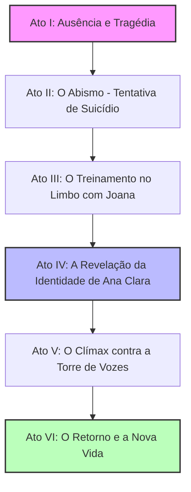

# 📝 Parecer Técnico e Narrativo: Estruturação e Coerência da História do Jogo

**[Metodologia Aplicada: 7 Etapas de Desenvolvimento de Jogos + Diretrizes Estéticas do Módulo]**

Este documento apresenta a análise crítica, reestruturação narrativa e especificações técnicas de gameplay para a história do jogo baseada no roteiro literário fornecido pelo cliente e no diálogo técnico subsequente. O enredo foi reorganizado de acordo com a **Metodologia de 7 Etapas** definida em [**README.md da Metodologia**](file:///C:/Users/hijon/Documents/curso-python-do-zero/tecnologia-3d/unreal-engine/metodologia-desenvolvimento/README.md).

---

## 🧭 Visão Geral & Fluxograma Narrativo

O jogo é um thriller psicológico e de ação focado na jornada de Ricardo, um ex-agente tático que transita entre o mundo físico e o limbo espiritual após uma tragédia familiar. Ele é guiado pelo espírito de sua filha assassinada, Ana Clara (sob o disfarce da guerreira Joana), para deter entidades espectrais que sugam a energia vital humana.

---

## 🛠️ Passo 1: Mecânica Principal (Core Mechanic) & Câmera

A ação principal que o jogador executa ao longo de toda a experiência deve ser concisa e focada na interação entre os dois planos:

> **Mecânica Principal:**
> *Transitar entre o plano físico e o limbo espiritual para expor, combater e sugar a energia vital de entidades e fantoches possuídos.*

### 🎥 Especificação e Justificativa de Câmera

*   **Tipo de Câmera:** **Câmera em Terceira Pessoa (Third Person)**
    *   *Dificuldade:* Alta.
*   **Por que PRECISAMOS desta câmera?**
    *   O jogo exige alta percepção espacial e navegação tridimensional em cenários estreitos e áreas externas. Como o protagonista interage com o ambiente do Limbo (como escalar rochas pretas escarpadas) e realiza combate corpo a corpo contra espíritos, a terceira pessoa é essencial para fornecer a precisão necessária. Além disso, a possessão simbiótica de Joana/Ana Clara exige que o jogador veja a mudança física e visual no próprio corpo de Ricardo (armadura de gelo brilhante ativando sobre o modelo dele).
*   **Por que uma visão em Primeira Pessoa ou Câmera Fixa não funciona?**
    *   Uma câmera em primeira pessoa limitaria o senso de ameaça periférica das entidades (que atacam pelos lados e costas), enquanto uma câmera fixa destruiria a verticalidade do Abismo e a dinâmica de parkour/esquiva tática nas lutas.

---

## 🎯 Passo 2: Quais as Sub Mecânicas?

As sub-mecânicas estendem o núcleo do jogo para gerar dinâmicas variadas:

### Lista de Sub Mecânicas (Máximo 1 linha cada)
1.  **Sopro Vital (Energy Drain):** Absorver energia vital de fantoches inimigos atordoados para recuperar vida e mana espiritual de Ricardo.
2.  **Transição de Fase (Dimension Shift):** Alternar a percepção do cenário entre o plano real e o Limbo espiritual para revelar passagens e perigos.
3.  **Combate de Postura Espectral:** Desferir ataques com armas físicas e espirituais para quebrar a estabilidade de espíritos e fantoches.
4.  **Possessão Simbiótica (Modo Joana):** Ceder temporariamente o corpo a Joana, mudando a jogabilidade para combate rápido com espada de gelo.
5.  **Furtividade Sensorial (Limbo Cover):** Ocultar-se na neblina cinzenta do limbo para evitar a detecção por patrulhas de Sem Corpos.

### Combinações de Desafios (Fusão de Sub Mecânicas)
*   **Combinação 1 - Ataque Oculto e Dreno (Furtividade + Transição + Dreno):**
    *   Navegar pela neblina do Limbo sem ser visto, transitar para o mundo físico atrás de um fantasma possuidor e realizar o dreno silencioso do seu sopro vital.
*   **Combinação 2 - Combate Simbiótico (Combate + Possessão + Transição):**
    *   Quebrar a postura do inimigo com os socos pesados de Ricardo, ativar a Possessão de Joana para desferir cortes de gelo e transitar de dimensão para desviar de contra-ataques.
*   **Combinação 3 - Fuga no Limbo (Transição + Furtividade + Sopro Vital):**
    *   Transitar para o Limbo quando encurralado, ocultar-se na névoa espiritual e roubar a energia de um hospedeiro desacordado em um beco para salvar Ricardo da morte física.

---

## 📦 Passo 3: Coloque seus Assets e Mecânicas em Grupos!

Estruturação das entidades lógicas (Blueprints C++) e kits de prototipagem crua (Block Mesh) para a montagem dos leveis:

### 1. Grupos de Mecânicas (Lógica em Blueprints)
*   `BP_RicardoPlayer` – Gerencia a integridade física de Ricardo e sua barra dupla (Vida Física e Energia Vital Espiritual).
*   `BP_JoanaSpectre` – Companheira que flutua ao lado, indica caminhos e possui o corpo de Ricardo sob comando (`BP_RicardoPlayer` -> `BP_JoanaMode`).
*   `BP_PuppetNPC` – IA de inimigo humano possuído. Tem comportamento errático no mundo físico e mostra uma "âncora espiritual" ligando-o ao Limbo.
*   `BP_SemCorpoSpectre` – Entidades que flutuam no Limbo, sugam energia vital à distância e exigem ataques espirituais para serem derrotadas.

### 2. Kits de Cenário (Block Mesh / Prototipagem Cinza)
*   **`Kit_Apartamento`**: Paredes internas modulares, portas batendo, janelas estreitas, bueiros urbanos.
*   **`Kit_FazendaGirassois`**: Caixa do celeiro de madeira, cercas, montes de feno modulares, malha de blocos amarelos de 2 metros para representar os girassóis.
*   **`Kit_Abismo`**: Rochas pontiagudas pretas modulares, rampas íngremes, cavernas escuras, trilhas com texturas de brasa.

---

## 📐 Passo 4: Level Design (Fases Jogáveis)

O jogo será construído e jogado do começo ao fim em formato Block Mesh (cinza) para validar as transições e o fluxo:

*   **Fase 1: O Refúgio nos Girassóis (Tutorial & Invasão)**
    *   *Kits:* `Kit_FazendaGirassois`.
    *   *Fluxo:* Ricardo executa tarefas simples na fazenda. Ao anoitecer, a casa é invadida por ex-parceiros da agência (fantoches). O jogador deve usar cobertura tática e combate de postura para defendê-la, terminando na invasão ao celeiro e na tragédia de Ana Clara.
*   **Fase 2: A Queda no Abismo (Descoberta do Limbo)**
    *   *Kits:* `Kit_Abismo`.
    *   *Fluxo:* Ricardo, após a tentativa de enforcamento, acorda no Abismo. Sem armas, ele precisa seguir a voz de Joana, realizar parkour tático para subir paredes escarpadas e escapar do Cavaleiro de Fogo.
*   **Fase 3: A Infiltração Urbana (Combate contra o Chefe)**
    *   *Kits:* `Kit_Apartamento` + cenários urbanos.
    *   *Fluxo:* Ricardo retorna à cidade enevoada, agora dominada por Sem Corpos. Ele deve transitar entre o real e o Limbo para desvendar runas, usar a possessão simbiótica de Joana para enfrentar hordas e derrotar o Chefe (Torre de Vozes).

---

## 🎨 Passo 5: História e Arte!

Esta seção detalha o dossiê conceitual, prazos realistas exigidos nas observações técnicas e correções de coerência lógica antes da substituição por assets de alta qualidade no motor.

### 👥 Dossiê dos Personagens

| Personagem | Perfil Técnico e Backstory | Papel na Narrativa |
| :--- | :--- | :--- |
| **Ricardo** | Ex-agente de Operações Especiais de uma agência de inteligência ultrassecreta. Perito em combate tático, infiltração e rastreamento. Homem frio e disciplinado, traumatizado pela incapacidade de proteger a família. | Protagonista. Transita entre a realidade física e o Limbo espiritual com o corpo definhando. |
| **Wêdja** | Esposa de Ricardo. Mulher sensível e forte, o esteio moral da família. Sua tosse crônica escondia um diagnóstico devastador, atuando como o gatilho para a aposentadoria forçada de Ricardo. | Âncora emocional. Retorna no Ato V como espírito aliado após sua passagem física. |
| **Ana Clara / Joana** | Filha de 14 anos de Ricardo. Assassinada por Silas Vane. Sua alma, presa no limbo pelo trauma, manifesta-se como "Joana", uma guerreira com armadura de gelo brilhante que treina e guia Ricardo. | Co-protagonista espiritual. Guia, mentora e elo de redenção de Ricardo. |

### 🩺 Laudo Oncológico e Tratamento Realista de Wêdja

> [!NOTE]
> **Laudo Médico e Procedimentos Oncológicos:**
> *   **Diagnóstico:** Adenocarcinoma Pulmonar Estágio IV (não-pequenas células), com metástases secundárias na coluna vertebral (osteolíticas) e lobo direito do fígado.
> *   **Sintomatologia Inicial:** Tosse seca persistente por 6 meses, progredindo para hemoptise (tosse com sangue).
> *   **Protocolo de Tratamento:** Quimioterapia de primeira linha baseada em platina (Cisplatina + Pemetrexede) associada a imunoterapia (Pembrolizumabe) a cada 21 dias. Radioterapia paliativa fracionada (10 sessões de 30 Gy) na coluna para alívio da dor metastática.
> *   **Prazos e Prognóstico:** A sobrevida média estimada pelo oncologista para Estágio IV metastático sob quimioterapia paliativa é de **12 meses**. A crise aguda fatal de Wêdja ocorre no **3º mês**, causada por uma embolia pulmonar massiva (complicação comum de câncer avançado).

### 🎖️ Trâmites e Prazos Militares Reais de Ricardo

> [!WARNING]
> **Processo de Baixa de Agente de Elite:**
> *   Como agente especial do governo com acesso a informações sensíveis, Ricardo não pode "pedir dispensa" e sair no mesmo dia. O trâmite exige segurança nacional:
> *   **Fase 1: Solicitação e Licença Emergencial:** Ricardo protocola o pedido de baixa voluntária por motivos humanitários (doença terminal de cônjuge). O comando concede uma **Licença Especial Extraordinária de 90 dias** (imediata) com redução de vencimentos.
> *   **Fase 2: Quarentena e Debriefing (60 dias):** Durante a licença, Ricardo passa por avaliações psicológicas de descompressão e debriefings detalhados para garantir que segredos de estado não sejam vazados. A baixa definitiva e o desligamento legal são homologados exatamente após **60 dias**, o que coincide com a mudança dele para o refúgio no campo.

### 👻 Lore, Origem e Propósito dos "Sem Corpos"

*   **Quem são:** São almas degeneradas e fragmentos conscientes de humanos que faleceram em condições traumáticas extremas. Sem conseguir ascender e rejeitando a escuridão eterna, ficaram presos no Limbo (o Abismo).
*   **Origem:** Há séculos, a barreira entre o mundo físico e espiritual enfraqueceu devido a rituais antigos. Os Sem Corpos aprenderam a manipular a energia magnética das almas humanas, descobrindo que podiam "descolar" a alma de uma pessoa viva e ocupar o espaço vazio do cérebro físico, transformando o corpo em um "fantoche" sob seu comando.
*   **Propósito:** Eles cobiçam o **sopro vital (energia vital)** dos vivos. No mundo incorpóreo, essa energia é convertida em poder bruto, permitindo que eles influenciem o mundo físico (causando acidentes, violência, ódio e desespero) para colher ainda mais almas.

### 🐔 Ajustes de Coerência e Dinâmica

#### 1. A Inconsistência da Galinha no Celeiro
*   *Problema:* Ricardo chuta a porta à noite e uma galinha voa em desespero contra seu rosto. À noite, galinhas têm péssima visão noturna e entram em um estado de catatonia/inércia, não voando nem se movendo mesmo diante de predadores.
*   *Resolução no Roteiro:* A invasão da fazenda e o incidente no celeiro devem ocorrer no **crepúsculo (entardecer)**, enquanto os girassóis ainda estão visíveis sob a luz avermelhada e as galinhas estão no chão do celeiro ciscando antes de empoleirar. Alternativamente, se a cena for à noite, a galinha é assustada por um invasor (Silas Vane) escondido que a derruba de seu poleiro, fazendo-a esvoaçar em pânico no exato momento em que Ricardo chuta a porta.

#### 2. A Dinâmica de Corrida nos Girassóis
*   *Problema:* Folhas de girassol batendo no rosto de Ricardo enquanto ele corre e suas pernas queimam.
*   *Resolução no Roteiro:* Girassóis agrícolas maduros atingem entre **1,80 e 2,20 metros de altura**. Ao correr em pé, as folhas largas e ásperas (com textura espinhosa e urticante) e as cabeças pesadas de sementes batem diretamente no peito e ombros de Ricardo. No entanto, por ser um soldado experiente sob ataque de tiros, Ricardo corre em **postura agachada de combate (low-ready)**. Nessa postura baixa, as folhas e caules rígidos açoitam seu rosto, dificultando a visão, enquanto a corrida semi-agachada causa uma queimação intensa nas coxas e panturrilhas após poucos metros.

---

## 🔊 Passo 6: Polimento!

Especificação dos efeitos de áudio e partículas para dar a identidade sombria desejada:

*   **Efeitos de Partículas (Niagara UE5):**
    *   *Sopro Vital:* Feixes de luz azul-dourada que espiralam dos corpos dos fantoches em direção à mão de Ricardo ao drenar a vida.
    *   *Armadura de Gelo:* Cristais de gelo que se materializam e emitem um brilho ciano difuso no corpo de Ricardo durante a possessão de Joana.
    *   *Cavaleiro de Fogo:* Fogo fátuo avermelhado e brasas que caem dos cascos do cavalo espiritual no Abismo.
*   **Design de Áudio Atmosférico (MetaSounds):**
    *   *Limbo:* Áudio com filtros de passa-baixas (abafado, semelhante a estar submerso), quebras de frequência ao avistar inimigos e sussurros sussurrados em 3D posicionais.
    *   *Memórias:* O som da tosse seca e dolorosa de Wêdja ecoa suavemente ao fundo quando o jogador encontra objetos pessoais dela na casa vazia.

---

## 🚀 Passo 7: Publicação!

Planejamento de lançamento da demo do jogo focado no feedback narrativo:

1.  **Demo "O Refúgio" no Itch.io:** Lançar uma demo curta jogável (Vertical Slice) abrangendo a Fase 1 (Invasão à Fazenda) e Fase 2 (Queda no Abismo) para testar a recepção das mecânicas de transição dimensional e a atmosfera.
2.  **Campanha Narrativa:** Criar o trailer de revelação focado no suspense familiar, exibindo o campo de girassóis sob a luz do entardecer e a transição chocante para as rochas pretas do Abismo.
