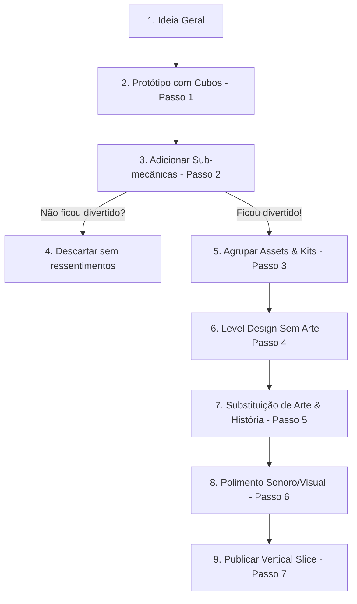

# 🛠️ Metodologia de Desenvolvimento de Jogos (Do Zero ao Jogo)

**[Compatibilidade: Planejamento Geral de Jogos e Integração com Unreal Engine]**

Este diretório contém a documentação da metodologia ativa de planejamento e desenvolvimento de jogos utilizada para estruturar o plano do jogo **Shadows of Old Edinburgh**. Esta metodologia baseia-se nas diretrizes do e-book [**TMJ-Ebook - Plano de Desenvolvimento de Jogos (1).pdf**](file:///C:/Users/hijon/Documents/curso-python-do-zero/tecnologia-3d/unreal-engine/TMJ-Ebook+-+Plano+de+Desenvolvimento+de+Jogos%20(1).pdf), combinada com as melhores práticas de arquitetura C++ para Unreal Engine 5.

---

## 💡 A Filosofia do Planejamento Flexível

Diferente do "conto de fadas" tradicional do desenvolvimento de jogos — que prega a criação de um Game Design Document (GDD) gigantesco e imutável antes de iniciar a programação —, este método defende um **planejamento extremamente dinâmico e flexível**. 

> [!IMPORTANT]
> **A Regra de Ouro:**
> O planejamento serve para você não perder tempo desenvolvendo algo que não vai funcionar. Ideias perfeitas na mente podem falhar no campo de batalha. Por isso, a única forma de saber se o seu barco flutua é colocando-o na água o mais rápido possível através de protótipos com blocos básicos (cubos).

---

## 📂 As 7 Etapas do Desenvolvimento Aplicadas ao Plano

Abaixo está o detalhamento de como a metodologia de 7 passos foi aplicada na reestruturação e aprimoramento do arquivo [**edinburgh_rpg_game_plan.md**](file:///C:/Users/hijon/Documents/curso-python-do-zero/tecnologia-3d/unreal-engine/referenciaGame/edinburgh_rpg_game_plan.md):

### 1. Mecânica Principal (Core Mechanic) & Câmera
*   **Conceito:** A ação repetitiva que o jogador realiza durante todo o jogo. Deve ser descrita em apenas uma linha. Além disso, a câmera deve ser justificada tecnicamente (e não por gosto pessoal).
*   **Aplicação no Plano:**
    *   *Mecânica:* Infiltrar locais restritos e revelar segredos espirituais usando o Medalhão Lunar.
    *   *Câmera:* 3ª Pessoa (justificada pela necessidade de noção espacial nas escaladas e parkour vertical nos prédios altos de Edimburgo). Refutou-se a câmera Top Down, pois ela ocultaria a grandiosidade gótica e a sensação claustrofóbica dos becos ("closes") e subterrâneos.
    *   *Integração UE C++:* Definição imediata da estrutura de código em C++ para a classe `AEwanCharacter` utilizando o Enhanced Input System para o movimento.

### 2. Sub Mecânicas e Combinações
*   **Conceito:** Extensões da mecânica principal que criam desafios variados. Devem ser combinadas (pelo menos 3 variações) para criar quebra-cabeças e situações de jogo dinâmicas.
*   **Aplicação no Plano:**
    *   Listamos 5 sub-mecânicas: *Parkour*, *Rastreamento Espiritual*, *Combate de Postura*, *Furtividade nas Sombras* e *Disfarce Social*.
    *   Propusemos 3 combinações de desafios concretos (ex: Emboscada Aérea combinando Parkour + Sombras + Ataque de Postura).

### 3. Coloque seus Assets e Mecânicas em Grupos
*   **Conceito:** Separar as entidades lógicas (Blueprints C++) e os elementos do cenário em kits modulares em formato "Block Mesh" (Grey Box/White Box) para permitir a rápida montagem dos níveis antes da criação artística final.
*   **Aplicação no Plano:**
    *   Dividimos os Blueprints principais (`BP_EwanCharacter`, `BP_SpectralEnemy`).
    *   Criamos 3 Kits de cenário modular com formas primárias de teste: `Kit_RoyalMile` (exterior/telhados), `Kit_Kirkyard` (cemitério) e `Kit_Vaults` (subterrâneos).

### 4. Level Design
*   **Conceito:** Construir o caminho completo do jogador (Início ao Fim) de cada nível de forma totalmente jogável usando apenas os kits de blocos geométricos. Level Design é sobre fluxo e desafios, não sobre arte.
*   **Aplicação no Plano:**
    *   Estruturamos as 3 fases fundamentais do protótipo de desenvolvimento (Vertical Slice): Fase 1 (Royal Mile / Introdução), Fase 2 (Greyfriars / Exploração e Combate) e Fase 3 (Vaults / Infiltração e Clímax).
    *   Cada fase especifica claramente quais sub-mecânicas e kits de blocos serão utilizados.

### 5. História e Arte!
*   **Conceito:** Com o protótipo cinza validado e divertido, realiza-se a substituição dos cubos e formas básicas pelos assets de arte final dentro das pastas dos grupos/kits, mantendo a integridade do design do nível.
*   **Aplicação no Plano:**
    *   Conexão direta com a imagem gótica de referência do herói (capa, roupas de couro e medalhão).
    *   Substituição dos blocos por malhas detalhadas utilizando **Nanite**, iluminação realista de luar e tochas com **Lumen** e criação do protagonista via **MetaHuman Creator** com física de tecidos (**Chaos Cloth**).

### 6. Polimento!
*   **Conceito:** Adicionar elementos estéticos não-jogáveis, efeitos de ambiente e sonorização dinâmica que transformam o protótipo em uma obra de arte final.
*   **Aplicação no Plano:**
    *   Uso de sistemas de partículas **Niagara** para criar a neblina rasteira clássica de Edimburgo.
    *   Implementação de sons atmosféricos dinâmicos com **MetaSounds/Wwise** (eco nos subterrâneos, passos variando conforme a superfície de pedra úmida ou madeira).

### 7. Publicação!
*   **Conceito:** Publicar o jogo em plataformas como Itch.io, Gamejolt ou Steam para colher feedback real da comunidade, ajustando o projeto com base no comportamento dos jogadores no campo de batalha.
*   **Aplicação no Plano:**
    *   Planejamento do lançamento de uma demo controlada (Vertical Slice com as 3 fases jogáveis) no Itch.io com página personalizada baseada na identidade sombria de Shadows of Old Edinburgh.

---

## 📅 Conclusão e Diretriz para Novos Projetos

Ao iniciar a criação de um novo plano ou implementar uma mecânica em Unreal C++, utilize este guia de metodologia como checklist para assegurar que você não está "pulando etapas" nem gastando tempo programando ou modelando detalhes de arte antes de validar a diversão da mecânica básica em formato de blocos cinzas.
