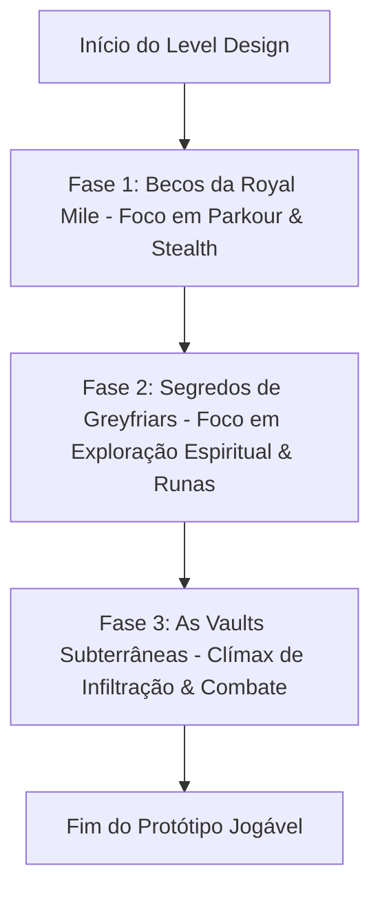
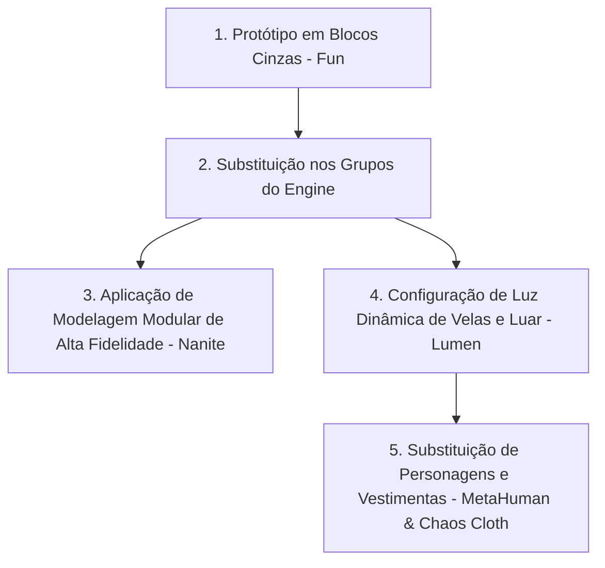

# 🎮 Plano de Desenvolvimento de Jogos: Shadows of Old Edinburgh

**[Metodologia Aplicada: Plano de Desenvolvimento de Jogos + Padrões C++ do Módulo]**

Este documento detalha o planejamento estratégico e a arquitetura técnica de **Shadows of Old Edinburgh** (ou *Moonlit Legacy*), um Action-Adventure RPG ambientado na Edimburgo do século XVII. A estrutura deste plano segue rigorosamente as **7 etapas de desenvolvimento** do método pedagógico ativo e a integração técnica exigida no desenvolvimento C++ moderno em Unreal Engine 5.

---

## 🧭 Visão Geral do Projeto & Inspiração Visual

O jogo retrata a Velha Edimburgo sob uma névoa gótica e misteriosa, misturando a história real da Escócia medieval com folclore e lendas urbanas. O arco do herói é guiado pela descoberta de segredos e assombrações nos becos ("closes") estreitos e subterrâneos da cidade.

> [!NOTE]
> **Inspiração da Imagem de Referência:**
> O design do protagonista baseia-se diretamente na imagem anexa: um jovem de cerca de 20 anos com cabelos escuros ondulados, olhar melancólico e determinado, vestindo roupas de couro escuro e tecido gasto com capa integrada. O artefato central de sua jornada é o pingente de crescente lunar reluzente que ele carrega no peito. O ambiente gótico ao fundo, iluminado por velas e sob um céu cinzento de tempestade, dita a direção artística geral do projeto.

---

## 🛠️ Passo 1: Mecânica Principal (Core Mechanic) & Câmera

A mecânica principal define a ação repetitiva e fundamental que sustenta o ciclo de jogabilidade do início ao fim:

> **Mecânica Principal:**
> *Infiltrar áreas restritas e revelar passagens ou segredos espirituais ocultos usando o poder do Medalhão Lunar.*

### 🎥 Especificação e Justificativa de Câmera

*   **Tipo de Câmera:** **Câmera em Terceira Pessoa (Third Person)**
    *   *Dificuldade:* Alta.
*   **Por que PRECISAMOS desta câmera?**
    *   O foco do jogo envolve movimentação vertical (escalada e parkour pelos telhados medievais) e combate dinâmico contra múltiplos inimigos. A terceira pessoa é crucial para conceder noção espacial e exibir a estética visual do protagonista (roupas de época, capa física simulada e o medalhão lunar ativo).
*   **Por que uma câmera fixa ou de movimentação limitada (Top Down) não funciona?**
    *   Edimburgo do século XVII possui uma verticalidade acentuada, com prédios de até sete andares ("tenements") e Vaults subterrâneas claustrofóbicas. Uma câmera superior esconderia a grandiosidade arquitetônica, eliminaria a mecânica de escalar telhados olhando para o alto e removeria o suspense ao explorar os cantos escuros dos "closes".

---

## 💻 Arquitetura Técnica C++: O Protagonista (`AEwanCharacter`)

Seguindo as diretrizes pedagógicas de C++ do módulo, a classe do protagonista gerencia os dados de reflexão e a vinculação de movimentos usando as melhores práticas de gerenciamento de memória e o **Enhanced Input System** (UE5 estrito).

### [EwanCharacter.h](file:///C:/Users/hijon/Documents/curso-python-do-zero/tecnologia-3d/unreal-engine/referenciaGame/EwanCharacter.h)
```cpp
#pragma once

#include "CoreMinimal.h"
#include "GameFramework/Character.h"
#include "EwanCharacter.generated.h" // Deve ser o último include!

UCLASS()
class EDINBURGHRPG_API AEwanCharacter : public ACharacter
{
    GENERATED_BODY()

public:
    AEwanCharacter();

protected:
    virtual void BeginPlay() override;

public:
    virtual void SetupPlayerInputComponent(class UInputComponent* PlayerInputComponent) override;

    /** Componente do Medalhão Lunar (Lógica do Artefato) */
    UPROPERTY(VisibleAnywhere, BlueprintReadOnly, Category = "Components|Medallion")
    class UStaticMeshComponent* MoonMedallionMesh;

    /** Inputs do Enhanced Input System */
    UPROPERTY(EditAnywhere, BlueprintReadOnly, Category = "Input|Setup")
    class UInputMappingContext* DefaultMappingContext;

    UPROPERTY(EditAnywhere, BlueprintReadOnly, Category = "Input|Setup")
    class UInputAction* MoveAction;

    UPROPERTY(EditAnywhere, BlueprintReadOnly, Category = "Input|Setup")
    class UInputAction* InteractAction;

    UPROPERTY(EditAnywhere, BlueprintReadOnly, Category = "Input|Setup")
    class UInputAction* MedallionAction;

    /** Atributos de Lógica Lunar expostos com segurança */
    UPROPERTY(EditAnywhere, BlueprintReadWrite, Category = "Gameplay|Attributes")
    float MaxMoonEnergy;

protected:
    /** Funções de callback de entrada */
    void Move(const struct FInputActionValue& Value);
    void Interact();
    void ToggleMoonMedallion();

private:
    /** Energia Lunar Atual computada pelo C++ */
    UPROPERTY(VisibleAnywhere, BlueprintReadOnly, Category = "Gameplay|Attributes", meta = (AllowPrivateAccess = "true"))
    float CurrentMoonEnergy;

    /** Estado ativo da Visão Espiritual */
    bool bIsMoonVisionActive;
};
```

### [EwanCharacter.cpp](file:///C:/Users/hijon/Documents/curso-python-do-zero/tecnologia-3d/unreal-engine/referenciaGame/EwanCharacter.cpp)
```cpp
#include "EwanCharacter.h"
#include "Components/StaticMeshComponent.h"
#include "EnhancedInputComponent.h"
#include "EnhancedInputSubsystems.h"

AEwanCharacter::AEwanCharacter()
{
    PrimaryActorTick.bCanEverTick = false; // Otimização: desativa Tick se desnecessário

    // Inicialização segura de subobjetos
    MoonMedallionMesh = CreateDefaultSubobject<UStaticMeshComponent>(TEXT("MoonMedallionMesh"));
    MoonMedallionMesh->SetupAttachment(GetMesh(), TEXT("NecklaceSocket"));

    // Valores padrão seguros
    MaxMoonEnergy = 100.f;
    CurrentMoonEnergy = 100.f;
    bIsMoonVisionActive = false;
}

void AEwanCharacter::BeginPlay()
{
    Super::BeginPlay();

    // Vinculação do Contexto de Entrada (Enhanced Input)
    if (APlayerController* PC = Cast<APlayerController>(GetController()))
    {
        if (UEnhancedInputLocalPlayerSubsystem* Subsystem = ULocalPlayer::GetSubsystem<UEnhancedInputLocalPlayerSubsystem>(PC->GetLocalPlayer()))
        {
            Subsystem->AddMappingContext(DefaultMappingContext, 0);
        }
    }
}

void AEwanCharacter::SetupPlayerInputComponent(UInputComponent* PlayerInputComponent)
{
    Super::SetupPlayerInputComponent(PlayerInputComponent);

    // Casting seguro e vinculação de comandos
    if (UEnhancedInputComponent* EnhancedInputComp = Cast<UEnhancedInputComponent>(PlayerInputComponent))
    {
        EnhancedInputComp->BindAction(MoveAction, ETriggerEvent::Triggered, this, &AEwanCharacter::Move);
        EnhancedInputComp->BindAction(InteractAction, ETriggerEvent::Started, this, &AEwanCharacter::Interact);
        EnhancedInputComp->BindAction(MedallionAction, ETriggerEvent::Started, this, &AEwanCharacter::ToggleMoonMedallion);
    }
}

void AEwanCharacter::Move(const FInputActionValue& Value)
{
    FVector2D MovementVector = Value.Get<FVector2D>();

    if (Controller != nullptr)
    {
        const FRotator Rotation = Controller->GetControlRotation();
        const FRotator YawRotation(0, Rotation.Yaw, 0);

        const FVector ForwardDirection = FRotationMatrix(YawRotation).GetUnitAxis(EAxis::X);
        const FVector RightDirection = FRotationMatrix(YawRotation).GetUnitAxis(EAxis::Y);

        AddMovementInput(ForwardDirection, MovementVector.Y);
        AddMovementInput(RightDirection, MovementVector.X);
    }
}

void AEwanCharacter::Interact()
{
    // Lógica C++ para interação com objetos interativos (ex: baús, portas)
}

void AEwanCharacter::ToggleMoonMedallion()
{
    bIsMoonVisionActive = !bIsMoonVisionActive;
    
    // Efeito visual em Blueprints pode escutar esta alteração de estado
    if (bIsMoonVisionActive)
    {
        UE_LOG(LogTemp, Log, TEXT("Visão Lunar Ativada - Consumindo energia..."));
    }
}
```

---

## 🎯 Passo 2: Quais as Sub Mecânicas?

As sub-mecânicas expandem o núcleo do jogo, permitindo que a ação de infiltração e revelação lunar seja combinada em desafios mais complexos.

### Lista de Sub Mecânicas (Máximo 1 linha cada)
1.  **Parkour e Escalada Gótica:** Escalar cantos de pedra, pular entre janelas e telhados medievais.
2.  **Rastreamento Espiritual:** Usar o medalhão para tornar visíveis runas de portais e inimigos espectrais.
3.  **Combate de Postura Dinâmico:** Ataques com adaga/espada focados em quebrar o equilíbrio do adversário.
4.  **Furtividade nas Sombras:** Ocultar-se em cantos sem iluminação, reduzindo a detecção dos guardas.
5.  **Disfarce Social:** Usar trajes da Guarda ou dos Clérigos para cruzar áreas vigiadas sem suspeita.

### Combinações de Desafios (Fusão de Sub Mecânicas)
*   **Combinação 1 - Emboscada Aérea Furtiva (Parkour + Sombras + Combate):**
    *   Escalar as gárgulas até o teto, aguardar a patrulha nas sombras dos telhados e realizar um ataque descendente quebrando a postura do líder da patrulha.
*   **Combinação 2 - Investigação Clandestina (Disfarce + Rastreamento + Sombras):**
    *   Vestir roupas de monge para infiltrar a catedral, utilizar o medalhão para decifrar a runa espectral em um túmulo e ocultar-se nas alcovas caso um guarda passe perto.
*   **Combinação 3 - Fuga Fantasmagórica (Combate + Rastreamento + Parkour):**
    *   Desestabilizar os inimigos terrestres com ataques físicos rápidos, ativar o medalhão para enxergar um portal de fuga espiritual oculto e escapar escalando a parede adjacente.

---

## 📦 Passo 3: Coloque seus Assets e Mecânicas em Grupos!

Para garantir um fluxo de Level Design rápido e modular, todas as entidades são estruturadas em grupos reutilizáveis (Kits de Cenário e Blueprints em C++).

### 1. Grupos de Mecânicas (Lógica em Blueprints)
*   `BP_EwanCharacter` – Lógica do herói, gerenciamento de energia lunar e atributos de postura.
*   `BP_SpectralLantern` – Lanterna que atua como checkpoint e recarrega a energia lunar.
*   `BP_SpectralEnemy` – IA inimiga que flutua nas Vaults e só é vulnerável sob a influência do Medalhão.
*   `BP_RuneLock` – Dispositivo de puzzle lunar que abre portões góticos ao ser alimentado por luz lunar.

### 2. Kits de Cenário (Block Mesh / Modelagem Básica)
As formas geométricas cruas e sem texturas criam a geometria tridimensional do ambiente de testes:

| Nome do Kit | Elementos Inclusos | Caso de Uso Principal |
| :--- | :--- | :--- |
| **`Kit_RoyalMile`** | Cubos de prédios de 5 andares, planos de telhados inclinados, arcos de pedra simples, becos ("closes") estreitos. | Exploração urbana de superfície e parkour. |
| **`Kit_Kirkyard`** | Lápides retangulares, criptas abobadadas, cercas de arame para representar grades de ferro, túmulos destruídos. | Puzzles de exploração espiritual ao ar livre. |
| **`Kit_Vaults`** | Túneis claustrofóbicos sob arcos circulares, cubos de barris, grades de celas, rampas e degraus irregulares. | Dungeons subterrâneas de stealth e combate. |

---

## 📐 Passo 4: Level Design (Fases Jogáveis)

O objetivo desta fase é criar um protótipo cinza (Block Mesh) totalmente funcional e jogável do início ao fim, focando na progressão mecânica sem arte ou áudio final.



### 🧱 Estrutura das Fases

#### Fase 1: Os Closes da Royal Mile (Nível Tutorial)
*   **Mecânicas Utilizadas:** Parkour e Furtividade nas Sombras.
*   **Kits Utilizados:** `Kit_RoyalMile`.
*   **Objetivo de Level Design:** Jogador inicia sem armas em um "close" bloqueado. Deve escalar as cornijas do beco para os telhados, esgueirar-se nas sombras para evitar a Guarda Municipal e alcançar a oficina onde encontra o Medalhão Lunar.

#### Fase 2: Segredos de Greyfriars (Nível de Exploração)
*   **Mecânicas Utilizadas:** Rastreamento Espiritual, Furtividade nas Sombras e Combate de Postura.
*   **Kits Utilizados:** `Kit_Kirkyard`.
*   **Objetivo de Level Design:** Investigar o cemitério enevoado. O jogador precisa rastrear runas invisíveis nas lápides, derrotar espectros que surgem ao ativá-las e obter a chave de ferro que abre as Vaults da cidade.

#### Fase 3: As Vaults Subterrâneas (Nível de Infiltração e Clímax)
*   **Mecânicas Utilizadas:** Todas as mecânicas integradas (Disfarce, Combate, Parkour, Rastreamento).
*   **Kits Utilizados:** `Kit_Vaults`.
*   **Objetivo de Level Design:** Infiltrar o subterrâneo claustrofóbico. O jogador deve desviar de patrulhas de cultistas do Véu Negro, resolver puzzles de luz lunar e selar a fenda de onde a Peste Espiritual se origina.

---

## 🎨 Passo 5: História e Arte!

Assim que o protótipo em cinza está divertido e validado, as caixas geométricas dos grupos de cenário e de lógica são substituídas pelos materiais e modelos de arte final.



*   **Substituição Modular:** Os cubos cinzas do `Kit_RoyalMile` e `Kit_Vaults` são trocados instantaneamente por modelos de alvenaria e cantaria de pedras do século XVII importados via **Quixel Megascans**.
*   **Nanite:** A geometria complexa das esculturas góticas da St. Giles' Cathedral e dos arcos subterrâneos é processada com Nanite para manter detalhes infinitos sem sacrificar a performance do jogo.
*   **Lumen:** A iluminação global em tempo real da Unreal Engine 5 renderiza os reflexos do luar nas ruas de paralelepípedo molhadas pela chuva, o brilho instável das velas nas tavernas e a luz fraca de tochas nos becos escuros.
*   **Personagens (MetaHuman):** O modelo provisório do protagonista é substituído pelo modelo final com base na imagem conceitual — feições expressivas, pele marcada pela neblina fria e vestimentas de couro que respondem ao movimento dinâmico da capa simulada via *Chaos Cloth Simulation*.

---

## 🔊 Passo 6: Polimento!

A fase de polimento adiciona os efeitos e sensações secundárias que garantem a atmosfera soturna e a imersão de áudio:

*   **Niagara Particles:** Criação da névoa volumétrica rasteira que serpenteia pelos becos úmidos de Edimburgo, o efeito de poeira e teias nos subterrâneos fechados e as partículas de energia brilhante do Medalhão Lunar ao ser ativado.
*   **Sistema de Áudio Dinâmico (MetaSounds):**
    *   Som dos passos do protagonista que se alteram de acordo com a superfície (madeira úmida, paralelepípedos encharcados ou terra batida do cemitério).
    *   Ecos dinâmicos dentro das Vaults e sussurros misteriosos em 3D posicionados no espaço espectral do Greyfriars Kirkyard.

---

## 🚀 Passo 7: Publique seu Jogo!

A etapa final do plano orquestra o lançamento do projeto no mercado independente:

1.  **Lançamento do Vertical Slice:** Publicar o protótipo polido contendo as três primeiras fases na plataforma **Itch.io**. A página de download seguirá o design do jogo, assemelhando-se a um diário de investigação do século XVII.
2.  **Coleta de Feedback:** Analisar relatórios de bugs e críticas da comunidade para balancear a dificuldade do parkour, do combate de postura e o tempo de uso do medalhão lunar.
3.  **Preparação para Steam:** Registar a página do jogo na Steam com trailers atmosféricos focados no realismo histórico e no mistério espiritual da Escócia, preparando o lançamento comercial completo do jogo.

---

### 📅 Próximos Passos
1.  Criar o projeto na Unreal Engine 5.3+ ativando Lumen, Nanite e o plugin do Enhanced Input.
2.  Desenvolver os modelos básicos em cubo (`Kit_RoyalMile`, `Kit_Kirkyard`, `Kit_Vaults`).
3.  Implementar o código C++ base para o movimento e controle do Medalhão em `AEwanCharacter`.
